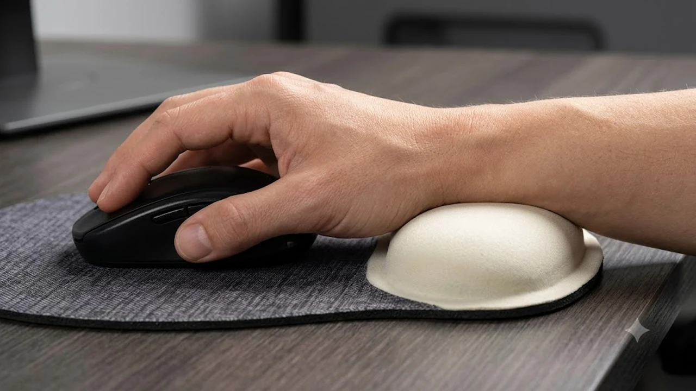

사무실 책상 위에 고정형 손목 받침대를 잘못 놓으면 오히려 손목 인대 압박이 심해집니다. 장시간 마우스와 키보드를 오가는 실무자들 사이에서 손목과 일체형으로 미끄러지듯 움직이는 '무빙 팜레스트'가 필수 데스크 셋업 장비로 자리 잡았습니다. 손목 꺾임 각도를 5\~10도 안팎으로 유지해 정중신경 압박을 줄여주는 검증된 3종을 분석합니다.

## 1. 지금 무빙 팜레스트가 뜨는 이유와 트렌드

기존 쿠션형 팜레스트는 손목 한 지점에 체중을 집중시켜 혈류를 방해하고, 마우스를 좌우로 크게 회전할 때 손목 관절이 꺾이는 문제가 있었습니다. 

2026년 데스크테크 시장의 핵심은 '하단 PTFE(테플론) 피트'를 적용해 마우스 패드 위를 마우스와 함께 활주하는 무빙 설계입니다. 마우스 단독 사용 시 발생하는 마찰 저항을 덜어내고, 손목 꺾임을 원천 차단하는 인체공학 장비 수요가 숏폼과 테크 커뮤니티를 중심으로 급증했습니다.

손목 각도 자체를 수직으로 세우고 싶다면 [2026 무선 버티컬 마우스 추천 TOP3](/posts/trending-picks/wireless-vertical-mouse-top3-2026/) 글도 함께 확인하면 좋습니다.

---

## 2. 무빙 팜레스트 TOP3 스펙 비교

| 모델명 | 가격대 | 핵심 스펙 | 추천 대상 |
| :--- | :--- | :--- | :--- |
| **델타허브 카피오 2.0 (Carpio 2.0)** | 4만 8,000원 | 무게 20g / PTFE 피트 / 실리콘 패드 분리형 / S·L 2종 규격 | 정밀 마우스 컨트롤과 내구성을 원하는 프로 실무자 |
| **제누스 무빙 인체공학 손목받침대 (G-Slide M1)** | 2만 3,000원 | 무게 28g / 고밀도 저반발 폼 / 좌우 대칭형 설계 | 가성비 입문자 및 양손 전환 유저 |
| **오키스 글라이딩 인체공학 팜레스트 (ErgoGlide-X)** | 3만 4,000원 | 무게 35g / 알루미늄 프레임 / 통기성 에어홀 실리콘 | 손에 땀이 많고 묵직한 지지력을 선호하는 유저 |

---

## 3. 예산대별 추천 모델 상세 분석

### 가성비형(2만원대): 제누스 무빙 인체공학 손목받침대 (G-Slide M1)

부담 없는 가격대로 무빙 팜레스트를 처음 경험해보기 알맞은 모델입니다. 

* **핵심 스펙**: 28g 초경량 설계, 고밀도 메모리폼 쿠션, 범용 PTFE 글라이드 피트
* **장점 1**: 좌우 대칭형 몰드로 제작되어 왼손잡이와 오른손잡이 모두 방향 구분 없이 바로 사용합니다.
* **장점 2**: 2만 원대 초반 가격으로 고정형 패드 대비 손목 마찰 저항을 70% 이상 줄여줍니다.
* **단점**: 패드 표면이 패브릭 마감이라 땀이나 음료 오염 시 분리 물세척이 어렵습니다.
* **이런 사람에게 추천**: 무빙 팜레스트 사용감이 본인 손에 맞는지 적은 예산으로 테스트해보고 싶은 입문자.

👉 [제누스 무빙 손목받침대 쿠팡에서 보기](https://www.coupang.com/np/search?q=제누스+무빙+손목받침대&sourceType=affiliate&trackingCode=AF8691300)

---

### 중간형(3만원대): 오키스 글라이딩 팜레스트 (ErgoGlide-X)

알루미늄 베이스를 채택해 견고한 내구성과 쿨링감을 제공하는 모델입니다.

* **핵심 스펙**: CNC 알루미늄 바디, 타공 에어홀 실리콘 패드, 저마찰 테플론 피트 4점 지지
* **장점 1**: 상단 실리콘에 타공 통기 구조가 들어가 장시간 손바닥을 밀착해도 땀이 차지 않습니다.
* **장점 2**: 35g의 적당한 무게감과 메탈 바디 덕분에 고속 마우스 슬라이딩 시 흔들림 없이 안정적으로 손목을 지지합니다.
* **단점**: 겨울철 첫 착용 시 금속 바디 프레임의 차가운 감촉이 손바닥 가장자리에 전해질 수 있습니다.
* **이런 사람에게 추천**: 땀이 많아 쾌적한 실리콘 세척이 필수적이거나 알루미늄 데스크테리어를 선호하는 직장인.

👉 [오키스 글라이딩 팜레스트 쿠팡에서 보기](https://www.coupang.com/np/search?q=오키스+글라이딩+손목받침대&sourceType=affiliate&trackingCode=AF8691300)

---

### 프리미엄형(4만원대): 델타허브 카피오 2.0 (Carpio 2.0)

의사 및 물리치료 전문가와 협업해 손목 관절(두상골 및 주상골) 압박을 분산하도록 설계된 글로벌 오리지널 모델입니다.

* **핵심 스펙**: 20g 초슬림 규격, 의료용 항균 실리콘 패드 분리 구조, S(손길이 8.5cm 이하) / L(손길이 8.5cm 이상) 옵션 제공
* **장점 1**: 손목 뼈가 바닥에 직접 닿지 않고 엄지두덩과 새끼두덩만을 받쳐주어 혈류 방해와 신경 압박이 없습니다.
* **장점 2**: 하단 PTFE 피트의 활주력이 매끄러워 마우스와 일체형으로 위화감 없이 미끄러집니다.
* **단점**: 단품 1개(한 손) 기준 4만 원대 후반으로 가격 진입 장벽이 다소 높은 편입니다.
* **이런 사람에게 추천**: 엑셀 및 그래픽 툴로 하루 10시간 이상 마우스를 쥐며 손목 통증 완화가 절실한 헤비 워커.

👉 [델타허브 카피오 2.0 쿠팡에서 보기](https://www.coupang.com/np/search?q=델타허브+카피오+2.0&sourceType=affiliate&trackingCode=AF8691300)

근무 중 다리 부기 완화까지 병행하려면 [무선 종아리 마사지기 TOP3 가성비 비교](/posts/trending-picks/wireless-calf-massager-top3-2026/) 포스팅을 참조하시고, 최신 셋업 아이템 정보는 [트렌드 상품 추천 TOP3](/posts/trending-picks/trending-picks-20260727/)에서 확인할 수 있습니다.

---

## 4. 무빙 팜레스트 구매 전 체크포인트

* **하단 피트 재질**: 저마찰 PTFE(테플론) 피트가 장착되었는지 확인해야 합니다. 일반 플라스틱 피트는 천 패드에서 마찰 저항이 심해 손목에 역방향 피로를 줍니다.
* **손바닥 밀착 부위와 사이즈**: 손목 관절 중앙부를 누르는 형태는 피하고, 손바닥 양쪽 근육 부위(대소수지구)만 들어 올려 신경을 비워주는 구조인지 확인해야 합니다.
* **마우스 패드 호환성**: 가죽이나 목재 데스크매트보다는 표면 마찰이 적은 고밀도 직조 천 패드나 하드 타입(유리/알루미늄) 패드와 조합해야 높은 글라이딩 효율을 냅니다.

---

> 이 포스팅은 쿠팡 파트너스 활동의 일환으로, 이에 따른 일정액의 수수료를 제공받습니다.

#트렌드상품 #쿠팡추천 #트렌드상품추천 #무빙팜레스트 #손목받침대추천 #델타허브카피오 #손목터널증후군 #데스크테리어