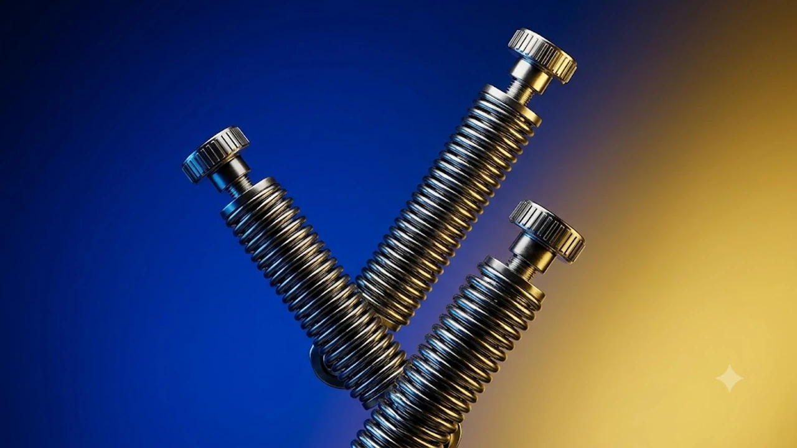

32인치 이상 대형 디스플레이와 21:9 울트라와이드, 1000R 곡률 커브드 모니터 사용자가 늘어나면서 번들 스탠드의 한계가 드러났습니다. 무게 중심이 전면으로 쏠려 화면이 아래로 처지는 틸트 풀림과 타이핑 시 발생하는 잔진동을 잡으려면 15kg 이상을 버티는 고중량 전용 모니터암을 써야 합니다. 책상 위 가용 면적을 넓히고 바른 시야각을 확보해 줄 고중량 모니터암 3종의 실측 스펙을 비교 분석합니다.

## 1. 지금 고중량 모니터암이 뜨는 이유

* **대화면·커브드 모니터 중심의 환경 변화**: 32인치 4K 모니터와 38·49인치 울트라와이드 디스플레이 점유율이 높아졌습니다. 곡률 1000R 패널은 무게 중심이 앞쪽으로 치우쳐 일반 9kg급 거치대로는 헤드가 숙여집니다.
* **데스크 공간 확보 및 모션데스크 연계**: 기본 삼각 받침대를 치워 책상 상판을 90% 이상 활용할 수 있습니다. 높이 조절 모션데스크 작동 시 발생하는 충격과 반동에도 모니터가 흔들리지 않습니다.
* **상단 설치(Top-Mount) 클램프의 정착**: 책상 아래로 들어가지 않고 상판 위에서 렌치로 조이는 체결 방식이 기본 적용되어 설치 시간을 10분 이내로 줄였습니다.

[2026 무선 버티컬 마우스 추천 TOP3](/posts/trending-picks/wireless-vertical-mouse-top3-2026/)와 조합해 손목과 경추 부담을 줄이는 작업 환경을 세팅할 수 있습니다.

## 2. TOP3 상품 스펙 비교

| 모델명 | 가격대 | 핵심 스펙 | 추천 대상 |
| :--- | :--- | :--- | :--- |
| **노스바유 NB G40** | 38,000원선 | 최대 15kg / 27\~40인치 / 가스스프링 | 32\~34인치 가성비 셋업 사용자 |
| **루나랩 타이탄 싱글** | 94,000원선 | 최대 20kg / \~57인치 / 상단 설치 클램프 | 38\~43인치 조립 편의성 중시 사용자 |
| **카멜마운트 PMA-2H** | 109,000원선 | 최대 23kg / 기계식 코일 스프링 / USB 3.0 내장 | 49인치 커브드·고중량 TV 거치 종결자 |

## 3. 예산대별 추천 모델 분석

### 저가 가성비 추천: 노스바유 NB G40

* **가격대**: 38,000원대
* **핵심 스펙**: 최대 지지 하중 15kg, 27\~40인치 지원, 가스 스프링 밸런스, VESA 75x75/100x100
* **장점**:
  * 알루미늄 다이캐스팅 관절 바디로 3만 원대 가격 대비 15kg 지지 성능 발휘
  * 상하 틸트 +85°/-30°, 좌우 스위블 ±90°, 360° 피벗 전방위 각도 조절 지원
* **단점**:
  * 하단 볼트 체결 방식이라 조립 시 책상 밑 공간 확보 필요
* **이런 사람에게 추천**: 32인치 평면 모니터 또는 34인치 21:9 와이드 모니터를 최소 비용으로 거치하려는 실속파

[NB G40 쿠팡에서 보기](https://www.coupang.com/np/search?q=NB+G40&sourceType=affiliate&trackingCode=AF8691300)

---

### 중간 밸런스 추천: 루나랩 타이탄 고중량 싱글

* **가격대**: 94,000원대
* **핵심 스펙**: 최대 지지 하중 20kg, 최대 57인치 대응, 상단 조임(Top-Mount) 클램프, 슬라이드형 VESA 플레이트
* **장점**:
  * 책상 위에서 렌치를 돌려 고정하는 구조로 단독 10분 이내 설치 완료
  * 모니터 결합부 슬라이드 탈부착 설계로 대형 패널 체결 시 작업 난이도 대폭 하락
* **단점**:
  * 최소 장력 기준치가 높아 5kg 미만 경량 모니터 결합 시 암이 상단으로 튕겨 올라감
* **이런 사람에게 추천**: 38인치 울트라와이드 또는 43인치 4K 모니터를 혼자 빠르고 안전하게 설치하고 싶은 직장인

[루나랩 타이탄 싱글 모니터암 쿠팡에서 보기](https://www.coupang.com/np/search?q=루나랩+타이탄+싱글+모니터암&sourceType=affiliate&trackingCode=AF8691300)

---

### 프리미엄 종결 추천: 카멜마운트 PMA-2H 프리미엄 고중량 싱글

* **가격대**: 109,000원대
* **핵심 스펙**: 최대 지지 하중 23kg, 기계식 코일 스프링 구동, USB 3.0 & 오디오 포트 내장, VESA 75/100/200 호환
* **장점**:
  * 가스 압력 손실 위험이 없는 기계식 스프링으로 장기간 거치 시에도 장력 일정 유지
  * 49인치 삼성 오디세이 G9 등 1000R 곡률 초중량 모니터의 헤드 숙임 완벽 방지
* **단점**:
  * 헤드 틸트 관절 텐션이 극도로 강해 세팅 후 모니터 각도 변경 시 상당한 악력 필요
* **이런 사람에게 추천**: 49인치 슈퍼 울트라와이드 커브드 게이밍 모니터 및 43인치 대화면 TV 패널 실사용자

[카멜마운트 PMA-2H 쿠팡에서 보기](https://www.coupang.com/np/search?q=카멜마운트+PMA-2H&sourceType=affiliate&trackingCode=AF8691300)

## 4. 구매 전 반드시 확인할 체크포인트

* **스탠드 제외 순수 패널 무게 확인**: 스탠드를 뺀 본체 무게를 기준으로 삼아야 합니다. 1000R 커브드 모니터는 전면 돌출 하중이 크므로 실측 무게에 최소 +3kg 여유분을 계산해야 틸트 처짐을 방지합니다.
* **책상 상판 두께 및 프레임 간섭**: 클램프 물림 두께(10\~80mm)를 확인하고 상판 하부 보강 프레임이 끝선에 붙어있는지 확인하십시오. 최소 70mm 이상의 평평한 물림 여유 공간이 있어야 합니다.
* **베사홀 규격 및 매립형 홈 확인**: 75x75mm 또는 100x100mm 규격 외에 패널 뒷면이 원형으로 파여있는 모델은 동봉된 스페이서(연장 볼트) 체결이 필수입니다.

장시간 착석 피로를 덜어주는 [무선 종아리 마사지기 TOP3 가성비 비교](/posts/trending-picks/wireless-calf-massager-top3-2026/) 글도 참고하시기 바랍니다.

---

> 이 포스팅은 쿠팡 파트너스 활동의 일환으로, 이에 따른 일정액의 수수료를 제공받습니다.

#트렌드상품 #쿠팡추천 #고중량모니터암 #모니터암추천 #데스크테리어 #울트라와이드 #카멜마운트 #루나랩 #노스바유