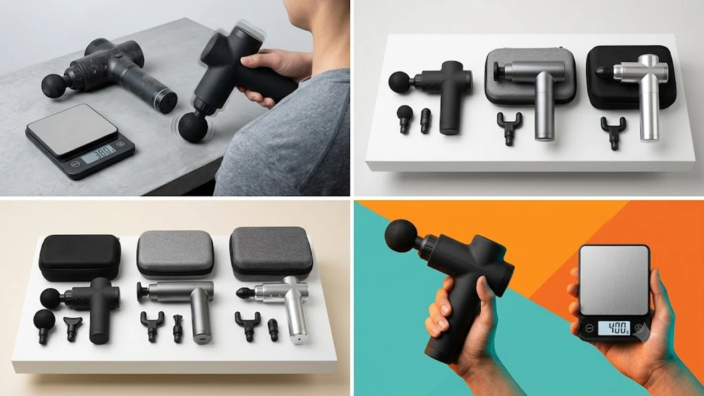

하루 종일 모니터를 보며 키보드와 마우스를 쥐고 일하다 보면 목 뒤부터 견갑골, 승모근까지 뻐근하게 굳어오는 통증을 겪기 마련입니다. 8월 말 환절기 피로와 맞물려 책상에 앉아있는 직장인과 홈 트레이닝을 즐기는 홈트족 사이에서 손목 부담 없이 휴대하며 뭉친 근막을 풀어주는 초경량 미니 마사지건이 필수 데스크템으로 자리 잡았습니다.

## 직장인과 러너가 초경량 미니 마사지건에 열광하는 이유

과거 1kg에 달하던 대형 마사지건은 강한 진동 대비 본체 무게 탓에 팔과 손목에 피로를 누적시키는 치명적인 단점이 있었습니다. 최근 출시되는 포켓형 마사지건은 300\~400g대 초경량 설계를 적용해 가방에 가볍게 수납할 수 있습니다. 

단순히 크기만 줄인 것이 아니라 브러시리스(BLDC) 고토크 모터를 장착하여 강하게 뼈 주변 근육을 눌러도 작동이 멈추지 않는 타격력을 구현했습니다. 책상 옆에 두고 승모근을 풀거나 퇴근 후 러닝 직후 종아리를 풀어주는 용도로 소비 패턴이 정착되었습니다.

## 2026 초경량 미니 마사지건 TOP3 스펙 비교

| 모델명 | 가격대 | 핵심 스펙 | 추천 대상 |
| :--- | :--- | :--- | :--- |
| **바디픽셀 핸디핏 미니** | 3만 원 후반 | 380g / 3,000RPM / 헤드 4종 | 가성비 입문자, 데스크 상시 비치용 |
| **제스파 바이퍼 미니** | 5만 원 중반 | 410g / 3,200RPM / 메탈 하우징 | 직장인 승모근·전신 근막 이완 |
| **보랄 초경량 포켓건** | 8만 원 후반 | 345g / 3,400RPM / 알루미늄 바디 | 러닝·헬스 야외 운동족, 출장 잦은 직장인 |

## 예산대별 추천 모델 3종 상세 분석

### 1. 바디픽셀 핸디핏 미니 마사지건 (BP-GUN-MINI) — 실속형 입문 모델

* **가격대:** 3만 원 후반대
* **핵심 스펙:** 무게 380g, 최대 3,000RPM 회전력, 교체형 헤드 4종 기본 제공
* **장점:** 
  1. 커피 한 잔 무게 수준인 380g으로 장시간 목 뒤를 마사지해도 손목 꺾임이 없습니다.
  2. 라운드 볼, 플랫, U자형, 총알형 헤드가 기본 포함되어 부위별 밀착 마사지가 가능합니다.
* **단점:** 
  1. 플라스틱 외관 소재 특성상 최고 단계 진동 시 손잡이 쪽으로 미세한 잔진동이 전달됩니다.
* **추천 대상:** 사무실 파티션 안이나 책상 위에 두고 가볍게 목과 어깨를 풀 가성비 제품을 찾는 직장인
* [바디픽셀 핸디핏 미니 마사지건 쿠팡에서 보기](https://www.coupang.com/np/search?q=바디픽셀+핸디핏+미니+마사지건&sourceType=affiliate&trackingCode=AF8691300)

---

### 2. 제스파 바이퍼 미니 무선 마사지건 (ZP2420) — 밸런스형 표준 모델

* **가격대:** 5만 원 중반대
* **핵심 스펙:** 무게 410g, 최대 3,200RPM 4단계 조절, 고토크 BLDC 모터
* **장점:** 
  1. 신체 굴곡에 강하게 밀착해도 모터가 헛돌거나 꺼지지 않고 균일한 타격감을 유지합니다.
  2. USB Type-C 포트 충전 방식을 지원해 노트북 충전기나 보조배터리로 손쉽게 충전할 수 있습니다.
* **단점:** 
  1. 전용 하드 파우치가 기본 구성에 포함되지 않아 별도 파우치 구매가 필요합니다.
* **추천 대상:** [2026 무선 버티컬 마우스 추천 TOP3](/posts/trending-picks/wireless-vertical-mouse-top3-2026/)와 함께 책상 위 피로 회복 세팅을 완성하고 싶은 실사용자
* [제스파 바이퍼 미니 무선 마사지건 쿠팡에서 보기](https://www.coupang.com/np/search?q=제스파+바이퍼+미니+무선+마사지건&sourceType=affiliate&trackingCode=AF8691300)

---

### 3. 보랄 초경량 포켓 마사지건 (BR-M300MG) — 프리미엄 휴대용 모델

* **가격대:** 8만 원 후반대
* **핵심 스펙:** 무게 345g, 최대 3,400RPM 5단계 파워, 아노다이징 알루미늄 바디
* **장점:** 
  1. 풀 메탈 바디를 적용해 최고 출력에서도 손잡이 발열과 진동 떨림을 확실하게 억제합니다.
  2. 주머니에 들어가는 초소형 포켓 사이즈로 운동 가방이나 백팩 측면 포켓에 쏙 들어갑니다.
* **단점:** 
  1. 알루미늄 메탈 표면 특성상 겨울철이나 에어컨 직바람 환경에서 처음 쥘 때 표면이 차갑습니다.
* **추천 대상:** [무선 종아리 마사지기 TOP3 가성비 비교](/posts/trending-picks/wireless-calf-massager-top3-2026/)를 보며 하체 관리에 관심이 많거나 헬스장·러닝 크루 모임에 상시 휴대할 강력한 미니건을 찾는 사용자
* [보랄 초경량 포켓 마사지건 쿠팡에서 보기](https://www.coupang.com/np/search?q=보랄+초경량+포켓+마사지건&sourceType=affiliate&trackingCode=AF8691300)

## 미니 마사지건 구매 전 반드시 확인할 체크포인트

1. **스톨 포스(Stall Force) 모터 저항력:** 크기만 작고 출력이 약한 제품은 몸에 대고 누르는 순간 모터 회전이 멈춥니다. 최소 3,000RPM 이상을 지원하는 고토크 BLDC 모터인지 확인해야 합니다.
2. **실측 본체 무게:** 500g을 초과하는 순간 손목에 부담이 가기 시작합니다. 헤드를 제외한 본체 무게가 400g 이하인지 체크하는 것이 핵심입니다.
3. **충전 규격 및 안전 인증:** 전용 어댑터 대신 USB-C 케이블 범용 충전을 지원하는지, KC 배터리 안전 인증을 정식 통과했는지 확인 후 선택해야 합니다.

---

> 이 포스팅은 쿠팡 파트너스 활동의 일환으로, 이에 따른 일정액의 수수료를 제공받습니다.

#트렌드상품 #쿠팡추천 #미니마사지건 #마사지건추천 #데스크테리어 #목어깨안마기 #초경량마사지건 #직장인필수템