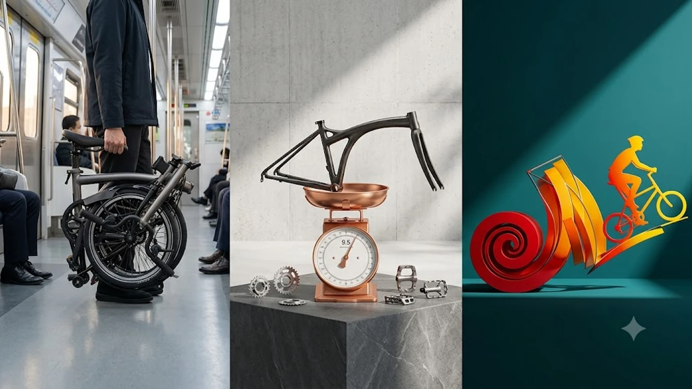

출퇴근길 지하철 연계나 좁은 실내 보관을 해결할 이동 수단으로 접이식 미니벨로가 실용적인 대안으로 꼽힙니다. 선선한 가을 날씨에 맞춰 도심 라이딩과 자전거 출퇴근 수요가 맞물려 휴대성이 뛰어난 폴딩 자전거의 인기가 급상승하고 있습니다.

## 1. 2026년 접이식 미니벨로가 주목받는 이유

* **대중교통 완벽 연계 규격**: 접었을 때 가로 60cm 안팎으로 줄어들어 평일 지하철 탑승 제약을 피하고, 차량 트렁크 적재가 수월합니다.
* **경량화 소재 대중화**: 카본 파츠와 티타늄 프레임 적용 모델이 늘어나 완차 무게 9kg대 진입이 수월해졌습니다.
* **라이프스타일 확장**: 실내 보관으로 도난 위험을 원천 차단하고 주말 레저용 투어링까지 커버합니다.

장시간 데스크 업무로 뭉친 다리 피로를 풀고 싶다면 [무선 종아리 마사지기 TOP3 가성비 비교](/posts/trending-picks/wireless-calf-massager-top3-2026/) 글도 함께 확인해 보세요.

## 2. TOP3 핵심 스펙 및 추천 모델 비교

| 모델명 | 가격대 | 핵심 스펙 | 추천 대상 |
| :--- | :--- | :--- | :--- |
| 에이스오픽스 에어 (Aceoffix Air) | 120만\~150만원대 | 9.5kg 경량, 트라이폴드 3단 접이, 외장 3단 | 가성비 경량 3단 접이 입문자 |
| 브롬톤 P라인 (Brompton P Line) | 410만\~460만원대 | 9.9kg, 티타늄 리어 프레임, 외장 4단 변속 | 완성도 높은 프리미엄 출퇴근 라이더 |
| 턴 버지 D9 (Tern Verge D9) | 130만\~160만원대 | 12.2kg, 20인치(451) 휠셋, 시마노 아세라 9단 | 장거리 항속 주행 및 속도 중시 라이더 |

### 에이스오픽스 에어 (Aceoffix Air)
* **가격대**: 120만 원 \~ 150만 원대
* **핵심 스펙**: 완차 무게 약 9.5kg, 16인치 349 휠셋, 외장 3단(최대 7단 개조 호환)
* **장점**:
  * 100만 원대 초반 가격으로 9kg대 가벼운 완성차 무게 구현
  * 표준 트라이폴드 규격으로 부품 및 액세서리 호환성 우수
* **단점**:
  * 순정 브레이크 세팅과 림 정렬 등 수령 후 초기 정밀 점검 필수
* **추천 대상**: 브롬톤 규격의 컴팩트한 폴딩 방식을 선호하면서 무게 부담과 초기 비용을 낮추고 싶은 실속파 라이더

[에이스오픽스 에어 쿠팡에서 보기](https://www.coupang.com/np/search?q=에이스오픽스+에어&sourceType=affiliate&trackingCode=AF8691300)

### 브롬톤 P라인 (Brompton P Line)
* **가격대**: 410만 원 \~ 460만 원대
* **핵심 스펙**: 완차 무게 9.9kg, 티타늄 리어 프레임 및 포크, 외장 4단 전용 변속기
* **장점**:
  * 5초 내외로 완료되는 직관적이고 견고한 3단 폴딩 시스템
  * 전용 롤러 휠과 랙 시스템으로 접은 상태에서 부드러운 롤링 이동 가능
* **단점**:
  * 400만 원을 상회하는 높은 초기 진입 가격
* **추천 대상**: 대중교통 환승이 잦고, 실내 보관 편의성과 잔존 가치를 최우선으로 두는 도심 출퇴근 라이더

[브롬톤 P라인 쿠팡에서 보기](https://www.coupang.com/np/search?q=브롬톤+P라인&sourceType=affiliate&trackingCode=AF8691300)

### 턴 버지 D9 (Tern Verge D9)
* **가격대**: 130만 원 \~ 160만 원대
* **핵심 스펙**: 완차 무게 12.2kg, 20인치 451 고속 휠셋, 시마노 9단 구동계
* **장점**:
  * 20인치 대형 휠셋 기반으로 일반 하이브리드 자전거에 준하는 고속 항속 능력
  * OCL 조인트 프레임 설계로 주행 중 뒤틀림 없는 강성 확보
* **단점**:
  * 2단 반접이 구조 특성상 접었을 때 부피가 커 지하철 휴대 시 공간 차지 발생
* **추천 대상**: 폴딩 크기보다 주행 속도, 언덕 등판 능력, 중장거리 라이딩 비율이 높은 라이더

[턴 버지 D9 쿠팡에서 보기](https://www.coupang.com/np/search?q=턴+버지+D9&sourceType=affiliate&trackingCode=AF8691300)

컴퓨터 작업 환경 개선이 필요하다면 [2026 무선 버티컬 마우스 추천 TOP3](/posts/trending-picks/wireless-vertical-mouse-top3-2026/) 리뷰도 참고해 보세요.

## 3. 예산대 및 목적별 선택 가이드

* **실속형 도심 통근**: 100만 원대 초반 예산으로 계단 운반이 쉬운 9kg대 무게를 원한다면 **에이스오픽스 에어**가 효율적입니다.
* **장거리 라이딩 및 속도**: 주말 한강 자전거 도로 주행이나 20km 이상 중거리 주행이 주 목적이라면 20인치 휠셋의 **턴 버지 D9**가 적합합니다.
* **종결급 휴대성 및 마감**: 대중교통 연계 이동이 매일 발생하고 내구성과 감성을 모두 챙기려면 **브롬톤 P라인**이 확실한 선택지입니다.

## 4. 구매 전 반드시 체크해야 할 4가지 포인트

* **지하철 휴대 탑승 규정**: 코레일 및 서울교통공사 규정상 평일에는 완전 접이식 자전거만 탑승 가능하므로, 3단 폴딩이나 20인치 이하 접이식인지 확인합니다.
* **실측 무게와 리프팅 한계**: 12kg 이상 모델은 지하철 환승 계단이나 육교 이동 시 피로도가 급격히 올라가므로 본인의 체력을 고려해 무게를 선택합니다.
* **휠셋 규격(16인치 vs 20인치)**: 16인치(349)는 실내 보관과 폴딩 부피에 유리하고, 20인치(451)는 속도 유지와 노면 충격 흡수에 유리합니다.
* **기어 단수와 주행 코스**: 평지 위주 도심 주행은 3\~4단으로 충분하지만, 경사도가 있는 언덕 코스를 포함한다면 7\~9단 이상의 기어비를 갖춘 모델을 골라야 합니다.

---

> 이 포스팅은 쿠팡 파트너스 활동의 일환으로, 이에 따른 일정액의 수수료를 제공받습니다.

#접이식미니벨로 #미니벨로추천 #자전거출퇴근 #브롬톤 #에이스오픽스 #턴미니벨로 #트렌드상품 #쿠팡자전거추천