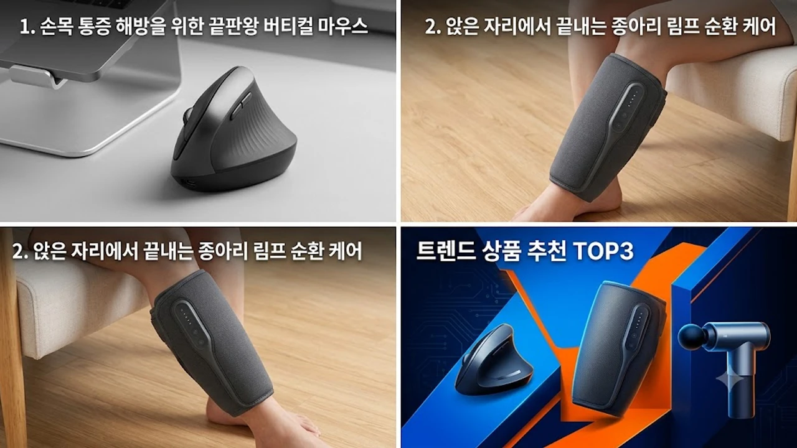

직접 써보고 후회 없었던 2026년 데스크 셋업 및 오피스 웰니스 핵심 아이템 3종을 골랐다. 스펙과 실사용 체감 단점까지 가감 없이 정리했으니 본인 작업 스타일에 맞춰 선택하면 된다.

하루 종일 모니터 앞을 지키는 직장인에게 장비 투자는 선택이 아닌 생존 문제다. 손목 터널 증후군부터 장시간 착석으로 굳어버린 하체 피로를 덜어줄 실질적인 장비들을 하나씩 짚어본다.

## 1. 손목 통증 해방을 위한 끝판왕 버티컬 마우스

손목 꺾임 각도를 인체공학적 57도로 맞춰 마우스 질을 할 때 전완근 부담을 즉각 줄여주는 대표 모델이다.

* **브랜드 / 모델명**: 로지텍 Lift 버티컬 마우스
* **가격대**: 79,000원
* **핵심 스펙**:
  * 57도 인체공학 수직 각도 설계
  * 400\~4,000 DPI 고정밀 옵티컬 센서 탑재
  * AA 배터리 1개로 최대 24개월 연속 작동
* **장점**:
  * 동양인 손 크기(F9\~F10 이하)에 꼭 맞는 그립감으로 기존 대형 MX Vertical 대비 손가락 벌림 부담이 없다.
  * 무소음 스마트휠 탑재로 1줄 단위 정밀 스크롤과 고속 스크롤이 자동으로 전환되며 소음이 0dB에 가깝다.
* **단점**:
  * 내장 리튬 배터리 충전 방식이 아니라서 2년 주기로 AA 건전지 교체가 필요하다.
* **이런 사람에게 추천**: F10 이하 손 크기로 하루 8시간 이상 엑셀이나 데이터 분석 업무를 처리하는 직장인.

손목 통증이 더 심하거나 다른 손 크기별 선택지가 필요하다면 [2026 무선 버티컬 마우스 추천 TOP3](/posts/trending-picks/wireless-vertical-mouse-top3-2026/) 글도 함께 확인해 볼 만하다.

👉 [로지텍 Lift 버티컬 마우스 쿠팡에서 보기](https://www.coupang.com/np/search?q=로지텍+Lift+버티컬+마우스&sourceType=affiliate&trackingCode=AF8691300)

## 2. 앉은 자리에서 끝내는 종아리 림프 순환 케어

오랜 시간 의자에 앉아 있으면 오후 4시만 되어도 다리가 붓고 저려온다. 거추장스러운 공기 호스 없이 벨크로로 감아 바로 작동시키는 무선 에어 압박 장비다.

* **브랜드 / 모델명**: 풀리오 무선 종아리 마사지기 V3
* **가격대**: 128,000원
* **핵심 스펙**:
  * 2.6L 에어펌프 내장
  * 2,600mAh 배터리 용량 (1회 완충 시 140분 작동)
  * 에어 압박 5단계 및 최고 50도 3단계 온열 기능
* **장점**:
  * 듀얼 에어백 구조로 발목부터 무릎 밑 비복근까지 쥐어짜듯 강력하게 가압해 부기가 빠르게 빠진다.
  * 지퍼와 벨크로 이중 체결 방식이라 한 번 둘레를 맞춰두면 지퍼만 올려서 10초 만에 착용할 수 있다.
* **단점**:
  * 1단계 압력도 센 편이라 종아리 뭉침이 심한 초기 사용자는 1\~2일간 뻐근함을 겪을 수 있다.
* **이런 사람에게 추천**: 퇴근 무렵 양말 고무줄 자국이 깊게 파이고 다리 저림을 자주 겪는 내근직 직장인.

시중의 다른 공기압 기기 스펙 차이가 궁금하다면 [무선 종아리 마사지기 TOP3 가성비 비교](/posts/trending-picks/wireless-calf-massager-top3-2026/) 분석을 참고하면 된다.

👉 [풀리오 무선 종아리 마사지기 V3 쿠팡에서 보기](https://www.coupang.com/np/search?q=풀리오+무선+종아리+마사지기+V3&sourceType=affiliate&trackingCode=AF8691300)

## 3. 손목 부담 없는 초경량 타격 마사지건

목 뒤, 승모근, 날개뼈 안쪽 담 결림을 즉각 풀어주는 초소형 고토크 마사지건이다. 1kg짜리 거대한 공구형 마사지건을 들고 있다가 오히려 팔목 관절이 상하는 문제를 막아준다.

* **브랜드 / 모델명**: 바디픽셀 머슬건 미니 제트
* **가격대**: 62,000원
* **핵심 스펙**:
  * 본체 무게 415g 초경량
  * 최대 3,200 RPM 브러시리스(BLDC) 모터 탑재
  * 8mm 진폭 깊이 및 4단계 강도 조절
* **장점**:
  * 415g 무게 덕분에 혼자서 승모근과 삼각근 뒤쪽을 누르고 있어도 손목에 힘이 들어가지 않는다.
  * BLDC 모터를 탑재해 살에 대고 체중을 실어 눌러도 모터 회전수가 떨어지지 않고 일정한 타격을 유지한다.
* **단점**:
  * 8mm 진폭 한계상 허벅지나 엉덩이 같은 두꺼운 대근육 심부 깊숙한 지점까지 자극하기에는 타격 깊이가 얕다.
* **이런 사람에게 추천**: 서랍에 넣어두고 컴퓨터 작업 중 굳어버린 목과 승모근을 2\~3분씩 빠르게 풀고 싶은 직장인.

체급별 타격감과 배터리 지속 시간이 고민된다면 [초경량 마사지건 추천 TOP3 비교](/posts/trending-picks/ultralight-mini-massage-gun-top3-2026/) 글에서 확인해 볼 수 있다.

👉 [바디픽셀 머슬건 미니 제트 쿠팡에서 보기](https://www.coupang.com/np/search?q=바디픽셀+머슬건+미니+제트&sourceType=affiliate&trackingCode=AF8691300)

## 4. 핵심 스펙 비교표 및 현장 운용 가이드

| 모델명 | 가격대 | 핵심 스펙 | 추천 대상 |
| :--- | :--- | :--- | :--- |
| **로지텍 Lift** | 79,000원 | 57도 각도 / 4,000 DPI / AA 24개월 작동 | 손목 통증으로 고생하는 F9\~F10 크기 손 소유자 |
| **풀리오 V3** | 128,000원 | 2.6L 에어펌프 / 5단계 압박 / 50도 온열 | 퇴근길 다리 부종과 저림이 심한 장시간 착석자 |
| **바디픽셀 미니 제트** | 62,000원 | 415g 무게 / 3,200 RPM / 8mm 진폭 | 일하다 수시로 목·승모근 결림을 풀어야 하는 사람 |

장비 세팅 시 주의할 점은 본인 체형과 작업 공간의 면적이다. 

책상이 좁다면 로지텍 Lift처럼 바닥 마찰 면적이 좁고 휠 소음이 없는 기종이 알맞다. 에어 마사지기는 작동 모터 진동음이 바닥을 타고 전달될 수 있으므로 사무실에서는 발 받침대 위에 발을 올린 상태에서 작동시키는 편이 낫다. 

마사지건은 뼈 부위(경추 뼈, 쇄골)를 직접 치지 말고 단단하게 굳은 근복부(근육의 볼록한 중간 지점)만 가볍게 10\~15초씩 이동하며 눌러주어야 근섬유 손상을 막을 수 있다.

---

> 이 포스팅은 쿠팡 파트너스 활동의 일환으로, 이에 따른 일정액의 수수료를 제공받습니다.

#트렌드상품 #쿠팡추천 #트렌드상품추천 #데스크테리어 #로지텍Lift #풀리오종아리마사지기 #미니마사지건 #직장인필수템