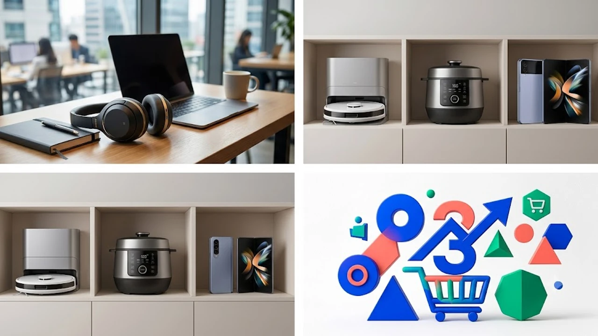

출퇴근 지하철의 날카로운 쇳소리와 카페의 어수선한 말소리를 단번에 지워주는 노이즈캔슬링 헤드폰은 단순한 오디오 장비를 넘어 일상의 집중력을 지키는 방어벽 역할을 톡톡히 합니다.

## 1. 지금 노이즈캔슬링 헤드폰이 뜨는 이유

재택근무와 거점 공유 오피스를 오가는 유연 근무제가 정착하면서 '어디서든 즉시 집중할 수 있는 환경'을 구축하려는 직장인들이 눈에 띄게 늘어났습니다. 개방형 사무실이나 카페 특유의 소음을 완벽히 차단해야 작업 능률이 오르기 때문입니다. 손목 피로를 줄여주는 [2026 무선 버티컬 마우스 추천 TOP3](/posts/trending-picks/wireless-vertical-mouse-top3-2026/) 글에서 소개한 생산성 장비들과 마찬가지로, 이제 헤드폰 역시 데스크 셋업의 핵심 장비로 대접받고 있습니다.

기술적인 진화도 구매 욕구를 자극합니다. 주변 소음 환경을 실시간으로 읽어내 차음 강도를 스스로 조율하는 적응형 ANC(액티브 노이즈 캔슬링)와 머리 움직임을 추적하는 입체 공간 음향이 플래그십은 물론 보급형 라인업까지 빠르게 번졌습니다. 여기에 스마트폰과 태블릿을 오가며 매끄럽게 페어링을 전환하는 멀티포인트 기능이 기본 탑재되면서 일상 속 활용도가 극대화되었습니다.

---

## 2. TOP3 상품 스펙 비교

현재 오픈마켓과 오디오 커뮤니티에서 실사용 만족도가 가장 높은 세 모델을 선별했습니다.

| 모델명 | 가격대 | 핵심 스펙 | 추천 대상 |
| :--- | :--- | :--- | :--- |
| **QCY H3 Pro** | 4만\~5만 원대 | 최대 43dB 차음 / 40mm 다이내믹 드라이버 / 60시간 연속 재생 | 부담 없는 가격에 ANC에 입문하려는 학생 및 사회초년생 |
| **소니 WH-1000XM5** | 39만\~44만 원대 | 8개 마이크 차음 시스템 / 무게 250g / LDAC 고해상도 코덱 | 균형 잡힌 해상력과 깔끔한 통화 음질을 원하는 직장인 |
| **보스 QuietComfort Ultra** | 47만\~52만 원대 | 몰입형 공간 오디오 / 무게 253g / CustomTune 음향 최적화 | 장시간 착용 시 정수리 통증 없이 강력한 소음 차단을 원하는 헤비 유저 |

---

## 3. 예산대별 추천 (저가·중간·프리미엄)

### 저가 가성비 원픽: QCY H3 Pro
*   **브랜드/모델명:** QCY H3 Pro
*   **실구매 가격대:** 4만 원대 후반 \~ 5만 원대 초반
*   **핵심 스펙:**
    *   최대 -43dB 하이브리드 액티브 노이즈 캔슬링
    *   배터리 용량 ANC On 기준 40시간 / ANC Off 기준 60시간 재생
    *   40mm PET 복합 다이어프램 드라이버 탑재
*   **장점:**
    *   5만 원 언더 가격대에서 보기 힘든 강력한 저음역대 차음 성능을 보여주며, 지하철 모터 구동음이나 버스 엔진 소음을 놀라울 정도로 잘 걸러냅니다.
    *   전용 스마트폰 앱을 통해 커스텀 EQ 조절과 노이즈 캔슬링 모드 세부 변경이 가능해 가성비가 압도적입니다.
*   **단점:**
    *   이어패드 쿠션감이 다소 뻣뻣하고 인조가죽 통기성이 떨어져 2시간 이상 착용 시 귀 주변에 땀이 차기 쉽습니다.
*   **이런 사람에게 추천:** 비싼 프리미엄 기기가 부담스럽거나, 헬스장 운동용 또는 독서실 공부용으로 막 굴릴 세컨드 헤드폰을 찾는 실속파.
*   👉 [QCY H3 Pro 쿠팡에서 보기](https://www.coupang.com/np/search?q=QCY+H3+Pro&sourceType=affiliate&trackingCode=AF8691300)

### 올라운더 중간급 표준: 소니 WH-1000XM5
*   **브랜드/모델명:** 소니(SONY) WH-1000XM5
*   **실구매 가격대:** 39만 원대 \~ 44만 원대
*   **핵심 스펙:**
    *   8개의 마이크와 2개의 프로세서(V1 + QN1) 통합 제어
    *   무게 250g 초경량 슬림 디자인
    *   ANC On 기준 최대 30시간 재생 (3분 급속 충전 시 3시간 사용)
*   **장점:**
    *   고음역대 사람 목소리와 카페 소음을 걸러내는 필터링 능력이 현존 제품 중 최상위권에 속해 업무 몰입도를 비약적으로 끌어올립니다.
    *   빔포밍 마이크 4개와 AI 노이즈 감소 알고리즘이 결합되어 바람이 부는 야외에서도 화상회의나 통화를 선명하게 처리합니다.
*   **단점:**
    *   헤드폰 프레임이 접히지 않는 일체형 스위블 구조라 기본 하드케이스 부피가 제법 커 가방 속 공간을 꽤 차지합니다.
*   **이런 사람에게 추천:** 안드로이드 폰으로 LDAC 무손실 음원을 감상하면서 재택근무 화상미팅까지 한 번에 끝내려는 비즈니스맨.
*   👉 [소니 WH-1000XM5 쿠팡에서 보기](https://www.coupang.com/np/search?q=소니+WH-1000XM5&sourceType=affiliate&trackingCode=AF8691300)

### 프리미엄 끝판왕: 보스 QuietComfort Ultra
*   **브랜드/모델명:** 보스(Bose) QuietComfort Ultra Headphones
*   **실구매 가격대:** 47만 원대 \~ 52만 원대
*   **핵심 스펙:**
    *   Bose 몰입형 오디오(공간 음향) 탑재
    *   무게 약 253g 및 폴딩 수납 힌지 구조
    *   사용자 귀 구조 맞춤형 CustomTune 자동 튜닝
*   **장점:**
    *   '착용감의 보스'라는 명성에 걸맞게 헤드밴드 장력이 부드러워 뿔테 안경을 쓴 채 반나절 이상 작업해도 관자놀이나 정수리가 욱신거리지 않습니다.
    *   저음역 차음이 극도로 자연스러워 장시간 귀에 노이즈캔슬링 특유의 멍한 먹먹함(이압)이 거의 남지 않습니다.
*   **단점:**
    *   공간 음향 모드를 상시 켜두면 배터리 지속 시간이 18시간 안팎으로 뚝 떨어져 충전 주기가 짧아집니다.
*   **이런 사람에게 추천:** 장거리 비행이나 출장이 잦아 기내 소음 차단이 절실하고, 착용감에 민감해 두통을 쉽게 느끼는 여행자.
*   👉 [보스 QuietComfort Ultra 쿠팡에서 보기](https://www.coupang.com/np/search?q=보스+QuietComfort+Ultra&sourceType=affiliate&trackingCode=AF8691300)

---

## 4. 구매 전 반드시 확인할 체크포인트

헤드폰을 고를 때는 단순 출력이나 디자인만 보고 덜컥 결제했다가 낭패를 보기 십상입니다. 장시간 귀에 얹어두는 제품 특성상 아래 네 가지 요소를 꼼꼼히 대조해 봐야 실패가 없습니다.

첫째는 무게와 헤드밴드 장력입니다. 260g을 넘어가는 헤드폰은 1\~2시간만 연속 착용해도 목덜미와 정수리에 뻐근한 피로를 줍니다. 본인이 안경을 쓰거나 두상이 좌우로 넓은 편이라면 조이는 힘이 덜한 보스 계열을 고르는 편이 현명합니다.

둘째는 코덱 지원 여부입니다. 고음질 음원 스트리밍을 즐긴다면 스마트폰 기종과 맞아떨어지는지 살펴야 합니다. 갤럭시는 24bit 고음질 전송이 가능한 LDAC 지원 기기를 고르는 것이 음향적 이점이 크며, 아이폰 사용자라면 AAC 압축 전송 최적화가 잘 된 모델로도 충분한 퍼포먼스를 냅니다.

셋째는 이압(귀 먹먹함) 조절 기능입니다. 노이즈 캔슬링 헤드폰은 역위상 파형을 쏘아 소음을 상쇄하는 원리라 밀폐된 공간에서 기압이 변하는 듯한 불쾌감을 겪는 사용자가 적지 않습니다. 전용 앱에서 차음 단계를 세밀하게 줄일 수 있거나, 기압 최적화 센서가 들어간 제품을 선택해야 적응하기 수월합니다.

퇴근 후 뭉친 다리를 풀어주는 [무선 종아리 마사지기 TOP3 가성비 비교](/posts/trending-picks/wireless-calf-massager-top3-2026/)를 찾는 것처럼, 귀와 뇌의 피로를 덜어주는 음향 기기 역시 본인의 일상 패턴과 착용 시간에 맞춰 고르는 지혜가 요구됩니다.

---

> 이 포스팅은 쿠팡 파트너스 활동의 일환으로, 이에 따른 일정액의 수수료를 제공받습니다.

#트렌드상품 #쿠팡추천 #노이즈캔슬링헤드폰 #소니헤드폰 #보스헤드폰 #가성비헤드폰 #무선헤드폰추천 #QCY헤드폰