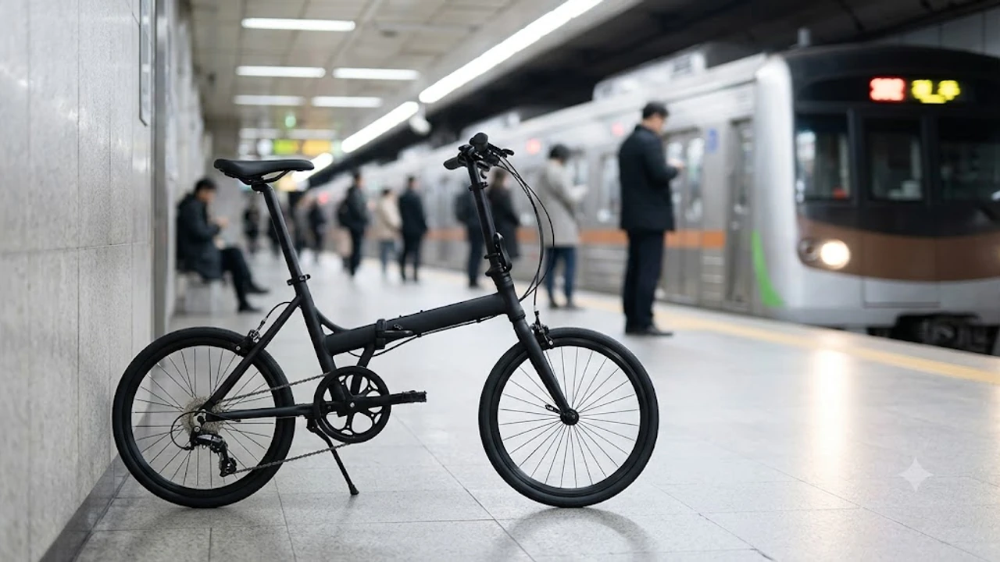

출퇴근길 지하철 지옥철을 겪어본 사람이라면 자전거를 들고 탄다는 발상 자체가 사치처럼 느껴질 수 있습니다. 하지만 무게 8kg 안팎의 경량 접이식 미니벨로는 얘기가 다릅니다. 개찰구를 지나 계단을 오르내리고, 접어서 사무실 책상 밑에 밀어 넣는 라이프스타일이 현실화되었기 때문입니다. 가을 라이딩 시즌과 맞물려 도심 통근자들의 수요가 집중되는 대표적인 모델 3종을 정밀 비교합니다.

---

## 1. 지금 접이식 미니벨로가 뜨는 이유

도심 교통 체증 심화와 대중교통 요금 인상 흐름 속에서 지하철역과 목적지를 잇는 이동 수단의 기준이 전동 킥보드에서 경량 미니벨로로 옮겨갔습니다. 배터리 화재 우려나 충전 번거로움이 없고, 지하철 접이식 자전거 휴대 승차 규정을 안정적으로 통과하기 때문입니다.

구형 철제 프레임의 11\~13kg 무게를 벗어나 카본 복합재, 티타늄, 경량 알루미늄 가공을 적용해 성인 남녀 누구나 한 손으로 계단을 오를 수 있는 7\~9kg대 트라이폴드(3단 접이) 기종의 접근성이 대폭 개선되었습니다.

출퇴근길 손목 부담을 덜어주는 장비 세팅을 고민 중이라면 사무실 환경에서는 [2026 무선 버티컬 마우스 추천 TOP3](/posts/trending-picks/wireless-vertical-mouse-top3-2026/) 세팅을 챙기는 것만큼이나, 통근길 이동 피로를 덜어주는 저중량 미니벨로 선택이 일상의 체력을 아끼는 핵심 요소입니다.

---

## 2. TOP3 상품 스펙 비교

| 모델명 | 가격대 | 핵심 스펙 | 추천 대상 |
|---|---|---|---|
| **다혼 K3 (Dahon K3)** | 60만\~70만 원대 | 8.1kg / 14인치 / 외장 3단 (9-13-17T) / 53T 크랭크 | 60만 원대 가성비와 지하철 환승 연계 통근자 |
| **에이스오픽스 에이스 에어 (Aceoffix Ace Air)** | 110만\~130만 원대 | 7.8kg / 16인치(349) / 외장 3단 / 카본 싯포스트 | 7kg대 초경량과 콤팩트 보관을 노리는 실속파 |
| **브롬톤 P라인 어반 4단 (Brompton P Line)** | 420만\~460만 원대 | 9.8kg / 16인치 / 외장 4단 (4단 텐셔너) / 티타늄 리어 | 정밀한 폴딩 완성도, 내구성, 장기 보유 유저 |

---

## 3. 예산대별 추천 (저가·중간·프리미엄)

### 다혼 K3 (Dahon K3) — 60만 원대 입문 종결자

* **가격대:** 60만 \~ 70만 원대
* **핵심 스펙:** 
  * 페달 제외 실측 8.1kg
  * 14인치 알루미늄 휠셋 및 전용 외장 3단 (9-13-17T)
  * 폴딩 규격 65 x 63 x 30cm
* **장점:** 
  * 14인치 휠 기반으로 가로 접이 후 부피가 작아 만원 지하철 문 옆 틈새나 버스 좌석 앞에도 곧바로 들어갑니다.
  * 60만 원대 지출로 완성차 8.1kg을 확보할 수 있어 가격 대비 감량 효율이 뛰어납니다.
* **단점:** 
  * 85cm의 짧은 휠베이스 때문에 과속방지턱이나 노면 요철 통과 시 조향 흔들림이 크고 충격이 직관적으로 전달됩니다.
* **추천 대상:** 편도 3\~5km 단거리 평지 위주 지하철 연계 통근자, 원룸 현관에 보관해야 하는 1인 가구.

[다혼 K3 쿠팡에서 보기](https://www.coupang.com/np/search?q=다혼+K3&sourceType=affiliate&trackingCode=AF8691300)

---

### 에이스오픽스 에이스 에어 (Aceoffix Ace Air) — 100만 원대 실속 초경량

* **가격대:** 110만 \~ 130만 원대
* **핵심 스펙:** 
  * 완성차 실측 7.8kg (카본 싯포스트·경량 안장 포함)
  * 16인치 349 규격 경량 휠셋 및 외장 3단 구동계
  * 폴딩 규격 58 x 58 x 30cm (3단 트라이폴드 구조)
* **장점:** 
  * 브롬톤형 트라이폴드 방식을 취하면서도 무게를 7.8kg으로 묶어 계단 이동 시 어깨와 손목 부담이 대폭 줄어듭니다.
  * 16인치 349 휠을 채택해 시속 20km대 크루징 주행 시 14인치 대비 항속 유지력이 안정적입니다.
* **단점:** 
  * 공장 출고 직후 힌지 클램프 유격과 디레일러 텐션 세팅 상태 편차가 있어 수령 후 전문 숍 정비가 한 차례 요구됩니다.
* **추천 대상:** 400만 원대 지출은 부담스럽지만 7kg대 가벼운 무게와 작은 폴딩 부피를 모두 원하는 통근 라이더.

[에이스오픽스 미니벨로 쿠팡에서 보기](https://www.coupang.com/np/search?q=에이스오픽스+미니벨로&sourceType=affiliate&trackingCode=AF8691300)

---

### 브롬톤 P라인 어반 4단 (Brompton P Line) — 400만 원대 플래그십

* **가격대:** 420만 \~ 460만 원대
* **핵심 스펙:** 
  * 실측 9.8kg (리어 랙 제외)
  * 티타늄 리어 프레임 및 티타늄 프론트 포크
  * 신형 외장 4단 스프라켓 시스템
* **장점:** 
  * 특허받은 힌지 체결부의 유격 제어력과 순정 이지휠 덕분에 흔들림 없이 캐리어처럼 밀며 이동할 수 있습니다.
  * 단단한 프레임 강성으로 급경사 페달링 시 뒤틀림 손실이 없으며 30km 이상 중거리 주행도 무리 없이 소화합니다.
* **단점:** 
  * 400만 원대 중반의 높은 출고가와 분실·도난 위험 때문에 실내 보관 공간 확보가 필수적입니다.
* **추천 대상:** 완성도 높은 기계적 마감을 최우선시하며 주말 30km 이상 중거리 투어링까지 겸하는 라이더.

[브롬톤 자전거 쿠팡에서 보기](https://www.coupang.com/np/search?q=브롬톤+자전거&sourceType=affiliate&trackingCode=AF8691300)

---

## 4. 구매 전 반드시 확인할 체크포인트

### 실측 무게와 실제 이동 동선
제원표 상 무게는 페달, 킥스탠드, 머드가드를 제외한 수치입니다. 실측 10kg이 넘어가면 계단을 2개 층 이상 오를 때 어깨와 전완근에 피로가 급격히 누적됩니다. 환승 경로에 에스컬레이터가 없다면 실측 9kg 이하 기종을 선택하는 것이 매일 지속하는 유일한 방법입니다. 주말 장거리 주행 후 뭉친 하체 피로는 [무선 종아리 마사지기 TOP3 가성비 비교](/posts/trending-picks/wireless-calf-massager-top3-2026/)를 통해 풀어주는 것도 좋습니다.

### 폴딩 방식 (2단 수평 접이 vs 3단 트라이폴드)
* **2단 수평 접이 (다혼 K3):** 프레임 중앙을 1회 접어 5초 안에 정리가 끝나지만 접은 후 가로 폭이 65cm에 달해 복잡한 지하철 통로에서 무릎이나 옆 사람과 간섭이 발생합니다.
* **3단 트라이폴드 (에이스오픽스, 브롬톤):** 뒷바퀴를 하단으로 스윙해 넣고 앞바퀴를 꺾는 3단계 메커니즘을 적용해 정육면체(약 58 x 58cm) 형태로 모입니다. 카페 테이블 밑이나 승용차 트렁크에 두 대를 나란히 적재하기에 적합합니다.

### 기어비와 휠 규격
* **14인치:** 타이어 외경이 작아 회전 관성이 낮고 노면 턱을 넘을 때 핸들 털림 현상이 발생합니다. 편도 3km 이내 단거리 이동에 한정해야 합니다.
* **16인치 349 규격:** 도로 둔턱 주파력이 확보되며 시속 20\~25km 주행 시에도 페달링 케이던스가 안정적으로 유지됩니다.
* 오르막 구간이 포함된 경로라면 크랭크 체인링과 리어 스프라켓 T수 조합을 확인해야 합니다. 최소 3단 이상의 외장 기어와 17T 이상의 저속 코그가 확보되어야 경사도 8% 이상의 언덕길에서 하차 없이 주행할 수 있습니다.

---

> 이 포스팅은 쿠팡 파트너스 활동의 일환으로, 이에 따른 일정액의 수수료를 제공받습니다.

#트렌드상품 #쿠팡추천 #접이식미니벨로 #출퇴근자전거 #초경량자전거 #브롬톤 #다혼K3 #미니벨로추천 #도심형자전거