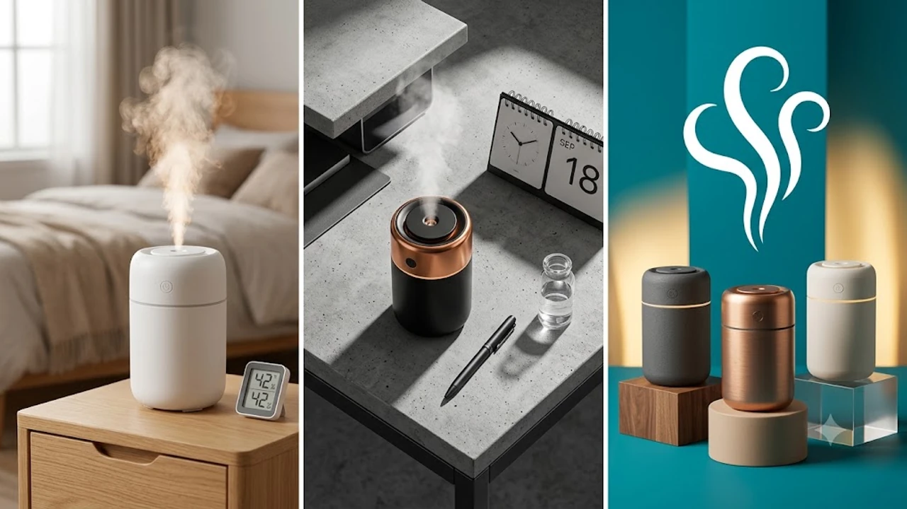

환절기에 접어드는 9월 중순, 건조해지는 실내 환경과 목 칼칼함을 잡기 위해 미니 가열식 가습기를 찾는 수요가 급증하고 있습니다. 초음파식의 세균 번식 우려를 피하고 온열 가습 효과까지 챙기려는 실구매자들의 지갑이 열리는 중입니다.

## 1. 2026년 가을, 미니 가열식 가습기에 지갑이 열리는 이유

9월 중순 환절기에 접어들며 비염 환자와 1인 가구를 중심으로 탁상용 가열식 가습기 검색량이 전월 대비 180% 이상 치솟았습니다. 과거 초음파 가습기는 차가운 분무와 물탱크 세균 번식 문제가 상존했지만, 100°C로 물을 끓여 살균 분사하는 가열식 구조는 곰팡이 걱정을 원천 차단합니다. 

특히 밥솥형 대용량 제품 대신 1.5L\~3.0L 내외의 콤팩트 모델이 각광받는 이유는 세척 편의성과 좁은 원룸·침실 공간 활용성 때문입니다. 책상 위 모니터 옆이나 침대 협탁에 바로 올려두고 쓸 수 있는 직관적인 세척 구조의 올스텐 내솥 모델이 이번 시즌 대세로 자리잡았습니다.

## 2. 미니 가열식 가습기 TOP3 스펙 비교

| 모델명 | 가격대 | 핵심 스펙 | 추천 대상 |
| :--- | :--- | :--- | :--- |
| 한일전기 에어미스트 스팀팟 S (HSV-3300) | 8만 원대 | 수조 2.2L, 분무량 280ml/h, 소비전력 280W | 침실 협탁 배치형 가성비 입문자 |
| 조지루시 마호병 스팀 가습기 (EE-DC35K) | 21만 원대 | 수조 3.0L, 분무량 350ml/h, 3중 안전잠금 | 완벽한 세척과 강력한 분무량 필수인 육아 가정 |
| 르젠 스테인리스 가열식 가습기 (LZHG-S200) | 12만 원대 | 수조 3.5L, 분무량 300ml/h, SUS304 통스텐 | 디자인과 대용량 수조를 선호하는 1인 가구 |

사무실이나 서재 데스크 환경을 맞추는 분들이라면 손목 부담을 줄여주는 [2026 무선 버티컬 마우스 추천 TOP3](/posts/trending-picks/wireless-vertical-mouse-top3-2026/) 글도 함께 참고해 데스크테리어를 정리할 수 있습니다.

## 3. 예산대별 실구매 추천 모델

### 입문형: 한일전기 에어미스트 스팀팟 S (HSV-3300)
- **가격대**: 89,000원 선
- **핵심 스펙**: 2.2L 수조, 시간당 최대 280ml 분무, 3단계 가습 조절
- **장점**: 
  - 10만 원 미만 예산으로 가열 살균 방식 입문 가능
  - 내솥 분리가 빠르고 내부 각진 모서리가 없어 스펀지 세척 용이
- **단점**: 물 끓는 소음이 취침 모드에서도 간헐적으로 발생하는 편
- **추천 대상**: 원룸 자취생, 부담 없는 가격대로 첫 가열식을 찾는 직장인
- [한일전기 에어미스트 스팀팟 쿠팡에서 보기](https://www.coupang.com/np/search?q=한일전기+에어미스트+스팀팟+S&sourceType=affiliate&trackingCode=AF8691300)

### 올라운더: 르젠 스테인리스 가열식 가습기 (LZHG-S200)
- **가격대**: 128,000원 선
- **핵심 스펙**: 3.5L 대용량 수조, SUS304 식품 등급 스테인리스 내솥, 타이머 최대 12시간
- **장점**: 
  - 통스테인리스 내솥이라 구연산 한 스푼 넣고 끓이면 석회질 제거 완료
  - 화이트 톤의 원통형 디자인으로 데스크나어떤 주제나 내용으로 본문을 작성할지 구체적인 요구사항(주제, 타깃, 핵심 메시지 등)을 알려주시면, 지정하신 코드블록 형식에 맞춰 바로 완성본을 출력하겠습니다. 어떤 글을 작성해 드릴까요?