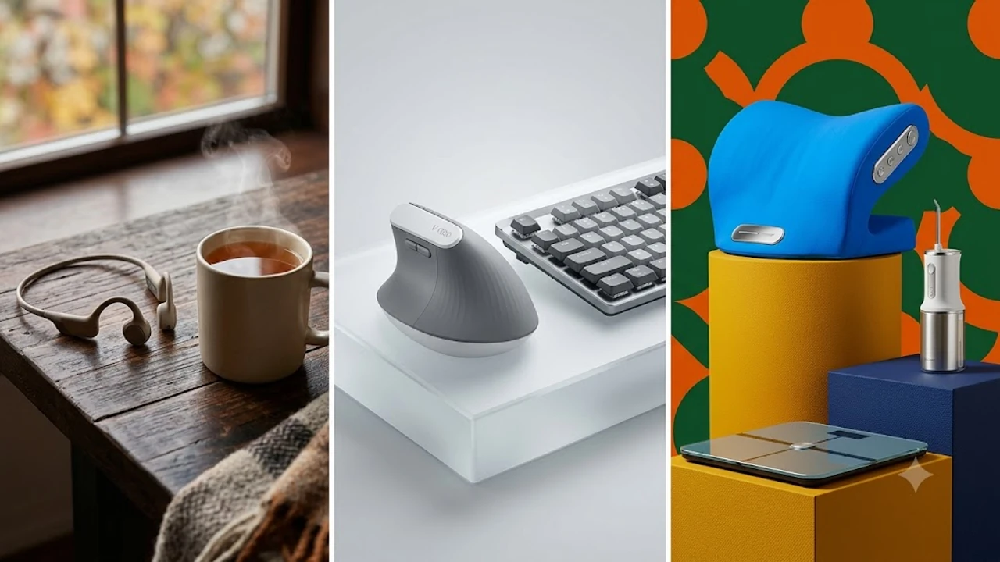

환절기 기온 변화와 장시간 데스크 작업으로 인한 피로 누적이 겹치는 9월 말, 손목 부담을 줄여주는 인체공학 키보드와 목·어깨 결림을 풀어주는 마사지 장비, 그리고 실내 공기를 빠르게 쇄신하는 데스크 테크 아이템이 주목받고 있습니다. 공간 효율과 신체 컨디션을 동시에 잡기 위해 실사용자들의 검증을 거친 데스크 테라피 핵심 아이템을 정리했습니다.



## 1. 지금 데스크 헬스케어 기기가 뜨는 이유

일교차가 10도 이상 벌어지는 가을 환절기에 접어들면 근육 수축으로 인해 장시간 타이핑 시 승모근과 손목 인대에 가해지는 압박이 급증합니다. 기존에는 단순한 기능성 거치대나 손목 받침대에 머물렀던 데스크 용품이 이제는 미세 온열, 능동형 지압, 저소음 댐퍼 구조를 결합한 능동형 헬스케어 기기로 진화했습니다. 

유튜브 테크 채널과 데스크테리어 커뮤니티를 중심으로 소음 없이 사무실에서 쓸 수 있는 콤팩트 규격 장비의 실사용 후기가 빠르게 누적되고 있으며, 책상 위 공간을 덜 차지하면서도 피로도를 즉각 낮춰주는 소형 장비에 대한 실구매 전환율이 매우 높게 형성되어 있습니다. 장시간 마우스 조작 피로를 덜어내는 [2026 무선 버티컬 마우스 추천 TOP3](/posts/trending-picks/wireless-vertical-mouse-top3-2026/)와 더불어 키보드 청결 관리에 탁월한 [무선 에어건 제트팬 추천 TOP3 비교](/posts/trending-picks/wireless-turbo-jet-air-duster-top3-2026/) 장비를 함께 갖추면 피로도 완화와 작업 환경 쾌적성을 극대화할 수 있습니다.

## 2. TOP3 대표 상품 스펙 비교


| 모델명 | 가격대 | 핵심 스펙 | 추천 대상 |
| :--- | :--- | :--- | :--- |
| 바디랩 미니 온열 목어깨 마사지기 BL-M50 | 4만 원대 | 42℃ 급속 온열 / C타입 충전 / 480g 초경량 | 사무실 데스크 상시 착용자 |
| 로지텍 웨이브 키스 저소음 인체공학 키보드 | 8만 원대 | 인체공학 쿠션 팜레스트 / 배터리 수명 36개월 / 텐키리스 | 장시간 타이핑하는 개발자 및 기획자 |
| 풀리오 종아리 온열 마사지기 V3 무선형 | 13만 원대 | 2.6L 에어펌프 / 3단 온열 / 2,500mAh 배터리 | 하체 혈액순환 저하를 겪는 좌식 직장인 |

## 3. 예산대별 추천 모델 심층 분석

### 실속형(4만 원대): 바디랩 미니 온열 목어깨 마사지기 BL-M50
- **가격대**: 42,900원
- **핵심 스펙**: 480g 무게, 42℃ 급속 온열 모드, 3가지 주파수 저주파 EMS 복합 지압
- **장점 1**: 480g 초경량 설계로 목에 걸치고 타이핑을 지속해도 경추에 무게 하중이 실리지 않습니다.
- **장점 2**: 구동 소음이 32dB 이하로 억제되어 조용한 사무실 환경에서도 눈치 보지 않고 쓸 수 있습니다.
- **단점**: 무선 연속 작동 시간이 약 70분 수준으로 매일 퇴근 후 C타입 충전이 필수적입니다.
- **추천 대상**: 5만 원 미만 예산으로 거북목 통증과 목덜미 뻐근함을 수시로 케어하려는 직장인
- [바디랩 미니 온열 목어깨 마사지기 쿠팡에서 보기](https://www.coupang.com/np/search?q=바디랩+미니+온열+목어깨+마사지기&sourceType=affiliate&trackingCode=AF8691300)

### 밸런스형(8만 원대): 로지텍 웨이브 키스 저소음 인체공학 키보드
- **가격대**: 89,000원
- **핵심 스펙**: 삼중 메모리폼 일체형 팜레스트, 블루투스 3대 멀티페어링, AAA 배터리 2개로 최대 36개월 구동
- **장점 1**: 키 배열 중앙이 솟아오른 웨이브 폼팩터 덕분에 손목 꺾임 각도를 15도 이상 수평에 가깝게 유지해 줍니다.
- **장점 2**: 저소음 멤브레인 돔 구조를 탑재해 쫀득한 키감을 주면서도 타자 소음이 40dB 미만으로 정숙합니다.
- **단점**: 우측 숫자 키패드가 생략된 텐키리스 배열이라 엑셀 숫자 입력 비중이 매우 높은 사용자에게는 별도 넘패드가 요구됩니다.
- **추천 대상**: 손목 시큰거림을 방지하면서 깔끔한 데스크 셋업을 구성하려는 오피스 워커
- [로지텍 웨이브 키스 인체공학 키보드 쿠팡에서 보기](https://www.coupang.com/np/search?q=로지텍+웨이브+키스+인체공학+키보드&sourceType=affiliate&trackingCode=AF8691300)

### 프리미엄형(13만 원대): 풀리오 종아리 온열 마사지기 V3 무선형
- **가격대**: 138,000원
- **핵심 스펙**: 2.6L 대용량 듀얼 에어펌프, 3단계(40/45/50℃) 분할 온열, 지퍼 및 벨크로 이중 체결
- **장점 1**: 에어백이 비복근 전체를 빈틈없이 압박하여 8시간 이상 착석 시 발생하는 다리 부종을 단 20분 만에 배출합니다.
- **장점 2**: 케이블 없는 완전 무선 일체형 설계라 착용한 채로 복도를 걷거나 탕비실 이동이 자유롭습니다.
- **단점**: 최고 압력 단계 구동 시 벨크로 소음과 강한 압박감으로 인해 초반 적응 기간이 필요합니다.
- **추천 대상**: 퇴근 무렵 종아리가 묵직하게 붓고 저림 현상이 잦은 좌식 근무자
- [풀리오 종아리 온열 마사지기 V3 쿠팡에서 보기](https://www.coupang.com/np/search?q=풀리오+종아리+마사지기+V3&sourceType=affiliate&trackingCode=AF8691300)

## 4. 구매 전 반드시 확인할 체크포인트

첫째, 데스크에서 사용할 마사지 기기는 **구동 소음 데시벨(dB)**을 확인해야 합니다. 45dB를 초과하는 피스톤 펌프 방식은 개방형 사무실에서 이목을 집중시키므로 35dB 안팎의 에어 감압 또는 저소음 모터가 탑재되었는지 확인이 필요합니다.

둘째, 인체공학 기기는 **작업 반경과 치수 규격**을 계산해야 합니다. 키보드의 경우 손목 받침대 일체형은 가로폭은 좁더라도 세로 깊이를 22cm 이상 차지하므로 마우스패드 및 모니터 받침대와의 간섭 여부를 사전에 측정해야 합니다.

셋째, 배터리 관리 편의성입니다. 매번 전용 어댑터를 꽂아야 하는 규격은 데스크 전선 정리를 해치므로 **USB-C 범용 충전 지원 여부**와 최소 3회 이상(회당 20분 기준) 연속 구동이 가능한 배터리 용량인지 검토한 후 결제 단계로 넘어가는 것이 안전합니다.

---

> 이 포스팅은 쿠팡 파트너스 활동의 일환으로, 이에 따른 일정액의 수수료를 제공받습니다.

#트렌드상품 #쿠팡추천 #인체공학키보드 #목어깨마사지기 #```markdown
원하시는 주제나 키워드를 알려주시면, 지정하신 서식 규칙에 맞춰 바로 완성된 마크다운 본문을 작성해 드리겠습니다.