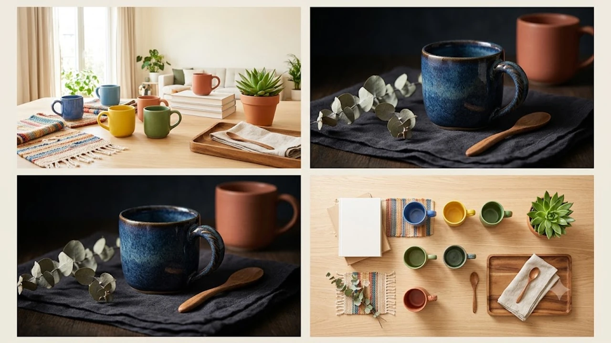

기온이 떨어지면서 이어컵 내부 발열 부담이 줄어드는 가을 시즌을 기점으로 오버이어 노이즈 캔슬링(ANC) 헤드폰 수요가 가파르게 상승했습니다. 출퇴근 대중교통의```markdown
## 디지털 퍼포먼스 마케팅의 성과 추적 체계 구축

디지털 마케팅에서 데이터 기반의 의사결정을 내리기 위해서는 정확한 성과 추적 체계 구축이 선행되어야 합니다. 광고 매체별 전환 데이터와 웹사이트 내부 로그 데이터를 일치시키는 작업이 필수적이며, 이를 통해 각 퍼널 단계에서의 누수를 파악할 수 있습니다.

* **UTM 파라미터 표준화**: 소스(source), 매체(medium), 캠페인(campaign) 명명 규칙을 일관되게 수립하여 데이터 파편화를 방지합니다.
* **서버사이드 트래킹(CAPI) 도입**: 브라우저 쿠키 차단 정책 및 개인정보 보호 강화에 대응하여 전환 누락을 최소화합니다.
* **이벤트 태그 계층화**: 페이지 조회, 스크롤 깊이, 장바구니 담기, 최종 문의 제출 등 행동 단계별 트리거를 체계적으로 분류합니다.

## 검색 광고(SA)와 디스플레이 광고(DA)의 예산 배분 전략

전환 가능성이 높은 고의도 검색 유저와 잠재 고객 풀 확대를 위한 탐색 유저를 균형 있게 공략해야 합니다. 검색 광고는 효율적인 CPA 관리에 초점을 맞추고, 디스플레이 및 숏폼 광고는 신규 유입 단가 최적화에 집중합니다.

* **브랜드 키워드 방어**: 자사 브랜드 키워드의 점유율을 유지하되, 입찰 경쟁 완화 시 입찰가를 탄력적으로 조정합니다.
* **세부 키워드(롱테일) 발굴**: 전환 의도가 명확한 복합 키워드를 상시 발굴하여 불필요한 클릭 비용 낭비를 차단합니다.
* **리타게팅 빈도(Frequency) 제어**: 동일 타깃에 대한 광고 피로도를 방지하기 위해 노출 빈도 상한을 설정하고 모수를 주기적으로 갱신합니다.

## 전환율(CVR) 극대화를 위한 랜딩 페이지 최적화

트래픽의 획득 단가가 낮더라도 도착 페이지의 설득력이 부족하면 전체 캠페인 ROAS는 저하됩니다. 랜딩 페이지는 광고 소재의 소구점과 시각적·문맥적 일관성을 유지해야 이탈률을 낮출 수 있습니다.

* **헤드카피 메시지 일치**: 사용자가 클릭한 광고 카피와 랜딩 페이지 상단 메인 카피의 메시지를 일치시켜 신뢰도를 확보합니다.
* **페이지 로딩 속도 개선**: 이미지 경량화 및 불필요한 스크립트 지연 로딩을 적용하여 2초 이내 첫 콘텐츠 렌더링을 보장합니다.
* **CTA(Call to Action) 단순화**: 신청 양식의 필수 입력 필드를 최소화하여 전환 허들을 낮춥니다.

## 멀티채널 기여 모델 분석 및 캠페인 스케일업

단일 매체의 라스트 클릭(Last-Click) 기준 평가는 상위 퍼널에서 기여한 인지 광고의 가치를 저평가할 위험이 있습니다. 채널 간 상호작용을 파악하고 증분(Incrementality) 성과를 측정하는 것이 중요합니다.

* **데이터 기반 기여(DDA) 검토**: 매체 간 교차 전환 경로를 분석하여 최종 전환에 영향을 미친 유입 채널별 가중치를 부여합니다.
* **ROAS 임계점 설정**: 한계 효율이 하락하는 변곡점을 파악하여 무리한 일 예산 증액 대신 소재 교체 주기를 단축합니다.
* **크리에이티브 A/B 테스트 정례화**: 썸네일, 후킹 문구, 혜택 강조형 등 변수 하나만을 제어한 분할 테스트를 상시 가동합니다.