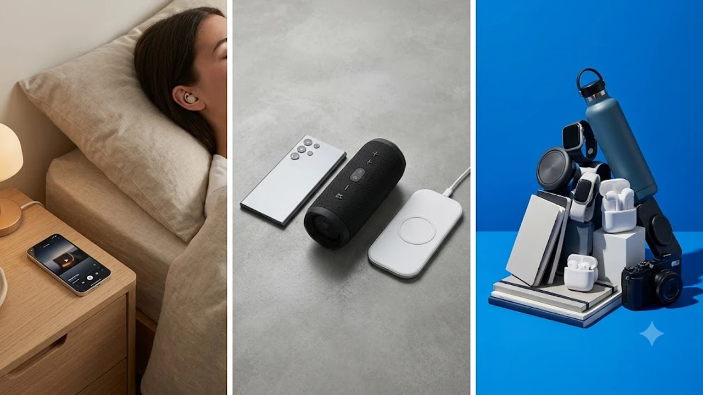

밤잠을 설치는 사람들에게 일반 무선 이어폰은 계륵입니다. 에어팟이나 갤럭시 버즈를 끼고 자면 옆으로 눕는 순간 귓바퀴가 짓눌려 뻐근한 통증이 밀려오고, 아침이면 이불 속 어딘가로 빠져 분실되기 일쑤입니다. 슬립테크 시장이 커지면서 두께를 극단적으로 줄여 베개에 머리를 파묻어도 이물감이 없는 수면 특화 이어폰(슬립버즈)이 필수가전처럼 자리 잡았습니다.


---

## 1. 지금 수면 이어폰 카테고리가 뜨는 이유

최근 직장인과 수험생을 중심으로 유튜브 '수면 꿀템' 쇼츠와 인스타그램 릴스를 통해 슬립버즈 실사용 후기가 빠르게 확산되고 있습니다. 가장 큰 요인은 층간소음, 동거인의 코골이, 환절기 수면 패턴 불균형에 대응하는 방식이 단순 귀마개에서 능동형 마스킹 디바이스로 진화했기 때문입니다.

기존 폼 귀마개는 소음을 막아주지만 귓속 압력이 차서 염증을 유발하거나 알람 소리까지 차단하는 한계가 있었습니다. 반면 최신 슬립 이어폰은 귓구멍 안쪽에 밀착되는 2\~3g대 초소형 설계에 전용 앱 백색소음, 뇌파 유도 바이노럴 비트, 스마트 알람 기능까지 탑재해 아침 기상까지 통제합니다. 퇴근 후 피로 회복과 수면 질 관리에 집중하는 '슬립코노미' 소비가 10월 환절기와 맞물려 폭발적인 검색량으로 이어지고 있습니다.

---

## 2. TOP3 상품 스펙 비교

시장에서 실구매 평가와 완성도가 높은 3개 제품을 선별해 한눈에 비교할 수 있도록 정리했습니다.

| 모델명 | 가격대 | 핵심 스펙 | 추천 대상 |
| :--- | :--- | :--- | :--- |
| **앤커 사운드코어 슬립 A20** | 10만 원대 중반 | 두께 8.6mm, 수면모드 14시간 재생, 트윈실 차음 이어팁 | 옆으로 누워 자며 밤새 완벽한 소음 차단이 필요한 사용자 |
| **원모어 컴포버즈 미니** | 9만 원\~10만 원대 | 유닛당 3.7g, 40dB QuietMax ANC, Qi 무선 충전 지원 | 통화·음악 감상과 취침용을 기기 하나로 끝내려는 올라운더 |
| **에이투 슬립버즈 AG01** | 3만 원\~4만 원대 | 유닛당 2.8g, 블루투스 5.3, 완충 시 6시간 연속 재생 | 저렴한 예산으로 입문형 미니 이어폰을 찾는 알뜰 구매자 |



---

## 3. 예산대별 추천 (저가·중간·프리미엄)

### [저가형] 에이투 슬립버즈 무선 초소형 이어폰 AG01
3만 원대 부담 없는 가격에 수면 이어폰의 본질인 물리적 소형화에 집중한 실속형 기기입니다.

* **가격대:** 39,900원대
* **핵심 스펙:** 유닛당 2.8g 초경량 바디, 블루투스 5.3 탑재, 완충 시 유닛 단독 6시간 연속 재생
* **장점:** 
  * 귓구멍 바깥 돌출부가 3mm 미만이라 옆으로 누워 베개를 눌러도 귓바퀴 연골 통증이 없습니다.
  * 3만 원대 진입 가격 덕분에 취침 중 뒤척이다 침대 틈새로 빠지거나 분실해도 금전적 타격이 적습니다.
* **단점:** 
  * 배터리 지속 시간이 실측 기준 약 5시간 30분\~6시간 수준이라 8시간 이상 숙면 시 기상 알람 전에 전원이 꺼질 수 있습니다.
* **이런 사람에게 추천:** 수면 이어폰의 착용감이 본인 귓구멍에 맞는지 적은 비용으로 먼저 검증해보고 싶은 입문자.
* [에이투 슬립버즈 쿠팡에서 보기](https://www.coupang.com/np/search?q=에이투+슬립버즈&sourceType=affiliate&trackingCode=AF8691300)

손목 피로 완화를 위한 데스크 툴 비교가 필요하다면 [2026 무선 버티컬 마우스 추천 TOP3](/posts/trending-picks/wireless-vertical-mouse-top3-2026/) 분석을 참고하시기 바랍니다.

### [중간형] 원모어 컴포버즈 미니 (1MORE ComfoBuds Mini)
취침 전용으로만 쓰기 아쉬운 분들을 위해 초미니 폼팩터 안에 강력한 하이브리드 노이즈 캔슬링을 집어넣은 다목적 모델입니다.

* **가격대:** 99,000원대
* **핵심 스펙:** 유닛당 3.7g 크기, 최대 40dB 하이브리드 액티브 노이즈 캔슬링, Qi 무선 충전 지원
* **장점:** 
  * 수면용 크기이면서도 강력한 ANC를 지원해 출퇴근 지하철 저음역 소음과 거실 TV 소음을 즉각 감쇄합니다.
  * 고감도 듀얼 마이크와 무선 충전 패드를 지원해 낮에는 화상회의 및 업무용, 밤에는 취침용으로 올데이 활용이 가능합니다.
* **단점:** 
  * 자체 로컬 사운드 저장 메모리가 없어 수면 내내 스마트폰과 블루투스 연결을 유지해야 하므로 스마트폰 배터리 소모가 동반됩니다.
* **이런 사람에게 추천:** 낮에는 일상 음감·통화용으로 굴리고 밤에는 귀 안 아픈 수면용으로 이어폰 한 대를 24시간 쓰고 싶은 직장인.
* [원모어 컴포버즈 미니 쿠팡에서 보기](https://www.coupang.com/np/search?q=원모어+컴포버즈+미니&sourceType=affiliate&trackingCode=AF8691300)

정밀 기기 청소와 데스크 관리에 관심이 많다면 [무선 에어건 제트팬 추천 TOP3 비교](/posts/trending-picks/wireless-turbo-jet-air-duster-top3-2026/) 글도 확인해 보세요.

### [프리미엄형] 앤커 사운드코어 슬립 A20 (ANKER Sleep A20)
코골이와 층간소음 차단에 특화된 슬립테크 전용 플래그십 모델입니다.

* **가격대:** 104,900원\~149,000원대
* **핵심 스펙:** 유닛 두께 8.6mm 초슬림 하우징, 슬립모드(로컬 음원) 단독 14시간 재생, 트윈실 실리콘 이어팁 차음 설계
* **장점:** 
  * 인체공학적 에어윙과 트윈실 이어팁 결합으로 베개 마찰 소음을 물리적으로 걸러내며, 귀를 완전히 덮어도 이물감이 제로에 가깝습니다.
  * 기기 자체 메모리에 백색소음·자연음을 저장해 블루투스를 끄고 단독 재생할 수 있으며, 배터리가 14시간 지속되어 아침 알람까지 꺼지지 않습니다.
* **단점:** 
  * 마이크 모듈이 탑재되지 않아 일반적인 음성 통화 기능은 지원하지 않습니다.
* **이런 사람에게 추천:** 배우자의 코골이나 층간소음 때문에 밤마다 잠을 깨며, 아침 전용 인이어 알람으로 개운하게 기상하고 싶은 숙면 지향 유저.
* [앤커 사운드코어 슬립 A20 쿠팡에서 보기](https://www.coupang.com/np/search?q=앤커+사운드코어+슬립+A20&sourceType=affiliate&trackingCode=AF8691300)

장시간 착석 업무로 누적된 하체 피로 완화 장비는 [무선 무릎 마사지기 TOP3 비교 추천](/posts/trending-picks/wireless-knee-massager-top3-2026/) 글에 상세히 비교되어 있습니다.

---

## 4. 구매 전 반드시 확인할 체크포인트

수면 이어폰 선택 시 다음 3가지 기준을 점검하면 반품이나 중복 지출을 방지할 수 있습니다.

1. **유닛 두께와 바깥 돌출 면적:** 두께가 9mm를 넘어가면 옆으로 누웠을 때 외이도와 이주(Tragus) 연골에 지속적인 압박통이 발생합니다. 본인의 수면 자세가 옆으로 눕는 타입이라면 8mm대 초박형 바디인지 확인해야 합니다.
2. **로컬 슬립 모드 및 배터리 타임:** 수면 시간은 최소 6\~8시간입니다. 일반 블루투스 연결 스트리밍 방식은 5\~6시간 만에 방전되기 쉽습니다. 기기 내장 메모리에 음원을 담아 블루투스를 끄고 10시간 이상 연속 재생할 수 있는 구조인지 따져보아야 합니다.
3. **통화 기능 필요 여부:** 완벽한 수면 소형화를 달성한 전용 기기(앤커 A20 등)는 마이크를 제거해 통화가 불가합니다. 낮 시간대 일상용 통화 겸용이```markdown
작성할 본문의 주제나 키워드를 전달해주시면 요청하신 형식에 맞춰 바로 마크다운 본문을 작성해 드리겠습니다. 다루고자 하는 내용이나 핵심 요구사항을 알려주세요.