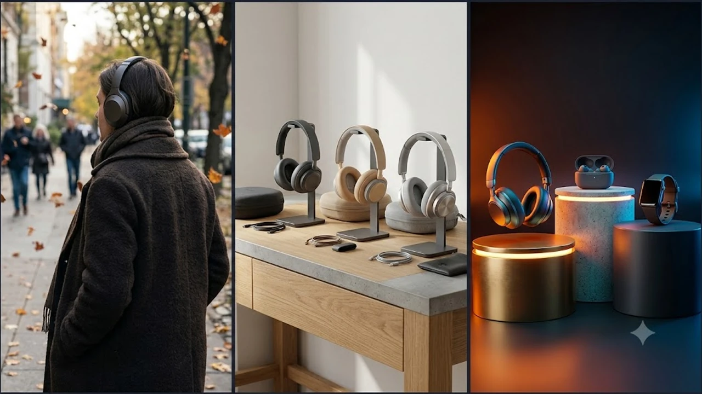

찬 바람이 불기 시작하면 출퇴근길 가방 속 인이어 이어폰 대신 귀 전체를 덮어주는 헤드폰으로 손이 간다. 귀를 따뜻하게 감싸는 물리적 방한 효과에 외부 소음을 지워버리는 강력한 차음 성능을 동시에 챙길 수 있기 때문이다.

## 지금 노이즈 캔슬링 헤드폰이 뜨는 이유

10월에 접어들며 기온이 급격히 떨어지면 체온 유지와 음향 감상을 동시에 만족하는 오버이어 헤드폰 검색량이 폭증한다. 귓구멍 안쪽을 압박해 외이도염 위험을 높이는 인이어 기기와 달리, 푹신한 이어쿠션으로 귓바퀴를 감싸주어 장시간 착용 피로감이 덜하다. 미니멀한 크림·실버 톤 헤드폰은 셔츠나 코트, 캐주얼 후드 어디에나 잘 어울리는 감각적인 패션 소품 역할을 톡톡히 해낸다.

지하철, 스터디 카페, 사무실 등 소음이 가득한 환경에서 집중력을 유지하려는 직장인들의 필수 생활 도구로 자리매김했다. 쾌적한 데스크 셋업 환경을 구성할 때 [2026 무선 버티컬 마우스 추천 TOP3](/posts/trending-picks/wireless-vertical-mouse-top3-2026/)와 함께 책상 위 분위기를 완성하는 핵심 오브제로 꼽힌다.

## TOP3 상품 스펙 비교

| 모델명 | 가격대 | 핵심 스펙 | 추천 대상 |
| :--- | :--- | :--- | :--- |
| QCY H4 | 39,000원대 | 43dB 하이브리드 ANC, 70시간 재생, 40mm 드라이버 | 3만 원대 예산으로 ANC 입문하려는 알뜰 사용자 |
| 소니 WH-1000XM5 | 449,000원대 | 8개 마이크+통합 V1 칩셋, 250g 무게, 30시간 재생 | 극강의 소음 차단력과 또렷한 통화 품질이 필요한 직장인 |
| 보스 QC 울트라 | 479,000원대 | 커스텀튠 오디오, 몰입형 공간 음향, 24시간 재생 | 안경 착용자나 장시간 청음 시 압박감 없는 착용감을 찾는 분 |

## 예산대별 추천 (저가·중간·프리미엄)

### 1. 입문용 가성비 끝판왕: QCY H4
* **브랜드 / 모델명:** QCY H4
* **가격대:** 39,000원대
* **핵심 스펙:**
  * 최대 43dB 하이브리드 액티브 노이즈 캔슬링
  * 노이즈 캔슬링 OFF 시 최대 70시간 배터리 타임
  * 40mm 네오디뮴 다이내믹 드라이버
* **장점:**
  * 치킨 두 마리 값도 안 되는 예산으로 기대 이상의 중저음역대 소음 상쇄 능력을 제공한다.
  * 한 번 완충하면 일주일 이상 충전기를 찾을 필요 없는 압도적인 배터리 지속력이 돋보인다.
* **단점:**
  * 이어패드 내부 열 방출이 더뎌 1시간 이상 연속 착용 시 땀이 차며, 하우징 플라스틱 마감이 다소 저렴해 보인다.
* **추천 대상:** 노이즈 캔슬링을 처음 경험하거나, 스크래치 걱정 없이 헬스장 막굴림용 서브 기기를 찾는 사람.
* [QCY H4 쿠팡에서 보기](https://www.coupang.com/np/search?q=QCY+H4&sourceType=affiliate&trackingCode=AF8691300)

### 2. 소음 차단 종결자: 소니 WH-1000XM5
* **브랜드 / 모델명:** 소니(SONY) WH-1000XM5
* **가격대:** 449,000원대
* **핵심 스펙:**
  * 8개의 듀얼 마이크와 전용 통합 프로세서 V1
  * 250g 초경량 소프트 핏 레더 밴드
  * 30mm 탄소 섬유 복합 돔 드라이버
* **장점:**
  * 버스 엔진 진동음과 카페 대화 소리를 사실상 무음 수준으로 지워내는 업계 최상위 차음 성능을 발휘한다.
  * 빔포밍 마이크 4개와 AI 알고리즘 결합으로 바람 부는 야외에서도 내 목소리를 상대방에게 또렷하게 전달한다.
* **단점:**
  * 힌지가 안쪽으로 접히지 않는 일체형 스위블 구조 탓에 기본 휴대용 파우치 부피가 꽤 크다.
* **추천 대상:** 매일 대중교통으로 장거리 출퇴근을 하거나 스터디 카페에서 완벽한 정적을 원하는 사람.
* [소니 WH-1000XM5 쿠팡에서 보기](https://www.coupang.com/np/search?q=소니+WH-1000XM5&sourceType=affiliate&trackingCode=AF8691300)

### 3. 극상의 착용감과 공간 음향: 보스 QC 울트라
* **브랜드 / 모델명:** 보스(BOSE) 콰이어트컴포트 울트라
* **가격대:** 479,000원대
* **핵심 스펙:**
  * 개인별 귀 형태를 분석해 사운드를 자동 보정하는 커스텀튠(CustomTune)
  * 소리가 머리 주위를 감싸는 몰입형 공간 오디오
  * 1회 완충 시 최대 24시간 재생
* **장점:**
  * 머리를 조이는 장력이 완벽히 분산되어 안경을 쓴 채 반나절을 착용해도 두통이나 귓바퀴 통증이 생기지 않는다.
  * 라이브 음원을 들을 때 드럼 킥과 베이스 기타 리프의 현장감이 극대화된다.
* **단점:**
  * 배터리 지속 시간이 경쟁 모델 대비 다소 짧고, 보스 전용 앱 초기 구동 속도가 간혹 느리다.
* **추천 대상:** 정수리 압박감에 민감한 두상이거나, 장시간 데스크 업무 중 고음질 사운드 감상을 즐기는 사람.
* [보스 QC 울트라 쿠팡에서 보기](https://www.coupang.com/np/search?q=보스+QC+울트라&sourceType=affiliate&trackingCode=AF8691300)

## 구매 전 반드시 확인할 체크포인트

첫째, 장력과 무게 확인이 필수다. 250g 이하 경량 모델이라도 헤드밴드 곡률이 좁아 관자놀이를 짓누르면 30분만 써도 두통이 온다. 두상이 크거나 안경을 쓴다면 장력이 부드럽고 이어쿠션 복원력이 우수한 모델을 골라야 이중 지출을 막는다.

둘째, 접힘(폴딩) 여부와 관리 편의성이다. 외출 시 목에 계속 걸고 다닐 생각이라면 회전만 되는 스위블 구조도 무방하다. 하지만 백팩에 수납해야 한다면 힌지가 완전히 접히는 폴딩 방식이어야 가방 공간을 덜 차지한다. 파우치에 먼지가 자주 낀다면 [무선 에어건 제트팬 추천 TOP3 비교](/posts/trending-picks/wireless-turbo-jet-air-duster-top3-2026/)를 활용해 안쪽을 털어내면 외관 폼을 깔끔하게 유지할 수 있다. 목에 장시간 걸고 다니느라 피로가 쌓였다면 귀가 후 [2026 무선 목어깨 온열마사지기 TOP3 비교](/posts/trending-picks/wireless-neck-shoulder-heat-massager-top3-2026/) 제품으로 승모근을 풀어주는 것도 좋은 관리법이다.

셋째, 고해상도 코덱 지원 여부다. 스마트폰 기종과 운영체제에 따라 쓸 수 있는 코덱이 갈린다. 고음질 음원을 손실 없이 전송하려면 안드로이드 환경에서는 LDAC 또는 aptX Adaptive 코덱 지원을 확인해야 하며, 아이폰 환경에서는 AAC 코덱 기반 사운드 튜닝 완성도를 따져봐야 제 성능을 100% 체감할 수 있다.

---

> 이 포스팅은 쿠팡 파트너스 활동의 일환으로, 이에 따른 일정액의 수수료를 제공받습니다.

#트렌드상품 #쿠팡추천 #트렌드상품추천 #노이즈캔슬링헤드폰 #블루투스헤드폰 #소니헤드폰 #보스헤드폰 #가성비헤드폰 #헤드폰추천