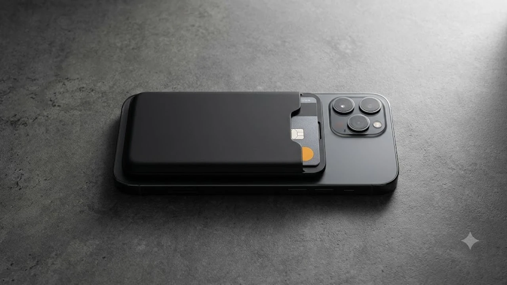

## 1. 두께 10mm 이하 카드지갑 일체형 보조배터리가 대세인 이유

외출할 때 스마트폰과 함께 보조배터리, 카드지갑을 각각 챙기는 번거로움은 주머니 무게를 늘리는 주원인입니다. 기존 10,000mAh급 대용량 배터리는 완충 횟수가 많지만, 200g을 넘나드는 무게와 18mm 이상의 두께 때문에 장착한 채로 통화나 타이핑을 하기 어렵습니다.

이 단점을 해결하기 위해 2026년 하반기 트렌드로 급부상한 아이템이 바로 초슬림 맥세이프 카드지갑 보조배터리입니다. 두께를 8\~10mm대로 억제하고 신분증이나 실물 신용카드를 1\~2장 수납할 수 있는 슬롯을 결합해 스마트폰 하나로 지갑과 배터리를 동시에 끝내는 EDC(Everyday Carry) 구성을 완성합니다.

특히 최신 스마트폰의 카메라 섬 규격에 맞춘 콤팩트한 세로 길이와 N52 등급 네오디뮴 마그네틱 배치는 흔들림 없는 밀착력을 보장합니다.

---

## 2. 핵심 TOP3 모델 스펙 비교

시중에서 가장 판매량과 실구매 평점이 높은 3개 제품의 핵심 수치 비교입니다.

| 모델명 | 가격대 | 핵심 스펙 | 추천 대상 |
| :--- | :--- | :--- | :--- |
| **신지모루 M-슬림 맥세이프 카드 보조배터리** | 27,900원 | 5,000mAh / 9.2mm / 118g / 카드 2장 | 가성비와 카드 수납 본연의 목적을 찾는 출퇴근 직장인 |
| **베이스어스 블레이드 울트라슬림 맥세이프** | 36,500원 | 5,000mAh / 8.8mm / 110g / 최대 15W | 얇은 두께, 빠른 충전 속도, 거치 기능이 필수인 사용자 |
| **앤커 MagGo 슬림 5000mAh (A25A0)** | 52,900원 | 5,000mAh / 9.0mm / 122g / ActiveShield 2.0 | 스마트폰 기기 발열 및 배터리 수명 관리를 최우선하는 실사용자 |

---

## 3. 추천 모델별 상세 스펙 및 장단점 분석

### ① 신지모루 M-슬림 맥세이프 카드 보조배터리
* **브랜드/모델명:** 신지모루 M-슬림 맥세이프 카드포켓 일체형 보조배터리
* **가격대:** 27,900원
* **핵심 스펙:**
  * 배터리 용량: 5,000mAh (정격 용량 3,000mAh)
  * 두께 및 무게: 9.2mm / 118g
  * 무선 출력: 7.5W (아이폰 최적화 규격)
* **장점:**
  1. 텐션 밴딩 구조 포켓으로 카드를 1장만 넣어도 빠지지 않고 최대 2장까지 안정적으로 수납됩니다.
  2. 안티 마그네틱 차폐 시트가 내장되어 카드를 꺼내지 않고도 대중교통 리더기에 바로 태그할 수 있습니다.
* **단점:**
  * 무선 충전 출력이 7.5W로 제한되어 배터리 잔량 20%에서 80% 충전까지 약 1시간 20분이 걸립니다.
* **이런 사람에게 추천:** 실물 카드 2장 수납이 필수이며 3만 원 미만 예산으로 가벼운 외출을 원하는 사용자.
* [신지모루 M-슬림 맥세이프 카드 보조배터리 쿠팡에서 보기](https://www.coupang.com/np/search?q=신지모루+M-슬림+맥세이프+카드+보조배터리&sourceType=affiliate&trackingCode=AF8691300)

### ② 베이스어스 블레이드 울트라슬림 맥세이프
* **브랜드/모델명:** 베이스어스(Baseus) 블레이드 마그네틱 카드 슬롯 보조배터리 5000mAh
* **가격대:** 36,500원
* **핵심 스펙:**
  * 배터리 용량: 5,000mAh
  * 두께 및 무게: 8.8mm / 110g (동급 최박형 수준)
  * 충전 출력: 무선 최대 15W, 유선 Type-C PD 20W 입출력
* **장점:**
  1. 두께 8.8mm로 주머니에 넣었을 때 일반 가죽 카드지갑을 붙인 것과 큰 차이가 없는 그립감을 제공합니다.
  2. 카드 슬롯 커버 플랩을 바깥으로 접으면 60도 각도로 세워지는 마그네틱 킥스탠드로 전환됩니다.
* **단점:**
  * 알루미늄 메탈 하우징 특성상 15W 고속 무선 충전 가동 시 표면 온도가 최대 41°C까지 빠르게 올라갑니다.
* **이런 사람에게 추천:** 유튜브나 OTT 영상을 거치해 시청하면서 15W 빠른 충전 속도를 누리고 싶은 미디어 헤비유저.
* [베이스어스 블레이드 울트라슬림 맥세이프 쿠팡에서 보기](https://www.coupang.com/np/search?q=베이스어스+블레이드+울트라슬림+맥세이프&sourceType=affiliate&trackingCode=AF8691300)

### ③ 앤커 MagGo 슬림 5000mAh (A25A0)
* **브랜드/모델명:** 앤커(Anker) MagGo 슬림 마그네틱 보조배터리 5000mAh
* **가격대:** 52,900원
* **핵심 스펙:**
  * 배터리 용량: 5,000mAh
  * 두께 및 무게: 9.0mm / 122g
  * 자력 수치: 12N (약 1.2kg 장력 지지)
* **장점:**
  1. 초당 35회 온도를 모니터링하는 ActiveShield 2.0 칩셋이 충전 발열을 39°C 이하로 엄격히 억제합니다.
  2. 12N의 강력한 네오디뮴 마그넷이 결합되어 스키니진 주머니에서 스마트폰을 꺼낼 때도 배터리가 이탈하지 않습니다.
* **단점:**
  * 자체 카드 슬롯 대신 자석식 외장 카드 플레이트를 후면에 별도 결합하는 구조라 카드 결합 시 두께가 13mm로 두꺼워집니다.
* **이런 사람에게 추천:** 스마트폰 발열 제어와 배터리 수명 보호를 최우선으로 여기며 견고한 자력을 원하는 사용자.
* [앤커 MagGo 슬림 5000mAh 쿠팡에서 보기](https://www.coupang.com/np/search?q=앤커+MagGo+슬림+5000mAh&sourceType=affiliate&trackingCode=AF8691300)

---

## 4. 구매 전 확인해야 할 3대 체크포인트

### 카메라 섬 턱 간섭 여부
스마트폰 일반형(6.1인치)이나 구형 미니 라인업은 카메라 섬과 맥세이프 링 사이 거리가 18mm 안팎으로 매우 좁습니다. 보조배터리 세로 길이가 104mm를 초과하면 카메라 테두리 턱에 배터리 상단이 걸쳐 자석이 완벽히 밀착되지 않으므로, 구매 전 배터리 세로 치수가 102mm 이하인지 대조해야 합니다.

### 안티 마그네틱 차폐 시트 장착
카드 수납형 보조배터리는 자석 모듈과 무선 충전 코일이 카드와 맞닿습니다. 차폐 기술이 없는 저가형 제품은 교통카드 단말기 인식 오류를 일으키거나 마그네틱 선을 손상시킵니다. 상세페이지에서 전자파 및 자력 차폐 필름 내장 표기를 확인하십시오.

### 패스스루(동시 충전) 지원
취침 전 보조배터리에 C타입 케이블을 꽂고 그 위에 스마트폰을 부착했을 때 기기와 배터리가 순차적으로 완충되는 패스스루 기능이 탑재되어야 출장이나 여행 시 충전기를 1개만 챙길 수 있습니다.

데스크 세팅을 한층 깔끔하게 바꾸고 싶다면 [2026 무선 버티컬 마우스 추천 TOP3](/posts/trending-picks/wireless-vertical-mouse-top3-2026/) 글을, 전자기기 먼지 제거용 휴대 장비가 필요하다면 [무선 에어건 제트팬 추천 TOP3 비교](/posts/trending-picks/wireless-turbo-jet-air-duster-top3-2026/) 분석 글도 함께 참고해 보시기 바랍니다.

---

> 이 포스팅은 쿠팡 파트너스 활동의 일환으로, 이에 따른 일정액의 수수료를 제공받습니다.

#트렌드상품 #쿠팡추천 #맥세이프카드지갑보조배터리 #슬림보조배터리 #앤커맥고 #베이스어스보조배터리 #신지모루맥세이프