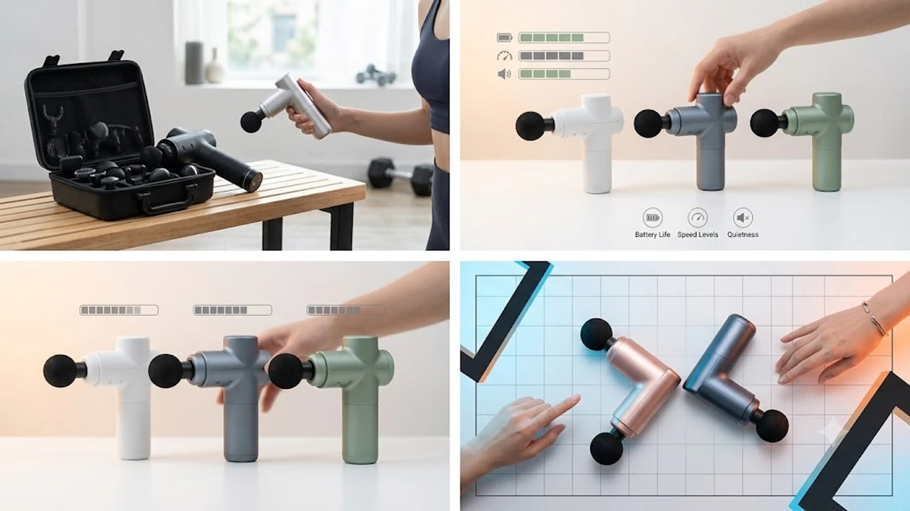

과거 1kg에 달하던 둔중한 마사지건은 몇 분만 들고 있어도 손목에 통증이 생겨 서랍 속으로 직행하곤 했습니다. 최근 수요가 급증한 제품군은 400g 안팎의 초소형 규격에 고출력 BLDC 모터를 압축한 초경량 미니 마사지건입니다. 외출용 백팩이나 헬스 가방에 부담 없이 들어가는 휴대성과 근막 깊숙한 곳까지 자극을 전달하는 8mm 이상의 진폭이 결합하면서 구매 전환이 가장 빠르게 일어나는 영역입니다.

사무직 직장인들이 장시간 모니터를 보며 굳어버린 승모근과 날개뼈 안쪽을 수시로 풀 때, 혹은 러닝 직후 타이트해진 허벅지와 둔근을 가볍게 두드릴 때 진가를 발휘합니다. 손목 터널 증후군 예방을 위해 [2026 무선 버티컬 마우스 추천 TOP3](/posts/trending-picks/wireless-vertical-mouse-top3-2026/)를 세팅한 데스크 환경에서도 작은 마사지건 하나를 곁에 두면 뻐근한 부위를 즉각 이완하기 좋습니다.

## 1. 지금 초경량 미니 마사지건이 뜨는 이유

근막 이완 장비 트렌드가 '무조건 강한 고출력'에서 '매일 쥐어도 부담 없는 초경량'으로 완전히 넘어왔습니다. 헬스장 전유물로 여겨지던 고중량 마사지건은 혼자서 등이나 목 뒤를 조작하기 어려웠고, 진동이 손잡이로 고스란히 역류해 손가락 관절에 피로감을 줬습니다.

반면 최신 미니 모델들은 항공 알루미늄 바디와 브러시리스 모터를 적용해 300\~400g대 무게를 실현했습니다. 한 손으로 들고 15분 연속 작동해도 전완근에 부하가 걸리지 않습니다. 크기는 작아졌지만 분당 최대 3,000RPM 회전수와 8\~10mm 진폭을 구현해 피부 표면만 긁는 가벼운 진동판 수준을 확실히 벗어났습니다.

## 2. TOP3 상품 스펙 비교

| 모델명 | 가격대 | 핵심 스펙 | 추천 대상 |
| :--- | :--- | :--- | :--- |
| **바디픽셀 머슬건 미니** | 4만 원대 | 본체 390g / 8mm 진폭 / 4단계 조절 (최대 3,000RPM) | 부담 없이 전신 부위를 풀고 싶은 가성비 입문자 |
| **샤오미 미니 마사지건 2** | 5만 원대 | 본체 350g / 8mm 진폭 / 2,450mAh 배터리 | 직장 데스크에 두고 매일 수시로 쓸 휴대성 최우선 유저 |
| **테라건 릴리프 (Theragun Relief)** | 17만 원대 | 본체 620g / 10mm 심층 진폭 / 특허 삼각 멀티그립 | 강한 타격력과 깊은 근육 이완을 원하는 고강도 운동 유저 |

## 3. 예산대별 추천 모델 분석

### 바디픽셀 머슬건 미니 (4만 원대)
* **핵심 스펙**: 자체 무게 390g, 타격 진폭 8mm, 4단계 분당 속도 조절(최대 3,000RPM), 기본 교체형 헤드 4종 제공
* **장점**: 
  * 4만 원대 가격대에 라운드볼, 플랫, 포인트, U자형 헤드를 모두 패키지에 포함해 승모근부터 발바닥까지 부위별 맞춤 타격이 가능합니다.
  * 작동 소음이 45dB 수준으로 억제되어 늦은 밤 실내나 원룸에서 가동해도 소음 스트레스가 적습니다.
* **단점**: 
  * 허벅지나 둔근 같은 대근육에 체중을 실어 강하게 압박하면 스톨 포스 한계로 모터 회전수가 순간적으로 떨어집니다.
* **추천 대상**: 마사지건을 처음 써보며 목, 어깨, 종아리 위주로 가벼운 근육 뭉침을 해소하려는 입문자에게 적합합니다. [무선 종아리 마사지기 TOP3 가성비 비교](/posts/trending-picks/wireless-calf-massager-top3-2026/)와 함께 활용하기에 예산 부담도 낮습니다.
* [바디픽셀 머슬건 미니 쿠팡에서 보기](https://www.coupang.com/np/search?q=바디픽셀+머슬건+미니&sourceType=affiliate&trackingCode=AF8691300)

### 샤오미 미니 마사지건 2 (5만 원대)
* **핵심 스펙**: 자체 무게 350g, 8mm 진폭, 2,450mAh 대용량 배터리(최장 30일 대기 및 5시간 사용), 3단계 강도 조절
* **장점**: 
  * 350g의 초소형 사이즈로 생수 한 병보다 가벼워 크로스백이나 파우치에 쏙 들어가 휴대성이 탁월합니다.
  * 헤드 표면이 고탄성 실리콘 재질로 마감되어 플라스틱 재질 특유의 딱딱한 뼈 부딪힘 충격이 덜하며 물티슈로 닦아내기 위생적입니다.
* **단점**: 
  * 기본 제공 헤드가 3종으로 경쟁 모델 대비 단순하여 집중 타격용 정밀 헤드가 필요한 경우 아쉬울 수 있습니다.
* **추천 대상**: 사무실 서랍이나 파우치에 상시 넣어두고, 데스크워크 중 승모근 결림을 수시로 두드리고 싶은 직장인에게 최적입니다.
* [샤오미 미니 마사지건 2 쿠팡에서 보기](https://www.coupang.com/np/search?q=샤오미+미니+마사지건+2&sourceType=affiliate&trackingCode=AF8691300)

### 테라건 릴리프 (17만 원대)
* **핵심 스펙**: 무게 620g, 심층 10mm 진폭 타격, 3단계 속도 조절(1,750 / 2,100 / 2,400PPM), 특허받은 삼각 에르고노믹 그립
* **장점**: 
  * 10mm의 깊은 스트로크를 통해 겉피부만 떨리는 수준을 넘어 깊숙한 속근육 층까지 타격 진동을 직격합니다.
  * 테라건 고유의 삼각형 손잡이 구조 덕분에 손목 꺾임 없이 손이 잘 닿지 않는 견갑골 뒤쪽과 등 중앙까지 스스로 누를 수 있습니다.
* **단점**: 
  * 타사 미니형보다 200g가량 무겁고 본체 부피가 있어 콤팩트한 휴대성 측면에서는 다소 양보가 필요합니다.
* **추천 대상**: 러닝, 헬스, 사이클 등 근력 운동 후 둔근이나 햄스트링의 묵직한 피로를 전문 마사지건 수준으로 깊숙이 풀어내야 하는 생활 스포츠 마니아에게 권장합니다.
* [테라건 릴리프 쿠팡에서 보기](https://www.coupang.com/np/search?q=테라건+릴리프&sourceType=affiliate&trackingCode=AF8691300)

## 4. 실패 없는 구매 체크포인트 4가지

* **진폭 8mm 기준선 확보**: 마사지건의 핵심 성능은 RPM 숫자가 아니라 헤드가 앞뒤로 튀어나오는 거리(진폭)입니다. 5\~6mm 저가 제품은 얇은 진동 마사지기 수준에 그치므로, 최소 8mm 이상 확보된 모델을 골라야 뭉친 속근육을 효과적으로 풀어냅니다.
* **스톨 포스(Stall Force) 확인**: 근육에 꾹 눌렀을 때 모터가 멈춰버리면 마사지 효과가 사라집니다. 본체 사양표에서 가압 한계가 최소 8kgf 이상인지, 대근육용작성할 주제나 원하시는 본문 내용을 알려주시면 요청하신 형식에 맞춰 바로 출력해 드리겠습니다.