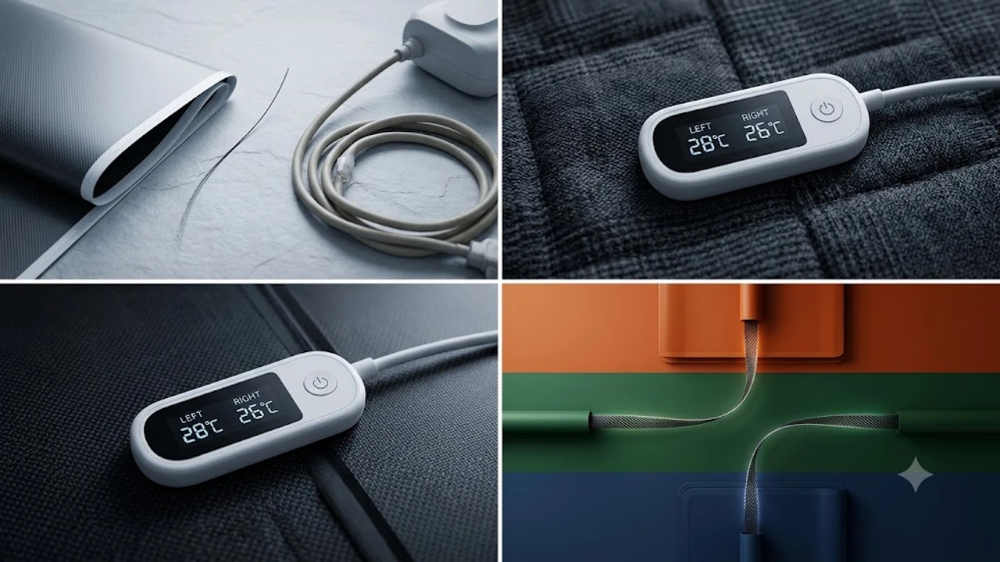

9월 중순 아침저녁으로 찬 바람이 불기 시작하며 실내 보온 침구 수요가 급증했다. 일교차가 10도 이상 벌어지는 환절기에는 체온 유지가 필수지만, 치솟은 도시가스 요금 탓에 보일러를 섣불리 가동하기엔 부담이 크다. 기존 1세대 전기장판은 전자기장 노출과 화재 불안감이 상존하고, 2세대 온수매트는 모터 소음과 주기적인 물 보충, 누수, 호스 내부 물 빼기 등 관리가 까다롭다. 

이러한 문제를 해결한 대안이 3세대 저전압 워셔블 카본매트다. 신소재 탄소 섬유 발열체를 장착해 단선 위험을 낮췄고, 24V 직류(DC) 전원을 채택해 전자기 발생 요인을 차단했다. 오염 시 세탁망에 넣어 세탁기 울코스로 세척할 수 있어 위생 관리도 수월하다. 가을 난방비 지출을 줄이고 수면 환경을 개선할 검증된 카본매트 3종의 스펙과 실사용 평가를 정리했다.

---

## 지금 카본매트로 교체 수요가 몰리는 이유

온수매트 중심이던 시장 구조가 카본매트로 빠르게 전환된 배경에는 세 가지 구체적인 이유가 있다.

* **전자파 차단 저전압 기술**: 일반 전기매트는 220V 교류(AC) 전원을 열선에 직접 공급해 자기장이 형성된다. 최신 카본매트는 전원 어댑터에서 220V를 24V 직류(DC)로 낮춰 공급하므로 유해 전자파 발생 요인을 구조적으로 억제한다.
* **통세탁과 접이식 수납**: 강철 대비 인장 강도가 우수한 탄소 섬유 발열체를 적용해 일반 이불처럼 콤팩트하게 접어 보관할 수 있다. 방수 접속 단자를 탑재해 드럼세탁기 울코스 세탁을 지원하므로 땀이나 먼지로 인한 오염을 손쉽게 제거한다.
* **낮은 소비전력**: 소비전력은 130W\~160W 수준에 머문다. 하루 8시간 가동 기준 월 예상 전기요금은 3,000원 안팎이다. 가스보일러 가동 시간을 1\~2시간만 줄여도 한 시즌 내에 기기 구매 비용을 회수할 수 있다.

장시간 데스크 업무로 굳은 몸을 풀 때는 [2026 무선 버티컬 마우스 추천 TOP3](/posts/trending-picks/wireless-vertical-mouse-top3-2026/) 글로 손목 부담을 줄이고, 잠들기 전 [무선 종아리 마사지기 TOP3 가성비 비교](/posts/trending-picks/wireless-calf-massager-top3-2026/) 기기를 함께 병행하면 피로 회복 속도를 한층 높일 수 있다.

---

## 검증된 워셔블 카본매트 TOP 3 상세 분석

**귀뚜라미 3세대 카본매트 온돌 KDM-98시리즈 (퀸 기준)**
* **가격대:** 29만 원 \~ 34만 원대
* **핵심 스펙:** 소비전력 160W, 매트 두께 15mm, 듀얼 분리 난방(좌우 1°C 단위 개별 제어)
* **장점:** 
  1. 좌우 1°C 단위 개별 온도 제어가 가능해 동침자와 체감 온도가 달라도 각자 체질에 맞출 수 있다.
  2. 분리형 컨트롤러를 채택해 세탁망 사용 시 최대 5회까지 드럼세탁기 울코스 물세탁을 지원한다.
* **단점:** 15mm 폼 구조로 매트가 묵직해 세탁 후 자연 건조까지 만 이틀 이상 걸린다.
* **추천 대상:** 침대 매트리스 위에서 탄탄한 온돌 쿠션감을 원하며 정밀한 온도 조절이 필수인 부부.
* [귀뚜라미 3세대 카본매트 온돌 쿠팡에서 보기](https://www.coupang.com/np/search?q=귀뚜라미+3세대+카본매트+온돌&sourceType=affiliate&trackingCode=AF8691300)

**경동나비엔 프리미엄 카본매트 EME520 (퀸 기준)**
* **가격대:** 33만 원 \~ 38만 원대
* **핵심 스펙:** 24V 저전압 DC 어댑터, 두께 8mm 슬림형, 전용 모바일 앱 연동
* **장점:** 
  1. 8mm 슬림 두께로 침대 매트리스 고유의 체압 분산 기능을 해치지 않으며 롤 형태로 말아 좁은 틈새에 수납할 수 있다.
  2. 친환경 인증을 획득한 텐셀·모달 복합 원단을 겉감으로 써서 추가 침구 패드 없이 맨살에 닿아도 촉감이 매끄럽다.
* **단점:** 고가임에도 원단 마모 방지를 위해 기계 세탁 권장 횟수가 최대 3회로 제한적이다.
* **추천 대상:** 두꺼운 매트 특유의 이질감을 꺼리며 스마트폰 원격 제어 기능을 적극 활용하는 사용자.
* [경동나비엔 카본매트 EME520 쿠팡에서 보기](https://www.coupang.com/np/search?q=경동나비엔+카본매트+EME520&sourceType=affiliate&trackingCode=AF8691300)

**보국전자 에어셀 카본 인체감지 전기요 BKB-3406 (싱글 기준)**
* **가격대:** 11만 원 \~ 13만 원대
* **핵심 스펙:** 소비전력 130W, 무게 1.8kg, 인체 감지 모션 센서 내장
* **장점:** 
  1. 침대를 비우면 설정 시간 경과 후 자동으로 전원을 차단하는 모션 센서가 있어 외출 시 전력 낭비를 방지한다.
  2. 1.8kg 초경량 설계로 드럼세탁기 탈수 부하가 적고 반나절 만에 빠르게 건조된다.
* **단점:** 좌우 분리 난방을 지원하지 않아 싱글 침대 전용으로 제한된다.
* **추천 대상:** 가성비와 손쉬운 세탁 관리가 최우선인 자취생 및 1인 가구.
* [보국전자 에어셀 카본매트 쿠팡에서 보기](https://www.coupang.com/np/search?q=보국전자+에어셀+카본매트&sourceType=affiliate&trackingCode=AF8691300)

---

## 카본매트 대표 3종 스펙 및 가격 비교

| 모델명 | 가격대 | 핵심 스펙 | 추천 대상 |
| :--- | :--- | :--- | :--- |
| **귀뚜라미 3세대 KDM-98** | 30만 원 안팎 | 160W / 15mm 두께 / 1°C 분리 난방 | 독립적 온도 세팅이 필요한 부부 침실 |
| **경동나비엔 EME520** | 30만 원대 중후반 | 24V 저전압 / 8mm 슬림 / 모달 복합재 | 슬림한 두께와 부드러운 촉감 중시형 |
| **보국전자 에어셀 BKB-3406** | 10만 원대 초반 | 130W / 1.8kg 초경량 / 모션 센서 | 실속형 난방비 절감을 원하는 1인 가구 |

---

## 구매 전 필수 점검 기준과 세탁 수칙

* **커넥터 방수 등급(IPX) 확인**: 세탁기 회전 시 컨트롤러 결합부로 수분이 침투하면 쇼트 고장의 원인이 된다. 단자함에 방수 실링 캡이 적용되었는지 검증해야 한다.
* **전원 인가 방식(DC 어댑터)**: 220V 직결 방식은 전자기장 노출 위험이 남는다. 24V 저전압 변환 어댑터 장착 모델인지 확인해야 한다.
* **세탁 망 사용 및 자연 건조**: 기계 세탁 시 반드시 전용 대형 세탁망에 넣고 울코스(약한 탈수)로 돌려야 탄소열선의 꼬임을 방지할 수 있다. 열풍 건조기 사용은 내부 실리콘 피복을 녹이므로 절대 금물이며, 통풍이 원활한 그늘에서 평평하게 눕혀 건조해야 내구성을 유지할 수 있다.

---

> 이 포스팅은 쿠팡 파트너스 활동의 일환으로, 이에 따른 일정액의 수수료를 제공받습니다.

#트렌드상품 #쿠팡추천 #카본매트 #워셔블카본매트 #귀뚜라미카본매트 #경동나비엔카본매트 #보국카본매트 #난방가전추천