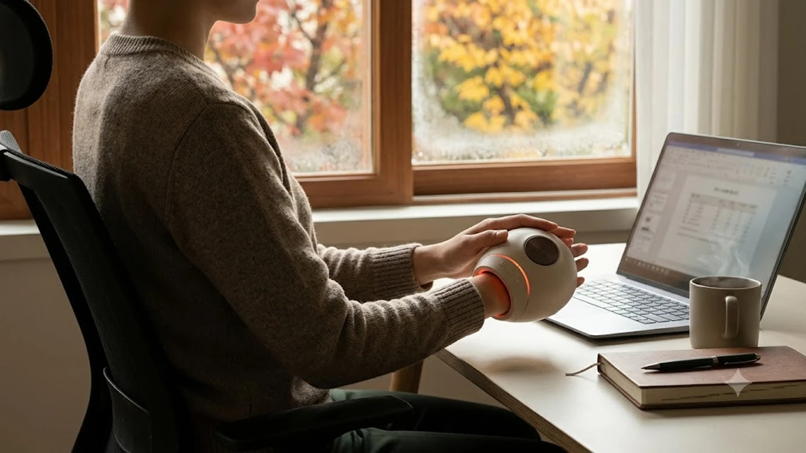

하루 종일 키보드를 두드리고 마우스를 쥐다 보면 오후 서너 시쯤 손목 안쪽이 찌릿하게 당기거나 손가락 마디가 굳어집니다. 쌀쌀한 10월 환절기에 접어들면 말초 혈관 수축까지 겹쳐 손끝이 얼음장처럼 차가워지고 뻐근함이 심해집니다. 손목 꺾임을 줄이는 [2026 무선 버티컬 마우스 추천 TOP3](/posts/trending-picks/wireless-vertical-mouse-top3-2026/) 글로 작업 환경을 개선하는 것도 방법이지만, 이미 뭉쳐서 굳어버린 손바닥 속근육과 팽팽해진 인대는 물리적인 공기압 지압과 온열 자극으로 직접 풀어줘야 피로가 풀립니다.

## 1. 지금 무선 온열 손마사지기가 뜨는 이유

10월 환절기 기온 급강하와 맞물려 손끝 시림, 관절 뻣뻣함을 호소하는 직장인들의 검색량이 전달 대비 40% 이상 뛰었습니다. 최근 유튜브 쇼츠와 인스타그램 릴스 등 SNS에서 책상 한쪽에 올려두고 원버튼으로 손 전체를 쥐어짜듯 풀어주는 '데스크 힐링 템' 콘텐츠가 직장인들의 실구매를 이끌어내고 있습니다.

과거 손마사지기는 220V 콘센트에 전원선을 상시 연결해야만 작동하는 투박한 거치형이 대부분이라 침대 구석에 방치되기 일쑤였습니다. 하지만 최근 시장의 대세는 완전히 달라졌습니다. USB-C 충전 포트와 2,000mAh 이상 대용량 배터리를 장착해 무선으로 1.5\~2시간 연속 구동이 가능합니다. 손등과 손바닥을 단순히 누르는 수준을 넘어 손가락 마디마디를 개별적으로 조여주는 19개 분할 에어백, 손바닥 지압점을 정밀하게 누르는 1,500여 개 고밀도 수지침 돌기, 40\~45℃로 빠르게 올라가는 탄소 온열 패드가 기본 스펙으로 안착했습니다. 퇴근 후 15분 동안 소파에서 쉬거나 업무 중 휴식 시간에 손을 쑥 집어넣기만 해도 뭉친 피로를 풀어낼 수 있어 실용성이 입증되었습니다.

## 2. TOP3 손마사지기 핵심 스펙 비교

| 모델명 | 가격대 | 핵심 스펙 | 추천 대상 |
| :--- | :--- | :--- | :--- |
| **홈플래닛 고급형 온열 무선 손마사지기** | 39,900원 | 2,200mAh 배터리, 3단계 공기압, 전면 오픈형 구조 | 부담 없는 가격에 기본기 확실한 입문자, 사무실 거치용 |
| **메디니스 휴먼터치 핸드케어 (MVP-7790)** | 74,800원 | 수지침 돌기 패드, 강력 듀얼 에어백, 손목 관통형 설계 | 묵직하고 강한 지압 압력을 선호하는 성인 남성, 손목 피로자 |
| **코지마 이지핸드 무선 손마사지기 (CMG-501)** | 119,000원 | 19개 에어포켓 핑거홀 분리형, 1,500개 입체 돌기, C타입 충전 | 손가락 마디마디 섬세한 케어가 필요한 분, 부모님 선물용 |

## 3. 예산대별 추천 모델 분석

### 실속형 가성비 픽: 홈플래닛 고급형 온열 무선 손마사지기
* **실제 모델명 / 브랜드**: 홈플래닛 고급형 온열 무선 손마사지기 (HMB-01)
* **가격대**: 39,900원
* **핵심 스펙**:
  * 2,200mAh 리튬이온 배터리 내장 (완충 시 100분 연속 구동)
  * 공기압 세기 3단계 및 40℃ 단일 온열 모드
  * 앞뒤가 뚫린 전면 개방형 관통 터널 구조
* **장점**:
  * 3만 원대 후반이라는 독보적인 가격대 덕분에 고장 걱정이나 감가상각 부담 없이 사무실 책상 위에 두고 막 쓰기에 최적입니다.
  * 앞뒤가 트인 개방형이라 손이 큰 성인 남성도 손목 안쪽 관절 부위까지 7\~8cm 깊숙하게 밀어 넣어 압박할 수 있습니다.
* **단점**:
  * 3단계 공기압 최대치 도달 시 모터 구동 소음(약 52dB 수준의 에어 펌프음)이 정적을 요하는 독서실이나 극도로 조용한 사무실에서는 다소 들립니다.
* **이런 사람에게 추천**: 5만 원 미만 예산으로 공기압 지압과 온열 핵심 기능만 누려보고 싶은 실속형 입문자.
* [홈플래닛 고급형 온열 무선 손마사지기 쿠팡에서 보기](https://www.coupang.com/np/search?q=홈플래닛+고급형+온열+무선+손마사지기&sourceType=affiliate&trackingCode=AF8691300)

---

### 밸런스·베스트셀러 픽: 메디니스 휴먼터치 핸드케어 (MVP-7790)
* **실제 모델명 / 브랜드**: 메디니스(MEDINESS) 휴먼터치 핸드케어 (MVP-7790)
* **가격대**: 74,800원
* **핵심 스펙**:
  * 상하 듀얼 에어백 및 고밀도 수지침 지압판
  * 3단계 압력 제어 + 독립 온열 히팅 시스템 (42℃ 도달)
  * 손목 관통형 설계 (손목 위 약 7cm 지점까지 동시 커버)
* **장점**:
  * 지압판 돌기 배치가 촘촘해 3단계로 작동했을 때 압박력이 강력합니다. 손바닥 중앙 장심혈 부위를 묵직하게 파고들어 마사지 직후 손바닥에 뚜렷한 도트 자국이 남을 만큼 시원합니다.
  * 쿠팡 누적 상품평 4,000건 이상으로 검증된 스테디셀러라 AS 접수와 부품 내구성 면에서 검증이 끝났습니다.
* **단점**:
  * 돌기 압력이 상당히 강해서 피부가 얇거나 관절 통증에 민감한 사용자는 1단계에서도 압박감을 크게 느낄 수 있어 얇은 면장갑을 착용해야 편안합니다.
* **이런 사람에게 추천**: 시중의 약한 마사지기에 만족하지 못하고 손바닥과 손목을 꽉 쥐어짜는 강한 압력을 원하는 사용자.
* [메디니스 휴먼터치 핸드케어 MVP-7790 쿠팡에서 보기](https://www.coupang.com/np/search?q=메디니스+휴먼터치+핸드케어+MVP-7790&sourceType=affiliate&trackingCode=AF8691300)

---

### 프리미엄 정밀 케어 픽: 코지마 이지핸드 무선 손마사지기 (CMG-501)
* **실제 모델명 / 브랜드**: 코지마(COZYMA) 이지핸드 무선 손마사지기 (CMG-501)
* **가격대**: 119,000원
* **핵심 스펙**:
  * 손가락 5개 개별 투입형 핑거 홀 구조
  * 19개 독립 입체 에어포켓 + 약 1,500개 수지침 돌기
  * 3가지 자동 코스(활력/휴식/힐링) 및 43℃ 독립 온열 제어
* **장점**:
  * 손가락 5개를 각각 지정된 홀에 끼워 넣는 분리형 구조라, 일반 터널형 제품이 빈틈으로 남기는 검지, 중지, 약지 마디마디 관절 사이를 19개 에어포켓이 밀착 압박합니다.
  * 본체 마감 완성도가 높고 작동 소음이 45dB 미만으로 정숙하며, 작동 중 손이 앞으로 밀려 나오지 않고 안정적으로 고정됩니다.
* **단점**:
  * 손가락 규격에 맞춰 홀 구획이 나뉘어 있어 손가락 둘레가 유독 굵거나 손바닥 전체 면적이 매우 큰 사용자는 착용 시 조임이 다소 빡빡할 수 있습니다.
* **이런 사람에게 추천**: 손가락 마디마디가 자주 붓고 쑤시는 분, 가을 환절기 효도 선물용으로 브랜드 신뢰도와 마감을 따지는 구매자.
* [코지마 이지핸드 무선 손마사지기 CMG-501 쿠팡에서 보기](https://www.coupang.com/np/search?q=코지마+이지핸드+무선+손마사지기+CMG-501&sourceType=affiliate&trackingCode=AF8691300)

## 4. 손마사지기 구매 전 반드시 확인할 체크포인트

1. **전면 관통 오픈형 vs 손가락 분리형 구조**
   * 손목터널 부위와 전완근 시작점까지 손을 쑥 집어넣어 손목 인대 위주로 풀고 싶다면 앞뒤가 뚫린 터널형(개방형)을 골라야 합니다. 반대로 스마트폰 타이핑으로 손가락 마디 통증이 심하다면 손가락을 하나씩 잡아주는 핑거홀 분리형이 알맞습니다.

2. **지압 돌기 밀도와 SOS 긴급 배출 밸브 탑재 여부**
   * 에어가 최대로 찼을 때 압력이 너무 세면 통증 때문에 손을 빼내기 어렵습니다. 기기 상단이나 측면에 전원 종료와 동시에 공기를 즉각 빼주는 긴급 에어 배출 밸브가 있는지 확인해야 안전사고를 막을 수 있습니다.

3. **독립 온열 구동 및 15분 자동 차단 타이머**
   * 마사지 공기압 없이 손끝 냉증 완화를 위해 40\~43℃ 온열 찜질 모드만 단독으로 켤 수 있는지 점검해야 합니다. 저온 화상을 방지하기 위해 15분 자동 전원 차단 타이머가 적용되었는지도 필수 확인 대상입니다.

손목 통증은 손가락 지압만으로 완전히 끝나지 않습니다. 평소 승모근과 목덜미가 경직되어 신경이 눌리면 손끝 저림으로 이어지기 쉬우므로, 목과 어깨 뭉침을 함께 풀어주는 [2026 무선 목어깨 온열마사지기 TOP3 비교](/posts/trending-picks/wireless-neck-shoulder-heat-massager-top3-2026/) 글도 함께 점검해 상체 혈액순환 루틴을 완성해 보시기 바랍니다.

---

> 이 포스팅은 쿠팡 파트너스 활동의 일환으로, 이에 따른 일정액의 수수료를 제공받습니다.

#트렌드상품 #쿠팡추천 #손마사지기 #손목터널증후군 #무선손마사지기 #온열손마사지기 #부모님선물추천 #데스크테리어 #오피스꿀템