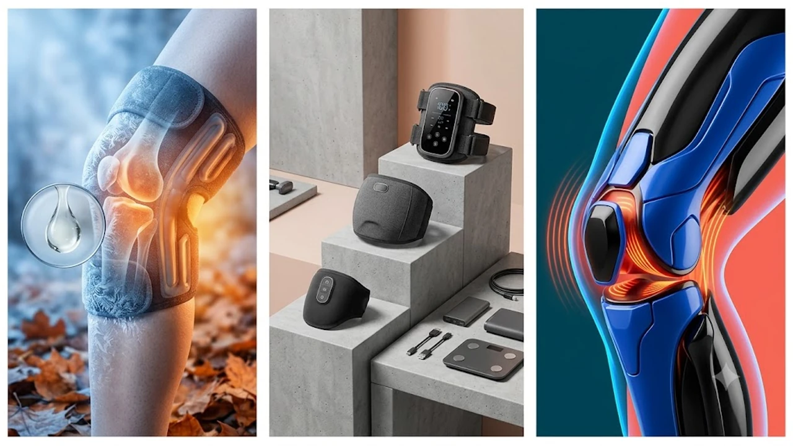

계단을 오르내릴 때 시큰거리는 통증이나 운동 후 뻐근하게 굳는 무릎 관절은 단순 찜질 팩 하나로 해결되지 않습니다. 손으로 주무르는 노동에서 벗어나고자 충전식 무선 무릎 마사지기를 결제하는 수요가 급증했습니다.

시중에 쏟아진 제품 중 출력 저하 없이 관절 주변부를 강하게 압박하고, 설정 온도 도달 속도가 빠른 검증된 기기 3종을 추려 성능과 가격을 직접 대조했습니다. 평소 다리 부종이나 종아리 뭉침까지 함께 관리한다면 [무선 종아리 마사지기 TOP3 가성비 비교](/posts/trending-picks/wireless-calf-massager-top3-2026/) 글도 함께 읽어두면 체계적인 하체 관리에 직관적인 기준이 잡힙니다.

---

## 1. 지금 무선 무릎 마사지기가 뜨는 이유

가을 환절기에는 일교차가 10°C 이상 벌어지며 기온이 떨어져 무릎 주변 혈관과 인대가 급격히 수축합니다. 관절 내부 활액의 점도가 올라가면서 평소보다 뻣뻣함과 시린 느낌을 호소하는 이들이 속출합니다.

여기에 2040 세대의 야외 러닝 크루 참여와 고중량 스쿼트 운동이 대중화되면서 슬개골 피로를 즉각 회복하려는 운동족의 필수 템으로 입소문을 탔습니다. 값비싼 안마의자 대신 필요한 부위만 간편하게 압박하는 실속형 케어 장비로 소비 패턴이 재편된 결과입니다.

---

## 2. 2026 무선 무릎 마사지기 대표 3종 스펙 비교

| 모델명 | 가격대 | 핵심 스펙 | 추천 대상 |
|---|---|---|---|
| **클럭 스트랩 무릎 마사지기 SP-303** | 119,000원 \~ 129,000원 선 | 3중 에어셀 가압, 3단 온열(최대 50°C), 2,500mAh | 강력한 공기압과 밀착 고정력을 찾는 관절염 환자·등산 애호가 |
| **풀리오 무릎 온열 마사지기 V2** | 89,000원 \~ 95,000원 선 | 380g 초경량, 30초 급속 발열(최대 55°C), 3,000mAh | 퇴근 후 가벼운 찜질과 이동 편의성을 선호하는 직장인 |
| **홈플래닛 무선 무릎 마사지기 HPM-K10** | 42,900원 \~ 46,900원 선 | 3,000RPM 진동+공기압, 3단 온열, 2,000mAh | 입문용 가성비 선물, 부모님 효도용 보조 기기를 찾는 구매자 |

---

## 3. 예산대별 추천 상품 상세 분석

### 클럭 스트랩 무릎 마사지기 SP-303
* **실제 판매가:** 119,000원 \~ 129,000원 선
* **핵심 스펙:**
  * 3중 독립 에어셀 입체 가압 챔버 적용
  * 3단계 온열 제어 (40°C, 45°C, 50°C 설정 온도 90초 이내 도달)
  * 2,500mAh 대용량 배터리 내장 (완충 시 120분 연속 구동)
* **장점:**
  * 광폭 벨크로 스트랩이 무릎 상하부를 견고하게 묶어 공기압 최고 단계에서도 마사지기가 밀려 올라가지 않습니다.
  * 진동 모듈 위치가 슬개건 양옆 틈새에 직접 닿아 뻐근하게 굳은 속근육을 강하게 털어냅니다.
* **단점:**
  * 배터리와 펌프가 결합된 전면 모듈 무게(약 510g)로 인해 선 채로 보행 시 아래로 처지는 감이 있습니다.
* **이런 사람에게 추천:**
  * 등산이나 장거리 사이클링 후 무릎 양옆 인대가 팽팽하게 굳어 강도 높은 지압 자극이 필요한 하체 운동 동호인에게 들어맞습니다.
* [클럭 스트랩 무릎 마사지기 쿠팡에서 보기](https://www.coupang.com/np/search?q=클럭+스트랩+무릎+마사지기&sourceType=affiliate&trackingCode=AF8691300)

### 풀리오 무릎 온열 마사지기 V2
* **실제 판매가:** 89,000원 \~ 95,000원 선
* **핵심 스펙:**
  * 본체 무게 약 380g 초경량 설계
  * 최고 55°C 그래핀 급속 발열 패드 (전원 인가 후 30초 내 열감 전달)
  * 3,000mAh 대용량 셀 탑재 (온열+공기압 동시 가동 시 90분 작동)
* **장점:**
  * 380g 수준의 가벼운 중량 덕분에 소파에 앉아 재택근무를 하거나 TV를 볼 때 무릎을 구부린 자세에서도 압박 밴드가 흘러내리지 않습니다.
  * 온열 패드 도달 온도가 최대 55°C까지 올라가 비 오는 날 뼈마디가 시린 만성 냉증 환자에게 찜질팩 대용으로 즉각적인 보온 효과를 냅니다.
* **단점:**
  * 공기압을 최고 단계로 올릴 때 에어 모터 구동 소음(약 52dB)이 발생해 조용한 독서실이나 취침 직전 침실에서 쓰기에는 거슬릴 수 있습니다.
* **이런 사람에게 추천:**
  * 무거운 하드케이스 형태를 기피하고, 부드러운 패브릭 질감으로 일상생활 중 가볍게 찜질과 지압을 동시에 누리고 싶은 분에게 알맞습니다.
* [풀리오 무릎 온열 마사지기 쿠팡에서 보기](https://www.coupang.com/np/search?q=풀리오+무릎+온열+마사지기&sourceType=affiliate&trackingCode=AF8691300)

### 홈플래닛 무선 무릎 마사지기 HPM-K10
* **실제 판매가:** 42,900원 \~ 46,900원 선
* **핵심 스펙:**
  * 3단계 공기압 지압 + 분당 최대 3,000RPM 미세 진동 복합 탑재
  * 발열 3단 제어 (42°C, 48°C, 53°C)
  * 2,000mAh 리튬이온 배터리 내장 (15분 자동 타이머 탑재)
* **장점:**
  * 4만 원대 가격 대비 진동 모드와 온열, 에어프레스를 전부 지원해 가성비 측면에서 압도적입니다.
  * 직관적인 터치 디스플레이가 장착되어 조작법을 따로 숙지하지 않아도 기계 작동에 서툰 부모님이 단번에 쓸 수 있습니다.
* **단점:**
  * 에어백의 팽창 범위가 상위 고가형 모델 대비 좁아 허벅지 하단과 정강이 상단까지 감싸는 풀 커버 지압력은 부족합니다.
* **이런 사람에게 추천:**
  * 10만 원 넘는 마사지기 가격이 부담스럽거나, 부모님 댁 안방에 놓아둘 입문용 데일리 온열 안마기를 찾는 분에게 들어맞습니다.
* [홈플래닛 무선 무릎 마사지기 쿠팡에서 보기](https://www.coupang.com/np/search?q=홈플래닛+무선+무릎+마사지기&sourceType=affiliate&trackingCode=AF8691300)

---

## 4. 구매 전 반드시 확인할 체크포인트

첫 번째는 고정 방식과 에어셀 배치입니다. 지퍼 고정식보다는 듀얼 벨크로(찍찍이) 밴드 구조여야 다리 둘레 차이에 유연하게 대응합니다. 무릎 윗부분과 아랫부분 두께가 사람마다 다르기 때문에 벨크로 면적이 넓어야 가압 시 기기가 헛돌거나 뒤틀리지 않습니다.

두 번째는 배터리 잔량에 따른 압력 유지력입니다. 저가형 모터를 쓴 제품은 배터리가 30% 이하로 떨어지면 에어 펌프 출력 압력이 급감해 헐렁해집니다. 배터리 용량이 최소 2,000mAh 이상인지, 충전 단자가 범용 규격인 USB Type-C를 지원하는지 점검해야 잦은 방전 스트레스를 줄입니다.

세 번째는 안전 타이머와 과열 방지 센서 유무입니다. 온열 기능이 50°C 안팎까지 올라가는 기기는 장시간 착용 시 저온 화상 위험이 뒤따릅니다. 15분에서 20분 주기로 자동 전원 차단 기능이 작동하는 기기여야 취침 전 안심하고 씁니다. 가을철 실내 체온 관리와 관절 보온을 함께 챙기려는 목적이라면 [2026 카본매트 TOP3 비교 추천](/posts/trending-picks/washable-carbon-mat-top3-2026/) 분석 내용도 함께 둘러보시길 권합니다.

---

> 이 포스팅은 쿠팡 파트너스 활동의 일환으로, 이에 따른 일정액의 수수료를 제공받습니다.

#트렌드상품 #쿠팡추천 #무선무릎마사지기 #클럭무릎마사지기 #풀리오무릎마사지기 #홈플래닛마사지기 #부모님효도선물 #관절온열찜질기 #내돈내산비교