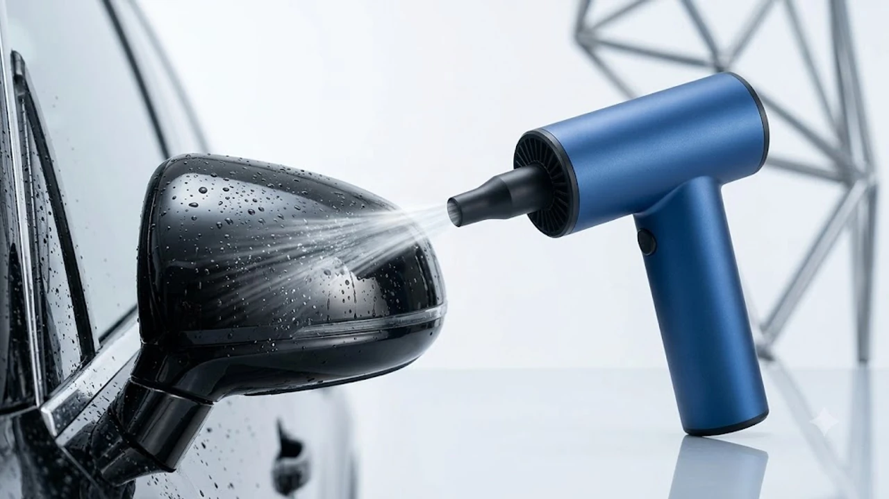

컴퓨터 본체 구석이나 기계식 키보드 스위치 사이에 낀 먼지를 털어내려고 캔 스프레이 압축공기를 사본 경험이 다들 있을 겁니다. 캔을 조금만 기울여도 하얀 냉매 액체가 뿜어져 나와 기판을 적시고, 몇 분 쓰지도 않았는데 캔 표면이 얼음장처럼 차가워지며 바람이 약해지는 문제는 늘 골칫거리였습니다.

이제 일회용 캔을 계속 살 필요가 없습니다. 손바닥 안에 들어오는 300g 안팎의 크기에 항공기 제트 엔진 원리를 적용한 초소형 BLDC 모터를 얹은 '무선 에어건 제트팬'이 그 자리를 완전히 대체했기 때문입니다. 책상 위 먼지 청소부터 세차 후 도어 틈새 물기 건조, 가을 캠핑장 텐트 낙엽 털기와 숯불 점화까지 한 번에 끝내는 무선 에어건 제트팬 추천 모델 3종을 정밀 비교합니다.

---

## 1. 지금 무선 에어건 제트팬이 폭발적으로 팔리는 이유

무선 에어건 제트팬의 인기는 단순한 유행을 넘어 실용적인 데일리 공구로 정착했습니다.

첫째, 데스크테리어와 정밀 전자기기 관리의 필수품이 되었습니다. 기계식 키보드, 카메라 렌즈, 고사양 데스크톱 쿨러는 브러시나 물티슈로 닦기 까다롭습니다. 제트팬은 부품 손상이나 정전기 쇼크 없이 초당 20\~30m에 달하는 고속 풍압만으로 틈새 먼지를 즉각 날려버립니다. 손목 부담을 줄여주는 [2026 무선 버티컬 마우스 추천 TOP3](/posts/trending-picks/wireless-vertical-mouse-top3-2026/)와 같은 데스크 셋업 기기들과 나란히 책상 위 상시 비치 아이템으로 자리 잡았습니다.

둘째, 환절기 아웃도어와 세차 취미의 확장입니다. 9월과 10월은 세차와 캠핑이 가장 활발한 계절입니다. 세차장 드라잉 존에서 사이드미러, 라디에이터 그릴, 휠 너트 구멍 속 고인 물을 드라잉 타월로 문지르면 잔스크래치가 생기기 쉽지만, 고속 제트팬을 쓰면 비접촉 방식으로 단 3초 만에 물기를 털어냅니다. 캠핑장에서는 텐트 스킨의 결로와 낙엽을 털어내고, 자충매트 공기 배기, 화로대 숯불 불씨를 살리는 만능 송풍기로 직결됩니다.

셋째, 초고속 BLDC(브러시리스) 모터와 고방전 배터리의 소형화입니다. 과거에는 부피가 큰 유선 송풍기나 콤프레셔에서만 가능했던 100,000 RPM 이상의 초고속 회전수를 가벼운 핸디형 바디에서 구현합니다. 캔 스프레이 소모 비용을 아끼고 쓰레기 배출을 줄일 수 있어 직장인과 실용주의 소비자들의 지갑을 열고 있습니다.

---

## 2. 무선 에어건 제트팬 TOP3 스펙 비교표

선택의 혼란을 줄이기 위해 현재 시장에서 실구매율이 검증된 3개 제품의 세부 수치와 포지션을 표로 대조했습니다.

| 모델명 | 가격대 | 핵심 스펙 | 추천 대상 |
| :--- | :--- | :--- | :--- |
| **크로스건 X3 Pro** | 35,000원\~42,000원 | 130,000 RPM / 풍속 30m/s / 3,000mAh | 오직 초강력 바람 세기만 원하는 가성비 세차·캠핑족 |
| **주파집 멀티 무선 에어건** | 54,000원\~59,000원 | 110,000 RPM / 풍속 25m/s / 전용 노즐 4종 | 실내 데스크 관리와 야외 사용을 겸하는 밸런스형 실속파 |
| **키카 제트팬 2** | 88,000원\~94,000원 | 100,000 RPM / 풀 메탈 바디 / 무단 슬라이더 | 정밀 기기 청소와 진공 흡입 겸용, 마감 품질을 따지는 사용자 |

---

## 3. 예산 및 용도별 TOP3 상세 분석

### ① 가성비 극대화 풍압 깡패: 크로스건(CrossGun) X3 Pro
* **가격대:** 35,000원\~42,000원
* **핵심 스펙:** 분당 130,000회전(RPM), 최대 풍속 30m/s, 3,000mAh 고방전 배터리 셀 탑재

크로스건 X3 Pro는 부가적인 요소를 덜어내고 출력 하나에 모든 설계를 맞춘 모델입니다. 손잡이 하단의 트리거를 누르면 손목에 묵직한 반동이 느껴질 정도의 바람을 즉각 방출합니다.

* **장점:**
  * 동급 가격대 경쟁 기기 중 단연 압도적인 130,000 RPM의 강력한 물리적 풍압.
  * 차량 도어 틈새 고인 물방울이나 세차 매트 깊숙이 박힌 흙먼지를 지체 없이 밀어내는 실전 세차 성능.
* **단점:**
  * 3D 프린팅 질감의 하드 플라스틱 바디를 채택해 메탈 소재 기기 대비 외관 고급스러움이 부족합니다.
* **추천 대상:** 복잡한 기능 없이 세차 후 틈새 건조, 캠핑장 장작 점화, PC 본체 내부 찌든 먼지 털기 등 거친 환경에서 부담 없이 굴릴 도구를 찾는 분.
* [크로스건 X3 Pro 쿠팡에서 보기](https://www.coupang.com/np/search?q=크로스건+X3+Pro&sourceType=affiliate&trackingCode=AF8691300)

---

### ② 완성도 높은 올라운더: 주파집(JUPAZIP) 멀티 무선 에어건
* **가격대:** 54,000원\~59,000원
* **핵심 스펙:** 분당 110,000회전(RPM), 최대 풍속 25m/s, 기본 노즐 4종 제공, 320g 알루미늄 합금 바디

국내 모바일 액세서리 전문 제조사 주파집의 제품으로, KC 정식 인증과 1년 무상 AS를 보장하는 균형 잡힌 기기입니다. 매끄러운 원통형 메탈 구조로 설계되어 손에 쥐었을 때 그립감이 단단합니다.

* **장점:**
  * 좁은 틈새 집중 노즐, 브러시 노즐, 에어튜브 노즐 등 결합 키트 4종을 기본 제공해 환경별 전환이 용이함.
  * 과전류·과충전 방지 스마트 IC 보호 회로를 내장해 배터리 수명 유지와 충전 안전성이 뛰어남.
* **단점:**
  * 최고 풍속 단계로 3분 이상 연속 가동 시 손잡이 상단 알루미늄 하우징으로 모터 열감이 전해집니다.
* **추천 대상:** 책상 위 전자제품 먼지 관리부터 차량 실내 컵홀더 및 시트 틈새 정리까지 두루 해결할 기본 탄탄한 모델을 찾는 분.
* [주파집 멀티 무선 에어건 쿠팡에서 보기](https://www.coupang.com/np/search?q=주파집+멀티+무선+에어건&sourceType=affiliate&trackingCode=AF8691300)

---

### ③ 정밀 기술력의 프리미엄: 키카(KICA) 제트팬 2
* **가격대:** 88,000원\~94,000원
* **핵심 스펙:** 분당 100,000회전(RPM), 풍속 20m/s, 슬라이드형 무단 변속 컨트롤러, 310g 풀 알루미늄 CNC 가공 바디

정밀 짐벌 전문 제조사 페이유(FeiyuTech)의 모터 제어 노하우가 투입된 상위 포지션 기기입니다. 단계별 버튼 방식 대신 슬라이드 레버를 밀어 풍량을 1% 단위로 섬세하게 통제할 수 있습니다.

* **장점:**
  * 송풍구 반대편에 전용 키트를 끼워 흡입 모드로 전환 가능한 듀얼 구조(진공청소기 겸용).
  * 정밀 CNC 알루미늄 바디와 무게 중심 설계 덕분에 최고 속도 구동 중에도 본체 떨림과 소음 대역이 낮음.
* **단점:**
  * 1,100mAh 용량의 경량 고방전 배터리를 탑재해 최대 출력 작동 시 연속 구동 시간이 약 12분으로 제한적입니다.
* **추천 대상:** 카메라 렌즈 틈새, 고급 음향기기, 정밀 피규어 수집품 등 미세한 풍량 제어가 필수적이거나 금속 감성의 마감을 선호하는 테크 애호가.
* [키카 제트팬 2 쿠팡에서 보기](https://www.coupang.com/np/search?q=키카+제트팬+2&sourceType=affiliate&trackingCode=AF8691300)

---

## 4. 구매 전 반드시 체크해야 할 4가지 포인트

1. **실제 모터 RPM 수치와 풍속(m/s) 데이터 확인:**
   시중 1\~2만 원대 초저가형 모델 중에는 일반 DC 모터를 달고 출력 수치를 부풀리는 사례가 있습니다. 모터 회전수가 최소 100,000 RPM 이상인지, 토출구 풍속이 초속 20m/s(시속 72km/h)를 넘는지 실측 스펙을 확인해야 미세먼지와 물기를 밀어낼 힘을 발휘합니다.

2. **금속 하우징 방열 설계와 NTC 과열 차단 센서 유무:**
   100,000 RPM 이상 도달하는 모터는 구동 시 필연적으로 열이 발생합니다. 플라스틱 통짜 사출 대신 열을 공기 중으로 배출하는 알루미늄 합금 케이스인지, 모터 온도가 60℃를 넘어가면 전원을 차단하는 NTC 온도 제어 센서가 장착되었는지 점검해야 모터 고장을 방지합니다.

3. **노즐 체결 구조의 물리적 잠금 방식:**
   에어건 풍압은 성인 손바닥을 뒤흔들 정도로 강력합니다. 단순 실리콘 마찰로 꼽는 결합 방식은 사용 도중 노즐이 앞으로 튕겨 나가 전자기기 액정이나 차량 도장면을 타격할 위험이 큽니다. 나사산 방식(스크루 체결)이나 홈에 맞춰 돌려 끼우는 트위스트 락 구조인지 확인해야 합니다.

4. **양방향 진공 흡입 기능 지원 여부:**
   바람을 강하게 부는 단방향 송풍만 필요한지, 좁은 공간의 먼지를 모아 흡입하는 진공청소기 기능까지 겸해야 하는지 따져보아야 합니다. 키카 제트팬 2처럼 흡입 노즐과 필터 키트가 호환되는 모델은 책상 구석 지우개 가루나 차량 시트 부스러기를 바로 치울 때 적합합니다.

컴퓨터 작업과 세차로 굳은 몸은 [무선 종아리 마사지기 TOP3 가성비 비교](/posts/trending-picks/wireless-calf-massager-top3-2026/)와 같은 힐링 기기로 달래며 능률을 챙겨보길 권합니다. 야외 활동과 거친 세차 환경 위주라면 크로스건을, 사무 공간과 실내 전자기기 관리가 주 목적이라면 주파집이나 키카를 선택하는 것이 명확한 해답입니다.

---

> 이 포스팅은 쿠팡 파트너스 활동의 일환으로, 이에 따른 일정액의 수수료를 제공받습니다.

#트렌드상품 #쿠팡추천 #무선에어건제트팬 #크로스건X3Pro #주파집에어건 #키카제트팬2 #데스크테리어청소 #셀프세차송풍기 #캠핑용품추천