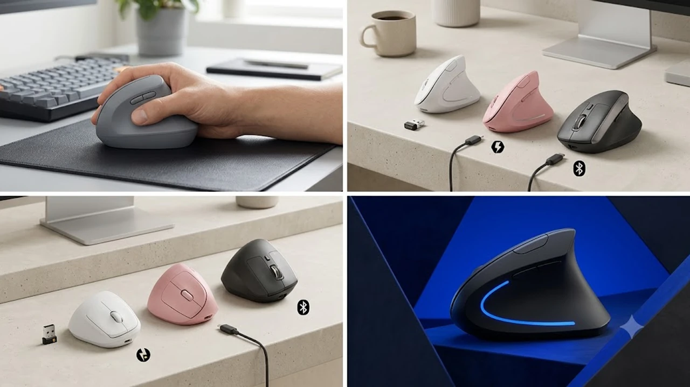

하루 8시간 이상 PC 앞에 앉아 키보드와 마우스를 쥐고 일하다 보면 어느 순간 손목 안쪽이 찌릿하게 저려오고 손가락 끝 감각이 둔해집니다. 일반 마우스를 쥘 때 손목 뼈와 힘줄이 바닥에 눌려 비틀리는 회내(Pronation) 자세가 장시간 이어지며 척골 신경을 압박하기 때문입니다. 악수하듯 자연스러운 각도를 만들어 손목 압력을 낮춰주는 무선 버티컬 마우스가 단순한 주변기기를 넘어 직장인의 필수 생존템으로 자리 잡은 배경입니다.

오랜 시간 누적된 손목 피로는 작업 효율을 갉아먹는 주원인입니다. 평소 다리 부종이나 전신 피로를 풀기 위해 [무선 종아리 마사지기 TOP3 가성비 비교](/posts/trending-picks/wireless-calf-massager-top3-2026/) 같은 힐링 디바이스를 찾는 분들이 많은 것처럼, 매일 손목 관절에 가해지는 물리적 부하를 근본적으로 줄이려면 마우스부터 손목 부담이 덜한 인체공학 구조로 바꿔야 합니다.

---

## 1. 지금 무선 버티컬 마우스가 뜨는 이유

* **57도 수직 각도의 손목 중립 포지션:** 일반 납작한 마우스는 손바닥이 바닥을 향하면서 전완근 근육이 비틀립니다. 버티컬 마우스는 팔과 손목이 가장 편안하게 이완되는 57도 자연스러운 악수 각도를 유지해 수근관절 압력을 즉각 분산합니다.
* **사무실 맞춤형 무소음 스위치 기본 탑재:** 초기 버티컬 마우스는 클릭음이 둔탁하고 커서 조용한 사무실이나 스터디카페에서 쓰기 부담스러웠습니다. 최근 출시 모델은 클릭 압력을 부드럽게 낮춘 저소음 댐퍼 스위치를 적용해 공공장소에서도 정숙하게 쓸 수 있습니다.
* **복수 기기를 넘나드는 무선 연결성:** 데스크탑, 노트북, 태블릿을 동시에 띄워두고 일하는 멀티태스킹 환경에 맞춰 블루투스와 2.4GHz USB 수신기를 버튼 하나로 넘나드는 3대 멀티페어링 기술이 대중화되었습니다.

---

## 2. TOP3 상품 스펙 비교

| 모델명 | 가격대 | 핵심 스펙 | 추천 대상 |
| :--- | :--- | :--- | :--- |
| **제닉스 STORMX VM3** | 29,800원 | 2.4GHz 무선+Type-C 유선 겸용 / 600mAh 내장 배터리 / 4단계 800\~2,400 DPI / 150g | 버티컬 마우스 입문자, F10 이상 손 크기 |
| **로지텍 LIFT** | 79,000원 | Logi Bolt+Bluetooth 5.0 / AA 건전지 1개(최대 24개월) / 400\~4,000 DPI / 125g | F9\~F10 중소형 손, 무소음·멀티페어링 필수 유저 |
| **로지텍 MX Vertical** | 119,000원 | Logitech Flow 3대 OS 연동 / 240mAh 고속 충전(최대 4개월) / 400\~4,000 DPI / 135g | F10.5 이상 대형 손, 정밀 그래픽·문서 전문 작업자 |

---

## 3. 예산대별 추천 (저가·중간·프리미엄)

### 가성비 입문형 (2만원대) — 제닉스 STORMX VM3

버티컬 마우스 특유의 각도에 적응할 수 있을지 확신이 서지 않을 때 부담 없이 선택하기 좋은 표준형 모델입니다.

* **핵심 스펙:** 2.4GHz 무선 및 Type-C 유선 듀얼 모드, 800·1,200·1,600·2,400 4단계 즉각 DPI 조절, 600mAh 리튬 폴리머 배터리 내장, 150g 무게 중심 설계.
* **장점:** 
  * 29,800원의 가격대로 초기 진입 비용 부담 없이 57도 인체공학 그립을 경험할 수 있습니다.
  * 건전지 교체 없이 USB-C 케이블을 꽂아 충전하면서 유선 마우스처럼 끊김 없이 작업할 수 있습니다.
* **단점:** 
  * 블루투스 기능을 지원하지 않아 USB Type-A 포트가 없는 슬림 노트북 이용 시 별도 C타입 젠더를 연결해야 합니다.
* **이런 사람에게 추천:** 버티컬 마우스 형태에 처음 도전하는 입문자, 손 크기가 F10 이상으로 손바닥 면적이 넓은 사용자.
* [제닉스 STORMX VM3 쿠팡에서 보기](https://www.coupang.com/np/search?q=제닉스+STORMX+VM3&sourceType=affiliate&trackingCode=AF8691300)

---

### 밸런스형 베스트셀러 (7만\~8만원대) — 로지텍 LIFT

아시안 체형의 손 크기에 정밀하게 맞춰 설계되어 현재 국내 데스크셋업 시장에서 가장 반응이 뜨거운 제품입니다.

* **핵심 스펙:** 블루투스 저전력(BLE) 및 Logi Bolt 수신기 지원, SmartWheel 정밀/고속 무단 변속 스크롤, AA 건전지 1개로 최대 24개월(730일) 구동, 125g 초경량 바디.
* **장점:**
  * SilentTouch 저소음 댐퍼를 적용해 도서관 및 조용한 사무실 기준치(40dB 이하)를 만족합니다.
  * 손 크기 F9\~F10(키보드 F1 기준 9\~10개 폭) 사용자의 손에 빈틈없이 감겨 손목에 들어가는 악력을 줄여줍니다.
* **단점:** 
  * 손 크기가 F10.5를 넘어가는 큰 손 사용자가 쥐면 약지와 새끼손가락 끝이 마우스패드 바닥에 쓸립니다.
* **이런 사람에게 추천:** 하루 6시간 이상 오피스 문서를 다루는 직장인, 손이 작거나 보통 크기(F9\~F10)인 남녀 사용자.
* [로지텍 LIFT 쿠팡에서 보기](https://www.coupang.com/np/search?q=로지텍+LIFT&sourceType=affiliate&trackingCode=AF8691300)

---

### 프리미엄 플래그십 (11만\~12만원대) — 로지텍 MX Vertical

전문 그래픽 디자이너, 개발자, 엑셀 대용량 데이터를 다루는 파워 유저를 위한 종결급 인체공학 마우스입니다.

* **핵심 스펙:** 4,000 DPI 고정밀 광학 센서 탑재, 240mAh 배터리 완충 시 4개월 지속(1분 급속 충전으로 3시간 작동), 최대 3개 디바이스를 오가는 Logitech Flow 기술 탑재.
* **장점:**
  * 79 x 120 x 78.5mm의 넓은 바디와 상단 텍스처 고무 그립이 손바닥 전체를 받쳐 장시간 작업 시 손목 근육 긴장도를 10% 낮춰줍니다.
  * 윈도우와 맥북 사이를 마우스 커서 하나로 넘나들며 텍스트와 파일을 복사·붙여넣기할 수 있어 다중 모니터 작업 속도가 대폭 단축됩니다.
* **단점:** 
  * LIFT 모델과 달리 클릭 시 기계식 스위치 특유의 딸깍 소리가 발생해 정숙성이 극도로 요구되는 독서실 환경에서는 사용이 제한적입니다.
* **이런 사람에게 추천:** 손 크기가 F10 이상으로 큰 편인 사용자, 듀얼 PC 세팅으로 대용량 그래픽·코딩 작업을 수행하는 전문가.
* [로지텍 MX Vertical 쿠팡에서 보기](https://www.coupang.com/np/search?q=로지텍+MX+Vertical&sourceType=affiliate&trackingCode=AF8691300)

---

## 4. 구매 전 반드시 확인할 체크포인트

* **손 크기(F넘버) 실측 확인:** 키보드 F1 키에 엄지손가락을 대고 새끼손가락을 최대한 뻗었을 때 닿는 키 개수를 확인하세요. F9 이하는 로지텍 LIFT(125g) 같은 콤팩트 모델을, F10.5 이상은 로지텍 MX Vertical이나 제닉스 VM3를 골라야 손가락 쓸림이 없습니다.
* **센서 감도(DPI)와 스위치 소음:** 버티컬 마우스는 손목 회전을 줄이고 손가락으로 정밀 조작하는 빈도가 높습니다. 최소 2,400\~4,000 DPI까지 세밀한 감도 조절을 지원하는지, 사무실 환경에 맞는 무소음 스위치인지 점검해야 합니다.
* **배터리 관리 방식:** 주기적으로 Type-C 케이블을 꽂아 충전하는 내장 리튬형(제닉스 VM3, 로지텍 MX)과 1\~2년에 한 번씩 건전지를 교체해 방전 스트레스가 없는 건전지형(로지텍 LIFT) 중 본인의 데스크 환경에 맞는 방식을 선택하세요.

더 알찬 오피스 및 라이프스타일 가전 정보가 필요하다면 [트렌드 상품 추천 TOP3](/posts/trending-picks/trending-picks-20260727/) 페이지에서 다른 제품군도 함께 비교해 보세요.

---

> 이 포스팅은 쿠팡 파트너스 활동의 일환으로, 이에 따른 일정액의 수수료를 제공받습니다.

#트렌드상품 #쿠팡추천 #무선버티컬마우스 #버티컬마우스추천 #손목터널증후군 #로지텍LIFT #로지텍MXVertical #제닉스마우스 #데스크테리어 #사무실필수템