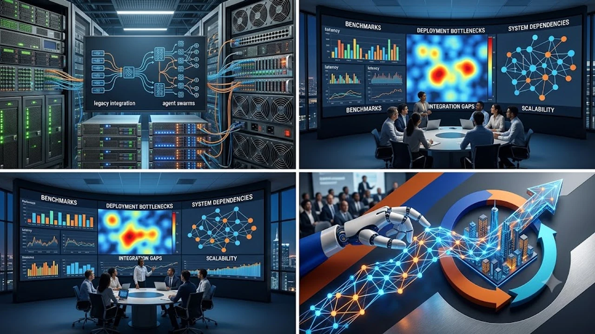

Enterprise automation has fundamentally pivoted from passive conversational models toward autonomous AI agents capable of planning, executing complex multi-step workflows, and adjusting to system errors in real time. Organizations deploying modern agentic frameworks are no longer seeking isolated text summaries; they are orchestrating cross-platform task loops that directly touch production databases, customer touchpoints, and development environments.

## Architectural Evolution of Enterprise AI Agents

### From Stateless Chatbots to Dynamic Multi-Agent Swarms
Early iterations of large language models functioned primarily as stateless engines, relying strictly on human prompts to trigger linear text generation. Modern autonomous setups use specialized agent clusters where distinct software entities assume dedicated roles: planner, executor, reviewer, and tool specialist. Instead of a single model attempting to navigate complex context windows, multi-agent frameworks distribute tasks, debate intermediate findings, and cross-validate data before executing operational code or database commits.

### Persistent Context Memory and Long-Horizon Execution
Sustained task execution requires dependable state management across hours or days of execution cycles. Production systems leverage hybrid vector-graph databases to index historical execution telemetry, API schemas, and organizational business logic. When an agent encounters an unhandled exception or an invalid API response, it inspects its persistent state, rolls back the uncommitted transaction, and selects an alternate path without human intervention.

### Tool Integration and Secure Sandbox Boundaries
Modern autonomous systems run inside locked-down runtime sandboxes with strict perimeter defenses. Tool calling protocols evaluate authentication tokens, enforce read-only mirrors for analytical tasks, and isolate write actions within monitored staging pipelines. This architecture prevents hallucinated commands from leaking destructive modifications into live software repositories or core enterprise infrastructure.

## Operational Benchmarks and Core Deployment Challenges

### Guardrails Against Compound Hallucinations
When multiple models pass outputs iteratively through a pipeline, a slight factual drift in the initial stage multiplies exponentially across downstream actions. Engineering teams mitigate this vulnerability through deterministic verification layers, such as schema-bound JSON responses, AST parsers for generated scripts, and intermediate policy checkpoints. 

> Operational reliability in multi-agent systems depends far more on deterministic validation gates than on raw parameter scale.

As broader architectural requirements expand across hardware ecosystems, organizations are also balancing compute footprints between local edge nodes and centralized clouds. The strategic integration of local hardware processing mirrors industry patterns covered in [Why IFA 2026 Shifted to On-Device AI: 3 Key Takeaways](/posts/us-trends/why-ifa-2026-shifted-on-device-smart-home-ai/), illustrating how localized computing stabilizes operational overhead.

### Economic Viability: Token Overhead vs. Labor Velocity
Multi-agent task decomposition incurs massive token consumption. A workflow requiring an agent team to research, draft, audit, and commit code can chew through millions of input tokens per ticket. Infrastructure leads must measure token economics against cycle speed and output precision:

- High-cost reasoning models reserved strictly for strategic routing and error triage.
- Compact, fine-tuned sub-models handling repetitive data extraction and transformation.
- Semantic caching layers eliminating duplicate model queries across identical operational tasks.

### Regulatory Compliance and Audit Trails
Regulated verticals such as banking, healthcare, and telecommunications require verifiable traceability for every programmatic decision. System logging now records the complete chain of thought, model weight versions, input payloads, and intermediate tool responses. Without immutable audit logs, deploying fully autonomous logic into production risks regulatory non-compliance under emerging global digital governance frameworks.

## Global Supply Chains and Regional Integration Models

### Western Enterprise Playbooks: SaaS and Cloud-Native Pipelines
North American and European enterprises prioritize direct integration with established API-driven ecosystems, including Salesforce, Workday, GitHub, and major cloud hyperscalers. Workflow definitions focus on autonomous software testing, customer journey remediation, and automated finance reconciliation. The focus remains heavily weighted toward API connectivity, serverless cloud functions, and zero-trust identity federation.

### East Asian Industrial Automation and Smart Manufacturing Hubs
East Asian deployment strategies, particularly within South Korea and Japan, blend software orchestration directly into hardware supply chains and manufacturing lines. Conglomerates in Seoul and Suwon deploy autonomous orchestration layers to supervise semiconductor cleanroom monitoring, automated component logistics, and predictive assembly maintenance. Local models optimized for bilingual technical documentation bridge real-time operational sensors with executive dispatch consoles.

### Geopolitical Pressures on Sovereign AI Infrastructure
Cross-border data flows face increasing scrutiny as nations implement strict data sovereignty laws. Enterprisewide multi-agent architectures increasingly separate operational control layers from localized training data pools. The regulatory tension surrounding compute access and model security aligns with broader geopolitical dynamics analyzed in [Trump-Xi Summit 2026: Why AI Guardrails Matter](/posts/us-trends/trump-xi-summit-2026-ai-guardrails-tech-truce/), emphasizing the ongoing friction between tech sovereignty and unified international standards.

## Practical Framework for Enterprise Implementation

### Phase 1: Identifying Low-Risk High-Volume Operational Bottlenecks
Begin deployment inside sandboxed operational environments where failure carries zero blast radius to revenue or customer trust. Typical entry points include:

- Internal developer productivity workflows, such as legacy code migration and unit test generation.
- Tier-1 IT helpdesk ticket triage and diagnostic log extraction.
- Vendor invoice validation against ERP purchase orders and shipping manifests.

### Phase 2: Building Human-in-the-Loop Approval Thresholds
Transitioning from human-driven tasks to full autonomy demands progressive validation tiers. Critical actions—such as initiating financial disbursements, deleting records, or publishing external communications—require human approval tokens. Autonomous agents execute all preliminary data collection and draft the proposed action, holding execution until an authenticated operator signs off.

### Phase 3: Monitoring Drift and Continuous Optimization
System health monitoring requires dedicated dashboards tracking task success rates, average resolution latency, token cost per task, and human intervention frequencies. Teams run automated red-teaming pipelines that inject edge-case inputs to verify that agent clusters adhere to safety baselines.

For technical teams optimizing local workstation setups and testing hardware for automated development environments, check out [관련상품 쿠팡에서 보기](https://www.coupang.com/np/search?q=%ED%95%B4%EC%99%B8%EC%9D%B8%EA%B8%B0%EC%83%81%ED%92%88&sourceType=affiliate&trackingCode=AF8691300) to inspect compatible development accessories.

#GlobalTrends #AIAgents #EnterpriseTech #Automation #Korea #TechTrends #SoftwareEngineering #CloudComputing