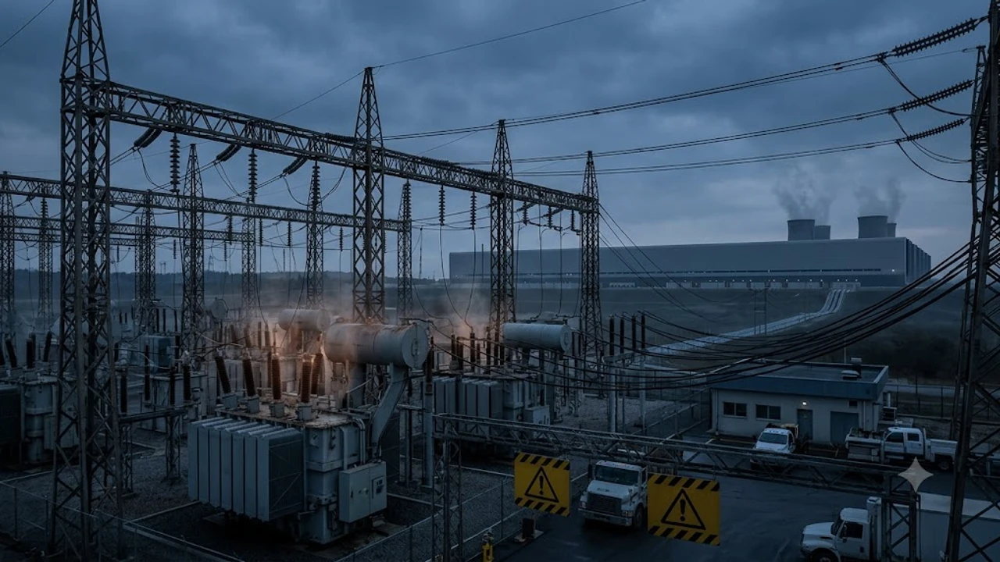

Hyperscale artificial intelligence infrastructure has officially run headfirst into physical physics, prompting a rapid shift toward **AI Behind-the-Meter Power**. As public utility queues stretch across multi-year backlogs and regional grids buckle under unprecedented gigawatt-scale loads, major compute operators are decoupling directly from municipal distribution networks to secure dedicated onsite microgrids.

## The 2026 Grid Bottleneck: Why AI Compute Is Outpacing Public Utilities

The relationship between municipal transmission systems and multi-hundred-megawatt AI data centers has reached a definitive breaking point. While consumer demand for synthetic intelligence capabilities scales exponentially, the physical infrastructure delivering baseline alternating current remains constrained by legacy equipment, permitting stalls, and long lead times for high-voltage transformers.

### The Northern Virginia 3 GW Wake-Up Call

Northern Virginia—long recognized as the premier hyperscale corridor in the world—faced an acute operational crisis when local transmission operators recorded sudden multi-gigawatt load imbalances during peak thermal events. 

- Over **3 gigawatts** of hyperscale processing capacity experienced momentary frequency and voltage disruptions within a single operational window.
- Inverter-based resources failed to provide adequate synthetic inertia, exposing vulnerabilities in local substation transformers.
- Regional utilities issued curtailment warnings to commercial operators, demonstrating that AI clusters cannot depend on shared municipal capacity for uninterrupted 24/7 uptime.

### Stricter FERC Ride-Through Mandates and Interconnection Backlogs

The Federal Energy Regulatory Commission (FERC) and the North American Electric Reliability Corporation (NERC) have responded with stringent compliance standards.

> "Interconnection queues across major RTO regions now exceed five to seven years for multi-hundred-megawatt loads, forcing developers to satisfy stringent dynamic voltage ride-through standards before breaking ground."

These mandates require any large-scale industrial compute node to sustain severe voltage dips without tripping offline or dumping load back onto fragile transmission corridors. Consequently, interconnection queues for commercial grid connections exceeding **250 MW** now encounter regulatory approval timelines running into the 2030s.

### The Economic Cost of Power Outages on LLM Training Clusters

Unscheduled power anomalies do not merely cause momentary system resets; they corrupt massive distributed training states across clusters running tens of thousands of synchronized GPUs.

* **Checkpoint Invalidation:** A single sub-cycle voltage drop can corrupt active gradient synchronization, forcing engineering teams to roll back multi-day model iterations.
* **Hardware Degradation:** Severe power fluctuations accelerate thermal wear on voltage regulator modules (VRMs) and high-bandwidth memory (HBM) stacks.
* **Direct Financial Loss:** With frontier AI training runs costing upwards of **$150 million** per iteration, even a single hour of cluster-wide idle state generates staggering capital drag.

For enterprises evaluating these downstream hardware disruptions, keeping track of macro hardware shifts detailed in [US Secondary Tariffs 2026: 3 Tech Supply Chain Impacts](/posts/us-trends/us-secondary-tariffs-2026-tech-supply-chain-impacts/) is critical for mitigating unexpected capital equipment shortages.

## 3 Core Drivers Accelerating Behind-the-Meter Power Deployments

To circumvent aging public grids, compute developers are deploying behind-the-meter (BTM) generation systems built directly adjacent to data halls. By generating and consuming power entirely on private land, these sites eliminate utility transmission interconnect delays entirely.

### Onsite Generation: SMRs and Fast-Start Micro-Turbines

The primary pillar of the BTM pivot centers on dedicated baseload generation capable of constant, non-intermittent power production.

1. **Small Modular Reactors (SMRs):** Factory-fabricated nuclear fission units providing **50 MW to 300 MW** of continuous zero-emission thermal energy directly to closed-loop cooling and electrical setups.
2. **Aeroderivative Gas Micro-Turbines:** High-efficiency, hydrogen-ready natural gas turbines providing ultra-fast ramp rates to match sudden GPU load spikes within milliseconds.
3. **Dedicated Geothermal Wells:** Advanced closed-loop geothermal extraction offering continuous baseload without requiring complex pipeline interconnects.

### Dedicated Utility-Scale BESS for Peak Load Smoothing

Because high-density transformer clusters fluctuate wildly in power draw depending on inference batches and matrix multiplication routines, large-scale Battery Energy Storage Systems (BESS) are essential.

- Modern BTM facilities deploy multi-hundred-megawatt-hour lithium-iron-phosphate (LFP) and sodium-ion battery containers.
- These arrays absorb sub-second current surges when clusters shift from idle states to full floating-point operations.
- Dedicated BESS setups act as continuous power conditioners, filtering harmonic distortion and ensuring consistent sine-wave purity for sensitive accelerator clusters.

### Complete Decoupling from Public Transmission Bottlenecks

By placing generation, storage, and consumption on the customer side of the utility meter, hyperscalers bypass regional utility commissions entirely.

* **No Transmission Access Fees:** Operators avoid escalating rate-base tariffs designed to fund broader municipal grid repairs.
* **Sovereign Energy Management:** System engineers retain total authority over dispatch schedules, maintenance downtime, and cooling adjustments.
* **Zero Curtailment Exposure:** Private generation assets are legally immune to public utility load-shedding orders during severe municipal heatwaves or winter freezes.

## Comparing Dedicated Onsite Power vs. Traditional Grid Interconnection

| Key Operational Metric | Traditional Grid Interconnection | Dedicated Behind-the-Meter (BTM) Infrastructure |
| :--- | :--- | :--- |
| **Time to First Megawatt** | 5 to 8 Years (Interconnection Queues) | 18 to 36 Months (Modular Deployment) |
| **Power Reliability & SLA** | 99.9% (Subject to Local Grid Events) | 99.999% (N+2 Redundant Microgrid) |
| **Upfront Capital Expenditure** | Low (Utility-Financed Lines) | High (Private CAPEX / Infrastructure Equity) |
| **Regulatory Jurisdiction** | Regional RTOs, State PUCs, FERC | Local Zoning & Industrial Safety Codes |
| **Harmonic & Power Quality** | Variable (Industrial Grid Noise) | Pristine (Dedicated BESS & Filtering) |

### Upfront Capital Expenditure vs. Long-Term Operational Uptime

Building an independent microgrid requires massive front-loaded capital allocations. A **500 MW** dedicated generation and storage installation demands hundreds of millions of dollars in private financing. 

However, hyperscalers view this expense against the baseline value of compute. When GPU server racks generate millions of dollars per day in inference API revenues, the premium paid for absolute operational continuity delivers a measurable return on investment within three to four operational years.

### Regulatory Approval Timelines and Environmental Compliance

While traditional grid hookups get bogged down in multi-state transmission line approvals, BTM facilities negotiate simpler, hyper-localized industrial permits.

* **Localized Air Quality Permits:** Natural gas micro-turbines operate under standard industrial air quality permits rather than interstate utility frameworks.
* **Closed-Loop Environmental Standards:** Modern microgrid setups utilize dry-cooling heat exchangers, minimizing local water table depletion.
* **Clean Energy Credits:** SMR-powered facilities earn top-tier zero-carbon certifications, aligning directly with enterprise net-zero benchmarks without needing synthetic carbon offset purchases.

### Scalability and Modularity for Next-Generation 100k GPU Clusters

Next-generation training clusters running advanced architectures cannot scale on fractional 20 MW utility upgrades. BTM architecture utilizes modular energy blocks. 

As a compute cluster expands from 25,000 accelerators to over 100,000 units, operators add standardized 50 MW generation and storage modules in parallel. This linear scaling removes the risk of infrastructure stalls and allows developers to synchronize compute delivery with dedicated power capacity.

## Global Supply Chain Fallout and the Korean Energy Sector Connection

The pivot toward private AI power generation has sparked a worldwide scramble for specialized electrical equipment, transformers, and industrial battery cells. South Korea's industrial manufacturing powerhouse has emerged as an indispensable hub for this global microgrid expansion.