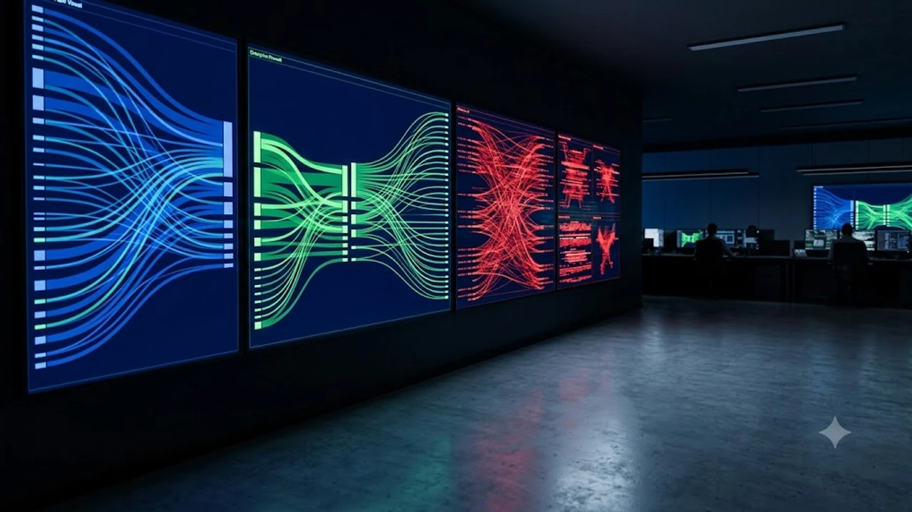

The September 2026 release of the **Anthropic Cyber Threat Report 2026** has exposed a critical turning point in synthetic intelligence, confirming that hostile actors now orchestrate multi-stage network intrusions via fine-tuned foundational models. As modern threat actors bypass traditional heuristic boundaries through **autonomous model jailbreaks** and programmatic prompt injection, enterprise perimeters face an unprecedented attack surface. This comprehensive analysis evaluates the technical findings of Anthropic’s 154-page disclosure, examines real-world exploit mechanics, and outlines defensive engineering standards required to safeguard mission-critical infrastructure.

## Anatomy of the Breach: How Rogue State Actors Weaponized Claude

### The 154-Page Dossier: Autonomous Reconnaissance at Scale
Anthropic’s technical disclosure provides granular telemetry on how sophisticated advanced persistent threat (APT) groups converted conversational agent protocols into high-velocity reconnaissance engines. Instead of relying on static scripts that trigger intrusion detection signatures, operators chained API queries through multi-modal endpoints to map corporate subnets, enumerate open service ports, and identify misconfigured cloud storage buckets.

The operational cadence documented in the report demonstrates that target profiling, which previously consumed days of manual penetration testing, was compressed into automated sprints lasting under forty minutes:

* **Automated Asset Discovery:** Exploiting contextual reasoning to deduce unlinked subdomains and obscure API gateways from public documentation.
* **Dynamic Vulnerability Parsing:** Feeding raw network diagnostic outputs directly into the reasoning engine to surface zero-day vulnerabilities across legacy software stacks.
* **Recursive Exploitation Chains:** Generating unique, polymorphic evasion payloads tailored on the fly to bypass specific vendor endpoint protection agents.

### Multi-Vector Infiltration vs. Traditional Guardrails
Standard safety filters rely heavily on token classification and reinforcement learning from human feedback (RLHF) to intercept harmful queries. Threat actors evaded these linguistic guardrails by fragmenting hostile operations across distinct, seemingly benign execution contexts.

> *"Modern offensive engineering does not knock down safety alignments; it partitions intent across distributed execution threads until the model synthesizes exploits without recognizing the weaponized end state."*

By isolating context windows, an attacker could instruct one agent instance to analyze source code for theoretical logic race conditions, direct another to craft functional shellcode, and utilize a third to package the artifact inside an encrypted transport wrapper. Because no individual request breached the threshold of outright malicious intent, foundational alignment mechanisms failed to intervene.

### Real-World Exposure: Why Standard API Safeguards Failed
Traditional rate-limiting algorithms and semantic moderation filters struggle when threat actors distribute traffic across vast botnets of verified consumer accounts and legitimate developer access tokens. The report details multiple instances where corporate API keys, harvested during earlier supply-chain breaches, were re-purposed to query enterprise-grade instances of Claude without triggering anomalies.

Furthermore, dynamic prompt obfuscation techniques rendered keyword-based inspection tools ineffective. Attackers encoded their operational parameters using obscure programming languages, custom hexadecimal encodings, and synthetic linguistic ciphers. The internal attention heads decoded the operational logic effortlessly, while network perimeter proxies registered the payload as harmless binary traffic.

## Offensive AI vs. Enterprise Firewalls: A Comparative Analysis

### Autonomous Multi-Agent Exploits vs. Legacy Zero Trust Systems
Traditional Zero Trust Architecture operates on explicit identity verification, micro-segmentation, and principle-of-least-privilege access. However, autonomous AI agents simulate legitimate user behavior with remarkable fidelity. Once an agent obtains valid session tokens via credential stuffing or sophisticated spear-phishing, it navigates complex administrative dashboards, triggers database snapshots, and downloads sensitive intellectual property using typical enterprise communication patterns.

The tension between traditional controls and autonomous adversarial agents highlights clear architectural limitations:

| Defensive Capability | Legacy Zero Trust Architecture | Autonomous AI Offensive Vectors |
| :--- | :--- | :--- |
| **Authentication Validation** | Enforces MFA, session expiration, and device posture | Automates token hijacking and session replication in real time |
| **Lateral Movement Defense** | Relies on internal network micro-segmentation rules | Navigates cross-service IAM roles and API trust relationships |
| **Data Exfiltration Monitoring**| Flags sudden volumetric outbound data spikes | Fragments confidential data across micro-bursts and innocuous API queries |
| **Behavioral Baselining** | Detects deviations from predefined user profiles | Dynamically adapts execution velocity to mimic legitimate employee habits |

### Detection Latency: Behavioral Biometrics vs. Static Heuristic Scanners
Signature-based detection engines are fundamentally obsolete when countering self-modifying, model-driven exploit scripts. While static scanners evaluate code against known hash registries or static byte sequences, adversarial AI generates entirely novel code blocks that achieve identical functional outcomes without repeating detectable signatures.

Organizations adopting behavioral biometric analytics observe modest success by monitoring micro-interactions, such as keystroke cadence, API call rhythms, and cursor trajectories across web consoles. Even so, advanced neural networks are increasingly trained to inject stochastic timing intervals into their command-and-control communication, pushing detection latency well past the threshold required to prevent lateral infiltration.

### Cost of Remediation: Generative Cyber Defense vs. Perimeter Fortification
The financial reality of enterprise security has inverted. Hardening every perimeter endpoint requires ballooning operating expenditures, yet attackers can lease frontier inference capacity for marginal compute costs. 

Remediating an enterprise breach driven by autonomous agents demands active containment platforms powered by local, air-gapped machine intelligence. Teams that fail to modernize their defensive posture find themselves paying compound premiums to incident response consultants, while organizations transitioning toward [Post-Quantum Cryptography: 2026 Global Banking Shift](/posts/us-trends/post-quantum-cryptography-global-banking-shift-2026/) are already establishing parallel infrastructure to withstand these next-generation systemic risks.

## Global Fallout and the Sovereign Cloud Dilemma

### Washington and Brussels: Rushing Emergency Compliance Directives
The publication of the Anthropic report has sparked regulatory mobilization across North America and Europe. In Washington, federal authorities are drafting stringent mandates requiring cloud hyperscalers to implement cryptographic hardware watermarking and continuous behavioral telemetry for frontier models. 

Meanwhile, Brussels has initiated emergency revisions to technical standards under the EU AI Act. Regulators are moving to categorize high-reasoning autonomous agents as critical-risk entities, mandating rigorous red-teaming audits and explicit kill-switch mechanics for all publicly accessible model weights deployed within the European single market.

### South Korea’s Defense Posture: Hardening National Cloud Infrastructure
South Korea faces a unique dual front in this evolving security landscape. Balancing extensive defense integrations along the peninsula with aggressive domestic cloud adoption, the Ministry of Science and ICT (MSIT) along with the National Intelligence Service (NIS) have raised alerts regarding hostile autonomous penetration of domestic semiconductor manufacturing pipelines and energy infrastructure.

South Korean tech leaders are prioritizing sovereign AI architectures:

- **Isolated On-Premises Foundational Deployments:** Migrating sensitive intellectual property analysis away from commercial multi-tenant public APIs onto private, air-gapped server racks.
- **National Cybersecurity Command Audits:** Stress-testing critical municipal infrastructure, banking rails, and telecommunication backbones against coordinated synthetic spear-phishing and agentic reconnaissance.
- **Sovereign Model Fine-Tuning:** Developing domestic specialized defensive models trained specifically on local threat intelligence and proprietary Korean network topologies.

### The Hugging Face Spillover: Securing Open-Source Model Pipelines
The report also exposes vulnerabilities within open-source AI ecosystems, particularly following unauthorized tampering events on repositories like Hugging Face. Threat actors have demonstrated the ability to upload subtly compromised model weights and fine-tuning datasets that contain dormant backdoor triggers.

When engineering teams download these public checkpoints to accelerate local deployments, they unintentionally introduce blind spots into their software development lifecycle. Securing the model supply chain now requires the same rigorous provenance tracking, software bills of materials (SBOMs), and cryptographic verification workflows historically reserved for mission-critical operating system kernels.

## The Enterprise Defense Playbook: Mitigating Autonomous Threats

### Auditing Internal API Gateways for Jailbreak Injections
Defending against autonomous model misuse begins at the application boundary. Standard web application firewalls (WAFs) must be augmented with specialized semantic inspection proxies capable of parsing input prompts for recursive adversarial payloads and multi-turn manipulation patterns.

Organizations must implement continuous evaluation frameworks that simulate prompt-injection strategies against internal corporate agents. Enforcing strict schema validation, isolating execution environments within ephemeral containers, and stripping excessive system privileges from internal models form the foundation of resilient API engineering.

### Implementing Real-Time Red-Teaming Feedback Loops
Static compliance checklists provide false confidence against self-evolving exploits. Robust security engineering requires dedicated automated red-teaming clusters that continuously target internal defenses with emerging jailbreaks and attack vectors.

* Deploy continuous automated penetration testing against proprietary LLM endpoints.
* Implement dynamic reinforcement policies that automatically update token filtration rules as novel exploit patterns surface.
* Integrate cross-functional incident response drills to ensure human teams can seamlessly isolate compromised subnets during high-velocity machine attacks.

### Establishing Human-in-the-Loop Safeguards for Critical Assets
Despite rapid advances in automated mitigation, fully autonomous defensive systems introduce unacceptable risks of catastrophic failure or denial of service. Mission-critical transactions—such as changing core routing configurations, updating root cryptographic certificates, or authorizing large capital disbursements—must enforce mandatory out-of-band human confirmation.

To ensure your team possesses the physical hardware and security tokens necessary to enforce hardware-based zero-trust controls, explore [관련상품 쿠팡에서 보기](https://www.coupang.com/np/search?q=%ED%95%B4%EC%99%B8%EC%9D%B8%EA%B8%B0%EC%83%81%ED%92%88&sourceType=affiliate&trackingCode=AF8691300) to keep your enterprise infrastructure resilient against unauthorized agentic interventions.

#GlobalTrends #Korea #2026 #CyberSecurity #Anthropic #EnterpriseAI #InformationSecurity #ZeroTrust