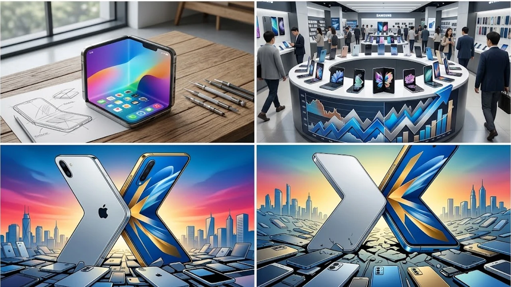

The smartphone landscape faces a critical inflection point as the **iPhone Duo** heads toward an October release, challenging the flexible display market that Android flagships have spent years standardizing. Apple’s entry forces a massive reassessment of hardware durability, software workflows, and component supply dynamics across the globe. For mobile enthusiasts and enterprise users tracking the shift toward flexible computing, this launch signals the end of the experimental era for dual-screen devices.

## Apple's Strategic Entry into the Foldable Arena

### The Timing Behind the October Launch
Apple intentionally waited out early iterations of folding glass, prioritizing panel resilience and structural stability over early market presence. Launching in October places the device squarely in front of holiday buyers while carving out dedicated breathing room away from standard annual handset cycles. This deliberate gap commands undivided consumer focus and targeted retail traffic.

### Redefining the Productivity Paradigm with iOS
Hardware alone cannot resolve the clunky user experience that has historically hindered foldable adoption. A dedicated dual-pane interface within iOS reimagines side-by-side app interactions as fluid workspaces rather than awkward split-screen compromises:

- **Dynamic Split Canvas**: Core apps stretch across the central crease, pulling up contextual drag-and-drop toolbars automatically.
- **Instant Background Continuity**: In-flight tasks on the exterior glass mirror to the expansive inner canvas the second the chassis opens.
- **Adaptive Touch Controls**: The lower pane pivots into a dedicated input console, timeline scrubber, or virtual deck during intensive editing tasks.

### Material Engineering and the Zero-Crease Objective
Visible display trenches remain the primary deterrent for hesitant consumers. Apple tackles panel fatigue by coupling ultra-thin flexible glass with a multi-axis fluid hinge:

> "Mainstream users reject folding screens when optical distortion ruins the center of the display. Dispersing hinge tension across multiple pivot points solves the visual problem that has plagued the category since day one."

By utilizing four discrete pivot bearings constructed from liquid titanium, the assembly flattens the display seam without placing direct shear stress on the organic light-emitting layers.

## Market Shakeup and the Competitive Pressure on Samsung

### The Disruption of Established Hegemony
Samsung spent seven hardware generations fine-tuning book-style foldables to dominate market share. The arrival of an iOS alternative hits that profit fortress directly, prompting swift defensive revisions in roadmaps, aggressive customer retention offers, and updated trade-in values. Android makers now must defend their hardware margins against Apple's deeply entrenched user ecosystem.

### Supply Chain Irony: The Korean Display Advantage
A striking operational tension defines this rivalry: Samsung Display manufactures the primary flexible OLED panels for the iPhone Duo.

| Metric | Samsung Galaxy Lineup | Apple iPhone Duo |
| :--- | :--- | :--- |
| **Panel Supplier** | Samsung Display Co. | Samsung Display / LG Display Co. |
| **Hinge Mechanism** | Armor Aluminum Teardrop | Multi-Axis Liquid Titanium Array |
| **Software Core** | One UI Multi-Window | Custom Dual-Pane iOS |
| **Primary Target** | Prosumers & Hardware Enthusiasts | Enterprise Fleets & Creative Professionals |

Even as Samsung Electronics guards its retail territory, its display component division secures massive factory orders from Cupertino. This complex cross-border supply chain mirrors broader semiconductor shifts examined in [US Secondary Tariffs 2026: 3 Tech Supply Chain Impacts](/posts/us-trends/us-secondary-tariffs-2026-tech-supply-chain-impacts/).

### Price Adjustments and Consumer Alternatives
Escalating hardware competition triggers aggressive promotional credits across major wireless networks. To protect sheer unit volume, long-standing players are expanding their lineups with accessible mid-tier foldables to capture budget-sensitive buyers before premium shoppers lock into iOS.

## Engineering and Silicon Integration

### Thermal Management in Dual-Chassis Hardware
Splitting computing silicon and battery packs between two distinct physical leaves creates persistent thermal obstacles. To eliminate localized throttling, Apple links twin vapor chambers via flexible graphite conduits spanning the hinge spine. This channel directs heat away from high-draw components without stressing moving parts.

### On-Device Intelligence Processing
A sprawling multi-window workspace demands instantaneous compute power for parallel tasks. Dedicated neural engines run document summarization, voice isolation, and live language translation entirely on the device, avoiding cloud latency. This local inference approach directly aligns with broader consumer shifts covered in [Why IFA 2026 Shifted to On-Device AI: 3 Key Takeaways](/posts/us-trends/why-ifa-2026-shifted-on-device-smart-home-ai/).

### Battery Architecture and Longevity
Lighting dual high-refresh panels places severe strain on runtimes. Engineers mitigated this battery hurdle with an asymmetrical dual-cell layout:

- **Primary Chassis Cell**: Delivers steady voltage directly to the compute package and cellular radios.
- **Secondary Display Cell**: Balances device ergonomics while providing dedicated current for panel backlights.
- **Dynamic Power Gating**: Shuts off pixel clusters on passive application panels during multi-window operation.

## Ecosystem Consequences and Practical Buyer Guidance

### The Developer Gold Rush for Dual-Pane Interfaces
Application makers face immediate pressure to ditch static aspect ratios. Responsive container systems are quickly replacing rigid grids as enterprise suites roll out split-screen docks and contextual floating menus to capture early adopters.

### Durability, Repairability, and Total Cost of Ownership
Hefty initial price tags mean build quality determines whether foldables stay viable long-term. Replacing flexible inner panels remains a costly endeavor, which makes rigorous hardware validation crucial:

- **Sealed Fluid Gaskets**: Keep fine dust and grit out of delicate hinge teeth.
- **Ceramic Composite Coating**: Shields the polymer cap layer against fingernail divots and stylus gouges.
- **Stress-Tested Longevity**: Mechanical joints endure over 400,000 fold cycles under high-humidity chamber testing.

For users planning to protect their hardware investment during daily travel, choosing dependable power accessories and sturdy everyday gear remains essential:
[관련상품 쿠팡에서 보기](https://www.coupang.com/np/search?q=%ED%95%B4%EC%99%B8%EC%9D%B8%EA%B8%B0%EC%83%81%ED%92%88&sourceType=affiliate&trackingCode=AF8691300)

The arrival of a dual-screen device from Cupertino marks the end of fragile prototypes and ushers in an era of mature, enterprise-ready flexible computing.

#iPhoneDuo #Apple2026 #FoldablePhone #TechTrends #Smartphones #MobileInnovation #NextGenHardware