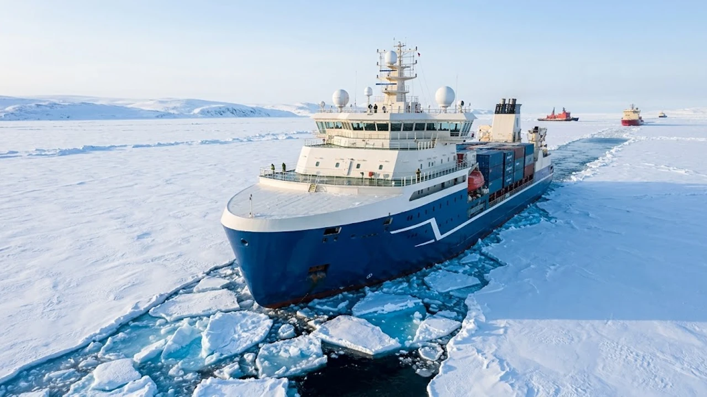

Surging chokepoint vulnerabilities across southern maritime corridors have pushed **Arctic shipping 2026** into the operational mainstream of international commerce. Modern polar maritime logistics and commercial convoys traversing the Northern Sea Route (NSR) are fundamentally redrawing the global freight map, slashing voyage durations between East Asian manufacturing hubs and European consumer markets. As industrial shippers seek resilient alternatives to volatile southern canals, the Arctic passage provides an unprecedented alternative for high-value containerized trade.

## The 2026 Arctic Transit Breakthrough

### Northern Sea Route Operational Milestones
Commercial transits through the Arctic basin achieved record volume during the current navigation season. High-capacity container vessels operating under specialized escort protocols have demonstrated that the Northern Sea Route can sustain regularized container liner schedules rather than sporadic bulk deliveries. Escort coordination led by nuclear-powered icebreaker fleets has kept Siberian sea channels navigable for extended sailing windows, allowing commercial operators to schedule fixed-day departures from East Asian origin terminals.

The operational leap relies on real-time satellite telemetry and high-resolution synthetic aperture radar (SAR) ice mapping. These orbital tracking systems provide commercial captains with sub-meter ice thickness profiles and drift vectors, mitigating the historical uncertainties of polar navigation. 

> "Commercial maritime logistics no longer treats polar transit as an exploratory gamble, but as an active, calculated risk hedge against chronic congestion in equatorial straits."

### Transit Time Comparison: Arctic vs. Suez and Cape Routes
Sailing metrics between major East Asian ports and Rotterdam show marked efficiency gains when routing through the Arctic corridor:

* **Arctic Northern Sea Route:** Voyage distance shrinks to approximately 7,300 nautical miles, requiring 18 to 21 days at an average cruising speed of 14 to 16 knots.
* **Suez Canal Route:** Measures roughly 11,500 nautical miles, requiring 32 to 36 days under standard navigation conditions without canal backlogs.
* **Cape of Good Hope Route:** Stretches across 14,500 nautical miles, consuming 40 to 46 days of open-ocean transit and significantly higher bunker consumption.

This 40% to 48% reduction in sailing duration allows liner operators to save up to 15 days per one-way voyage. Shorter turnarounds reduce capital lockup in transit inventory and shield shippers from geopolitical bottlenecks, such as recurring regional friction highlighted in the [U.S.–Iran Standoff & The Strait of Hormuz: August 2026 Global Flashpoints](/posts/us-trends/us-trends-issue-20260802/).

### Ice-Class ARC7 Fleet Expansion and Navigation Safety
The physical backbone of this logistical shift is the deployment of purpose-built ARC7 ice-class container carriers and LNG tankers. These specialized hulls feature reinforced structural steel plating up to 50 millimeters thick, double-acting bow profiles, and podded azimuthing propulsion units capable of 360-degree rotation. 

ARC7 vessels independently crush level ice up to 2.1 meters thick when sailing astern, minimizing dependency on dedicated icebreaker escorts in moderate pack conditions. Advanced thermal anti-icing systems integrated along topside decks prevent ballast freezing and superstructure icing, ensuring stability and crew safety in sub-zero operational environments.

## Economic and Environmental Realities of Polar Freight

### Fuel Efficiency Gains and Carbon Emission Trade-Offs
Shorter voyage distances directly reduce gross heavy fuel oil (HFO) or LNG consumption per container slot:

* **Voyage Fuel Burn Reduction:** Direct polar transit trims total bunker consumption by 30% to 35% compared to round-the-Cape voyages.
* **Scope 1 Emission Drops:** Net carbon dioxide ($CO_2$) emissions per TEU drop proportionately with reduced engine runtime over identical origin-destination pairs.
* **Black Carbon Deposition Risks:** Engine exhausts emitting particulate soot in polar latitudes accelerate localized surface albedo loss when deposits settle on snow and ice fields.
* **Emission Abatement Requirements:** International maritime rules enforce strict low-sulfur distillates, closed-loop exhaust gas scrubbers, and dual-fuel methane engines across Arctic corridors.

### High Insurance Premiums and Extreme Weather Risk Factors
Despite massive distance savings, polar voyages carry distinct financial barriers that alter commercial bottom-line calculations:

* **Hull and Machinery (H&M) Surcharges:** Underwriters levy substantial risk premiums on polar transits, reflecting salvage costs and sparse repair dockyard infrastructure along the Siberian coastline.
* **Protection and Indemnity (P&I) Clauses:** Strict environmental liability cover requires higher deductible reserves for potential fuel spills in icy waters.
* **Specialized Pilotage Tariffs:** Mandatory ice pilotage fees and state icebreaker escort tariffs offset a portion of bunker fuel savings.
* **Rapid-Onset Meteorological Hazards:** Polar lows, freezing fog, and shifting pack ice compress operational margins, requiring flexible voyage scheduling.

### Seasonal Viability vs. Year-Round Scheduled Freight
The commercial Arctic calendar remains divided into distinct operational phases. Unescorted and light-escort navigation operates primarily during the summer-autumn window between July and November, when seasonal melt opens reliable channels. 

During the winter-spring months (December to June), severe multi-year pack ice restricts access exclusively to heavy ARC7 icebreakers and convoy formations. Consequently, global supply chain planners utilize Arctic transit as a seasonal surge corridor, shifting back to conventional southern routes during deep winter to maintain predictable inventory flows.

## Asian Maritime Dominance and Shipbuilder Demand

### South Korean Shipyards Leading High-Spec Icebreaker Construction
Shipbuilders in South Korea—specifically HD Hyundai Heavy Industries, Hanwha Ocean, and Samsung Heavy Industries—hold the world's most dominant technological portfolio for polar-grade commercial vessels. Constructing ARC7-rated carriers demands specialized low-temperature carbon-manganese steel fabrication, high-precision membrane containment welding, and cryogenic engineering.

These shipyards have secured substantial long-term orders for ice-breaking LNG carriers and dual-fuel polar container ships. Their proprietary hull designs, optimized through cryogenic tank testing and simulated polar hydrodynamics, set global manufacturing benchmarks that competing regional shipyards struggle to match under strict delivery timelines.

### Busan and Regional Ports Positioning as Key Arctic Hubs
The Port of Busan has begun positioning its terminals as the primary northeastern transshipment nexus for Arctic-bound freight:

* **Feeder Aggregation:** Cargo originating from Japan, Northern China, and Southeast Asia consolidates at Busan before loading onto heavy ice-class trunk vessels.
* **Bunkering Infrastructure:** Expanded LNG and green methanol bunkering facilities cater directly to polar-rated container vessels preparing for high-latitude transit.
* **Customs Free-Trade Staging:** Dedicated bonded logistics zones allow fast-track processing for temperature-sensitive cargo and advanced manufacturing components facing tight transit windows.

This strategic positioning reinforces Asian port competitiveness amid broader trade reorganizations driven by [US Secondary Tariffs 2026: 3 Tech Supply Chain Impacts](/posts/us-trends/us-secondary-tariffs-2026-tech-supply-chain-impacts/).

### Trade Route Diversification for East Asian Exporters
For high-tech manufacturers, battery producers, and automotive exporters in South Korea and East Asia, the Arctic passage provides strategic route redundancy. Relying exclusively on southern chokepoints—such as the Malacca Strait, Bab el-Mandeb, and the Suez Canal—exposes supply chains to single-point disruption risks. 

Deploying seasonal Arctic sailings guarantees that time-critical components, industrial machinery, and premium retail products reach European distribution centers without exposure to equatorial geopolitical friction or canal toll spikes.

## Future Outlook and Strategic Supply Chain Playbook

### Geopolitical Governance and Polar Code Regulations
Navigation through high-latitude waters operates under the International Maritime Organization (IMO) International Code for Ships Operating in Polar Waters (Polar Code). Compliance requires:

* **Mandatory Polar Water Operational Manuals (PWOM):** Comprehensive operational playbooks detailing ice-structure interaction, cold-weather firefighting, and emergency survival gear for all crew members.
* **Zero-Discharge Environmental Standards:** Strict bans on the discharge of oil, noxious liquid substances, and untreated sewage into Arctic waters.
* **Exclusive Economic Zone (EEZ) Navigation Rights:** Complex jurisdictional rules governing international passage rights through coastal Arctic waters and territorial straits.

### Integrating Arctic Routes into Multimodal Supply Chains
Logistics directors must design dynamic routing algorithms that integrate polar sailing windows into broader enterprise resource planning (ERP) systems:

* **Dual-Track Logistics Scheduling:** Route baseline inventory via standard year-round lanes while shifting peak seasonal shipments to Arctic sailings between July and October.
* **Buffer Management:** Maintain safety stock reserves near European rail terminals to absorb occasional icebreaker transit delays caused by severe weather.
* **Cold-Chain Optimization:** Take operational advantage of ambient cold polar temperatures to reduce energy consumption in refrigerated container units (reefers).

### Key Milestones to Watch in Global Freight Logistics
Over the next strategic cycle, three industry milestones will determine whether Arctic shipping scales from a high-efficiency alternative into a dominant pillar of global freight:

* **Commercial Fleet Scale:** The delivery rate of next-generation dual-fuel ARC7 container ships from Asian shipyards into commercial service.
* **Infrastructure Buildout:** Expansion of emergency response bases, deep-water salvage tugs, and automated weather telemetry stations along Arctic coastlines.
* **Insurance Market Normalization:** Potential stabilization of polar underwriting premiums as satellite-guided safe sailing miles accumulate across global carrier fleets.

#ArcticShipping #GlobalLogistics #SupplyChain2026 #MaritimeTrade #NorthernSeaRoute #Shipbuilding #GlobalTrends