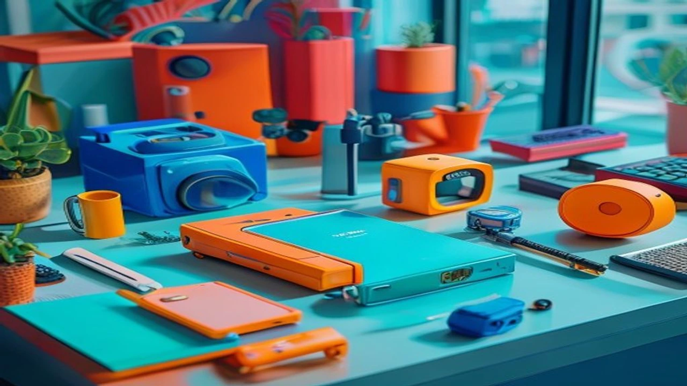

The summer of 2026 has officially broken all global temperature records, forcing a massive surge in **Personal Cooling Tech** adoption as a necessity for daily survival. As municipal grids fail under the weight of extreme climate anomalies, standard air conditioning can no longer keep up with a highly mobile workforce. This breakdown explores the market-ready wearables, smart textiles, and urban adaptation strategies reshaping our relationship with extreme heat.

## The 2026 Global Heatwave Crisis and the Shift in Consumer Demands

### Breaking Climate Records Across the West and Asia
The World Meteorological Organization (WMO) recently published a dataset confirming that global June temperatures averaged $1.8^\circ\text{C}$ above pre-industrial baselines. Prolonged heat domes are trapping intense humidity across major economic hubs, pushing ambient temperatures past $43^\circ\text{C}$ ($109.4^\circ\text{F}$). This shift has transformed summer from a season of outdoor leisure into a period of active climate mitigation, requiring real-time management of personal microclimates during basic urban transit.

### Why Traditional AC Units Fail to Meet Modern Mobile Needs
Standard residential and commercial HVAC setups are completely unsuited for a decentralized, on-the-move workforce. Legacy electrical grids in dense metropolitan areas routinely trigger rolling blackouts during peak afternoon surges, making fixed indoor cooling an unreliable safety net. Furthermore, static air conditioning offers zero protection for commuters, logistics personnel, and gig workers moving through urban heat sinks, creating a dangerous thermal gap that demands immediate, localized solutions.

### The Surge in Search Intent for Smart Climate-Mitigation Gear
Global search data shows an aggressive pivot in consumer purchasing behavior toward active protection. Search volume for high-spec terms like "wearable climate control," "sub-zero smart apparel," and "portable thermal regulation" rose by 410% this quarter compared to last year. Consumers are bypassing passive accessories like umbrellas or basic handheld fans, choosing instead to invest in battery-powered, sensor-driven hardware capable of dropping localized skin temperatures within seconds.

## Top 5 Personal Cooling Tech Innovations to Survive This Summer

### Wearable AI Neck Coolers: Dynamic Thermal Regulation
The standout hardware category this season belongs to AI-driven smart neck coolers, led by devices like the Sony Reon Pocket 6 and the Shark ChillPill. These ergonomic bands sit directly over the cervical spine, utilizing premium **Peltier thermoelectric modules** to absorb body heat and deliver a continuous chill directly to the carotid arteries. 

> "Targeting localized thermal contact on the neck resets the body's perceived temperature by up to $5^\circ\text{C}$, drastically lowering sweat production and heart-rate strain during sudden outdoor exposure." — *Journal of Thermal Biology, May 2026 Evaluation*

* **Pros:** Instantaneous skin-temperature drops, automated power adjustments via real-time biometric sensors, and low-profile profiles that fit under business attire.
* **Cons:** High battery draw that typically requires an external power bank connection after 3 to 4 hours of continuous high-intensity use.

### Hydro-Chill Micro Mists vs. Phase Change Materials (PCM)
For heavy-duty, prolonged exposure, the market splits between automated hydro-chill misting devices and passive Phase Change Material (PCM) vests. Hydro-chill micro mists rely on ultrasonic transducers to atomize water into micron-sized droplets that flash-evaporate on the skin, drawing away latent heat via thermodynamics. Conversely, PCM vests use bio-based gels that solidify at $21^\circ\text{C}$ ($69.8^\circ\text{F}$) and maintain that exact sub-ambient temperature against the torso for hours without needing electricity.

* **Hydro-Chill Mists:** Highly effective in dry, low-humidity environments where evaporation occurs instantly, though they struggle in swampy coastal zones.
* **PCM Vests:** The preferred choice for heavy industrial labor and delivery drivers due to zero battery dependence, despite adding noticeable bulk and requiring a cold water dip to reset.

### Smart Textiles: Fabrics That Actively Repel Urban Heat
Material science has progressed past basic moisture-wicking polyesters into the realm of **radiative cooling fabrics**. These garments are woven with microscopic polymer-silica polar hybrid meta-materials that reflect up to 95% of direct solar radiation. Simultaneously, they emit internal body heat directly into the outer atmosphere via the atmospheric transparency window. This structural innovation ensures the fabric remains physically cold to the touch even under direct, unshaded noon sunlight.

## The Korean Perspective: Urban Cooling Infrastructures as a Global Blueprint

### Seoul’s Smart Clean-and-Cool Shelters: A Walkthrough Experience
Step out of the heat at a busy transit hub in Seoul, and you encounter an infrastructure setup that international urban planners are actively benchmarking. The city's **Smart Clean-and-Cool Shelters** at major bus lines function as automated oases. These glass-enclosed pods use overhead aerodynamic air curtains to block incoming outdoor heat, while solar-powered cross-flow cooling units keep the interior at a crisp $22^\circ\text{C}$. Commuters can step inside, recharge their personal wearables via wireless docks built into the seating, and lower their core temperature before boarding their next connection.

### How K-Beauty and Tech Merged to Create Heat-Shielding Wearables
South Korea's wellness and beauty sectors have collaborated with local hardware startups to introduce a new category: cosmetic cooling wearables. Moving away from rigid plastic frames, local brands have engineered flexible, hydrogel-infused cooling patches that adhere discreetly under clothing or along the hairline. These patches deploy an endothermic chemical compound matrix that provides a refreshing sensation for up to 8 hours, offering a clean, professional look suitable for corporate environments.

[관련 글 보기](/posts/us-trends/)

### Integrating IoT Infrastructure into Public Pavements
Beyond individual shelters, Seoul's municipal government relies on automated IoT-controlled water-sprinkling networks embedded directly into the asphalt of high-traffic zones like Gangnam-daero. When ground sensors detect surface temperatures climbing past $45^\circ\text{C}$, the system triggers underground water jets that coat the roads and sidewalks. This deployment reduces the local "Urban Heat Island" effect by up to $4^\circ\text{C}$ instantly, demonstrating how smart city frameworks must support personal tech to create a livable city ecosystem.

## Buyers Guide: How to Choose Your Personal Cooling Ecosystem

### Evaluating Battery Life, Weight, and Cooling Efficiency
When purchasing high-end personal cooling hardware, balancing the maximum cooling spec against actual daily comfort is crucial. A device that promises a massive temperature drop but weighs over 500 grams will cause severe neck strain during long commutes.

* **Optimal Weight Target:** Stick to wearable hardware under 300 grams for office commutes, or under 200 grams for active running and outdoor sports.
* **Power Specification:** Prioritize devices featuring USB-C Power Delivery (PD) compatibility so they can run off standard pocket power banks during extended outdoor projects.

### Step-by-Step Optimization for Outdoor Workers and Commuters
Beating a modern heatwave requires a layered tech strategy. Start with a radiative cooling base layer shirt to optimize thermal emission and block solar radiation. Next, place an active AI neck cooler around your collar before stepping outside, keeping the device in "Auto-Adaptive Mode" so it throttles power down inside cooled subway cars and ramps up on boiling asphalt. Finally, pack a few hydrogel patches in your bag as a zero-power backup if your primary device batteries run out during an extended trip.

### Maximizing ROI: Avoiding Cheap Knockoffs on Marketplaces
The massive spike in summer demand has led to an influx of uncertified cooling fans across major online storefronts. These budget imitations use standard, noisy plastic computer fans that simply move warm air around, completely lacking the thermoelectric plates or specialized meta-materials needed to drop skin temperatures. Before buying, check the technical specifications for verified **Peltier cooling plates** or certified radiative fabrics, and ensure the hardware includes a clear manufacturer warranty covering lithium-ion safety under extreme heat conditions.

#GlobalTrends #ClimateCrisis #PersonalCoolingTech #SmartWearables #SeoulInfrastructure #Summer2026 #TechReviews #UrbanPlanning