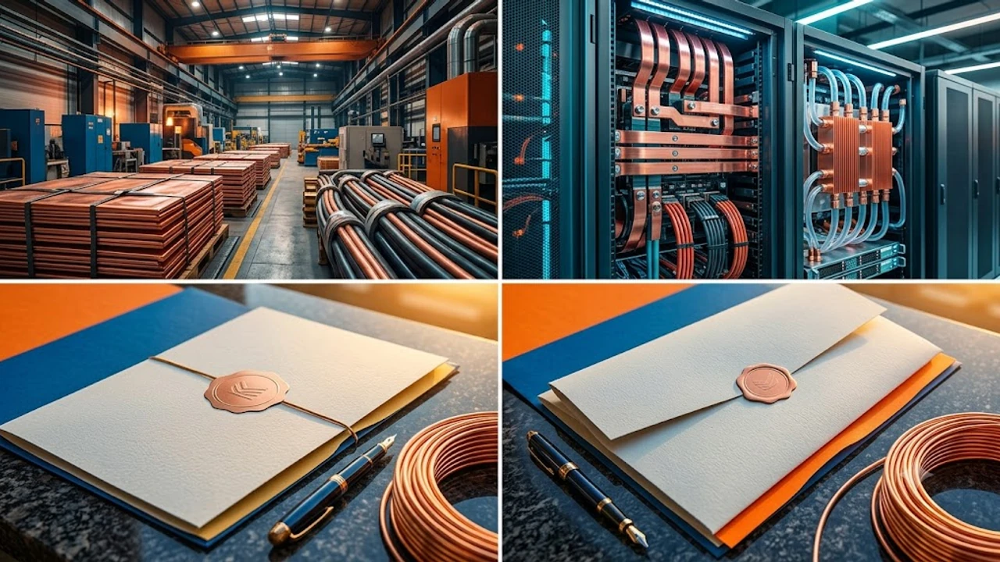

The accelerated buildout of hyperscale compute campuses has run headfirst into a hard physical constraint: the **Copper Deficit 2026**. While billions flowed into next-gen silicon accelerators and multi-megawatt training clusters, the upstream metals supply chain stalled. Surging demand for refined red metal is colliding with structural mine exhaustion, forcing cloud operators and utility planners into a fierce procurement bottleneck for the conductive backbone of modern electrification.

## The Hidden Physical Bottleneck Behind the 2026 AI Capex Boom

### Why Silicon Ambitions Are Crashing into Raw Commodity Realities
For two years, capital markets obsessed over GPU wafer allocations, high-bandwidth memory packaging, and power-per-watt efficiency. Yet compute clusters require massive physical conduits, substation step-down transformers, and heavy-duty busbars before a single server powers on. While software iteration cycles take weeks, opening a greenfield copper mine takes over a decade, creating a structural mismatch between digital demand and raw extraction.

### Inside the 250,000-Ton Refined Copper Supply Gap
Physical metal stockpiles across London, New York, and Shanghai bonded warehouses plummeted to razor-thin inventory levels this quarter. Commodity analysts project an outright **250,000 metric ton** deficit of refined cathode for 2026. Treatment and refining charges (TC/RCs) plunged toward zero, signaling that global smelters cannot secure sufficient raw concentrate, driving spot benchmark prices well above $6.80 per pound.

> "Compute scales effortlessly on paper, but electrical delivery remains governed by metallurgy. You cannot deploy gigawatt clusters without metric tons of pure conductive copper anchoring the floor."

### Hyperscaler Infrastructure Outlays vs. Physical Grid Limitations
The push to construct multi-gigawatt computing zones has exposed deep regional grid fragility. Regional transmission operators now quote 36- to 48-month lead times for major substation interconnections, primarily driven by backorders for high-voltage copper windings and step-up transformer components. Capex budgets cannot outrun the physical availability of grid hardware.

## Anatomy of the Crunch: Where Data Centers Consume Copper

### High-Voltage Interconnects, Substations, and Grid Redundancy
A standard 100-megawatt compute facility consumes thousands of tons of high-conductivity copper across its distribution architecture:

* **Utility Step-Down Substations:** Heavy coils inside 500kV-to-34.5kV step-down transformers rely entirely on pure copper wire to manage extreme current densities without thermal breakdown.
* **Solid Busway Systems:** Continuous overhead copper busbars deliver clean direct power to thousands of rack slots, minimizing the line-drop voltage loss seen in cheaper alternatives.
* **Underground Distribution Feeders:** Armored, thick-gauge underground conduit runs bridge substations directly to backup generator arrays and uninterruptible power supply (UPS) banks.

### Thermal Management Systems and Rack-Level Power Architecture
High-density compute racks exceeding 100kW per footprint make conventional air handling obsolete. Direct-to-chip cold plates, micro-channel heat sinks, and coolant distribution manifolds rely almost exclusively on high-purity copper due to its 400 W/m·K thermal conductivity. Moving from ambient airflow to closed-loop liquid systems triples the mass of red metal embedded inside each server cabinet.

### High-Purity Wiring Demands Across Next-Gen AI Server Clusters
Within high-density clusters, passive direct-attach copper (DAC) cabling handles intra-rack and top-of-rack switching. While optical transceivers take over long-distance hall-to-hall connectivity, short-run twinaxial copper cables dominate rack interconnects because they consume zero signal-processing power and avoid the heat penalty of active laser transceivers.

## Global Supply Disruption and the Asian Supply Chain Angle

### Legacy Mine Grade Depletion and Extended Permitting Lead Times
Primary open-pit deposits across Chile and Peru face relentless ore-grade degradation, forcing mining conglomerates to process double the tonnage of raw rock compared to a decade ago just to maintain flat refined output. Complex environmental permitting and regional water scarcity prevent rapid capacity additions.

Broad macro trade frictions exacerbate regional price premiums. Dynamics detailed in [US Secondary Tariffs 2026: 3 Tech Supply Chain Impacts](/posts/us-trends/us-secondary-tariffs-2026-tech-supply-chain-impacts/) illustrate how critical mineral tariffs and cross-border trade friction redirect global commodity flows away from key processing hubs.

### South Korean Cable and Grid Giants Stepping into the Breach
Faced with domestic western supply crunches, hyperscalers are turning to high-end Asian industrial manufacturers. South Korean infrastructure powerhouses like LS Cable & System and Taihan Cable have captured massive international market share, delivering ultra-high-voltage direct current (HVDC) systems and advanced busduct modules that maximize power density while cutting down on scrap loss during fabrication.

### Cross-Market Spillover: Electric Vehicles and Renewable Competition
Data center developers are bidding directly against broader electrification infrastructure:

* **Battery Electric Mobility:** Dedicated EV platforms utilize roughly 80kg of copper wiring and battery foils per vehicle.
* **Offshore Wind Arrays:** Subsea inter-array and export cabling networks require heavy copper cross-sections to withstand harsh marine operational environments.
* **Utility-Scale Solar:** Utility inverter stations demand extensive copper grounding and collector networks across square miles of solar tracking fields.

## Strategic Playbook: How Tech Giants and Investors Navigate the Shortage

### Long-Term Power Offtake and Direct Smelter Agreements
Tech enterprises are bypassing intermediaries to lock down physical supplies. Cloud infrastructure operators are negotiating forward volume commitments directly with copper refiners and funding dedicated e-waste recycling lines to harvest pure cathode from legacy facilities.

### Material Substitution and Advanced High-Efficiency Alloys
Engineering groups are testing pragmatic substitutions across non-critical electrical pathways:

* **Aluminum Feeder Cables:** Replacing select medium-voltage feeder links with larger cross-section aluminum, accepting larger raceway footprints to alleviate copper procurement backlogs.
* **Engineered Composite Shielding:** Deploying conductive polymer shielding on secondary data lines to conserve copper for high-current applications.
* **Higher Voltage Facility Distribution:** Transitioning internal power distribution to 800V DC architectures to reduce current requirements and slim down overall conductor diameters.

### Key Indicators and Commodity Trends to Monitor for Q4 2026
Tracking the severity of this constraint requires watching upstream smelter terms, warehouse cancellation warrants, and utility queue backlogs. As compute density ramps up, physical materials availability will dictate project delivery schedules more than chip fab yield rates.

Securing clean power distribution and surge protection remains essential across both industrial campuses and personal high-performance setups.

[고성능 멀티탭 및 서지보호기 쿠팡에서 보기](https://www.coupang.com/np/search?q=%EA%B3%A0%EC%84%B1%EB%8A%A5%20%EC%84%9C%EC%A7%80%EB%B3%B4%ED%98%B8%EA%B8%B0%20%EB%A9%80%ED%8B%B0%ED%83%AD&sourceType=affiliate&trackingCode=AF8691300)

#GlobalTrends #CopperDeficit #DataCenters #ArtificialIntelligence #Semiconductors #EnergyGrid #Infrastructure #2026Trends