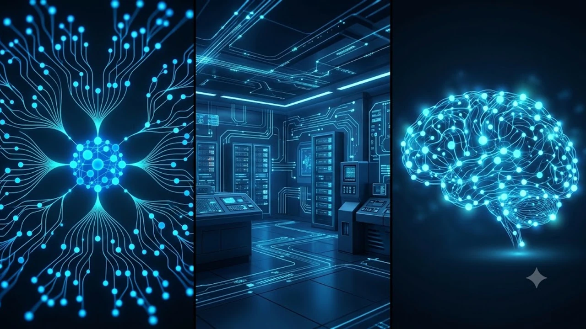

Recent announcements regarding **Google DeepMind restructuring 2026** signal a massive realignment in how big tech approaches general intelligence. As competition intensifies across enterprise cloud platforms and multi-agent systems, Google has opted to streamline its core research unit to accelerate breakthrough capabilities. This unexpected operational shift redefines the timeline for upcoming frontier models and changes how global tech hubs interact with Google's cloud ecosystem.


## What Triggered the Google DeepMind Leadership Restructuring in August 2026?

### Demis Hassabis Steps Into Chairman Role to Focus Exclusively on AGI

The transition of Nobel laureate Demis Hassabis from day-to-day administrative oversight to Chief Scientist and Chairman marks a structural evolution within DeepMind. By relieving Hassabis of routine operational duties, Google aims to direct his primary focus toward foundational Artificial General Intelligence research. This organizational maneuver reflects a deliberate effort to separate long-term scientific discovery from immediate commercial execution, enabling top research minds to solve core reasoning bottlenecks without corporate distractions.

### Centralizing Operations in Mountain View Ahead of Gemini 3.5 Pro

Operational authority is consolidating rapidly around Mountain View engineering leads to tighten product release cycles. As the scheduled rollout for Gemini 3.5 Pro approaches, Google is removing management layers between research laboratories and product deployment teams. This centralization reduces technical debt across API pipelines and ensures that experimental model architectures transition directly into scalable production code for global developers.

### How the AI Race with OpenAI and Anthropic Forced Google’s Hand

Escalating pressure from Silicon Valley rivals made the legacy structure untenable. Competitors have demonstrated rapid deployment velocities by maintaining lean, product-focused research pipelines. Google’s decision to consolidate DeepMind addresses internal friction points that previously delayed model deployment, ensuring faster response times to competitive updates in multimodal reasoning and autonomous agent capabilities.

## Comparing Google DeepMind’s New Structure vs. Silicon Valley Competitors



### Google DeepMind vs. OpenAI: Research Autonomy vs. Productization Velocity

The contrast between Google DeepMind and OpenAI highlights two distinct philosophies in frontier AI development. While OpenAI integrates product engineering directly into research sprints, Google previously maintained a clear division between academic research and commercial software. The updated structure bridges this gap without completely abandoning DeepMind's academic roots.

* **Research Autonomy:** DeepMind retains dedicated units focused purely on biological modeling and quantum compute applications.
* **Product Alignment:** Engineering sub-teams now report directly to cloud infrastructure leads to speed up deployment.
* **Capital Efficiency:** Resource allocation now favors projects with clear utility in enterprise workflows.

### Open-Weight Threats: How Alibaba’s Qwen 3.8-Max Influenced the Shift

The global market landscape has shifted due to aggressive open-weight releases from East Asian competitors. Models such as Alibaba’s Qwen 3.8-Max have closed the gap in coding benchmarks and automated orchestration, putting pressure on proprietary cloud providers. Google’s structural shift is designed to ensure its proprietary Gemini offerings maintain a distinct performance edge over open-weight alternatives, particularly in enterprise-grade reliability and complex reasoning tasks. Understanding these shifts is part of a broader industry evolution detailed in our analysis of [2026 Physical AI Guide: Why Cloud 3.0 Changes Tech](/posts/us-trends/2026-physical-ai-guide-cloud-3-0-tech-trends/).

### Key Pros and Cons of Streamlining AI Engineering Under Centralized Leadership

> "Centralization accelerates release cadences, but organizations must carefully manage the trade-off between immediate product goals and long-term scientific breakthroughs."

* **Advantages:**
  * Faster API deployment cycles for enterprise clients.
  * Direct alignment between hardware accelerators (TPU infrastructure) and model design.
  * Reduced administrative overhead across international research hubs.
* **Disadvantages:**
  * Potential risk of short-term quarterly goals overshadowing high-risk exploratory research.
  * Cultural friction as research-oriented teams adapt to strict product release schedules.

## Real-World Impact on Korean Tech Ecosystems and Global Developers

### Why South Korean Giants (Naver, Samsung, SK Hynix) Are Watching Closely

Major technology firms in South Korea are analyzing Google’s operational changes to adjust their own AI infrastructure roadmaps. Samsung Electronics and SK Hynix monitor these shifts closely due to the direct relationship between frontier model architectures and High Bandwidth Memory (HBM) requirements. Meanwhile, platform operators like Naver evaluate how changes in Gemini’s API pricing and performance affect their localized services and enterprise search solutions.

### What Enterprise Cloud Architects Need to Prepare for in Gemini Infrastructure

Cloud architects building on Google Cloud Platform (GCP) must anticipate faster deprecation schedules for legacy endpoints as streamlined engineering teams push updates more frequently. Engineering teams should audit their integration pipelines to ensure compatibility with real-time multi-agent frameworks.

| Metric / Focus Area | Legacy DeepMind Pipeline | 2026 Post-Restructure Pipeline |
| :--- | :--- | :--- |
| **Model Release Frequency** | Bi-annual major updates | Iterative monthly rolling updates |
| **Infrastructure Focus** | Academic compute clusters | Unified TPU v6 / Cloud Engine integration |
| **Developer API Support** | Standard REST endpoints | Native multi-agent state management APIs |
| **Research-to-Product Time** | 6 to 12 months | Under 90 days |

### My Hands-On Experience Transitioning Workflows to Gemini's Evolving API Ecosystem

When migrating enterprise automation scripts to the latest Gemini API endpoints, the impact of Google's tighter engineering integration becomes immediately obvious. In early testing, latency during complex structured JSON output generation dropped significantly compared to previous revisions.

```python
# Example: Configuring resilient multi-agent calls using Gemini 2026 SDK
import google.genai as genai

client = genai.Client()

response = client.models.generate_content(
    model='gemini-2.5-flash',
    contents='Analyze enterprise cloud telemetry for anomaly detection.',
    config=dict(
        temperature=0.2,
        system_instruction="Provide structured JSON diagnostics only."
    )
)
print(response.text)