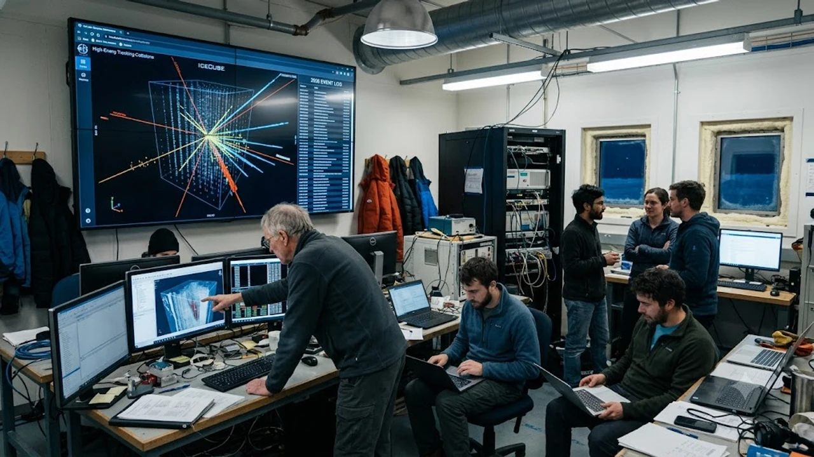

The Royal Swedish Academy of Sciences officially awarded the **2026 Nobel Prize in Physics** to Belgian-American theoretical physicist Francis Halzen for his pioneering leadership of the IceCube Neutrino Observatory. By turning an entire cubic kilometer of pristine Antarctic ice into a cosmic sensor array, Halzen cracked open an entirely new window into the universe, capturing elusive "ghost particles" from the violent edges of deep space. His recognition cements high-energy neutrino astronomy as an indispensable leg of multi-messenger astrophysics alongside traditional optical, radio, and gravitational wave observatories.

## How Francis Halzen Won the 2026 Nobel Prize in Physics

### The 35-Year Journey from Radical Concept to Stockholm
When Francis Halzen first pitched the concept of drilling miles into Antarctic glacial ice to catch subatomic particles in the late 1980s, the broader physics establishment dismissed it as sheer science fiction. Standard particle physics experiments operated within hermetically sealed subterranean tanks filled with ultra-purified water or scintillator fluid. Proposing to melt miles-deep shafts into the coldest plateau on Earth seemed like an operational nightmare.

Halzen, working from the University of Wisconsin–Madison, recognized a relentless mathematical constraint: high-energy astrophysical neutrinos interact so feebly with ordinary matter that logging meaningful detection rates requires an instrumented target mass of at least one gigaton—one cubic kilometer of transparent medium. Excavating and engineering a human-made tank of that scale was physically and financially impossible. Clear glacial ice, compressed under immense pressure over hundreds of thousands of years to expel every microscopic air bubble, stood out as the planet's only viable natural candidate.

### Decisive Contributions to the IceCube Neutrino Observatory
Halzen guided the Antarctic Muon And Neutrino Detector Array (AMANDA) prototype throughout the 1990s before directing the construction of the full-scale IceCube observatory between 2004 and 2010. His primary theoretical contribution centered on calculating the precise optical scattering and absorption coefficients of glacial ice at depths exceeding 1,500 meters, proving that secondary light signals could travel hundreds of meters without distortion.

He unified an international consortium spanning 58 research institutions across 14 nations, securing pivotal support from the U.S. National Science Foundation. Halzen demonstrated that beneath the bubble-laden surface layers, deep polar ice is the most radiatively stable and optically pure solid medium known to science, providing an ideal darkened chamber for sensitive photon detection.

### Recognizing the Detection of Cosmic High-Energy Neutrinos
The Nobel Committee spotlighted Halzen's definitive 2013 breakthrough: the first empirical detection of extraterrestrial high-energy neutrinos originating from beyond our solar system and the Milky Way. Before IceCube, scientists had only recorded neutrinos from Earth's atmosphere, our Sun, and the singular, nearby core-collapse explosion of Supernova 1987A.

IceCube shattered this barrier by capturing petaelectronvolt (PeV) cosmic neutrinos—famously cataloged as "Bert," "Ernie," and "Big Bird"—each carrying millions of times more energy than the particles churned out by CERN's Large Hadron Collider. By delivering verified proof of a diffuse cosmic neutrino flux, Halzen resolved a century-long search for non-thermal particle beams capable of crossing billions of light-years without attenuation.

## Why Antarctic Ice Became the Ultimate Telescope for Ghost Particles

### Turning a Cubic Kilometer of Glacial Ice into an Optical Sensor
Neutrinos carry zero electrical charge and an almost negligible mass, interacting with ordinary matter exclusively through the weak nuclear force and gravity. Trillions of low-energy solar neutrinos slip through our bodies every second without touching a single atom. Because they ignore the electromagnetic spectrum entirely, standard mirrors and satellite dishes cannot see them.

IceCube circumvents this invisibility through sheer volumetric scale. The facility instruments an entire cubic kilometer of Antarctic ice, suspended between 1,450 meters and 2,450 meters below the surface. A grid of 5,160 Digital Optical Modules (DOMs)—thick borosilicate glass spheres containing high-gain photomultiplier tubes and nanosecond-precision digital electronics—hangs across 86 vertical boreholes. When a cosmic neutrino directly scores a head-on collision with a water nucleus in the crystal lattice, it creates a cascade of relativistic leptons: muons, electrons, or taus.

### The Physics of Cherenkov Radiation in Sub-Zero Darkness
As these daughter particles streak through the ice, their velocity exceeds the local phase velocity of light within that solid medium ($c/n$, where $n \approx 1.31$ for compressed ice). This mismatch ignites a brilliant flash of Cherenkov radiation:

> **Cherenkov Radiation:** A coherent, cone-shaped shockwave of blue and ultraviolet light emitted when a charged relativistic particle travels faster than the speed of light in that specific medium—the electromagnetic twin of a supersonic boom.

The submerged optical modules record the arrival timestamps down to single nanoseconds. By mapping the geometric profile of the light cone—whether a straight line track from a muon or an expanding spherical shower from an electron—on-site computing systems calculate the parent neutrino's energy and point of origin with sharp sub-degree precision.