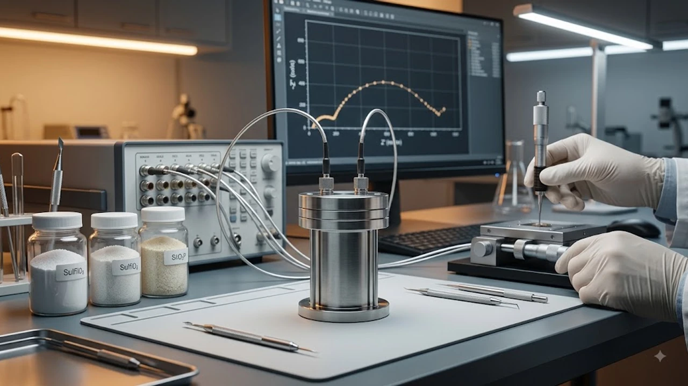

The global race for next-generation electric mobility reached a decisive turning point this week, accelerating the timeline for **solid-state battery commercialization 2026**. Rather than draining capital on standalone gigafactories, sulfide-based electrolyte developers are restructuring their business models around specialized material synthesis and strategic joint ventures. This pragmatic pivot bridges advanced chemical intellectual property directly with Tier-1 battery production lines, fundamentally altering how automakers approach next-generation energy storage.

## Strategic Pivot to Commercial Electrolyte Supply

### Abandoning In-House Cell Fabrication for Material Specialization
At the J.P. Morgan Automotive Conference on August 13, 2026, leading battery innovators signaled an official departure from trying to out-build established battery manufacturing giants. Solid Power confirmed that its primary commercial engine is transitioning from subsidized joint research to pure commercial electrolyte supply.

Instead of burning hundreds of millions of dollars to build vehicle pack assembly lines, pure-play battery developers are adopting an asset-light posture. Supplying high-purity argyrodite sulfide electrolyte powder directly to established cell manufacturers removes catastrophic capital risk while securing immediate off-take channels.

### Revenue Mix Realignment and Capital Discipline
Early-stage battery firms historically relied on sporadic joint-development milestones, government research subsidies, and speculative intellectual property licensing. Over the next 12 to 24 months, financial sheets are pivoting toward physical material shipments.

> "Collaboration revenue is tapering off by design, allowing commercial material deliveries to carry earnings as pilot lines qualify for automotive-scale throughput." — *J.P. Morgan Automotive Conference Presentation (August 2026)*

Backstopped by **$400 million in cash reserves** and continuous-manufacturing grants from the U.S. Department of Energy, pioneering material producers are directing their capital expenditure into slashing the unit cost per kilogram.

### Continuous-Flow Wet Chemistry Over Batch Processing
Scalability has long served as the ultimate bottleneck for sulfide-based solid electrolytes. Manufacturers are discarding sluggish batch processing methods in favor of high-throughput continuous-flow wet chemistry. This engineering transition yields critical industrial advantages:
- **Tolerant Ambient Boundaries:** Significantly loosens dry-room humidity constraints during intermediate production stages.
- **Tighter Process Consistency:** Sharpens Gage R&R tolerances to meet automotive defect limits.
- **Expedited OEM Audits:** Smooths compliance across ISO 9001 Stage 1 and Stage 2 certification benchmarks.

## The South Korean Industrial Nexus

### Strategic Alliances with SK On and Samsung SDI
South Korea has solidified its position as the primary proving ground for scalable solid-state chemistry. Rather than operating in geographic silos, international innovators have built continuous validation loops with **SK On** and **Samsung SDI**.

SK On is operating and validating dedicated pilot pouch cell equipment in Daejeon, while Samsung SDI harnesses high-conductivity sulfide compounds to refine its proprietary SolidStack architecture. These partnerships ensure raw electrolyte specifications align seamlessly with automated high-speed calendering lines.

### Scaling Regional Joint Venture Infrastructure
Pilot synthesis lines in North America and Europe cannot support commercial-scale vehicle rollout schedules. Consequently, capital deployment is shifting directly into joint venture production footprints in South Korea.