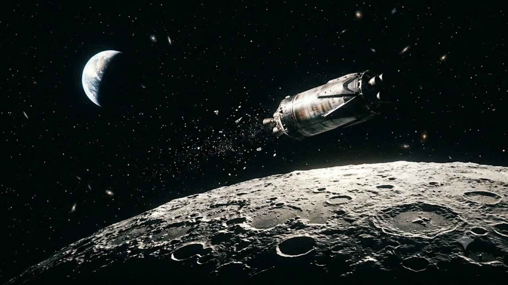

On August 5, 2026, astronomers and space tech observers worldwide turned their attention to the lunar surface as an untracked upper stage slammed into the Moon. The **SpaceX Moon Impact 2026** involved a 3,900-kilogram Falcon 9 stage impacting near the Einstein crater region, giving researchers a rare, unscripted test case for orbital decay models and lunar surface collision dynamics.

## The August 5 Lunar Event: What Occurred and Why It Captured Global Attention

### Understanding the 3,900kg SpaceX Rocket Stage Trajectory

The object designated as 2025-010D drifted through a chaotic Earth-Moon orbit for eighteen months following its initial payload deployment in early 2025. Abandoned in deep cislunar space, the rocket stage became a gravitational pinball, continuously tugged by the competing forces of Earth, the Moon, and the Sun.

By late July 2026, orbital calculations confirmed a direct collision course. Hitting the surface at a hyper-velocity of 2.43 kilometers per second (over 8,700 km/h), the 3,900-kilogram steel-and-composite structure delivered kinetic energy equivalent to roughly three tons of TNT packed into a single localized point.

### Immediate Observations from US and Canadian Observatories

With the impact window predicted for 06:35 UTC on August 5, 2026 (2:35 a.m. EDT), the Moon was ideally positioned over the Western Hemisphere. Observatories across North America coordinated rapid-sequence optical imaging along the limb of the lunar disc.

Because the collision site sits at 19.455° North latitude and 266.406° East longitude, telescope arrays across Canada and the US focused high-frame-rate sensors on the target zone, attempting to capture the initial optical flash against the sunlit lunar terrain.

### How Lunar Surface Collision Physics Provide Rare Research Data

Unlike routine micrometeorite hits, man-made lunar impacts give planetary scientists precise control variables for crater modeling:

* **Known dry mass:** Exactly 3,900 kilograms of aerospace-grade metals and structural alloys.
* **Calculated velocity:** Precisely 2.43 km/s upon entering the lunar gravitational field.
* **Non-volatile structure:** Metallic construction devoid of volatile frozen gases or water ice.

These fixed values allow geophysicists to calibrate seismic models and measure regolith displacement with accuracy that natural impactors rarely permit.

## Technical Evaluation: Debris Plume Dynamics vs. Impact Flash Visibility

### Dissecting the Solar Illumination Challenge on the Lunar Limb

Spotting a kinetic impact against bright, sunlit lunar soil presents a severe optical signal-to-noise problem. Shadows are nonexistent in direct sunlight, meaning thermal flashes fade almost instantly into background solar glare.

> "Capturing an impact flash against direct sunlight demands narrow-band filtering and sub-millisecond exposure speeds," notes orbital tracker Bill Gray. "The thermal bloom vanishes almost instantly, making high-altitude ejecta plumes our primary target for visual confirmation."

### Scientific Instruments Used to Track Debris Cloud Spreads

To extract useful telemetry from the impact, research facilities deployed specialized hardware stacks:

* **High-Speed Photometers:** Recording light intensity fluctuations at microsecond intervals to capture the kinetic flash peak.
* **Infrared Spectrometers:** Tracking thermal decay and gas expansion profiles over the initial 60 seconds post-collision.
* **Wide-Field Lunar Imagers:** Monitoring dust cloud expansion as displaced particles lofted above the local horizon.

Computer simulations indicate that pulverized lunar dust and rock fragments can rise up to 100 kilometers into space before settling back down under weak lunar gravity, leaving a temporary debris cloud visible for several minutes.

### Comparing Artificial Lunar Impacts: Past Missions vs. 2026 Event

Humanity has been crashing hardware into the Moon since the Apollo program, though purposes have shifted from intentional seismic testing to tracking rogue orbital debris.

| Impact Event | Object Type | Mass (kg) | Velocity (km/s) | Target Zone |
| :--- | :--- | :--- | :--- | :--- |
| **Apollo 13 S-IVB (1970)** | Saturn V Upper Stage | 13,925 | 2.58 | Oceanus Procellarum |
| **LCROSS Centaur (2009)** | Atlas V Upper Stage | 2,305 | 2.50 | Cabeus Crater |
| **SpaceX 2025-010D (2026)** | Falcon 9 Upper Stage | 3,900 | 2.43 | Near Einstein Crater |

Unlike LCROSS—which was deliberately crashed into a dark polar crater to search for water ice—this 2026 Falcon 9 impact represents an uncontrolled orbital decay of hardware stranded in deep space.

## Real-World Implications for Orbital Waste and Deep Space Logistics

### Lessons Learned for Long-Term Earth-Moon Orbit Debris Management

The August 5 collision exposes an operational gap in cislunar space management. While Low Earth Orbit (LEO) is subject to strict de-orbit rules, objects left in high-eccentricity transfer orbits float in regulatory dead zones where gravitational drift makes long-term tracking notoriously difficult.

As commercial launch rates surge globally, derelict hardware in cislunar space poses a growing long-term threat. Space agencies are now considering mandatory end-of-life disposal protocols, such as directed heliocentric burns or targeted, intentional lunar disposal maneuvers.

### The Growing Operational Risks for Future Lunar Infrastructure

As international space programs build out permanent lunar surface bases and orbiting stations, unmonitored debris crashes create secondary hazards:

1. **High-Velocity Ejecta Arcs:** Material thrown out by hyper-velocity collisions can travel hundreds of kilometers across the Moon, putting surface hardware at risk.
2. **Abrasive Dust Lofting:** Fine particulate clouds lofted high above the surface can damage delicate optical systems, solar panels, and docking mechanisms on low-orbiting satellites.
3. **Orbital Crowding:** Uncharted junk in cislunar transit lanes increases collision risks for crewed vehicles.

This surge in deep-space operational complexity aligns with broader shifts detailed in the [2026 Physical AI Guide: Why Cloud 3.0 Changes Tech](/posts/us-trends/2026-physical-ai-guide-cloud-3-0-tech-trends/), where physical assets require autonomous, continuous real-time tracking to maintain safety.

### Industry Consensus on Spent Rocket Stage Disposal Standards

Leading launch providers and regulatory bodies are drafting stricter cislunar operations frameworks:

* **Reserved Disposal Fuel:** Requiring 2–3% fuel margins for positive de-orbit burns into heliocentric graveyard orbits.
* **Persistent Tracking Beacons:** Equipping upper stages with low-power transponders that remain active for months after payload separation.
* **Standardized Target Zones:** Implementing automated flight software to steer decommissioned stages away from scientific sites and human assets if a lunar impact is unavoidable.

## Practical Guide for Amateur Astronomers and Space Tech Enthusiasts

### Best Telescopic Equipment for Capturing Lunar Surface Shifts

Amateur astronomers analyzing lunar impact zones need hardware optimized for resolution and rapid frame capture:

* **Aperture:** Minimum 8-inch (200mm) optical tube assembly (SCT or Newtonian reflector).
* **High-FPS Planetary Cameras:** USB3.0 CMOS sensors capable of recording at 100+ frames per second at full resolution.
* **Monochrome Sensors & IR-Pass Filters:** Near-infrared wavelengths slice through atmospheric turbulence, yielding sharper surface detail along the lunar limb.

### Recommended Software and Open-Source Orbital Tracking Tools

Determining the path of deep space objects requires tools capable of handling complex three-body orbital mechanics:

* **Find_Orb:** An open-source orbit determination utility developed by Project Pluto that computes trajectories from optical observation data.
* **NASA JPL Horizons System:** A web-based platform providing high-precision ephemerides for solar system bodies and spacecraft.
* **Stellarium / SkySafari:** Popular sky-mapping software updated with custom TLE (Two-Line Element) orbital sets to track cislunar debris paths in real time.

### How International Collaboration Shapes Modern Space Data Science

Predicting the August 5 collision required continuous data sharing between amateur sky-watchers, academic observatories, and private tracking networks. Once independent observers flagged object 2025-010D's decay, teams across Europe, North America, and Asia pooled observational data to pinpoint the impact footprint down to a narrow timeframe.

This global monitoring effort proves that open-source scientific networks are essential for maintaining safety across deep space as humanity expands its footprint. For broader context on global technical and market developments, explore the [Global Trends Overview](/posts/us-trends/).

#GlobalTrends #SpaceX #Astronomy #MoonImpact2026 #SpaceDebris #LunarScience #Falcon9 #CislunarSpace