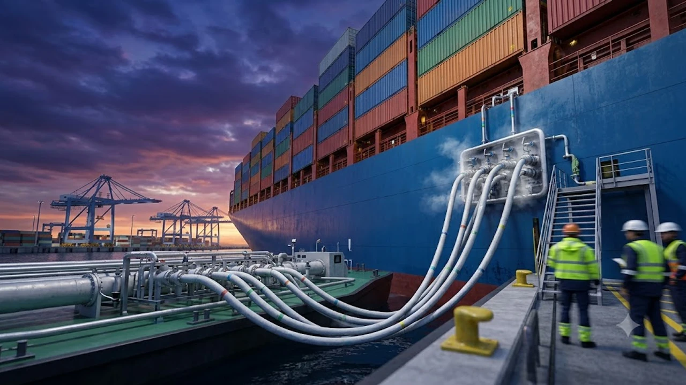

The enforcement of clean maritime fuel 2026 mandates is sending shockwaves across oceanic freight corridors, forcing carriers to abandon legacy high-sulfur fuel oils in favor of zero-carbon alternatives. With port authorities implementing strict emissions verification schemes, international logistics planners are confronting an immediate transformation in maritime carbon accounting and vessel bunkering economics. These regulatory updates eliminate prior compliance gray areas, penalizing carriers that fail to transition to verified alternative propulsion systems.

## The 2026 Clean Maritime Fuel Mandate: What Just Happened

### IMO Carbon Enforcement and Expedited Deadlines
The International Maritime Organization accelerated its net-zero greenhouse gas timeline, establishing rigid life-cycle fuel intensity caps. Vessels failing to prove verified emissions reductions face automatic operational downgrades under the Carbon Intensity Indicator (CII) framework. Port state control inspectors now wield the authority to detain non-compliant tonnage or issue heavy administrative fines at berthing terminals.

### Why Ammonia and Green Methanol Take Center Stage
Shipowners are bypassing intermediate transition hydrocarbons to focus capital directly on green methanol and liquefied ammonia. Green methanol provides an accessible drop-in pathway using conventional liquid handling infrastructure, whereas ammonia delivers an absolute tailpipe carbon-neutral profile. Both feedstocks require distinct bunkering safety protocols and specialized bunkering barges, creating stark operational contrasts across bunkering centers.

### Immediate Port Sanctions from Rotterdam to Singapore
Leading maritime hubs, including Rotterdam, Antwerp-Bruges, and Singapore, deployed real-time fuel sampling protocols backed by digital bunker delivery notes. Ships entering these territorial waters without certified mass-flow metering or emissions-compliant dual-fuel systems encounter immediate port tariff surcharges. These fees disrupt typical charter party agreements, shifting commercial liabilities directly to operators.

## How Dual-Fuel Economics Impact Global Freight and Logistics

### Breakdown of Alternative Fuel Surcharges on Container Rates
The fuel price spread between conventional Very Low Sulfur Fuel Oil (VLSFO) and green fuels continues to introduce volatility into freight pricing models. Carriers are rolling out structured Clean Fuel Surcharges (CFS) across key Asia-Europe and transpacific lanes to offset alternative fuel procurement costs:

- **E-Methanol Premiums:** Fuel procurement costs hover at roughly 2.1 to 2.5 times the equivalent metric ton price of low-sulfur heavy oil.
- **Bunkering Availability Gaps:** Green bunkering hubs remain localized, requiring feeder deviation miles that add 3% to 5% to voyage durations.
- **Pass-Through Friction:** Shippers without long-term contracted index rates face fluctuating quarterly bunker adjustment factors.

Similar supply chain realignments are visible across other geopolitical corridors, as detailed in our analysis of [US Secondary Tariffs 2026: 3 Tech Supply Chain Impacts](/posts/us-trends/us-secondary-tariffs-2026-tech-supply-chain-impacts/).

### Fleet Modernization Challenges: Scrapping vs. Retrofitting
Vessel owners managing tenured tonnage face an expensive fork in the road. Retrofitting a standard 15,000 TEU container vessel with dual-fuel ammonia fuel injection systems, pressurized tanks, and vapor handling equipment demands capital outlays exceeding $22 million per hull. Consequently, older container ships face premature demolition, tightening spot capacity across non-core maritime trade loops.

### Long-Term Supply Chain Inflation vs. Decarbonization Targets
Procurement teams must reconcile internal corporate sustainability targets with tangible freight budget inflation. While corporate shippers mandate Scope 3 supply chain decarbonization, paying green premiums on ocean legs squeezes wholesale retail margins. Balancing baseline spot booking costs against certified green corridor allotments represents the primary operational hurdle for logistics directors worldwide.

## Why Korean Shipyards Hold the Key to the Global Energy Shift

### Order Dominance: HD Hyundai, Hanwha Ocean, and Samsung Heavy
South Korean shipbuilding powerhouses have effectively secured the global supply pipeline for high-spec, dual-fuel tonnage. HD Hyundai, Hanwha Ocean, and Samsung Heavy Industries hold over 70% of the world's order book for ammonia-ready and methanol-powered ultra-large container ships and gas carriers. Their dock spaces remain booked through late 2029, dictating the practical speed of commercial fleet decarbonization.

### Breakthroughs in Ammonia Propulsion and Cryogenic Containment
Korean naval architects solved critical ammonia combustion anomalies, including toxic slip mitigation and nitrogen oxide reduction catalysts. Breakthroughs in cryogenic fuel tank construction and proprietary fuel gas supply systems (FGSS) allow commercial carriers to store liquid ammonia at minus 33 degrees Celsius without sacrificing valuable commercial cargo volume.

### Bottlenecks in Asian Dry Docks and Delivery Timeline Realities
Despite high yard efficiency, yard capacity limits throughout Ulsan, Geoje, and Mokpo create a global supply ceiling. Specialized equipment backlogs—particularly cryogenic valve trains, low-speed two-stroke alternative fuel engines, and high-tensile steel plates—constrain vessel delivery cadences:

> "The decarbonization timeline of global maritime trade is no longer dictated by international policy makers; it is strictly governed by dry dock throughput and engine room delivery slots across East Asian shipyards."

Fleet managers failing to secure delivery slots by mid-decade risk running obsolete tonnage into escalating international port penalties.

## Preparing Your Supply Chain for the Clean Fuel Transition

### Strategic Route Planning to Mitigate Regional Port Penalties
Cargo owners must audit port calls to avoid cascading emissions penalties. Routing cargo through bunkering hubs with mature green fuel supply chains guarantees compliant operations and protects shipments against port-side administrative detentions.

### Key Metrics to Audit Freight Forwarders and Carbon Surcharges
Logistics procurement teams should enforce rigorous transparency standards across their freight forwarding partners:
- **Verified Bunker Delivery Receipts:** Demanding mass-flow meter verification for all fuel volume allocations.
- **Vessel-Specific CII Ratings:** Restricting bookings to ships with certified A or B operational ratings under IMO frameworks.
- **Index-Linked Fuel Surcharges:** Tying fuel charges directly to transparent spot assessments for green methanol and ammonia rather than generic carrier formulas.

### The 2027 Outlook: Navigating Multi-Fuel Fleet Compliance
The transition toward net-zero shipping requires adaptive commercial contracts. Shippers should negotiate bi-fuel clauses in multi-year service contracts, shielding their balance sheets from regional regulatory shocks while ensuring compliance with stringent international emissions legislation.

For teams managing complex industrial equipment shipping and offshore logistics, acquiring heavy-duty transit monitoring supplies is essential: [관련상품 쿠팡에서 보기](https://www.coupang.com/np/search?q=%EB%AC%BC%EB%A5%98%EC%9E%A5%EB%B9%84%ED%83%80%EC%9D%B4%EB%8B%A4%EC%9A%B4%EB%B2%A8%ED%8A%B8&sourceType=affiliate&trackingCode=AF8691300)

#GlobalTrends #CleanMaritimeFuel #IMO2026 #SupplyChain #Logistics #KoreanShipbuilding #GreenMethanol #AmmoniaBunkering