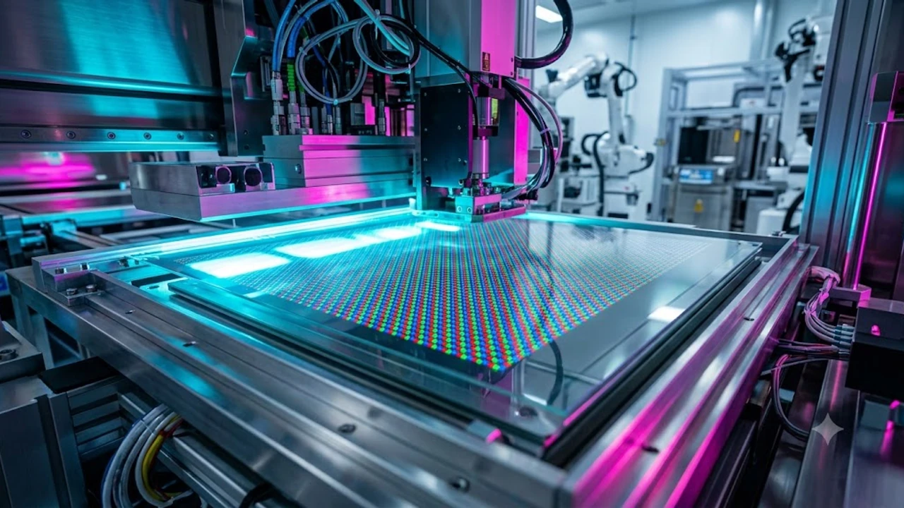

The display manufacturing industry reached a watershed moment in 2026 with the unveiling of **FLiPP OLED** (*FMM-Less Innovative Pixel Patterning*). By eliminating the physical shadow masks that have bottlenecked organic light-emitting diode production for decades, this photolithographic breakthrough dismantles long-standing glass substrate limits while dramatically boosting panel performance. As device makers push for brighter, longer-lasting displays across laptops, tablets, and automotive cockpits, maskless OLED patterning is resetting baseline standards for pixel density and power efficiency.

## Understanding FLiPP Architecture and the FMM Dilemma

For over fifteen years, RGB OLED manufacturing has depended on Fine Metal Mask (FMM) deposition. While effective for compact screens like smartphones, stretching ultra-thin sheets of invar alloy across large manufacturing chambers creates stubborn physical roadblocks in yield, resolution, and glass substrate scaling.

### The Fundamental Bottleneck of Fine Metal Masks in Large Panels

Conventional thermal evaporation vaporizes organic compounds through microscopic slots etched into an invar foil. As mother glass expands to larger generations, these mechanical masks encounter structural failures:

- **Gravitational Mask Sagging:** Suspended over wide spans inside vacuum chambers, metal masks bow under gravity, causing severe subpixel misalignment.
- **Thermal Expansion Drift:** High-temperature evaporation chambers heat the invar alloy, triggering thermal expansion that bleeds subpixel colors into neighboring boundaries.
- **Strict Aperture Ceilings:** Mask ribs require a minimum physical thickness to avoid tearing under tension, capping active light-emitting aperture ratios between 18% and 22%.
- **Cleaning and Degradation Downtime:** Organic vapors accumulate heavily on mask surfaces, forcing frequent, costly maintenance stops that drag down total factory throughput.

### How Photolithographic Patterning Replaces Traditional Evaporation

FLiPP replaces physical vapor shadow masks with an advanced photolithographic workflow borrowed from front-end semiconductor fabrication. Technicians coat the entire substrate uniformly with organic emitter layers before applying precision ultraviolet (UV) exposure and specialized chemical developers to carve out red, green, and blue subpixels directly on the backplane.

> "Photolithographic patterning strips mechanical tension out of the manufacturing equation, pushing pixel pitches to limits dictated solely by optical stepper resolution rather than the physical rigidity of a metal foil."

Using low-damage dry etching and chemical lift-off solutions formulated specifically for vulnerable organic molecules, FLiPP produces crisp subpixel edges without thermal distortion, cutting out physical contact with the active display area entirely.

### Core Technical Metrics: Brightness, Lifespan, and Aperture Ratio

Eliminating mechanical mask borders unlocks substantial surface area inside every individual subpixel. Performance data presented at IMID 2026 highlights clear architectural leaps over traditional evaporation setups:

- **1.6× Peak Luminance Surge:** A broader emission surface lets panels pump out high nit ratings at lower electrical current densities, protecting delicate chemical bonds from premature breakdown.
- **2.4× Extended Operating Lifespan:** Because emitters generate required brightness levels with less driving strain, organic degradation slows down dramatically to reduce burn-in risks.
- **55% Aperture Ratio Boost:** Shrinking non-emitting dead zones between subpixels maximizes optical efficiency and curbs internal light scattering inside the panel stack.

## FLiPP vs. Traditional FMM OLED: Architectural Comparison

Directly comparing photolithographic architecture with established shadow-mask systems illustrates how eliminating mechanical constraints restructures fab floor economics and panel geometry.

| Technical Metric | Traditional FMM OLED | FLiPP Photolithographic OLED | Architectural Advantage |
| :--- | :--- | :--- | :--- |
| **Aperture Ratio** | 18% – 22% | 31% – 35% | +55% optical emission surface |
| **Max Pixel Density (PPI)** | ~500–600 PPI (Glass-limited) | 1,000+ PPI | Native support for micro-displays |
| **Substrate Compatibility** | Gen 6 Optimal (Gen 8.6 Constrained) | Gen 8.6 and Gen 10.5 Native | Seamless macro-glass processing |
| **Luminance Decay Rate** | Baseline | 58% Slower Luminescence Decay | Substantially prolonged operational life |
| **Mask Tooling Downtime** | High (Frequent Tension Tuning) | Minimal (Standard Litho Reticle) | Drastically fewer line-stop maintenance events |

### Optical Efficiency and Subpixel Density Benchmarks

Evaporation chambers struggle to exceed 500 to 600 pixels per inch (PPI) on glass substrates without resorting to Diamond PenTile subpixel layouts that sacrifice real chromatic resolution. 

Because FLiPP relies on high-precision optical steppers, subpixels can be arranged in native RGB stripe matrices at densities exceeding 1,000 PPI. This capability is pivotal for next-generation spatial computing headsets and high-end monitors where color fringing around fine vector text has long frustrated users.

### Manufacturing Yields Across 8.6-Generation Glass Substrates

Display manufacturers have poured billions into Generation 8.6 (2290mm × 2620mm) fabs. On glass this large, conventional FMM masks suffer steep yield drops toward the center of the sheet where mask sagging peaks.

FLiPP bypasses this limitation. By exposing the glass with standard step-and-repeat lithography tools, yield consistency remains uniform from the center to the outermost edges of Gen 8.6 and Gen 10.5 sheets. This consistency slashes per-panel scrap rates and maximizes mother-glass economic output.

### Thermal Dissipation and Power Consumption Trade-Offs

While photolithographic processing requires rigid cleanroom chemical controls to protect organic materials from solvent degradation, the resulting operational power savings are substantial:

- **Lower Power Draw at High Luminance:** The wider aperture area allows panels to consume 20% to 30% less electrical power when hitting target full-screen white luminance compared to Gen 6 FMM equivalents.
- **Reduced Thermal Hotspots:** Spreading drive currents over larger subpixel footprints prevents intense heat accumulation, protecting passive-cooled hardware designs from thermal throttling.

## Strategic Benefits and Supply Chain Implications for 2026

The commercial rollout of maskless OLED architecture reshapes component sourcing and supply chain strategy. As hardware makers navigate shifting global trade rules—similar to the disruptions highlighted in [US Secondary Tariffs 2026: 3 Tech Supply Chain Impacts](/posts/us-trends/us-secondary-tariffs-2026-tech-supply-chain-impacts/)—locking down advanced, high-yield display manufacturing provides a vital competitive moat.

### Acceleration of IT-Grade OLED Adoption in Laptops and Tablets

Laptops, tablets, and creative workstations have moved slowly toward pure RGB OLED due to steep fabrication costs and burn-in risks on static interface elements.

FLiPP clears both obstacles at once:

1. **Static UI Durability:** A 2.4× operational lifespan surge ensures persistent taskbars, navigation docks, and fixed design software panels no longer trigger localized ghosting.
2. **Cost Parity with Mini-LED:** Gen 8.6 production volume enabled by FMM-less fabrication pushes unit costs down toward parity with high-end quantum-dot Mini-LED backlights.

Personal computing OEMs are utilizing this cost reduction to swap dual-layer tandem architectures for single-layer, high-efficiency FLiPP panels across flagship laptops throughout late 2026.

### Cost Disruption for Automotive and Extended Reality Panels

Automotive applications demand multi-year operating lifespans and intense daylight visibility. Standard FMM panels frequently need dual-stack tandem layouts to hit automotive-grade luminance without degrading rapidly, driving up bill-of-materials costs.

FLiPP delivers single-stack panels capable of hitting daylight readability targets while withstanding wide cabin temperature swings. In spatial computing and near-eye hardware, FLiPP bridges the gap between standard glass panels and cost-prohibitive Micro-OLED silicon wafers (OLEDoS), enabling high-density displays at mass-market price tiers.

### Global Market Shift: Korean Display Leadership vs. Regional Competitors

The commercialization of FLiPP reinforces South Korea's high-tech manufacturing sector at a pivotal competitive moment:

- **Ecosystem Protection:** Formulating proprietary chemical photoresists and strippers that protect sensitive organic emitters builds an intellectual property wall that rivals cannot quickly clone.
- **Capital Expenditure Optimization:** By adapting proven semiconductor-grade exposure tools instead of buying bespoke multi-million-dollar invar tensioning fixtures, Korean fabs can scale Gen 8.6 output with leaner ongoing capital expenditure.
- **Commodity Insulation:** Advanced patterning insulates manufacturers from low-margin price wars driven by aggressive state-subsidized legacy display production.

For a broader perspective on shifting industrial landscapes and hardware trends, explore the [Global Trends Overview](/posts/us-trends/).

## Step-by-Step Industry Roadmap: Tracking Commercial Deployment

The transition away from Fine Metal Mask tooling is rolling out in structured stages across global manufacturing ecosystems.

### Phase 1: Pilot Line Integration and Validation (2026-2027)

- **Chemical Process Tuning:** Finalizing ultra-low-damage developer chemistries that prevent chemical contamination inside organic emission layers.
- **Pilot Substrate Testing:** Running dedicated Gen 6 lines to establish tight defect-density baselines and repeatable yield curves.
- **OEM Sample Qualification:** Supplying test panels to major consumer tech brands for thermal stress, color balance, and mechanical durability verification.

### Phase 2: Mass Production Rollout for Tier-1 Global OEMs

- **Gen 8.6 Line Conversion:** Installing high-throughput photolithographic exposure tools directly onto 8.6th-generation factory floors.
- **Premium IT Integration:** Launching initial retail availability in 14-inch and 16-inch laptops, expanding rapidly into pillar-to-pillar automotive display cockpits.
- **Yield Curve Acceleration:** Scaling line yields past the 85% commercial viability threshold across full-size mother glass sheets.

### Phase 3: Long-Term Transition to Next-Generation Display Form Factors

- **Ultra-Dense Micro-Displays:** Pushing subpixel densities beyond 1,500 PPI for spatial headsets and heads-up avionics displays.
- **Flexible and Rollable Integration:** Applying FLiPP patterning onto flexible polyimide films without the shear stress that often tears mechanically evaporated layers.
- **Legacy Line Phaseout:** Converting older FMM equipment to low-margin replacement panel manufacturing as photolithographic OLED takes over mainstream electronics.

#GlobalTrends #OLED #DisplayTech #LGDisplay #Semiconductor #HardwareInnovation #TechTrends2026 #SouthKorea