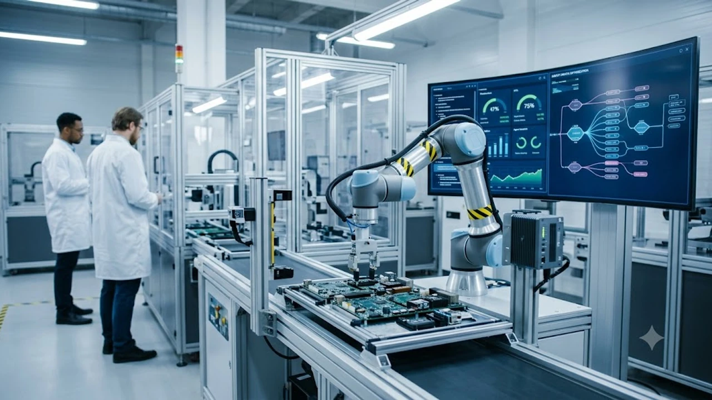

Generative AI agents are dismantling traditional enterprise software architectures by pivoting from conversational chatbots into autonomous digital workforces. Rather than waiting for continuous manual prompts, these predictive systems synthesize data, prioritize competing operational bottlenecks, and execute end-to-end technical objectives. By orchestrating complex logic chains across modern IT stacks, cognitive agents are setting a radically higher baseline for organizational speed and output.

## The Evolution of Autonomous Cognitive Systems
### Shift from Reactive to Proactive Execution
Early foundation models were inherently passive tools that produced isolated text blocks on command. Modern architectures operate as proactive, self-directing pipelines driven by semantic task routing and real-time state management. Instead of relying on a human user to initiate a project, cognitive systems monitor telemetry feeds, database updates, and network alerts to flag anomalies and launch remediation workflows independently.

**Three architectural upgrades drive this shift:**
- **Dynamic Task Decomposition:** Systems dissect high-level objectives into granular steps, testing alternative API execution paths if an intermediate request fails.
- **Episodic and Semantic Memory:** Vector stores retain historical interaction context across quarters, maintaining project memory without retraining base weights.
- **Direct Tool Integration:** Autonomous agents write ad-hoc scripts, trigger webhooks, query production databases, and parse unstructured documents without human intervention.

> "Operational agents shift the cognitive burden of system coordination away from human operators, turning high-level business goals directly into executed code and automated decisions."

### Multimodal Capabilities Redefining Interaction
The division between processing text, real-time video, and spatial data has effectively collapsed. Contemporary agents simultaneously evaluate visual interface designs, audio instructions, and structured schemas to solve complex technical tasks. In engineering workflows, vision-enabled agents review UI screen recordings alongside backend crash logs, identifying performance bottlenecks and generating pull requests to fix the underlying issues within minutes.

This consolidated perception streamlines human-machine interaction across technical domains. Industrial diagnostic platforms cross-reference thermal camera streams with maintenance logs to diagnose machinery wear before critical failures occur. Unifying these parallel data streams inside single multimodal models eliminates the latency and error rates typical of disconnected microservices.

## Enterprise Integration and Operational Efficiency

### Streamlining Complex Departmental Workflows
Modern organizations deploy multi-agent clusters where specialized digital personas collaborate on multifaceted business projects. Monolithic models are split into modular units: dedicated researcher agents aggregate market data, quantitative agents build statistical models, and auditing agents verify output against industry compliance frameworks.

This division of labor cuts cycle times across core functions:
- **Product Strategy:** Market-sensing agents aggregate competitor feature releases, analyze consumer sentiment across public forums, and deliver weekly technical briefs.
- **Automated QA:** Specialized test-generation agents run edge-case simulations across newly committed repositories, logging reproducible test vectors directly to issue trackers.
- **Talent Acquisition:** Sourcing agents screen inbound portfolios, verify code repositories against baseline requirements, and schedule interview panels automatically.

### Cost Reduction Through Intelligent Process Automation
Intelligent automation eliminates the fragility of legacy Robotic Process Automation (RPA), which routinely broke whenever software layouts or invoice structures changed. Generative agents leverage semantic understanding to dynamically parse shifting document designs, map unfamiliar data fields to internal ERP systems, and execute complex cross-platform reconciliations without manual rule-writing.

**Key financial and operational outcomes include:**
- **Tier-2 Support Automation:** Agents inspect diagnostic dumps, trace stack traces, and remediate customer-facing software issues directly, reducing engineering support ticket volume.
- **Automated Contract Analysis:** Legal agents review vendor Master Services Agreements (MSAs), flagging non-standard indemnity clauses and comparing payment terms against treasury policy before human sign-off.
- **Dynamic Inventory Balancing:** Supply chain agents monitor warehouse intake rates, forecast local demand spikes, and generate purchase orders without human administrative delays.

### Navigating Tech Supply Chain Complexities
Geopolitical friction and shifting trade mandates demand extreme agility in semiconductor procurement and cloud infrastructure logistics. Autonomous agents actively track global shipping bottlenecks, wafer fabrication lead times, and regulatory filings to optimize manufacturing roadmaps weeks in advance. 

These logistics agents continuously recalibrate enterprise risk models based on global macroeconomic shifts. The volatile regulatory environments detailed in the [US Secondary Tariffs 2026: 3 Tech Supply Chain Impacts](/posts/us-trends/us-secondary-tariffs-2026-tech-supply-chain-impacts/) heavily influence how autonomous purchasing agents balance component inventories between domestic and offshore suppliers. When sudden export restrictions or tariff adjustments hit the market, these systems automatically reroute orders to vetted secondary fabrication partners to keep assembly lines running smoothly.

## Consumer Applications and Edge Computing
### Hyper-Personalized Digital Assistants
Consumer interfaces have evolved from simple voice triggers into unified personal coordinators. Operating across personal devices, these agents access calendars, financial budgets, and travel preferences to handle end-to-end logistics. They coordinate flights, confirm hotel bookings, and sync meetings without requiring the user to navigate individual travel portals or scheduling apps.

These tools also adapt to user communication styles and workflow habits. When an overloaded schedule risks missed deadlines, the assistant prioritizes urgent correspondence, prepares concise email drafts for approval, and postpones non-critical calendar invites. By filtering routine administrative noise, personal agents return hours of focus back to the user each week.

### The Role of Edge Processing in Daily Tasks
Running generative models on local hardware solves the latency and privacy bottlenecks inherent to cloud computing. Modern hardware architectures now embed dedicated neural engines directly into mobile and desktop silicon, allowing complex multi-billion-parameter models to process user data locally without an active internet connection.

This paradigm shift is transforming consumer hardware, a trend highlighted in [On-Device AI Phones: Top 5 Breakthroughs in 2026](/posts/us-trends/on-device-ai-phones-top-breakthroughs-2026/). Running agentic models directly on local NPUs guarantees that sensitive financial documents, biometric signals, and personal voice data remain entirely on the physical device. Edge execution also enables background agents to parse ambient sensor data continuously, delivering real-time contextual reminders with near-zero latency and minimal battery consumption.

## Ethical Governance and Security Guardrails
### Establishing Trust in Autonomous Execution
Granting autonomous systems the authority to make business-critical decisions requires robust, deterministic security guardrails. Organizations are transitioning toward "Human-on-the-loop" (HOTL) architectures, where agents execute standard operating procedures independently while escalating ambiguous scenarios or high-value financial actions to human supervisors.

To prevent catastrophic execution errors and model drift, developers implement isolated secondary evaluation layers:
- **Pre-execution Linting:** A secondary model checks all generated database queries, API parameters, and file operations against corporate security policies before execution.
- **Deterministic Sandboxes:** Automated code execution occurs inside isolated, ephemeral containers with restricted network permissions.
- **Anomaly Detection:** Real-time monitoring tracks token consumption, transaction sizes, and API error rates to kill runaway agent loops before they affect production environments.

### Data Privacy and Localized Frameworks
Deploying autonomous agents at scale requires strict compliance with international data residency and privacy mandates. Enterprises are investing heavily in Retrieval-Augmented Generation (RAG) pipelines connected to private, on-premise foundation models, ensuring proprietary intellectual property never leaves secure internal networks.

Role-based access controls are hardcoded directly into the system's semantic router. A sales enablement agent, for instance, cannot read internal HR records or view source code repositories, preventing privilege escalation exploits. Building this rigorous security foundation ensures that businesses can scale autonomous cognitive agents safely while maintaining complete compliance across their digital infrastructure. [Explore Smart Tech Hardware and Accessories on Coupang](https://www.coupang.com/np/search?q=smart+home+accessories&sourceType=affiliate&trackingCode=AF8691300)

#GenerativeAI #AIAgents #Automation #FutureOfTech #MachineLearning #TechTrends2026 #EdgeComputing #SmartAutomation