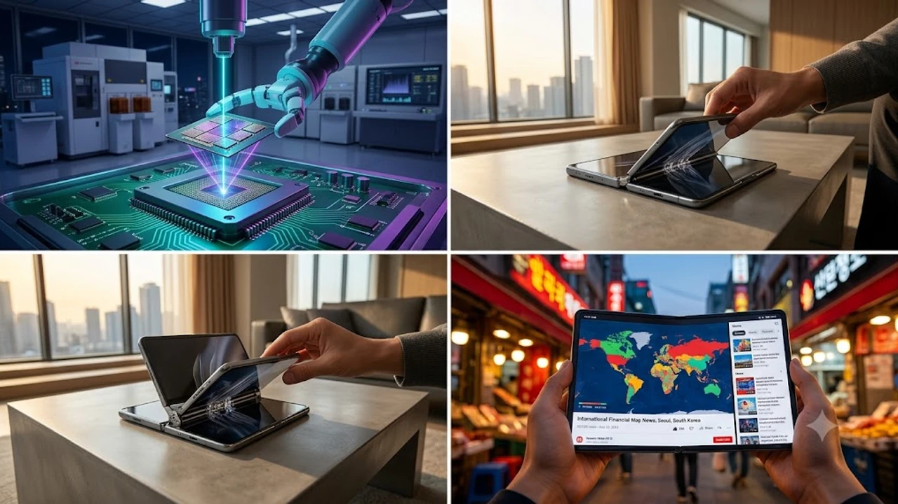

The debut of the **Huawei Mate XT2** has ignited an intense debate across mobile hardware circles, positioning the Kirin 9050 Pro processor directly against stringent international trade barriers. As hardware engineers evaluate this dual-hinge flagship, the convergence of advanced packaging and local semiconductor design reveals an ambitious technological gambit. This tri-fold smartphone demonstrates how domestic supply chains adapt under persistent technological blockades.

## Architecture of the Kirin 9050 Pro

### Multi-Die Packaging and Logic Folding
Huawei and SMIC bypassed extreme ultraviolet photolithography limits by implementing dense deep ultraviolet multi-patterning combined with advanced packaging techniques. Instead of relying on a monolithic 3nm die, the Kirin 9050 Pro employs a modular 2.5D interconnect structure. This approach links compute units and high-bandwidth caches through high-density silicon interposers, boosting cluster communication bandwidth while managing thermal dissipation across the chassis.

### Custom DaVinci NPU and On-Device Processing
The silicon integrates an updated DaVinci Neural Processing Unit engineered specifically to execute 3-billion-parameter language models directly on the device. By optimizing 4-bit and 8-bit integer quantization pipelines, the chipset handles live conversational translation and predictive interface routing without continuous round-trips to remote cloud servers. This local processing architecture mirrors wider industry developments explored in [On-Device AI Phones: Top 5 Breakthroughs in 2026](/posts/us-trends/on-device-ai-phones-top-breakthroughs-2026/).

> "Advanced packaging and high-density heterogeneous stacking are allowing domestic silicon designers to achieve competitive throughput, even while restricted to mature optical lithography nodes."

## Mechanical Innovation of the Tri-Fold Chassis

### Dual-Action Friction Hinges and Durability
Transforming from a 6.4-inch single-hand display into a 10.2-inch expansive workspace requires two distinct hinge mechanisms. The primary hinge folds inward using a dual-track teardrop design, protecting the internal panel from particulate ingress. The secondary hinge articulates outward, maintaining structural tension across the center crease. Precision-milled titanium-grade alloys withstand over 450,000 bending cycles without degrading operational resistance.

### Ultra-Thin Flexible Glass Substrates
Panel durability relies on a multi-tier composite structure incorporating chemically strengthened ultra-thin flexible glass laminated with a shock-absorbing polymer layer. This setup mitigates micro-fractures under uneven tensile pressure. The engineering parallels shifts across global hardware supply chains described in [US Secondary Tariffs 2026: 3 Tech Supply Chain Impacts](/posts/us-trends/us-secondary-tariffs-2026-tech-supply-chain-impacts/), where alternative component sourcing dictates manufacturing feasibility.

## Global Supply Chain Pressures and Market Rivalry

### The High-End Foldable Showdown
The Mate XT2 directly challenges Samsung Electronics' dominant foldable lineup across East Asia and Europe. While Korean manufacturers hold significant advantages in display efficiency and memory bandwidth, Huawei is capturing high-net-worth consumer mindshare across tier-one cities in China. This tension forces established market leaders to accelerate their own experimental form factors and dual-folding panel roadmaps.

### Yield Rates and Component Bottlenecks
Despite visible engineering progress, volume production remains fragile. Industry estimates suggest yields for complex multi-patterned interposers hover below 40%, inflating retail unit costs and limiting commercial shipments during the initial sales quarter. Memory interfaces and specialized power management integrated circuits still depend heavily on stockpiled components or secondary distributors, leaving production runs vulnerable to updated enforcement rules.

## Enterprise Viability and Market Outlook

### Software Synergy and HarmonyOS Next Integration
Hardware form factors succeed or fail on the strength of their software ecosystems. Running on pure HarmonyOS Next—completely stripped of the legacy Android Open Source Project code base—the Mate XT2 splits the canvas across three responsive application windows. Document editors, stock charting suites, and design tools adapt dynamically across folded, dual-screen, and fully deployed states without interface stutter.

### Thermal Headroom and Real-World Battery Drain
Driving a 10.2-inch 120Hz high-brightness OLED panel alongside an advanced multi-chip module places immense demands on the 5,600mAh silicon-carbon battery pack. Huawei mitigates thermal throttling by distributing split vapor chambers across all three structural panels. However, sustained compute sessions under intense NPU workloads highlight the thermodynamic tax of multi-die architectures relative to monolithic Western chips.

[최신 스마트폰 및 테크 액세서리 쿠팡에서 보기](https://www.coupang.com/np/search?q=%EC%8A%A4%EB%A7%88%ED%8A%B8%ED%8F%B0%EC%95%A1%EC%84%B8%EC%84%9C%EB%A6%AC&sourceType=affiliate&trackingCode=AF8691300)

#GlobalTrends #Huawei #MateXT2 #Kirin9050 #FoldablePhones #MobileTech #Semiconductors #Korea