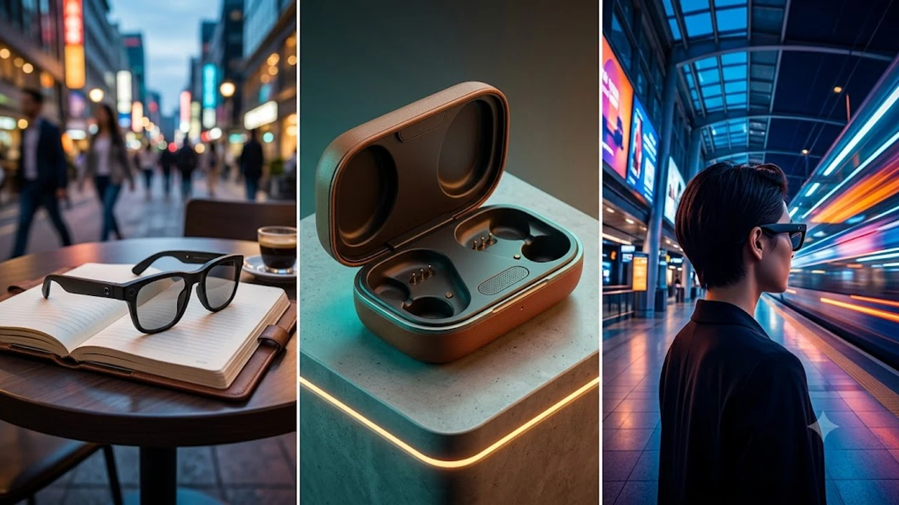

Meta Connect 2026 marked a decisive turning point for personal computing, officially signaling the transition from pocket-bound smartphones to ambient, screenless artificial intelligence hardware. With over one hundred stylistic variations, high-resolution optical upgrades, and breakthrough multimodal models, the newly announced smart glasses lineup sets a benchmark for mainstream wearable technology. As edge inference architectures mature, ambient computing devices are proving that hands-free digital interaction can integrate seamlessly into everyday fashion without technical friction.

## Meta Connect 2026 Unveils Next-Gen AI Wearables
The keynote presentation laid out a clear strategy: eliminate the cognitive friction of fishing a glass slab out of a pocket by embedding contextual machine intelligence directly onto the bridge of the user's nose. Unlike early prototypes that felt like clunky surveillance experiments, the hardware showcased at Meta Connect 2026 prioritizes classic acetate frames, whisper-quiet thermal regulation, and sub-second acoustic feedback.

### The Shift from Smartphone Screens to Ambient AI Displays
Consumer digital habits spent fifteen years locked into hand-held touchscreens. Meta's latest portfolio directly attacks that reflex by treating visual panels as secondary options rather than core requirements. By pairing conversational agents with continuous environmental sensing, the new hardware lets users identify subway transit hubs, translate street signage in real time, and catalog workshop tools without breaking physical stride.

The industry trajectory mirrors broader hardware cycles across consumer electronics. Similar to [Why IFA 2026 Shifted to On-Device AI: 3 Key Takeaways](/posts/us-trends/why-ifa-2026-shifted-on-device-smart-home-ai/), modern connected devices prioritize immediate on-device processing over persistent cloud tethering. Ambient displays achieve this through directional audio cues and contextual vocal summaries, proving that auditory feedback often delivers information faster than navigating nested visual menus.

### EssilorLuxottica Partnership Deepens Across 100+ Styles
The joint venture between Meta and European eyewear giant EssilorLuxottica expanded dramatically during the 2026 keynote. Recognizing that aesthetic insecurity kills wearable adoption faster than poor battery life, the design teams introduced over 100 frame, lens, and finish combinations across classic consumer silhouettes:

- **Ray-Ban Wayfarer Classic & Large**: Standardized proportions with reinforced titanium barrel hinges.
- **Skyler & Headliner Profiles**: Low-bridge, rounded frames built specifically for narrow facial geometry.
- **Prescription-Optimized Chassis**: Ultra-thin temple stems engineered to house custom high-index prescription lenses without muffling acoustic drivers.
- **Transition Chromance Options**: Sun-reactive polarized glass tuned to prevent polarized screen distortion while stepping outdoors.

> "Wearable computing fails the moment a user feels self-conscious wearing it in public. Engineering must hide inside timeless design, not shout over it."

By distributing custom lithium-polymer cells and processing silicon evenly along the acetate temple arms, engineers kept the total frame weight under 50 grams on baseline models, matching standard non-smart prescription frames.

### Global Expansion Timelines Across Key Consumer Markets
Commercial rollout schedules revealed an aggressive push into Asia-Pacific hubs alongside traditional North American and European channels. Initial retail sales kick off in early October across the United States, Canada, the United Kingdom, France, and Germany.

The second distribution wave follows within three weeks, activating localized voice models, retail demonstration spaces, and authorized prescription networks across South Korea, Japan, Singapore, and Australia. The inclusion of high-density metropolitan hubs like Seoul and Tokyo reflects fierce consumer appetite for lightweight mobile accessories, backed by existing regional retail distribution via Gentle Monster partner networks and major optometry chains.

## Ray-Ban Meta Gen 3 vs Audio: Specs, Battery, and Trade-offs

The product architecture splits into two distinct hardware philosophies: full multimodal capture via the Ray-Ban Meta Gen 3, and an ultra-minimalist, camera-free variant known simply as Meta Audio. This structural separation tackles corporate privacy mandates head-on while giving privacy-conscious buyers a viable daily driver.

### Camera vs Camera-Free: Why Privacy Drove the Audio-Only Model
Corporate offices, cleanrooms, and medical facilities have routinely banned camera-equipped eyewear due to corporate espionage risks and strict patient privacy regulations. The camera-free Audio model strips out optical sensors altogether, replacing them with dual open-ear micro-transducers and beamforming acoustic arrays.

This hardware choice yields concrete functional benefits:

- **Full Workplace Compliance**: Approved for use in classified test facilities, trading floors, and hospital wards.
- **Zero Social Hesitation**: Sidesteps public recording anxiety in shared fitness centers, commuter trains, and dining spaces.
- **Weight Reduction**: Drops frame weight to 41.5 grams, matching the feel of conventional designer acetate frames.
- **Extended Acoustic Chamber Volume**: Reclaims internal housing space to boost low-end bass response by 4.2 dB.

### Hardware Upgrades: 3K Ultra HD, 12MP Sensor, and Battery Lifespan
For users choosing optical capture, the Gen 3 received substantial silicon and camera sensor upgrades. The ultra-wide camera module incorporates a custom 12MP Sony sensor paired with an f/2.2 aperture lens capable of capturing 3K Ultra HD video at a stable 60 frames per second.

| Metric / Specification | Ray-Ban Meta Gen 2 (Previous) | Ray-Ban Meta Gen 3 (2026) | Meta Audio (Camera-Free) |
| :--- | :--- | :--- | :--- |
| **Optical Sensor** | 12MP (1080p Video) | 12MP Custom (3K 60fps) | None |
| **System Memory** | 32 GB Flash Storage | 64 GB / 128 GB UFS | 16 GB Flash Storage |
| **Continuous Audio** | 4.0 Hours | 6.5 Hours | 9.0 Hours |
| **Mixed Active Use** | ~3.5 Hours | Up to 6.0 Hours | Up to 11.0 Hours |
| **Case Recharges** | 8 Additional Cycles | 8 Additional Cycles | 10 Additional Cycles |
| **Weight** | 48.6 grams | 49.2 grams | 41.5 grams |
| **Water Resistance** | IPX4 Splash Resistant | IPX5 Water Jet Resistant | IP54 Dust & Splash |

Battery gains stem largely from TSMC's 3-nanometer low-power silicon node, allowing the onboard neural engine to run background wake-word detection at less than 12 milliwatts.

### Pricing Breakdown and Cost Comparison Across the 2026 Portfolio
Retail pricing targets specific user tiers. The entry-level, camera-free Meta Audio frames launch at $229 USD, positioning them directly against high-end active-noise-canceling earbuds and premium optical eyewear.

The Ray-Ban Meta Gen 3 baseline model starts at $329 USD with standard UV-protective lenses. Polarized editions run $359 USD, while Transitions and prescription-glazed packages land between $399 USD and $449 USD depending on optical coatings. Every pair ships with an updated leatherette charging case featuring rapid USB-C charging and MagSafe-compatible induction coils that restore 50 percent of battery life in 20 minutes.

## Muse Agent Integration and On-Device Intelligence
Hardware represents only half the equation; the primary performance jump comes from the integration of Meta's Muse Agent. This software layer bridges the gap between passive smart accessories and active personal assistants capable of executing autonomous contextual workflows.

### Muse Spark Engine and Autonomous Real-Time Task Execution
The Muse Spark engine runs on a split architecture that balances tasks between an ultra-low-latency on-device chip and cloud reasoning clusters. Routine requests—such as volume adjustments, countdown timers, calendar queries, and local media playback—process locally in under 180 milliseconds without an active data connection.

When users request complex multimodal tasks ("Inspect this mechanical valve and find the matching gasket size"), the device streams compressed sensor frames over Wi-Fi 7 or 5G mobile tethering. Muse then executes multi-step workflows:

1. Identifies the mechanical component through edge visual feature extraction.
2. Cross-references physical dimensions against industrial distributor catalogs.
3. Prompts the wearer with a low-tone chime before authorizing transactions through tokenized biometric authentication.

### Spatial Audio with Dolby Atmos Capture and Micro-OLED Specs
Acoustics upgraded from flat directional projection to immersive 360-degree soundscapes. Using a five-microphone array positioned along the nose bridge, temples, and end-pieces, Gen 3 frames record directional Dolby Atmos spatial audio during video capture. Playback utilizes phase-canceling open-ear micro-speakers that direct sound straight into the ear canal while suppressing ambient sound leak by 18 decibels compared to Gen 2, preventing nearby commuters from hearing incoming calls.

For specialized enterprise editions showcased in developer breakouts, miniature Micro-OLED monocular waveguide projectors displayed green-monochrome heads-up telemetry. While absent from consumer sunglasses, these developer builds point toward augmented reality convergence where graphical prompts overlay physical architecture.

### FDA-Cleared Hearing Enhancement as an Accessible Medical Feature
A standout announcement during the accessibility segment was the introduction of FDA Class II clearance for over-the-counter hearing assistance software. Leveraging directional beamforming microphones, the glasses actively isolate and amplify human speech frequencies while suppressing ambient background noise:

- **Dynamic Voice Focus**: Tracks head orientation to isolate the voice of the speaker directly in front of the wearer.
- **Acoustic Calibrations**: Runs an automated hearing diagnostic in the companion app to generate custom equalization curves for each ear.
- **Tinnitus Masking**: Plays soft, calibrated brown noise frequencies during quiet periods to reduce auditory fatigue.

This functional integration turns high-fashion eyewear into an affordable, stigma-free alternative to traditional clinical hearing aids that routinely cost thousands of dollars.

## Industry Ramifications and the Asian Wearable Market Response
The aggressive product rollout at Meta Connect 2026 reshapes the competitive landscape across international hardware hubs, establishing new dynamics between American platform software and Asian precision manufacturing ecosystems.

### Consumer Reception in Early Adoption Hubs and South Korea
South Korea serves as a critical proving ground for smart eyewear adoption due to high urban density, pervasive broadband infrastructure, and strong lifestyle fashion markets. Flagship boutiques in Gangnam and Seongsu-dong reported full reservation lists for retail fitting sessions within hours of the official launch announcement.

Korean early adopters have gravitated toward the hands-free navigation capabilities, which integrate directly with local map APIs and transit data providers. Furthermore, fashion collaborations spearheaded by regional style influencers have positioned the lightweight frames as desirable lifestyle items rather than bulky Silicon Valley eccentricities, accelerating broader social acceptance across younger demographics.

### Big Tech Rivalry: Meta vs Apple Vision and Samsung Spatial Projects
Meta's product strategy directly challenges its primary ecosystem competitors by taking the opposite philosophical approach to spatial computing:

- **The Meta Approach**: Prioritize lightweight, stylish daily-wear hardware under $350 USD, accepting limited display capabilities in favor of all-day comfort and pervasive audio AI.
- **The Apple Approach**: Deliver high-fidelity visual immersion through the Vision Pro ecosystem at premium enterprise pricing, accepting bulky form factors while iterating toward future lightweight glasses.
- **The Samsung & Google Alliance**: Developing Android XR spatial platforms targeting mid-tier form factors that bridge smart glasses and lightweight mixed-reality headsets.

By capturing the everyday consumer market early through EssilorLuxottica's retail storefronts, Meta establishes substantial distribution moats that display-heavy competitors will struggle to overcome without radical optical miniaturization breakthroughs.

### Buying Verdict: Is the 2026 AI Glasses Lineup Worth the Upgrade?
For owners of original Gen 1 hardware or newcomers to ambient tech, the 2026 lineup offers compelling maturity. The combination of IPX5 water resistance, doubled battery longevity, reliable hands-free intelligence, and dedicated camera-free workplace options resolves almost every functional complaint leveled at earlier generations.

Current Gen 2 owners who strictly use their glasses for casual podcasts and phone calls can comfortably wait for future iterations. However, those seeking professional-grade 3K visual documentation, hearing enhancement, or seamless multimodal AI assistance will find the Ray-Ban Meta Gen 3 to be the most capable consumer wearable on the market today.

[스마트 글래스 및 웨어러블 테크 인기상품 쿠팡에서 보기](https://www.coupang.com/np/search?q=%EC%8A%A4%EB%A7%88%ED%8A%B8%EC%95%88%EA%B2%BD&sourceType=affiliate&trackingCode=AF8691300)

#GlobalTrends #MetaConnect2026 #SmartGlasses #RayBanMeta #WearableTech #ArtificialIntelligence #AmbientComputing #SouthKorea