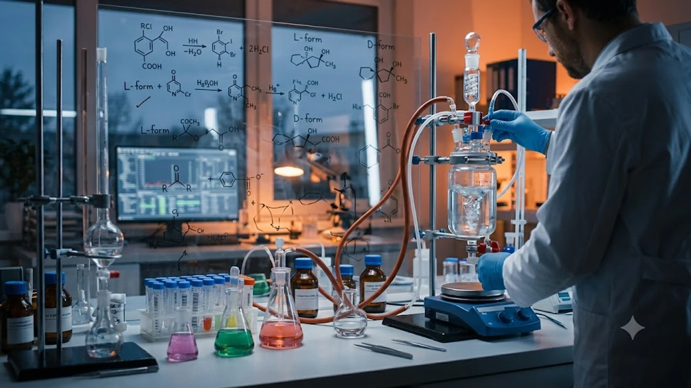

The awarding of the **2026 Nobel Chemistry Prize** represents a decisive milestone for synthetic biology and commercial pharmaceuticals, unraveling the longstanding mystery of biological homochirality and structural asymmetry. By honoring Henri B. Kagan and Kenso Soai, the Nobel Committee focused global attention on how sub-atomic handedness dictates cellular receptor docking, toxicological safety, and large-scale manufacturing throughput.

## Understanding the 2026 Nobel Chemistry Prize Breakthrough

### The Mystery of Molecular Handedness in Living Systems

Chirality describes molecules that exist as non-superimposable mirror images, identical in molecular formula yet distinct as left and right hands. In terrestrial biology, natural selection enforces strict **biological homochirality**:

- Ribosomal machinery constructs functional cellular enzymes almost entirely from L-enantiomer amino acids.
- The helical backbones of RNA and DNA integrate exclusively D-enantiomer ribose and deoxyribose sugars.
- Abiotic laboratory reactions run without chiral templates predictably collapse into flat 50:50 racemic mixtures.

For over a century, investigators debated how prebiotic Earth broke that initial symmetry without biological enzymes. The work of Kagan and Soai provides the physical blueprint, proving that infinitesimal thermodynamic fluctuations can trigger an irreversible cascade toward total chiral dominance.

### Kagan's Non-Linear Effects vs. Traditional Asymmetric Catalysis

Classical coordination chemistry historically operated on an assumption of strict linearity: a chiral catalyst batch possessing 20% enantiomeric excess (ee) should deliver a reaction product with roughly 20% ee. Henri Kagan overturned this framework by documenting **non-linear effects (NLE)** across multi-component catalytic systems.

> When transition-metal catalyst species aggregate into dimeric or oligomeric clusters in solution, homochiral pairings (left-left or right-right) exhibit markedly different kinetic rates, solubility equilibria, and turnover frequencies compared to their mixed heterochiral counterparts.

Through these reservoir effects, an impure catalyst mixture can drive product enantiomeric purity far beyond its own baseline reading. This fundamental discovery freed synthetic chemists from the requirement of sourcing 100% pure chiral catalysts.

### The Soai Reaction: How Autocatalysis Amplifies Single Chirality

Kenso Soai demonstrated the apex of symmetry breaking through the discovery of the **Soai reaction**—the addition of diisopropylzinc to pyrimidine-5-carbaldehydes. In this sequence, the resulting chiral zinc alkoxide serves directly as an asymmetric autocatalyst for its own generation.

1. **Subtle Asymmetric Induction:** An imperceptible initial bias—such as a minuscule 0.00005% enantiomeric bias delivered by circularly polarized ultraviolet light or chiral quartz crystals—initiates the reaction environment.
2. **Autocatalytic Self-Replication:** The dominant enantiomer accelerates its own formation while heterochiral dimeric associations trap the opposing enantiomer in an unreactive state.
3. **Exponential Runaway Amplification:** Over successive batch cycles, the enantiomeric purity surges past 99.5% ee without a single enzymatic or biological cofactor.

This mechanism bridges primordial abiogenesis with precision fine-chemical synthesis.

## Why Molecular Chirality Dictates Modern Drug Safety

### Mirror-Image Molecules and Historical Pharmaceutical Hazards

Target receptors and active enzyme pockets throughout human physiology are structurally chiral. When a racemic therapeutic enters systemic circulation, the two mirror-image enantiomers frequently trigger contradictory physiological pathways.

- **Thalidomide:** Administered as a morning sickness sedative in the mid-20th century, the $(R)$-enantiomer induced sleep, while the mirror-image $(S)$-enantiomer bound to cereblon proteins, causing severe teratogenic limb malformations.
- **Ethambutol:** The $(S,S)$-enantiomer serves as a baseline antibiotic against tuberculosis, whereas the $(R,R)$-isomer induces dose-dependent optic neuritis leading to irreversible vision loss.
- **Dextromethorphan vs. Levomethorphan:** One compound acts as a standard over-the-counter antitussive cough suppressant, while its stereoisomer acts as a potent, controlled opioid narcotic.

These historical catastrophes established modern pharmaceutical regulations requiring stereochemical profiling for every active drug isomer.

### Enhancing Enantiomeric Purity in Active Pharmaceutical Ingredients

Global drug regulators, including the US Food and Drug Administration (FDA) and the European Medicines Agency (EMA), enforce strict stereoisomeric purity ceilings on marketed small molecules. Active Pharmaceutical Ingredients (APIs) targeting human receptors require optical purity exceeding 99.8% ee.

Conventional downstream racemic separation demands discarding half of the raw chemical yield as hazardous industrial waste. Deploying Kagan-type catalytic non-linear kinetics enables process chemists to drive reactions straight toward the desired isomer, shortening synthetic pathways and mitigating off-target toxicity in clinical candidates.

### Cost Efficiencies in Next-Generation Asymmetric Synthesis

Harnessing non-linear catalytic behavior transforms pharmaceutical economics:

- **Lower Precious Metal Catalyst Loads:** Homochiral catalytic assemblies dominate reaction velocity, permitting production facilities to cut costly ruthenium, rhodium, and palladium charges.
- **Tolerant Reagent Thresholds:** Chemical plants avoid purchasing ultra-purified chiral auxiliaries, allowing downstream autocatalytic effects to polish intermediate stereochemical purity.
- **Reduced Environmental Factor (E-Factor):** Eliminating massive solvent volumes formerly required for diastereomeric recrystallization cuts operational carbon footprints and hazardous disposal fees.

These technical manufacturing advancements mirror wider supply chain realignments outlined in [US Secondary Tariffs 2026: 3 Tech Supply Chain Impacts](/posts/us-trends/us-secondary-tariffs-2026-tech-supply-chain-impacts/).

## Commercial Ramifications for Global and Korean CDMOs

### Scaling Chiral Synthesis Across Worldwide Biopharma Pipelines

As contemporary oncology pipelines shift toward complex small molecules, chiral linkers, and targeted payloads, chiral center construction represents an acute operational bottleneck. More than 60% of novel small-molecule treatments approved by regulators contain two or more asymmetric carbon centers.

Contract Development and Manufacturing Organizations (CDMOs) across the United States, Europe, and Asia are shifting batch campaigns into continuous-flow microreactors optimized for Kagan-Soai non-linear stereoselective reactions.

### Korea's High-Tech CDMO Sector: Samsung Biologics and Celltrion Adaptations

South Korea's biomanufacturing hubs occupy a strategic position within this manufacturing evolution:

- **Samsung Biologics:** Having built dominant monoclonal antibody bioreactor capacity in its Songdo biocluster, the firm has accelerated investment in small-molecule payload infrastructure to satisfy international demand for antibody-drug conjugate (ADC) linkers requiring absolute enantiomeric fidelity.
- **Celltrion:** As the company scales biosimilar and proprietary drug discovery, high-precision chiral synthesis platforms secure stereochemical bio-equivalence across complex synthetic adjuvants and lipid nanoparticle excipients.
- **Domestic Specialty Chemical Suppliers:** Domestic Korean chemical processors serving the Songdo and Daedeok Innopolis corridors gain a distinct advantage by adopting continuous-flow autocatalytic synthetic protocols.

> Integrating microfluidic continuous-flow systems with Kagan-Soai catalytic dynamics enables high-tech Korean synthesis facilities to condense technical development lead times from eighteen months down to twelve weeks.

### Supply Chain Resilience in High-Purity Chiral Intermediates

Shifting regulatory baselines and geopolitical friction require decentralized active ingredient manufacturing. The capability to convert low-ee feedstocks into clinical-grade stereopure APIs domestically shields commercial biomanufacturers from overseas fine-chemical supply shocks, serving as an operational buffer for critical healthcare infrastructure.

For ongoing analysis covering international technology disruptions, review the complete [Global Trends 전체 글 보기](/posts/us-trends/) repository.

## Future Frontiers: From Prebiotic Chemistry to Precision Therapeutics

### Solving the Origin of Life's Homochirality Puzzle

Beyond active pharmaceutical plants, the 2026 Nobel Prize validates fundamental research into abiogenesis. Kenso Soai’s laboratory experiments proved that subtle chiral physical forces—such as circularly polarized light emitted from synchrotron radiation or rotating neutron stars—possess sufficient thermodynamic drive to tilt the chiral balance of an entire biosphere.

These findings supply astrobiology teams with concrete molecular fingerprints for isolating extraterrestrial biosignatures during automated sampling runs across icy ocean worlds and Martian regolith.

### Implementing Autocatalytic Systems in Scaled Green Chemistry

Integrating autocatalytic amplification aligns direct API production with zero-waste manufacturing goals:

- Eliminating heavy solvent loads required for fractional chiral recrystallization.
- Running industrial reactions at ambient temperature by capitalizing on reactive dimeric catalytic complexes.
- Establishing self-sustaining reaction loops where synthesized product regenerates the catalytic cycle.

These engineering principles systematically lower energy inputs across commercial fine-chemical synthesis.

### Key Takeaways for Investors and Life Science Researchers

The commercial validation provided by the 2026 Nobel Chemistry Prize directs immediate venture and R&D capital:

- **Microfluidic Synthesis Automation:** Capital flows directly into continuous-flow microreactors equipped with inline polarimetry and circular dichroism analytics.
- **Patent Lifecycle Management:** Pharmaceutical developers are engineering new intellectual property moats by securing pure single-enantiomer patents via low-cost autocatalytic pathways.
- **Cross-Sector Research Alliances:** Accelerating joint ventures between academic stereochemistry laboratories and commercial CDMO production facilities.

[관련상품 쿠팡에서 보기](https://www.coupang.com/np/search?q=%ED%95%99%EC%88%A0%EC%84%9C%EC%A0%81+%ED%99%94%ED%95%99&sourceType=affiliate&trackingCode=AF8691300)

#GlobalTrends #NobelPrize2026 #Chemistry #Chirality #Biopharma #CDMO #OrganicSynthesis #KoreaBiotech