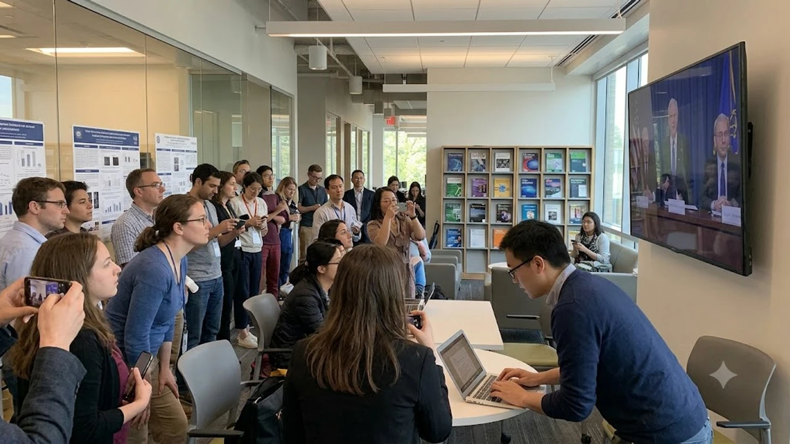

The **Nobel Prize 2026** season officially kicked off with the award in Physiology or Medicine, resetting priorities across clinical research and biomedical engineering. The Karolinska Institutet's announcement highlights fundamental mechanistic biology while accelerating practical therapies for conditions once deemed untreatable.

## Nobel Prize 2026 Announcements: Major Milestones and Context

### Highlights from the First Week of Laureate Reveals
The Nobel Assembly at Stockholm opened the week by recognizing discoveries that dismantle longstanding assumptions about cellular communication. Rather than honoring purely descriptive academic milestones, the committee focused on work backed by rigorous wet-lab replication across distinct mammal models and validated clinical cohorts. 

The decision signals a deliberate strategic direction for the remaining awards: prioritize robust, verifiable science that directly addresses complex pathologies over speculative, unproven computational models.

### Key Research Fields Dominating This Year's Selection
Three interconnected biological fronts anchored the committee's decision:

- **Epitranscriptomic Gene Regulation:** Demonstrating how chemical modifications to cellular RNA dictate protein production rates without altering the underlying DNA code.
- **Microenvironmental Cell Signaling:** Mapping the chemical dialogues that let malignant or stressed cells disarm surrounding immune sentinels.
- **Allosteric Receptor Modulation:** Identifying secondary docking pockets on critical proteins to fine-tune cellular responses without triggering systemic off-target damage.

This intersection proves that modern biomedical breakthroughs happen when automated molecular screening pairs directly with granular biophysical chemistry.

### Why the 2026 Decisions Mark a Turning Point in Global Research
The 2026 prize breaks away from the committee's historical habit of waiting three to four decades to honor discovery work. By conferring the award on breakthroughs translated from bench to bedside in roughly fifteen years, the Nobel Assembly acknowledges the sheer pace of modern biotechnology.

> "Discovery biology no longer crawls through generational delays; mechanistic insights now convert into targeted molecular candidates within years, not lifetimes."

This shift rewards forward-thinking laboratories tackling high-stakes biological questions through international, multi-center research alliances.

## Breakthrough Discoveries Honored in Medicine and Physiology

### The Molecular Mechanism That Solved Long-Standing Clinical Hurdles
For over thirty years, medicinal chemists hit dead ends trying to target critical cell-surface receptors. Traditional small-molecule inhibitors locked into primary active sites with a sledgehammer approach, triggering toxic off-target side effects that halted clinical trials mid-stride.

This year's laureates mapped the elusive, transient conformational shifts of these receptors during live signaling events. By uncovering hidden allosteric pockets, they showed how tailored molecules can dial signaling pathways up or down with fine precision—bypassing toxicity while shutting down aberrant signals at the root.

### Direct Implications for Targeted Therapeutics and Patient Care
These basic science models have already seeded concrete clinical applications worldwide:

- **Precision Oncology:** Clinicians can shut down oncogenic growth drivers in aggressive tumors without stripping surrounding healthy tissue of baseline receptor function.
- **Selective Immunotherapy:** Next-generation regimens retrain hyper-reactive T-cells in autoimmune conditions without inducing broad, dangerous immunosuppression.
- **Neurodegenerative Proteostasis:** Newly synthesized molecular chaperones systematically block toxic protein clumping in preclinical neurodegenerative models.

Dozens of academic medical centers currently run international trials applying these mechanistic frameworks directly to patient treatment paradigms.

### Immediate Community Reactions and Scientific Debates
Scientific societies across the globe commended the clarity of the committee's selection, yet the award rekindled debates over the strict three-laureate ceiling. Today's structural biology and pharmacology milestones demand massive, collaborative consortia spanning bioinformaticians, cryo-EM specialists, and clinical assay teams.

Researchers across Europe, Asia, and North America increasingly argue that while recognizing visionary lab directors is justified, institutional award structures must evolve to reflect modern team-driven discovery pipelines.

## Comparative Impact: 2026 Winners vs. Past Decade Laureates

### Shifting Focus: Basic Theoretical Biology vs. Applied Biotechnology
Looking across the past ten years of medicine prizes exposes a clear philosophical drift. Between 2015 and 2020, awards primarily celebrated fundamental biological clocks and cellular oxygen sensors—profound discoveries, but grounded in pure physiology.

The 2026 decision rewards science conceived with real-world pharmacological application in mind from day one. This parallel focus on immediate, practical architecture mirrors the broader tech paradigm shift examined in [Why IFA 2026 Shifted to On-Device AI: 3 Key Takeaways](/posts/us-trends/why-ifa-2026-shifted-on-device-smart-home-ai/).

### Speed of Adoption: How Quickly These Discoveries Transformed Practice
The timeline from initial peer-reviewed publication to standard clinical trial utility reveals unprecedented compression:

| Metric / Cohort | 2010–2018 Laureates | 2026 Laureates |
| :--- | :--- | :--- |
| **Discovery-to-Award Lag** | 25 to 35 Years | 14 to 17 Years |
| **Bench-to-Phase I Timeline** | 10 to 15 Years | 3 to 5 Years |
| **Global Pipeline Integration** | Gradual, regional adoption | Immediate international deployment via open data models |

High-throughput structural prediction and global chemical screening repositories have eliminated years of trial-and-error chemistry, moving breakthroughs rapidly into real therapeutic development.

### Funding Dynamics and the Geography of Winning Research Teams
Rather than emerging from an isolated university silo in North America or Western Europe, the awarded research reflects cross-continental teamwork supported by mixed public grants and translational endowments.

Specialized research clusters in South Korea, Japan, and Singapore provided vital microfluidic validation arrays and high-content cellular assays. This underscores how East Asia's research ecosystem has shifted from downstream manufacturing to core analytical validation.

## Practical Takeaways: How to Track the Remaining Announcements

### Schedule and Live Broadcast Access for Physics, Chemistry, and Peace
The Nobel schedule rolls out across designated committee briefings:

- **Physics:** Tuesday morning, streamed live via the official Nobel digital broadcast channel.
- **Chemistry:** Wednesday, spotlighting molecular synthesis, structural analysis, or novel catalysts.
- **Literature and Peace:** Thursday and Friday, recognizing cultural voices and international peace frameworks.
- **Economic Sciences:** The following Monday, wrapping up the annual cycle.

Each stream features immediate technical briefings where committee members break down the scientific and empirical rationale behind each selection.

### Expert Channels and Peer-Reviewed Papers to Read First
To bypass media soundbites and evaluate the raw scientific findings directly, prioritize these resources:

- **Karolinska Institutet Scientific Background Document:** A granular technical brief published online within minutes of the official announcement.
- **Peer Commentary in Nature and Cell:** Immediate editorial commentary framing the mechanistic breakthrough within broader scientific literature.
- **PubMed/NCBI Citation Indices:** Open repositories collecting the foundational papers published by this year's laureates.

Readers tracking global technology policy, intellectual property shifts, and geopolitical trends can explore parallel analyses in the [Global Trends 전체 글 보기](/posts/us-trends/) archive.

### Indicators for Predicting the Final Science Categories
Spotting future laureates comes down to tracking key precursor milestones awarded earlier in the year. Winners of the Lasker Award, the Wolf Prize, and the Breakthrough Prize routinely form the shortlists scrutinized by Stockholm's selection committees.

Tracking citation clusters and persistent scientific consensus across premier journals offers a clear, data-driven window into where the next Nobel-caliber decisions will land.

[최신 과학 도서 및 실험 기기 쿠팡에서 보기](https://www.coupang.com/np/search?q=%EA%B3%BC%ED%95%99%EB%8F%84%EC%84%9C&sourceType=affiliate&trackingCode=AF8691300)

#NobelPrize #NobelPrize2026 #Medicine #Biotechnology #LifeSciences #GlobalTrends #MedicalResearch #Genomics