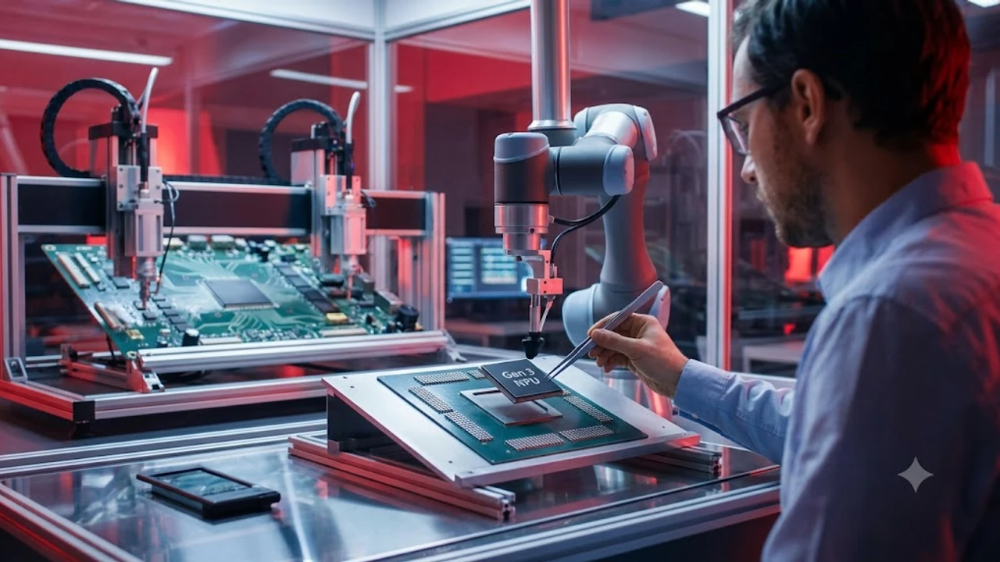

The landscape of consumer mobile hardware is shifting rapidly as **on-device AI phones** transition from experimental software gimmicks to core computing engines. Late-2026 silicon design prioritizes local edge intelligence, running complex multimodal tasks directly on device without pinging a remote server. This architectural pivot gives users instant processing speeds, uncompromised offline access, and rock-solid personal privacy.

## Next-Gen NPU Architectures and Speed Gains

### Dedicated Silicon vs Hybrid Cloud Processing
The primary engine driving this leap is the transition to dedicated Neural Processing Units (NPUs) built specifically for INT4 and FP8 quantized matrix multiplications. Instead of splitting tasks over fragile cellular networks, modern mobile chips reserve dedicated high-bandwidth memory pipelines exclusively for local AI workloads.

* **On-Device Execution:** Sub-10ms response times for text generation, zero network dependency, zero external token costs.
* **Hybrid Fallback:** Reserved exclusively for trillion-parameter foundation tasks, reducing average cellular uplink usage by up to 78%.
* **Memory Bandwidth:** Direct LPDDR5X-9600 access ensures generative token throughput exceeds 35 tokens per second on localized models.

### Latency Reductions in Real-Time Speech Translation
Natural language inference no longer stutters during cross-border communication. By deploying streamlined 3B-parameter sequence-to-sequence models directly within phone cache, translation pipelines now operate with near-zero latency.

> "True contextual translation requires acoustic nuance processing alongside semantic mapping—something only achievable when raw audio streams never leave local memory buffers."

This architecture enables simultaneous, bi-directional voice interpretation during cellular calls without noticeable audio desynchronization, fundamentally changing international commerce and travel.

### Power Consumption and Thermal Management
Early generative AI mobile features suffered from aggressive thermal throttling, but late-2026 fabrication improvements have brought significant relief. Advanced 2nm and refined 3nm process nodes offer dedicated low-power NPU clusters that execute continuous sensor monitoring and predictive scheduling under a strict 1.8W power envelope. Micro-vapor chambers dissipate concentrated heat spikes, allowing sustained on-device reasoning without turning the chassis into a hand warmer.

## Flagship Showdown: Late 2026 Model Comparisons

### Hardware Benchmarks Across Top Tier Brands
Flagship handsets now compete heavily on dedicated TOPS (Tera Operations Per Second) and effective memory allocation rather than standard CPU clocks.

| Device Tier | Dedicated NPU Power | Local Model Capacity | Typical Token Generation Speed |
| :--- | :--- | :--- | :--- |
| **Ultra Flagship** | 65+ TOPS | Up to 11B Quantized | ~38 tokens/sec |
| **Premium Mid-Range** | 42–48 TOPS | Up to 7B Quantized | ~24 tokens/sec |
| **Standard Tier** | 28–32 TOPS | Up to 3.8B Quantized | ~14 tokens/sec |

Global supply chain dynamics remain critical to understanding this hardware bifurcation, as detailed in our breakdown of [US Secondary Tariffs 2026: 3 Tech Supply Chain Impacts](/posts/us-trends/us-secondary-tariffs-2026-tech-supply-chain-impacts/).

### Local Memory Demands for 7B+ Parameter Models
Memory configurations are separating entry-level hardware from true AI workstations. Running a quantized 7B parameter multimodal model locally requires at least 5.5GB of dedicated RAM permanently allocated to model weights and KV caches. Consequently, premium 2026 handsets now standardize on 16GB to 24GB unified memory pools, ensuring that background operating system tasks remain completely fluid while generative inference runs in split-screen mode.

### Camera Processing and Generative Photo Editing
Image signal processors (ISPs) have fully merged with neural engines. Rather than applying post-capture filters, modern camera pipelines employ pixel-level semantic segmentation in real time.
* **Semantic Relighting:** Modifying directional sunlight and shadow softness before the shutter closes.
* **Instant Object Removal:** Local in-painting engines reconstruct occluded backgrounds at 60fps within the viewfinder preview.
* **Zero-Artifact Super Resolution:** Generating authentic high-frequency textures without blurry digital interpolation.

## Privacy and Offline Utility Breakdown

### Zero-Cloud Data Transmission Safeguards
Enterprise security teams and privacy-conscious users are driving the rejection of cloud-dependent assistants. On-device models run entirely within hardware-isolated enclaves (such as Knox Vault and Secure Enclave architectures). Cryptographic keys and personal prompts are processed locally, ensuring biometric data, financial logs, and confidential memos never traverse external networks.

### Offline Productivity and Document Summarization
Air travel and remote field operations no longer break generative workflows. Users can intake dense 200-page PDF reports, generate comprehensive executive briefs, extract actionable spreadsheets, and transcribe multi-speaker audio recordings entirely in Airplane Mode. 

### Edge AI Security Vulnerabilities to Consider
Local models introduce unique threat vectors that hardware developers must continuously patch:
* **Prompt Injection in Local OCR:** Malicious text embedded in printed invoices designed to trigger unauthorized system API calls.
* **Side-Channel Memory Extraction:** Potential model weight theft via physical power-trace probing on compromised bootloaders.
* **Adversarial Input Exploits:** Subtle pixel noise injected into documents to bypass local safety filters.

## Practical Setup and Battery Optimization Guide

### Enabling Native On-Device Assistants
To make the most of local processing, set default assistant permissions to bypass cloud execution. Head to your system device settings, navigate to **AI & Processing Engine**, toggle **Local-First Execution** to *Always Active*, and download the optimized offline language pack for your native dialect (typically 2.1GB to 3.8GB).

### Managing Background Cache for Local Models
Because localized foundation weights remain resident in memory to prevent cold-start delays, routine cache optimization is necessary:
* Clear temporary diffusion scratchpads weekly under **Storage > System Engine Data**.
* Set context-window memory limits to 8k tokens for non-analytical messaging workflows.
* Pin essential multimodal weights while allowing secondary creative modules to offload to UFS 4.1 storage when battery levels dip below 20%.

### Fine-Tuning Settings to Maximize Battery Life
Continuous neural processing can drain capacity if left unchecked. Enable dynamic frequency scaling for your NPU to dynamically throttle inference clock speeds during passive background tasks like auto-tagging photo galleries. 

For users seeking compatible high-speed accessories, chargers, and high-spec mobile hardware to keep up with demanding local AI compute, check out top-rated options directly: [관련 스마트 기기 쿠팡에서 보기](https://www.coupang.com/np/search?q=%ED%95%B4%EC%99%B8%EC%9D%B8%EA%B8%B0%EC%83%81%ED%92%88&sourceType=affiliate&trackingCode=AF8691300).

#GlobalTrends #OnDeviceAI #Smartphones #EdgeAI #TechTrends #2026Tech #MobileHardware #ArtificialIntelligence