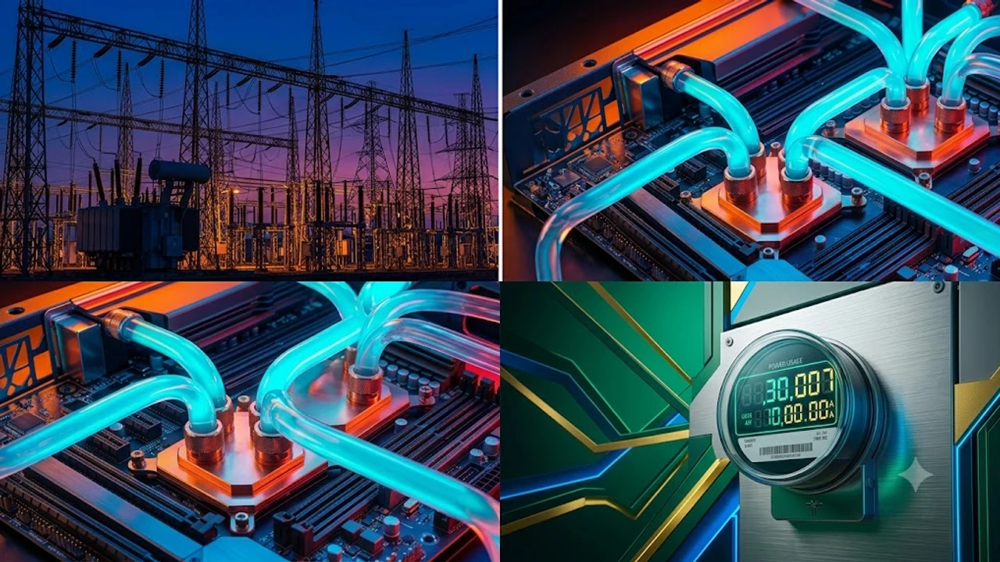

The swift expansion of artificial intelligence infrastructure has slammed directly into a hard legislative wall with the arrival of the **Ratepayer Protection Act 2026**. As hyperscale data center operations consume unprecedented volumes of electricity, regulators and utility commissions are stepping in to ensure industrial compute clusters stop inflating retail power bills. Managing the friction between regional grid capacity, commercial interconnection tariffs, and corporate computational demands has become the central operational hurdle for modern enterprise computing.

## The Ratepayer Protection Act: Why Congress Targeted Big Tech's Grid Demands

The political landscape in Washington shifted abruptly as constituent pushback over rising utility statements reached critical mass across regional electricity markets. Energy-intensive training clusters and inferencing campuses, which previously secured frictionless municipal approvals and localized tax abatements, now face rigorous federal scrutiny aimed at divorcing commercial algorithmic expansion from baseline residential utility accounts.

### The 417-3 Bipartisan Mandate That Shook Silicon Valley

The legislative momentum behind the statute caught technology sector strategists off guard, defying the gridlock that typical regulatory debates produce. The lopsided tally revealed nationwide consensus that municipal rate bases cannot serve as low-interest financing vehicles for commercial machine learning footprints:

- **Universal District Pressures**: Representatives from agricultural cooperatives across the Midwest and dense metropolitan districts along the Eastern Seaboard cited uniform voter frustration over compounding, double-digit rate hikes.
- **Strict Federal Firewalls**: The mandate explicitly prohibits regional transmission organizations from rolling speculative industrial interconnection expenses into retail rate calculations.
- **Direct Enforcement Authorities**: State regulatory commissions now carry the legal backing required to suspend interconnection permits for any commercial development that fails to fund its high-voltage substations upfront.

> "Public utility networks exist to provide reliable, affordable power to regular households, not to absorb the capital liabilities of private computational infrastructure." — House Energy and Commerce Committee Hearing

### How 100MW+ Hyperscale Facilities Shifted Utility Costs to Everyday Households

For decades, transmission planning relied on steady, incremental demand forecasts. The rapid emergence of single-tenant campuses demanding anywhere between 150 megawatts and a full gigawatt upended regional planning assumptions overnight:

- **Costly Substation Upgrades**: Step-down transformer replacements and breaker banks required multi-million-dollar outlays, often executed under emergency utility schedules.
- **Socialized Grid Costs**: Legacy utility accounting distributed these capital line items across millions of residential bills through general grid improvement fees.
- **High-Priced Peaker Plants**: Transmission operators frequently turned to inefficient, fast-ramping natural gas peakers to balance sudden computing spikes during afternoon peak loads, driving wholesale wholesale clearing prices higher.

### The "Bring Your Own Power" Mandate Reshaping Data Center Development

The core operational mechanism within the statute establishes an unambiguous "Bring Your Own Power" standard for planned compute centers requesting 50 megawatts or more. Operators can no longer depend solely on baseline public connections without demonstrating dedicated capacity:

- **Dedicated Generation Portfolios**: Developers must present long-term, direct-contracted power generation contracts before site engineering permits receive administrative clearance.
- **On-Premises Battery Storage**: Facilities must install firm behind-the-meter storage capable of islanding operations during high-stress alerts on the regional grid.
- **Heavy Curtailment Penalties**: Campuses that pull emergency surplus from the civilian network without pre-clearance face punitive tariff multipliers reaching 400% above index averages.

## Big Tech vs. Public Utilities: The Hidden Economics of the AI Power Bottleneck

Behind this legislative standoff lies a stubborn reality: the physical components that deliver power simply cannot scale at the speed of software deployment cycles.

### Hyperscaler Capex Meets Generation Bottlenecks in PJM and ERCOT

Cloud platforms continue to pour record capital expenditure into specialized accelerator chips, yet finished server racks sit in holding facilities waiting for energized connections. Within critical transmission systems like PJM Interconnection and ERCOT, administrative queues routinely surpass six years:

- **Severe Transformer Shortages**: Industrial-grade step-down units now carry procurement lead times exceeding three full calendar years.
- **Stalled Transmission Reviews**: Over 2,600 energy and storage assets across North America remain stuck in preliminary grid connection reviews.
- **Forced Curtailment Clauses**: Operators accepting conditional, interruptible utility contracts face sudden shutoffs during peak summer grid crunches, halting uninterrupted training jobs mid-stride.

For teams examining decentralized hardware frameworks to bypass centralized grid bottlenecks, our evaluation of [Why IFA 2026 Shifted to On-Device AI: 3 Key Takeaways](/posts/us-trends/why-ifa-2026-shifted-on-device-smart-home-ai/) explores how client-side processing handles localized workloads without depending on massive transmission pipelines.

### Beyond Nuclear Deals: The Surge in On-Site Solid Oxide Fuel Cells and Microgrids

Long-horizon nuclear generation contracts dominate technology headlines, but near-term capacity targets are pushing infrastructure architects toward immediately deployable, localized generation:

- **Solid Oxide Fuel Cells**: Engineering teams are installing modular fuel cell installations directly alongside machine rooms, running on pipeline gas or clean hydrogen mixtures to lock in 99.999% continuous availability.
- **Direct-Coupled Solar and Battery Arrays**: Expansive acreage surrounding server clusters is converting into dedicated solar and lithium-iron-phosphate battery networks built exclusively for computational draw.
- **Small Modular Reactor Commitments**: Multi-megawatt modular nuclear concepts have moved from conceptual technical papers into formal commercial procurement pipelines scheduled across the coming decade.

### Cost Re-allocation Models: Who Absorbs High-Voltage Interconnection Fees?

The structural resolution of this conflict fundamentally rewires how transmission infrastructure is funded and depreciated:

| Network Asset | Traditional Public Model | Ratepayer Protection Act Model | Capital Impact on Developers |
| :--- | :--- | :--- | :--- |
| **High-Voltage Transmission** | Spread across all regional accounts | 100% assigned directly to developer | Adds $45M to $120M in site preparation |
| **Substation Step-Down Hardware** | Absorbed into utility rate base | Capitalized upfront by tech tenant | Direct upfront cash outlay required |
| **Emergency Reserve Capacity** | Managed and billed by utility | Mandatory on-site storage assets | 15% to 25% increase in base build cost |
| **Grid Reliability Levies** | Flat per-kilowatt-hour charges | Dynamic peak-penalty structures | Sustained downward pressure on margins |

## Global Fallout: Will US Grid Regulations Reshape International AI Expansion?

Restricting open-ended transmission access across the United States is prompting a global reassessment of where computing assets should reside, redirecting foreign direct investment toward markets balancing energy access and industrial development.

### European Grid Interconnection Delays Mirroring American Resistance

Municipalities across Western Europe began enacting rigid computational power allocations long before US federal action took shape:

- **Capital City Moratoriums**: Local authorities across Dublin, Amsterdam, and Frankfurt established firm caps or full halts on new high-voltage computational connections.
- **Mandatory Heat Recycling**: European urban regulations require server halls to capture and reroute liquid exhaust into public district heating loops.
- **Rigid Hourly Carbon Accounting**: Regulators are eliminating bundled renewable certificates, requiring verified, real-time spatial matching with zero-emission assets.

International policy shifts are reshaping high-tech manufacturing, equipment supply lines, and trade routes worldwide, as outlined in our report on [US Secondary Tariffs 2026: 3 Tech Supply Chain Impacts](/posts/us-trends/us-secondary-tariffs-2026-tech-supply-chain-impacts/).

### South Korea's K-Grid Dilemma: Yongin Mega Semiconductor Clusters Facing Power Scarcity

South Korea represents an acute junction where silicon manufacturing and artificial intelligence compute clash directly over localized transmission constraints:

- **The Yongin Complex Draw**: The planned semiconductor and packaging hub in Gyeonggi Province requires a projected 10 gigawatts of steady baseload electricity—a total comparable to the output of roughly 10 standard nuclear units.
- **Transmission Rights-of-Way Obstacles**: Korea Electric Power Corporation faces persistent regional resistance to running high-voltage lines across inland provinces to transmit southern offshore wind and nuclear generation to the metropolitan core.
- **Regulatory Spillover**: South Korean policymakers are looking directly at the American legislative approach to prevent semiconductor and data center power draw from triggering retail electricity increases on domestic consumers.

### Cross-Border AI Sovereign Cloud Shifts to Energy-Rich Regions

To keep up with deployment milestones, global tech corporations are channeling billions into jurisdictions with trapped or surplus clean power reserves:

- **Nordic Clean Energy Hubs**: Abundant hydro and geothermal capacity across Iceland, Norway, and Sweden is attracting model training facilities that operate independent of metropolitan grid pressures.
- **Middle Eastern Energy Campuses**: Regional investment funds across the UAE and Saudi Arabia are integrating gigawatt-scale computing centers directly into dedicated solar arrays.
- **Distributed Edge Topologies**: System architects are increasingly deploying smaller, geographically dispersed inferencing clusters that disperse power demands across dozens of municipal grids rather than centralizing load in a single fragile zone.

## Strategic Alternatives: How Hyperscalers Navigate Strict Power Constraints

Surviving this regulatory environment demands comprehensive adjustments from electrical engineers, datacenter architects, and technology operators.

### Transitioning from Traditional Grid Draw to Private Clean Energy Offtake

Cloud corporations are essentially transforming into independent power producers to preserve their digital growth targets while remaining on the right side of public regulators:

- **Equity Positions in Energy Projects**: Companies are taking active ownership stakes in geothermal developments and offshore wind arrays rather than relying on paper-only utility offsets.
- **Real-Time Microgrid Coordination**: Enterprise campuses are deploying intelligent control software that balances generation output, battery reserves, and compute workloads on a second-by-second basis.
- **Dedicated Municipal Agreements**: Operators are financing municipal clean power installations in exchange for long-term generation capacity that bypasses residential distribution lines entirely.

### Accelerated Deployments of Liquid-Cooled, High-Efficiency Compute Clusters

Efficiency metrics have shifted from routine facility considerations into make-or-break deployment criteria:

- **Direct-to-Chip Cold Plates**: Moving from standard fan cooling to closed-loop liquid systems reduces auxiliary building electricity consumption by up to 40%.
- **Dielectric Immersion Tanks**: Submerging dense hardware in specialized fluids maximizes compute concentration per square meter without adding heavy building air conditioning loads.
- **Intelligent Workload Balancing**: Cloud orchestration engines dynamically throttle flexible model training runs during hours of high wholesale pricing, shifting processing loads to off-peak periods when consumer grid demand dips.

### Long-Term Regulatory Risk Mitigation for Enterprise AI Infrastructure Leaders

Enterprise technology executives targeting sustainable growth under current regulatory models must align infrastructure designs with realistic grid parameters:

1. **Power-First Site Selection**: Evaluate prospective development sites based on existing substation headroom and local utility regulatory stances before weighing proximity to fiber network exchanges.
2. **True Islanding Architecture**: Design facility electrical networks with the capacity to run entirely off-grid for at least 72 hours during severe transmission crunches.
3. **Geographic Diversification**: Protect operations against sudden regulatory changes by dividing large-scale training jobs and processing workloads across different regulatory regions.

[관련상품 쿠팡에서 보기](https://www.coupang.com/np/search?q=%ED%95%B4%EC%99%B8%EC%9D%B8%EA%B8%B0%EC%83%81%ED%92%88&sourceType=affiliate&trackingCode=AF8691300)

#RatepayerProtectionAct #AIDataCenters #EnergyCrisis #CleanEnergy #BigTech #Infrastructure2026 #GridReliability #GlobalTrends