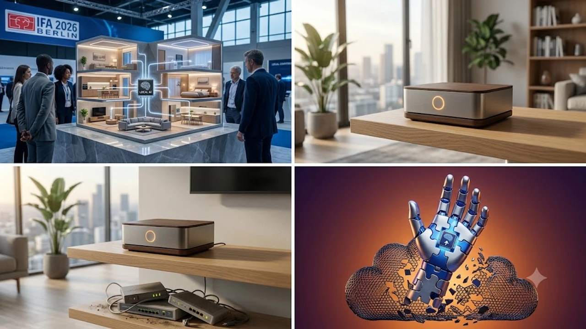

The rapid consumer pivot toward on-device smart home AI marked a historic inflection point as IFA 2026 closed its exhibition halls in Berlin. Homeowners and enterprise tech buyers are aggressively abandoning centralized cloud automation architectures in favor of decentralized edge computing nodes. This structural migration solves persistent friction points across network dependency, monthly subscription models, and residential data governance.

## The Zero-Cloud Paradigm: Why IFA 2026 Rewrote Smart Home Standards

The 2026 edition of IFA in Berlin crystallized a long-simmering discontent among European and global smart appliance owners. For nearly a decade, the consumer IoT sector operated on an exploitative premise: capture audio, video, and operational telemetry from household machines and ship those raw payloads to hyperscale cloud providers for contextual computation. That architecture is disintegrating under regulatory, financial, and ethical scrutiny.

### Privacy Fatigue and Pushback Against Mandatory Cloud Subscriptions

Consumer tolerance for recurring fees tied to basic hardware functionality has broken down. Across major electronics retail sectors in 2026, buyers routinely walk away from products requiring a monthly $9.99 subscription merely to run human-presence detection or localized climate scheduling. Beyond recurring charges, high-profile breaches of home security cameras and leaked audio transcripts between 2024 and 2025 created deep residential distrust. Connected households now demand isolated execution environments that keep intimate family routines strictly within their four walls.

### The Shift from Cloud Latency to Local Edge Processing

A standard round-trip API call to an off-premise server averages 250 to 600 milliseconds under optimal conditions, frequently spiking past two seconds during regional peak internet congestion. By contrast, specialized low-power silicon embedded directly inside residential gateways executes ambient routines in less than 30 milliseconds. When an emergency acoustic trigger sounds—such as shattered glass, a smoke alarm chime, or a fall detection event—relying on external DNS resolution and wide-area network routing is a structural liability. Localized inference guarantees operational determinism regardless of external network stability.

### Regulatory Catalysts in Europe Setting Global Privacy Baselines

The European Union's aggressive enforcement of the AI Act alongside tightened GDPR interpretation guidelines created an immense legal barrier for foreign cloud ecosystems at IFA 2026. Regulators demand explicit transparency and stringent containment mechanisms for multi-modal domestic telemetry. Household appliances collecting biometrics, room spatial layouts, and continuous acoustic monitoring must prove that personal identifiable information is not hoarded for commercial model training without explicit, unbundled authorization. Hardware makers discovered that processing and purging telemetry on localized neural execution cores eliminates massive corporate compliance fines and class-action risks.

---

## On-Device Smart Home AI vs. Traditional Cloud Hubs: A Direct Comparison

The choice between a cloud-dependent automation stack and an on-premise edge hardware architecture fundamentally alters how a modern residence functions during everyday tasks and unexpected network disruptions. 

### Processing Speed and Offline Resilience During Network Outages

Traditional cloud hubs turn into useless plastic bricks when broadband cuts out or DNS providers experience regional outages. On-device smart home AI systems, by contrast, maintain absolute functional continuity. If an internet service provider experiences a backhaul severance, localized inference models continue to coordinate presence sensing, automated thermostat moderation, motorized shades, and safety protocols without interruption. The architectural blueprint reflects the computational evolution explored in [On-Device AI Phones: Top 5 Breakthroughs in 2026](/posts/us-trends/on-device-ai-phones-top-breakthroughs-2026/), demonstrating that edge silicon now possesses sufficient compute density to handle complex multi-step reasoning locally.

| Operational Vector | Legacy Cloud Hub Architecture | On-Device AI Architecture (2026 Standard) |
| :--- | :--- | :--- |
| **Response Latency** | 250 ms – 1,500 ms (Network dependent) | < 35 ms (Deterministic local processing) |
| **Broadband Dependency** | Complete failure on connection drop | 100% operational retention for local logic |
| **Data Vectorization** | Raw audio/video stream egress to cloud | Local embedding generation, raw data dropped |
| **Ongoing Maintenance** | Recurring monthly SaaS charges | Zero subscription fees for core automation |
| **Protocol Compatibility** | Walled-garden cloud APIs | Matter-over-Thread, local IP binding |

### Data Protection: Raw Sensor Feeds vs. Local Vector Embeddings

The operational differentiator lies in how data is represented and transferred. In a legacy system, an optical sensor on a robotic vacuum or smart security hub streams uncompressed pixels to an off-site data center for semantic labeling. 

> "Transmitting raw domestic imagery across public backbones to identify an obstacle or family member is an unacceptable security flaw in modern consumer electronics. The edge node must compute the semantic vector and destroy the raw buffer in dynamic RAM within a single clock cycle."

Under modern on-device AI standards, an on-board neural processing unit (NPU) processes the camera buffer, derives a non-invertible mathematical vector, labels the target as a piece of furniture or an inhabitant, and instantly purges the raw visual data. No sensitive household imagery ever traverses the home's external gateway.

### Hardware Unit Economics and the Long-Term Cost of Ownership

While localized NPU-equipped hubs carry a marginal retail price premium of $40 to $70 over barebones cloud bridge devices, the long-term economics strongly favor the edge consumer. Bypassing mandatory cloud tier packages saves an average household between $120 and $240 annually per home management setup. For hardware manufacturers, offloading millions of simultaneous real-time multi-modal inference tasks from enterprise cloud data centers directly to client silicon slashes operational infrastructure expenditures, eliminating massive ongoing server upkeep costs.

---

## The South Korean Offensive: Samsung and LG Leading Edge Automation

South Korean technology giants seized the center stage at IFA 2026 by operationalizing edge-native computing across high-end consumer appliances. Moving far beyond simple mobile app controls, both conglomerates demonstrated production-ready appliances that execute autonomous domestic reasoning without persistent remote cloud reliance.

### LG ThinQ ON and ThinQ Claw: Autonomous Contextual Agents

LG Electronics headlined its Berlin showcase with the public debut of **ThinQ ON**, an AI-powered smart home hub paired with its autonomous execution agent, **ThinQ Claw**. Instead of requiring rigid, scripted verbal prompts, ThinQ Claw parses unstructured messages sent via standard messaging platforms or local microphones. 

When a user transmits a casual note like *"Heading home now,"* ThinQ Claw reads ambient indoor temperatures, estimates commute arrivals, checks local utility peak-rate hours, and commands the residential heat pump to initiate high-efficiency cooling. Crucially, LG engineered the platform to run context identification and routine execution logic locally, utilizing embedded NPU chipsets that minimize external communication to encrypted status handshakes.

### Samsung SmartThings Vision AI Companion and Local Ecosystems

Samsung countered at the Berlin grounds by presenting an aggressive expansion of its SmartThings edge infrastructure. Leveraging custom neural silicon embedded across its 2026 Bespoke line—including refrigerators, induction ranges, and laundry hubs—Samsung introduced localized Vision AI. 

- **Automated Food Inventory Auditing:** Internal wide-angle cameras identify fresh produce, detect spoilage velocity, and suggest recipes locally without transmitting refrigerator video streams to external servers.
- **SmartThings Local Network Mesh:** If broadband connectivity drops entirely, Samsung's television screens and smart displays act as backup edge brokers, maintaining Thread and Zigbee automation sequences across all household switches and safety monitors.
- **Dynamic Energy Balancing:** Appliances coordinate power drawing via local network protocols to shave peak consumption during grid stress events, operating independently of third-party utility servers.

### What European Market Acceptance Means for Global Consumer Electronics

Europe serves as the world's most challenging proving ground for consumer data governance and energy efficiency regulations. By securing swift regulatory compliance and positive reception from European retail distribution channels for their edge-first platforms, South Korean manufacturers established an operational blueprint for other international markets. The success achieved in Berlin accelerates the global phase-out of legacy, cloud-bound consumer electronics, forcing American and Chinese IoT vendors to match this localized processing benchmark.

---

## Practical Deployment: How to Build a Privacy-First Smart Home in 2026

Transitioning an existing household from vulnerable cloud architectures to an autonomous, edge-managed smart home requires deliberate hardware selection and intentional network topology planning.

### Auditing Existing IoT Hardware for Local NPU and Matter Compatibility

The first step involves cataloging installed smart devices to identify operational dependencies:
- **Discard Proprietary Cloud Bridges:** Phase out legacy hubs that rely strictly on vendor-specific webhooks and proprietary cloud APIs to operate.
- **Prioritize Matter-over-Thread Endpoints:** Ensure new smart bulbs, smart plugs, motorized switches, and climate sensors carry native Matter certification. Matter establishes a universal, local application layer that communicates directly across home radio frequencies without phoning home.
- **Verify On-Board Compute Metrics:** When purchasing new major appliances or surveillance hubs, check product specifications for discrete neural processing capabilities capable of at least 2.5 TOPS (Trillions of Operations Per Second) of local execution.

### Setting Up an Air-Gapped Local Automation Controller

To achieve true zero-cloud sovereignty, power users are deploying local edge automation controllers:
1. **Deploy an Edge Hub:** Choose a localized coordinator, such as a Home Assistant Green, an open-source NPU-equipped SBC (Single Board Computer), or commercial local hubs like LG ThinQ ON.
2. **Isolate Smart Hardware on an IoT VLAN:** Configure your residential Wi-Fi router to place all smart switches, cameras, and appliances onto a dedicated Virtual Local Area Network (VLAN).
3. **Restrict WAN Access:** Block external internet access for that isolated VLAN entirely. Matter-enabled devices and local NPU hubs will continue to communicate flawlessly across the local network boundary without the ability to upload packets to third-party tracking domains.

### 3 Non-Negotiable Security Checklist Steps Before Buying 2026 AI Appliances

Before investing in new connected household hardware, verify these three essential safeguards:

- **Demand Local Storage and Processing Guarantees:** Ensure the product packaging and technical whitepaper confirm that biometric facial scans, floor plans, and audio files are stored in encrypted physical storage on the device, not uploaded to a vendor cloud bucket.
- **Inspect Fallback Manual Controls:** Never install critical infrastructure—such as smart deadbolts, water shut-off valves, or primary cooktops—that lack physical bypass switches or offline mechanical access.
- **Review Device Firmware Lifecycle Policies:** Under current regulations, reputable manufacturers must guarantee at least five years of offline firmware maintenance and local bug patching. Avoid white-label IoT gadgets that abandon software support shortly after release.

[관련상품 쿠팡에서 보기](https://www.coupang.com/np/search?q=%EC%8A%A4%EB%A7%88%ED%8A%B8%ED%99%88+%ED%97%88%EB%B8%8C+Matter&sourceType=affiliate&trackingCode=AF8691300)

#GlobalTrends #SmartHome #OnDeviceAI #IFA2026 #EdgeComputing #DataPrivacy #MatterIoT #TechTrends2026