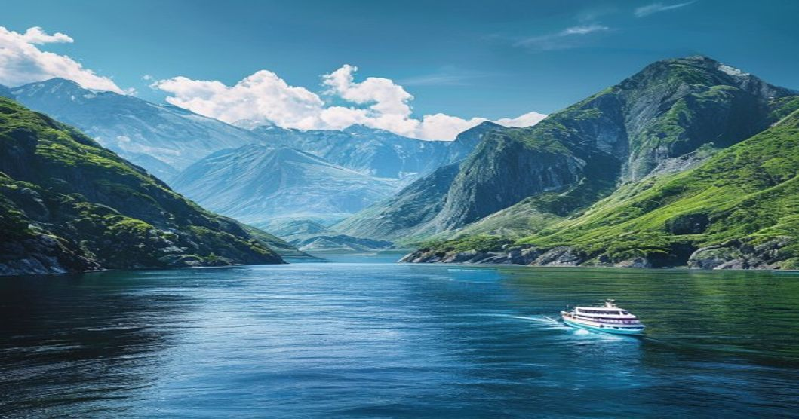

유럽 남부의 기록적인 폭염과 아시아 전역의 찜통더위가 매년 최악의 수치를 갱신하면서, 올여름 휴가를 준비하는 여행객들의 시선이 일제히 북쪽을 향하고 있습니다. 2026 쿨케이션 트렌드는 더 이상 일시적인 유행이 아닌, 기후 변화 시대의 생존형 여행법으로 확고히 자리 잡았습니다. '시원한(Cool)'과 '휴가(Vacation)'가 결합된 이 신조어는 태양이 내리쬐는 전통적인 해변 휴양지를 피하고, 서늘하고 쾌적한 기후를 자랑하는 고위도 국가나 고산 지대를 찾아 떠나는 거대한 움직임을 뜻합니다. 무더위에 지친 체력을 소모하는 대신 대자연 속에서 진정한 휴식을 누리고자 하는 수요가 폭발적으로 증가하는 현시점, 실패 없는 피서 목적지와 실질적인 준비 전략을 분석합니다.

## 2026년 여름, 왜 쿨케이션인가?

### 기후 변화가 바꾼 여름휴가 공식

과거 여름휴가의 상징은 이탈리아 남부의 뜨거운 태양이나 스페인의 북적이는 해변이었습니다. 그러나 최근 몇 년간 지중해 연안 국가들이 40도를 웃도는 극심한 폭염과 가뭄으로 국가 비상사태까지 선언하면서 관광 지형도가 완전히 뒤바뀌었습니다. 찌는 듯한 열기 속에서 유명 관광지 인파에 섞여 걷는 일은 휴식이 아닌 고역이 되었습니다. 그 결과, 여행객들은 더위로 인한 육체적 스트레스를 원천 차단하고 쾌적한 환경에서 야외 활동을 온전히 즐길 수 있는 대체 목적지로 눈을 돌리게 되었습니다.

### 수요 급증이 보여주는 여행 패턴의 변화

글로벌 온라인 여행사들의 예약 데이터는 이러한 근본적인 변화를 명확히 보여줍니다. 2026년 여름 성수기 기준, 북유럽과 아시아 내 고위도 지역 항공권 검색량이 눈에 띄게 치솟으며 주목받고 있습니다. 극성수기인 7월과 8월, 전통적인 인기 휴양지의 숙박 예약률 증가세가 정체된 반면, 한여름에도 평균 기온 15\~25도를 유지하는 지역의 예약률은 가파른 상승 곡선을 그리고 있습니다. 이는 단순한 호기심을 넘어, 비용을 조금 더 지불하더라도 확실한 피서를 원한다는 소비자의 강력한 의지가 반영된 결과입니다.

## 유럽의 쿨케이션 성지: 아이슬란드와 스칸디나비아

### 빙하 트레킹과 백야의 매력, 아이슬란드

여름철 평균 기온이 10\~15도 안팎에 머무는 아이슬란드는 2026 쿨케이션의 최정점에 서 있는 목적지입니다. 여행객이 케플라비크 공항에 첫발을 내디딜 때 뺨을 스치는 서늘한 바람은 그 자체로 일상에서의 완벽한 해방감을 선사합니다. 눈보라가 치는 한겨울에는 접근조차 힘든 링로드(Ring Road) 자동차 투어가 여름에는 쾌적하고 안전하게 가능해집니다. 해가 지지 않는 백야 현상 덕분에 늦은 밤까지 얼음동굴 탐험과 빙하 트레킹, 웅장한 폭포 투어를 꽉 차게 즐길 수 있어 시간적 효율성 측면에서도 압도적인 우위를 점합니다.

### 피오르드와 쾌적한 하이킹, 노르웨이

노르웨이를 필두로 한 스칸디나비아반도 국가들 역시 역대급 호황을 누리는 중입니다. 7월 한여름에도 에어컨이 전혀 필요 없는 선선한 날씨 속에서 송네 피오르드(Sognefjord)의 장엄한 절경을 마주하는 크루즈 탑승은 여행의 질을 수직 상승시킵니다. 끝없이 펼쳐진 거대한 산맥의 트레킹 코스를 땀 한 방울 흘리지 않고 상쾌하게 오를 수 있다는 점은 전 세계 하이커들과 가족 단위 여행객들을 북유럽으로 불러 모으는 가장 강력한 무기입니다.

## 아시아의 서늘한 피난처: 홋카이도와 윈난성

### 라벤더 만발한 여름 피서지, 삿포로와 비에이

장시간의 비행이 부담스러운 여행객이라면 아시아 내에서도 훌륭한 대안을 찾을 수 있습니다. 일본 홋카이도는 아시아 최상단 고위도에 위치해 한여름에도 20도 초중반의 습도 낮은 쾌적한 날씨를 자랑합니다. 특히 7월 중순 후라노와 비에이 지역을 끝없이 수놓는 보랏빛 라벤더 언덕은 시각적인 청량함까지 더해줍니다. 도심의 뜨거운 아스팔트 대신 시원한 자작나무 숲길을 걷고, 저녁에는 선선한 기온 속에서 따뜻한 노천 온천욕을 즐기는 일은 여름 홋카이도에서만 누릴 수 있는 특별한 호사입니다.

### 쾌적한 사계절 봄의 도시, 중국 쿤밍

최근 한국 여행객 사이에서 검색량이 기하급수적으로 늘어난 또 다른 지역은 중국 윈난성의 쿤밍(곤명)입니다. 해발고도 1,900m 고원 지대에 자리 잡아 '영원한 봄의 도시'라 불리는 이곳은 한여름 평균 기온이 23도 수준에 머뭅니다. 쿤밍을 기점으로 윈난성 일대의 리장 고성과 만년설이 덮인 옥룡설산을 연계하는 코스는 에어컨 바람 없이도 서늘함을 만끽하며 웅장한 대자연을 감상하는 아시아 최고의 쿨케이션 루트로 평가받고 있습니다.

## 쿨케이션 여행 계획 시 주의점 및 단점

### 얼리버드 예약 필수와 높은 항공권 가격

전 세계의 피서 수요가 한정된 서늘한 지역으로 몰리는 현상은 필연적으로 가격 상승을 동반합니다. 2026년 여름 쿨케이션 목적지로 향하는 직항 항공권과 뷰가 좋은 주요 숙박시설은 이미 봄철부터 빠르게 매진되는 추세입니다. 스칸디나비아나 아이슬란드의 경우 평소에도 높은 현지 물가에 성수기 프리미엄까지 더해져 전체 여행 예산이 크게 치솟을 위험이 존재합니다. 철저한 예산 계획과 사전 예약 없이 임박해서 일정을 잡으면 기대 이상의 막대한 지출을 감당해야 합니다.

### 날씨의 변덕과 꼼꼼한 옷차림 준비

여름철 '시원하다'는 말은 현지 기상 상황에 따라 언제든 '추워질 수 있다'는 의미와 맞닿아 있습니다. 홋카이도 산간 지방이나 북유럽 국가들은 한여름에도 비가 오거나 아침저녁으로 기온이 한자리 수로 급격히 떨어지는 경우가 매우 잦습니다. 가벼운 반소매와 얇은 여름옷만 챙겨갔다가는 현지에서 값비싼 방한용품을 급히 구매해야 하는 낭패를 겪을 수 있습니다. 겹쳐 입기 좋은 얇은 바람막이와 기능성 경량 패딩 준비는 선택이 아닌 필수 조건입니다.

## 성공적인 2026년 여름 해외여행을 위한 전략

### 목적지별 최적의 방문 시기 분석

완벽한 쿨케이션을 위해서는 지역별 미세한 기후 특성과 성수기 시점을 정확히 파악해야 합니다. 홋카이도의 라벤더 절경을 노린다면 7월 중순이 최적기지만, 번잡한 인파를 피해 호숫가 캠핑의 여유를 즐기고 싶다면 8월 말이 훨씬 합리적인 선택입니다. 반면 아이슬란드와 노르웨이는 7월 말부터 8월 초가 일 년 중 가장 기온이 따뜻하고 내륙의 모든 산악 도로가 통제 없이 개방되므로, 오프로드 탐험을 원한다면 반드시 이 시기를 공략하는 것이 현명합니다.

### 예산 절감과 가치 소비를 동시에 잡는 팁

폭등하는 여행 경비를 방어하려면 유연하고 현명한 접근 방식이 요구됩니다. 대도시의 비싼 글로벌 체인 호텔 대신 현지 분위기를 생생하게 느낄 수 있는 에어비앤비나 외곽의 산장(Cabin) 숙박을 활용하고, 직접 장을 봐서 요리하는 횟수를 늘리면 식비를 크게 줄일 수 있습니다. 렌터카 이용 시 전기차를 대여해 유류비를 절감하는 방식도 추천합니다. 이는 2026 쿨케이션의 기저에 깔린 친환경 및 지속 가능한 여행이라는 최신 가치 소비 트렌드와도 완벽하게 부합합니다.

유럽 여름 여행지의 구체적인 일정과 숙소 정보는 [유럽 여름 여행 완전 가이드](/posts/world-travel/europe-summer-travel-guide-2026/)도 함께 확인해보세요.

#해외여행트렌드 #쿨케이션 #2026여름여행 #여름휴가추천 #아이슬란드여행 #홋카이도여름 #폭염피서지 #해외여행지추천
