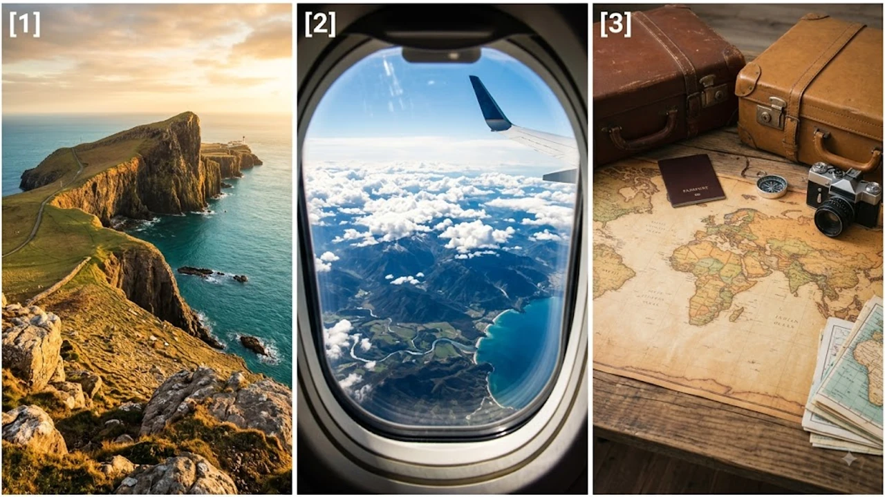

2026년 8월 여름 휴가철을 맞아 유럽 전역의 하늘길이 최악의 혼잡을 겪으면서 **유럽 항공 지연** 및 결항 피해를 호소하는 여행객이 급증했습니다. 유럽 관제탑(ATC)의 만성적인 인력 난과 기록적인 여름 운항량이 맞물려 주요 환승 공항의 대기 시간이 폭증한 결과입니다. 현지에서 연쇄 지연을 겪고 있거나 출국을 앞두고 있다면, 항공사의 피해보상 규정과 현장 대처법을 정확히 파악해 두어야 마땅한 권리를 보상받을 수 있습니다.

## 2026년 8월 유럽 항공 지연 대란의 원인과 실태

### 관제탑(ATC) 인력 부족과 최다 운항량 경신
유로컨트롤(Eurocontrol) 발표에 따르면 2026년 8월 첫째 주 유럽 상공의 일일 운항 건수는 역대 최대치인 3만 4천 편을 돌파했습니다. 반면 서유럽 주요 관제소의 인력 부족률은 15% 이상을 기록하며 수속 및 이착륙 통제에 심각한 과부하가 걸렸습니다. 이로 인해 관제탑 제한(ATC Restriction)으로 인한 출발 지연이 전체 지연 원인의 40% 이상을 차지하는 기현상이 이어지고 있습니다.

### 파리·암스테르담·프랑크푸르트 등 주요 환승 공항 혼잡도
유럽의 핵심 허브인 프랑스 파리 샤를드골(CDG), 네덜란드 암스테르담 스키폴(AMS), 독일 프랑크푸르트(FRA) 공항은 연쇄 지연의 직격탄을 맞았습니다. 수하물 처리 인력 부재와 게이트 배정 지연이 겹치면서 환승 시간이 2시간 미만인 승객들의 연결편 탑승 실패 사례가 하루 평균 수백 건씩 보고되는 상황입니다.

### 결항 및 연쇄 지연 발생 시 항공사별 현황
유럽계 대형 항공사인 루프트한자, 에어프랑스-KLM뿐만 아니라 라이언에어, 이지젯 같은 저비용 항공사(LCC) 역시 일정이 꼬이면서 승무원 법정 근무 시간 초과로 인한 기습 결항을 연이어 발표했습니다. 특히 주말 출발편은 한 번 지연이 발생하면 당일 대체편 배정이 사실상 불가능한 실정입니다. 최근 여행 수요 폭증 배경은 [세계여행지 최신 트렌드](/posts/world-travel/world-travel-1783348391782/)에서도 자세히 확인하실 수 있습니다.

## EU261 보상 규정: 내가 받을 수 있는 진짜 혜택은?

### 보상금 지급 대상 조건(3시간 이상 지연 및 결항)
유럽연합의 강력한 승객 보호 법안인 **EU261 규정**에 따라 EU 출발 항공편 또는 EU 국적 항공사를 이용해 EU에 도착하는 승객은 지연 시간에 따라 정액 보상금을 요구할 수 있습니다.
- **최종 목적지 도착 기준 3시간 이상 지연 시**: 비행거리에 따라 1인당 **250유로에서 최대 600유로**까지 현금 보상 산정
- **항공사 귀책 사유가 명확한 결항**: 대체편 제공과 별도로 정액 보상금 즉시 청구 가능

### 관제탑 문제(ATC) vs 항공사 귀책 사유 차이점
보상 청구 시 가장 주의할 대목은 항공사의 책임 회피 전략입니다. 기상 악화나 관제탑 명령(ATC)은 '불가항력적 기상/안전 사유(Extraordinary Circumstances)'로 분류되어 항공사가 정액 보상금 지급을 거부할 명분이 됩니다. 하지만 기체 정비 이상, 승무원 시간 초과, 항공사 자체 시스템 오류는 **100% 항공사 귀책**이므로 반드시 증빙을 확보하여 보상을 요구해야 합니다.

### 숙박비·식대·교통비 지원(Duty of Care) 청구 방법
지연 원인이 불가항력이라 할지라도 항공사는 승객에게 **돌봄의 의무(Duty of Care)**를 제공해야 합니다. 2시간 이상 지연 시 식음료 쿠폰이 지급되어야 하며, 야간 대기 발생 시 근처 호텔 숙박비와 공항-호텔 간 왕복 이동 교통비를 제공할 의무가 있습니다. 항공사가 현장에서 쿠폰을 주지 않는다면 개인 신용카드로 결제한 뒤 영수증을 첨부해 사후 정산 청구가 가능합니다.

> **💡 핵심 포인트**: 항공사 현장 직원이 "관제탑 사유라 아무것도 해줄 수 없다"고 주장하더라도 식비 및 호텔비 영수증 정산(Duty of Care)은 예외 없이 청구할 수 있습니다. 영수증 원본과 탑승권을 반드시 보관하세요.

## 현장에서 지연·결항 발생 시 즉각적인 대처 가이드

### 항공사 데스크 대기열 피하고 앱으로 즉시 재예약하기
결항이나 대형 지연이 선언되면 공항 카운터 앞에는 수백 명의 줄이 서게 됩니다. 현장 데스크 대기열에 서서 시간을 허비하지 말고, 즉시 해당 항공사 공식 모바일 앱이나 고객센터 전화로 접속해 대체편을 재배정받는 편이 훨씬 빠릅니다.

### 현수수료 및 영수증 증빙 자료 완전 확보법
추후 보상금 신청 및 영수증 청구를 위해 다음 자료를 현장에서 즉시 사진으로 남겨두어야 합니다.
- **전광판(FIDS) 사진**: 본인이 탑승할 편명과 지연 시간/결항 문구가 선명하게 찍힌 전광판
- **지연 사유 확인서**: 항공사 데스크나 게이트에서 발급해 주는 지연/결항 사유서(Delay Certificate)
- **지출 영수증**: 식당, 택시, 호텔 결제 시 품목이 명확히 기재된 영문 세부 영수증(Itemized Receipt)

### 대체 항공편 및 기차 결합 노선 확보 노하우
동일 항공사의 다음 대체편이 24시간 이후에나 가능하다면, 타 항공사 연결편이나 유럽 고속열차(Eurostar, TGV, ICE 등) 대체 탑승권을 요구할 권리가 있습니다. 항공사가 이를 거부하고 자력 이동을 안내할 경우, 대체 교통편 결제 전 "자가 결제 후 환불 가능 여부"를 이메일이나 문자 기록으로 남겨두어야 추후 분쟁을 예방할 수 있습니다. [2026년 여름 해외여행 추천 도시 5곳](/posts/world-travel/summer-travel-cities-2026/)을 방문할 때도 이 같은 대체 이동 수단 확보는 필수적입니다.

## 8월 유럽 여행객을 위한 피해 예방 필수 체크리스트

### 아침 첫 비행기 예약으로 연쇄 지연 회피하기
유럽 내 이동 시 오전 6시~8시 사이에 출발하는 **첫 번째 스케줄 비행기**를 선택하면 지연 위험을 80% 이상 줄일 수 있습니다. 앞선 비행편의 지연 여파가 누적되지 않은 상태이고, 기체와 승무원이 공항에 미리 대기하고 있기 때문입니다.

### 환승 시간 최소 3시간 이상 확보 전략
현재 유럽 주요 허브 공항의 입국 심사 및 보안 검색 대기 시간이 매우 길어졌습니다. 동일 티켓 연결편이라도 환승 대기 시간을 최소 3시간 이상, 수하물을 직접 찾아서 다시 붙여야 하는 LCC 조합이라면 최소 4시간 30분 이상 확보하는 일정 짜기가 안전합니다.

### 여행자 보험 특별 약관 활용 및 추가 보상 팁
EU261 보상과 별개로 국내 해외여행자 보험의 **'항공기 지연/결항 추가 비용'** 특약에 가입되어 있다면 중복 보상이 가능합니다. 보통 4시간 이상 지연 시 라운지 이용비, 식사비, 대체 교통비를 일정 한도(보통 20~50만 원) 내에서 실비 보상하므로 출국 전 약관을 재확인하는 것이 현명합니다.

- **출국 전 준비**: 항공사 앱 알림 설정 온(ON), 전자 탑승권 캡처 저장
- **공항 도착 후**: 게이트 변경 여부 15분 단위 체크, 비상용 단백질바/물 소지
- **지연 발생 시**: 지연 사유 증명서 즉시 요구, 결제 영수증 타임라인별 정리

#유럽항공지연 #EU261보상 #유럽여행지연 #항공권결항보상 #유럽관제탑지연 #8월유럽여행 #유럽항공권환불 #항공기지연대처 #유럽여행자보험 #해외여행팁