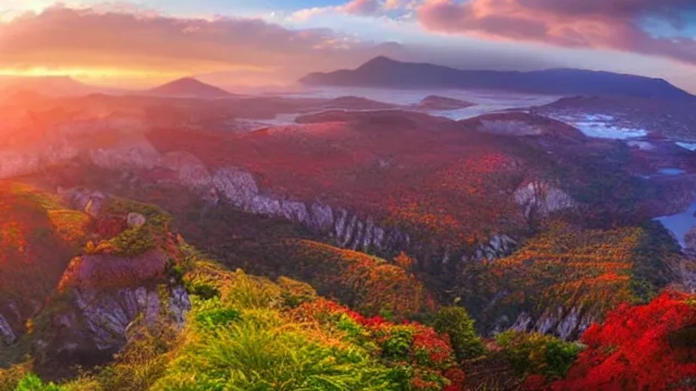
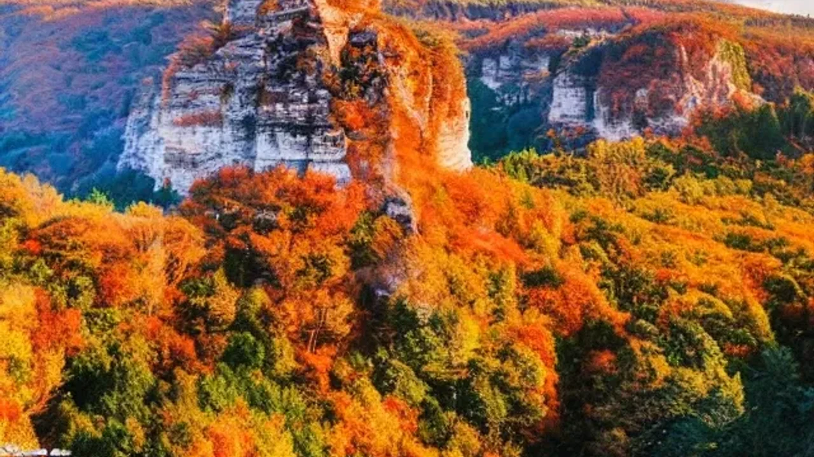

최근 여행의 패러다임이 단순한 휴식에서 개인의 취미에 깊이 몰입하는 형태로 빠르게 변화하고 있습니다. 단순한 호캉스를 넘어 서핑, 하이킹, 골프 등 평소 즐기던 액티비티를 여행의 중심으로 삼는 **플레이케이션**이 올여름 가장 주목받는 트렌드로 자리 잡았습니다. 나만의 취미에 온전히 몰입할 수 있는 완벽한 숙소 선택법과 실전 가이드를 전해드립니다.

## 왜 지금 플레이케이션인가? 트렌드 전격 분석

### 일반 호캉스 vs 액티비티 몰입형 여행, 무엇이 다를까?
기존의 호캉스가 호텔 방 안에서 넷플릭스를 보거나 수영장에서 사진을 남기는 '소극적 휴식'에 머물렀다면, 취미 중심 여행은 철저히 '행동과 성취'에 초점을 맞춥니다. 고급 침구와 조식 뷔페 대신 새벽 서핑 세션을 위한 해변 접근성이나 자전거 정비 공간을 갖춘 숙소를 선택하는 식입니다. 침대에 누워 흘려보내는 시간보다 몸을 움직여 얻는 카타르시스가 현대인의 스트레스를 더 해소해 준다는 연구 결과가 이를 뒷받침합니다.

### 2026년 서구권과 국내 MZ세대가 취미 여행에 열광하는 이유
글로벌 시장 조사 기관인 크리테오(Criteo)의 2026년 소비자 트렌드 보고서에 따르면, 젊은 여행자의 68%가 '여행을 통해 새로운 기술을 숙달하거나 취미를 깊이 있게 즐기기를 원한다'고 답했습니다. SNS에 과시하는 획일적인 명소 방문에 피로감을 느낀 이들이 개인적 성취감และ 독창적인 경험으로 눈을 돌린 결과입니다. 퇴근 후 주말마다 즐기던 서핑이나 클라이밍을 여행지라는 낯선 환경에서 확장할 때 만족도는 극대화됩니다.

### 데이터로 보는 올여름 가장 핫한 플레이케이션 테마 Top 3
글로벌 숙박 플랫폼의 올해 6월 예약 동향을 분석한 결과, 가장 가파른 상승세를 보인 테마는 단연 서핑, 마운틴 트레킹, 그리고 실내 테니스/골프입니다. 특히 서핑 테마 숙소는 전년 동기 대비 예약률이 42% 증가했으며, 전문 강습과 장비 보관을 연계한 올인원 패키지 숙소들이 트래픽을 독점하고 있습니다. 

## 플레이케이션 유형별 장단점 및 추천 타겟

### 양양·제주 코스: 서핑 및 수상 스포츠 중심 여행의 명과 암
강원도 양양 인구해변이나 제주 중문 일대의 서프 스테이들은 바다와 곧바로 연결되는 압도적인 접근성을 자랑합니다. 
* **장점:** 아침에 눈을 뜨자마자 서프보드를 들고 바다로 뛰어들 수 있으며, 강사 및 다른 서퍼들과의 자연스러운 네트워킹이 가능합니다.
* **단점:** 여름 성수기 특유의 소음과 인파로 인해 정적인 휴식을 원하는 이들에게는 오히려 스트레스가 될 수 있습니다. 날씨의 영향을 강하게 받아 파도가 없는 날에는 일정이 붕괴될 위험이 존재합니다.

### 강원·평창 코스: 마운틴 하이킹 및 트레일 러닝 숙소의 매력과 주의점
해발 고도가 높은 평창이나 정선 일대의 아웃도어 스테이는 여름철 무더위를 피해 숲속을 달리고 싶은 하이커들에게 최적의 선택지입니다.
> **에디터 팁:** 고지대 숙소는 새벽 트레일 러닝 후 곧바로 스파나 사우나를 즐길 수 있는 회복 시설(Recovery Facility)이 잘 갖춰져 있는지 반드시 따져봐야 합니다. 
다만 대중교통 접근성이 현저히 떨어지므로 자차나 렌터카가 필수적이며, 주변에 도보로 이동 가능한 편의시설이 부족하다는 점은 감수해야 합니다.

### 도심 근교 코스: 실내 테니스·골프 인도어 플레이케이션의 가성비 비교
날씨 리스크를 피하고 싶다면 경기 가평이나 용인 일대에 위치한 실내 코트 연계형 독채 펜션이 훌륭한 대안이 됩니다. 기습적인 폭우나 폭염 속에서도 쾌적하게 테니스 랠리를 즐기거나 스크린 골프를 즐길 수 있어 직장인들의 주말 1박 2일 단기 여행으로 선호도가 높습니다. 야외 액티비티보다 이국적인 풍광은 덜하지만, 일정 예측 가능성이 100%라는 점에서 시간 효율성이 뛰어납니다.

[관련 글 보기](/posts/world-travel/)

## 100% 성공하는 플레이케이션 숙소 고르는 꿀팁

### 1단계: 내 장비 보관 및 렌탈 인프라 확인하기
고가의 개인 서프보드나 카본 자전거, 골프백을 안전하게 보관할 수 있는 전용 락커나 거치 공간이 있는지 체크해야 합니다. 보안 장치가 허술한 숙소라면 여행 내내 장비 분실 우려로 스트레스를 받게 됩니다. 장비가 없는 초보자라면 숙소 자체적으로 하이엔드급 장비를 저렴하게 대여해 주는지 확인하는 것이 비용을 아끼는 지름길입니다.

### 2단계: 숙소 연계 로컬 강습 프로그램 유무 체크리스트
단순히 잠만 자는 곳이 아니라 현지 전문가의 밀착 케어를 받을 수 있는 숙소여야 비용이 아깝지 않습니다. 숙소 예약자에게 제공되는 독점 강습 시간표가 있는지, 강사의 자격증이 검증되었는지 예약 전 상세 페이지를 꼼꼼히 훑어보아야 합니다. 숙소와 연계된 프로그램은 개별적으로 사설 업체를 예약하는 것보다 동선과 비용 면에서 훨씬 유리합니다.

### 3단계: 커뮤니티 공간이 활성화된 숙소를 선택해야 하는 이유
혼자 취미를 즐기는 것보다 같은 관심사를 가진 사람들과 정보를 공유할 때 여행의 깊이가 달라집니다. 저녁 시간에 액티비티 후기를 나눌 수 있는 공용 라운지나 바비큐 존이 잘 마련된 게스트하우스형 스테이를 고르면, 단순한 관광객이 아닌 로컬 크루의 일원이 된 듯한 깊은 소속감을 경험하게 됩니다.

## 에디터가 직접 다녀온 플레이케이션 리얼 후기

### 낮에는 서핑, 밤에는 네트워킹: 활기찬 서프 캠프에서의 2박 3일
지난달 직접 찾은 양양의 한 서프 스테이는 서퍼들을 위해 정교하게 설계된 공간이었습니다. 아침 7시 라인업 세션을 마치고 숙소로 돌아오면 따뜻한 온수가 나오는 야외 샤워실에서 보드를 세척하고 곧바로 객실로 들어갈 수 있는 동선이 매력적이었습니다. 저녁에는 라운지에서 강사들이 촬영해 준 서핑 영상을 보며 자세 교정 피드백을 받는 클리닉이 열려 실력이 한 단계 성장하는 계기가 되었습니다.

### 온전히 나에게 집중하는 시간: 숲속 아웃도어 스테이가 준 뜻밖의 회복
정선의 깊은 산속에 위치한 하이커 전용 숙소에서의 경험은 완전한 고독과 몰입의 시간이었습니다. 숙소에서 제공한 트레킹 지도를 따라 오대산 자락의 숨은 코스를 오롯이 혼자 걸었습니다. 일과를 마치고 돌아와 계곡 물소리를 들으며 즐긴 노천탕은 육체적 피로를 완벽하게 씻어주었으며, 도심의 소음에서 벗어나 취미에 온전히 몰입하는 삶의 활력소가 되었습니다.

### 초보자도 몸만 가면 되는 웰컴 패키지 활용 실전 팁
많은 숙소들이 여름 시즌을 맞아 '몸만 오는 패키지'를 선보이고 있습니다. 이 시스템을 영리하게 이용하려면 체크인 시간보다 최소 2시간 일찍 도착해 웰컴 센터에서 장비를 선점해야 합니다. 늦게 도착할수록 본인의 체형이나 숙련도에 맞는 장비가 소진되어 불편한 상태로 액티비티를 진행해야 할 확률이 높아지기 때문입니다. 미리 제공되는 안내 이메일을 통해 개인 준비물(선크림, 기능성 의류 등)만 철저히 챙긴다면 비용 대비 최상의 효율을 누릴 수 있습니다.

#플레이케이션 #여름여행트렌드 #액티비티숙소 #서핑여행 #트레일러닝 #아웃도어스테이 #취미여행 #2026여행