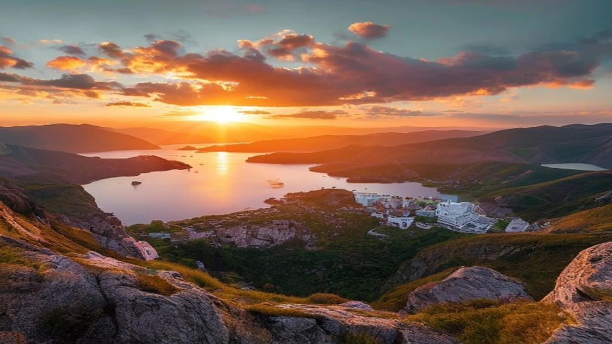

2026년 여름 휴가철이 본격적으로 시작되면서 복잡한 대도시를 벗어나 여유를 찾으려는 **소도시 여행 트렌드**가 뜨거운 주목을 받고 있습니다. 랜드마크 중심의 인증샷 투어에 피로감을 느낀 여행자들이 자신만의 숨겨진 목적지를 찾아 발길을 돌리기 시작한 것입니다. 올여름 가장 핫한 글로벌 세컨더리 시티의 매력과 구체적인 여행 팁을 지금부터 상세히 공유합니다.

## 2026년 오버투어리즘의 역습: 왜 지금 소도시인가?

### 글로벌 메가 트렌드 '안티 투어리즘'의 등장 배경
최근 전 세계 유명 관광지들이 수용 가능한 인원을 초과하면서 현지 주민들의 삶을 위협하는 오버투어리즘 문제가 임계점에 도달했습니다. 이로 인해 관광객의 무분별한 유입을 거부하거나 제한하는 **안티 투어리즘(Anti-Tourism)**이 강력한 글로벌 메가 트렌드로 부상했습니다. 이제 대중적인 명소를 찾아가 빽빽한 인파에 치이는 전통적인 관광 방식은 여행자들에게 깊은 피로감을 안겨주고 있습니다.

### 유명 관광지의 규제 강화와 바가지요금 실태
실제로 이탈리아 베네치아는 당일치기 관광객에게 입장료를 부과하기 시작했고, 일본 교토의 기온 거리는 관광객의 통행을 일부 제한하는 강수를 두었습니다. 여기에 글로벌 고물가 현상이 맞물리면서 유명 대도시의 숙박비와 식비는 천정부지로 치솟았습니다. 현지 물가에 비해 과도하게 책정된 바가지요금과 서비스 질 저하는 여행자들로 하여금 기존 목적지를 기피하게 만드는 결정적인 계기가 되었습니다.

### 대도시를 벗어나 세컨더리 시티로 향하는 여행객들
> "유명한 대도시(Primary City)의 그늘에 가려져 있던 차선책 도시, 즉 **세컨더리 시티(Secondary Cities)**가 2026년 최고의 대안으로 선택받고 있습니다."

여행자들은 이제 도쿄 대신 근교의 시즈오카를, 방콕 대신 치앙라이를 선택합니다. 대도시의 인프라는 부족할지언정, 현지인의 진짜 삶을 가장 가까이서 들여다볼 수 있는 청정 구역으로 이동하는 발길이 급증하는 추세입니다.

## 나만 알고 싶은 2026년 글로벌 세컨더리 시티 추천 리스트

### 아시아의 숨은 보석: 베트남 남두 섬과 일본 지방 소도시
베트남 푸꾸옥 인근에 위치한 **남두 섬(Nam Du Island)**은 아직 단체 관광객의 손길이 닿지 않아 원시의 자연을 고스란히 간직한 청정 구역입니다. 투명한 에메랄드빛 바다와 저렴한 로컬 해산물 물가는 가성비를 중시하는 자유 여행자들에게 천국과 같습니다. 또한, 일본의 **다카마쓰**나 **마쓰야마** 같은 시코쿠 지역의 소도시들은 고유의 우동 문화와 오래된 온천을 여유롭게 즐길 수 있어 인기가 높습니다.

### 유럽의 한적한 로컬 감성: 대도시 근교의 청정 마을들
프랑스 파리의 살인적인 여름 물가를 피해 기차로 2시간 거리에 있는 **콜마르(Colmar)**나 루아르 계곡의 작은 마을들로 향하는 유럽 여행객이 크게 늘었습니다. 동화 같은 목조 주택 and 아기자기한 운하가 펼쳐지는 이곳은 굳이 값비싼 투어를 신청하지 않아도 걸어서 동네 전체를 사로잡을 수 있는 매력을 지녔습니다. 

### 인스타그램을 사로잡은 '나만 아는 청정 구역' 명소의 특징
* **낮은 외국인 비율:** 현지 주민들의 일상에 자연스럽게 녹아들 수 있는 환경을 선사합니다.
* **독특한 로컬 콘텐츠:** 그 지역에서만 생산되는 전통주, 특산물, 수공예품이 존재합니다.
* **자연 친화적 환경:** 콘크리트 빌딩 숲이 아닌 산, 바다, 호수 등 가공되지 않은 청정 자연을 배경으로 삼습니다.

## 세컨더리 시티(소도시) 여행의 명확한 장단점 분석

### 장점: 압도적인 가성비, 여유로운 로컬 문화 체험, 인파 없는 힐링
소도시 여행의 가장 큰 매력은 대도시 대비 **최대 40\~50% 이상 저렴한 숙박비와 식비**입니다. 파리나 도쿄 중심가의 좁은 비즈니스호텔 가격으로 소도시에서는 넓은 가든이 딸린 로컬 주택 전체를 빌릴 수 있습니다. 유명 맛집 앞에 길게 줄을 설 필요가 없고, 마주치는 현지인들과 여유롭게 인사를 나누며 진짜 그 나라의 문화를 온전히 체감하게 됩니다.

[관련 글 보기](/posts/world-travel/)

### 단점: 제한적인 대중교통망, 언어 장벽, 부족한 대형 숙박 인프라
물론 명확한 한계도 존재합니다. 기차나 버스의 배차 간격이 몇 시간에 한 대꼴로 길거나, 아예 대중교통이 닿지 않아 이동 동선을 짜기가 까다롭습니다. 영어 통용 국가가 아니라면 번역 앱 없이는 기본적인 주문조차 어려울 수 있으며, 5성급 글로벌 체인 호텔이나 대형 쇼핑몰 같은 현대적인 편의시설을 기대하기 어렵습니다.

### 단점을 완벽하게 상쇄하는 현실적인 절충안
> "소도시의 단점을 해결하는 핵심 열쇠는 바로 **'허브 앤 스포크(Hub and Spoke)'** 전략에 있습니다."

인근의 거점 대도시를 베이스캠프로 삼아 숙소를 잡고, 낮 시간 동안에만 기차나 렌터카를 이용해 주변 소도시를 당일치기로 촘촘하게 둘러보는 방식이 권장됩니다. 이렇게 하면 대도시의 편리한 인프라와 소도시의 한적한 감성을 동시에 누릴 수 있습니다.

## 초보자도 실패 없는 소도시 여행 준비 가이드

### 구글 맵과 해외 렌터카 예약을 활용한 교통편 마스터하기
교통이 불편한 지방 소도시를 자유롭게 누비기 위해서는 국제운전면허증 발급이 필수입니다. 구글 맵에 방문할 장소들을 미리 핀으로 저장해 두고, 도보 동선과 차량 이동 경로를 대조해야 길을 잃지 않습니다. 소도시의 경우 소형 렌터카 수요가 빠르게 매진되므로, 항공권 결제 직후 렌터카 예약 플랫폼을 통해 차량을 미리 확보해 두는 편이 안전합니다.

### 에어비앤비와 로컬 게스트하우스 안전하게 고르는 법
대형 호텔이 없는 소도시에서는 현지인의 집을 빌리는 에어비앤비나 오래된 민박을 이용해야 합니다. 이때 실패 확률을 줄이려면 아래 세 가지 조건을 반드시 검토해야 합니다.
- **슈퍼호스트** 마크가 부여된 숙소인지 확인
- 최근 6개월 이내에 작성된 후기가 최소 20건 이상인지 체크
- 도심 가로등이 잘 정비된 안전 구역인지 스트리트 뷰로 사전 파악

### 소도시 여행 시 반드시 챙겨야 할 필수 번역 및 오프라인 지도 앱
소도시는 통신 음영 지역이 발생할 확률이 대도시보다 높습니다. 따라서 데이터를 사용할 수 없는 비상 상황을 대비해 구글 맵의 **오프라인 지도 다운로드** 기능을 활용해 해당 지역 지도를 기기에 미리 저장해 두어야 합니다. 또한 번역 앱의 실시간 카메라 번역 기능을 오프라인 팩으로 다운로드해 두면 인터넷 연결 없이도 현지 메뉴판과 표지판을 직관적으로 읽어낼 수 있어 매우 유용합니다.

**함께 읽으면 좋은 글**
- [산악 바이브 여행, 2026 진짜 시원한 해외 명소](/posts/world-travel/mountain-vibes-alpine-summer-escape-2026/)
- [2026 여권 순위 발표! 한국 2위로 바뀐 무비자 국가는?](/posts/world-travel/2026-global-passport-ranking-korea-visa-free-travel-guide/)

#소도시여행트렌드 #세계여행지 #세컨더리시티 #안티투어리즘 #해외여행준비 #2026여행트렌드 #숨은명소 #가성비여행 #로컬여행 #힐링여행