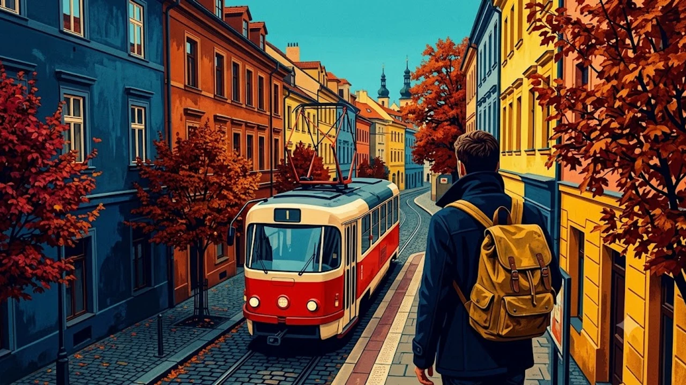

유럽의 뜨거웠던 여름 성수기가 지나가고 선선한 바람이 불어오는 가을은 복잡한 인파를 피해 온전히 도시의 정취를 누리기 가장 좋은 계절입니다. 고즈넉한 단풍과 낭만적인 풍경 속에서 여유로운 일정을 계획 중이라면, 쾌적한 기후와 효율적인 동선을 갖춘 **가을 유럽 여행** 코스로 서유럽과 중유럽 핵심 도시를 묶어 떠나는 일정을 권합니다.

## 가을 정취를 극대화하는 서유럽 낭만 동선

파리와 브뤼셀, 암스테르담을 잇는 고속열차 구간은 환승 없이 빠르게 도심 간 이동이 가능해 이동 피로를 크게 덜어냅니다.

### 파리 센강변과 뤽상부르 공원의 늦가을 산책
가을 파리의 매력은 화려한 명소보다 노랗게 물든 플라타너스 낙엽이 깔린 골목길에 머물 때 더욱 짙어집니다. 뤽상부르 공원 녹색 의자에 앉아 따뜻한 플랫 화이트를 마시며 여유를 즐기거나, 오후 늦게 오르세 미술관 인근 센강변을 따라 퐁네프 다리까지 걷는 코스는 이 계절만의 특권입니다. 

- **추천 일정**: 오전 뤽상부르 공원 산책 후 생제르맹데프레 골목 서점 및 노천카페 방문
- **동선 팁**: 해질녘 바토무슈나 센강 유람선을 타면 단풍 든 강변과 에펠탑 야경을 동시에 감상 가능

### 고속열차 유로스타로 이어지는 벨기에 브뤼헤 당일치기
파리 북역에서 고속열차로 1시간 20분이면 브뤼셀에 닿고, 이곳에서 로컬 열차로 1시간을 더 달리면 중세 수로 도시 브뤼헤에 도착합니다. 가을 운하를 따라 붉게 물든 덩굴식물과 붉은 벽돌 건물이 수면에 반영되는 광경은 한 폭의 유화처럼 다가옵니다. 

- 마르크트 광장 종탑에 올라 붉은 지붕으로 가득 찬 시내 전경 조망
- 운하 유람선을 타고 조용한 백조 서식지(사랑의 호수 공원) 둘러보기

### 운하 도시 암스테르담의 가을 골목 탐방
브뤼셀에서 탈리스(유로스타)를 이용하면 2시간 만에 암스테르담 중앙역에 도달합니다. 요르단(Jordaan) 지구 골목길 사이로 흐르는 운하와 운치 있는 가을빛 가로수길은 자전거를 대여해 달리기에 최적의 컨디션을 보여줍니다.

## 클래식한 낭만이 흐르는 중유럽 황금 코스

프라하, 빈, 부다페스트로 이어지는 중유럽 구간은 오스트리아 연방철도(OBB) 레일젯(Railjet) 열차망이 촘촘해 국가 간 이동이 무척 매끄럽습니다.

### 낭만적인 페트르진 언덕과 프라하성 야경
가을의 프라하는 블타바강 안개와 어우러져 한층 몽환적인 분위기를 자아냅니다. 푸니쿨라를 타고 페트르진 언덕에 오르면 단풍으로 덮인 붉은 지붕 물결이 한눈에 들어옵니다. 카를교는 일출 무렵에 찾아야 관광객 무리 없이 차분한 새벽안개를 온전히 마주할 수 있습니다.

> "카를교 위에서 마주하는 가을 아침 안개와 페트르진 숲의 단풍은 중유럽 여행자들에게 가장 깊은 잔상을 남깁니다."

### 빈 벨베데레 정원과 비엔나 카페 하우스의 온기
프라하 중앙역에서 레일젯을 타고 약 4시간이면 음악의 도시 빈에 도착합니다. 클림트의 대표작이 걸린 벨베데레 상궁 정원은 가을 산책 코스로 손색이 없습니다. 쌀쌀해진 오후에는 100년 전통의 카페 자허나 첸트랄에 들러 아인슈페너와 자허토르테 한 조각으로 몸을 녹이는 시간이 필수 코스입니다.

### 다뉴브강 야경과 온천으로 마무리하는 부다페스트
빈에서 기차로 2시간 40분 거리인 부다페스트는 가을밤이 특히 화려합니다. 국회의사당 맞은편 바차니 광장이나 어부의 요새에서 감상하는 금빛 조명은 유럽 내에서도 독보적인 야경을 자랑합니다. 낮 동안 세체니 온천의 야외 온천탕에 몸을 담그면 장거리 이동으로 쌓인 여독을 말끔히 씻어낼 수 있습니다.

## 남유럽의 온화한 햇살을 즐기는 이탈리아 북부 루트

10월과 11월에도 비교적 기온이 온화한 이탈리아 북부는 가을 미식과 예술을 함께 즐기기에 알맞습니다.

### 밀라노 대성당 루프탑과 브레라 예술 지구
밀라노는 트렌디한 패션 거리와 역사적 유산이 공존하는 관문 도시입니다. 두오모 대성당 루프탑에 오르면 고딕 양식의 첨탑 사이로 맑은 가을 하늘과 알프스 산자락의 능선이 아련하게 펼쳐집니다. 브레라 지구의 미술관과 감각적인 편집숍들을 천천히 거닐어보길 권합니다.

### 토스카나 구릉지대 사이프러스 길 드라이브
피렌체에서 렌터카를 빌려 발도르차 평원으로 향하면 황금빛으로 물든 들판과 사이프러스 나무가 길게 늘어선 전형적인 토스카나 풍경이 나타납니다. 몬탈치노와 몬테풀치아노의 와이너리에 들러 가을 햇살 아래 숙성된 브루넬로 디 몬탈치노 와인을 시음해보는 여정은 잊지 못할 추억이 됩니다.

### 수상 도시 베네치아의 골목길 걷기
골목 전체가 미로처럼 얽힌 베네치아는 여름의 습한 열기가 가라앉은 가을에 가장 쾌적하게 여행할 수 있습니다. 다만 성수기와 주말 일부 날짜에는 도시 입장료 정책이 적용되므로 사전에 규정을 확인해야 불필요한 과태료를 피할 수 있습니다. 자세한 규정은 [베네치아 당일치기 300유로 벌금 피하는 법](/posts/world-travel/venice-day-trip-entry-fee-qr-fine-guide/) 포스팅을 참고하시기 바랍니다.

## 환절기 유럽 자유여행 실전 준비와 짐 싸기

일교차가 10도 이상 벌어지는 가을 유럽을 다닐 때는 날씨 변화와 치안에 대비한 전략적인 패킹이 뒷받침되어야 합니다.

### 큰 일교차를 대비하는 레이어드 의류 셋업
가을 유럽은 한낮에는 따뜻한 햇살이 비추다가도 해가 지면 체감온도가 급격히 떨어집니다. 부피가 큰 두꺼운 외투 한 벌보다는 얇은 니트, 셔츠, 경량 패딩, 방풍 재킷을 여러 겹 겹쳐 입는 방식이 기온 변화에 유연하게 대처하기 좋습니다. 또한 돌바닥(코블스톤)이 대부분인 구시가지를 하루 만 보 이상 걸어야 하므로 쿠션감이 우수한 편안한 트래킹화나 러닝화가 필수입니다.

### 국가 간 열차 이동 짐 분실 방지 요령
기차 짐칸에 캐리어를 둘 때는 반드시 와이어 자물쇠로 고정해 두고, 여권·신용카드·스마트폰 등 귀중품은 항상 몸에 밀착되는 크로스백이나 복대에 보관해야 소매치기 표적에서 벗어날 수 있습니다. 열차가 정차역에 멈출 때마다 수하물 선반을 수시로 확인하는 습관도 잊지 말아야 합니다. 

- 캐리어 도난 방지용 스프링 와이어 자물쇠 구비
- 소매치기 방지 핸드폰 스트랩 및 도난 방지 힙색 착용

[여행 안전용품 및 도난방지 가방 쿠팡에서 보기](https://www.coupang.com/np/search?q=%EC%97%AC%ED%96%89%EC%9A%A9%ED%92%88&sourceType=affiliate&trackingCode=AF8691300)

#유럽여행 #가을유럽여행 #유럽자유여행 #서유럽여행코스 #중유럽여행 #이탈리아여행 #유럽기차여행 #유럽여행준비물