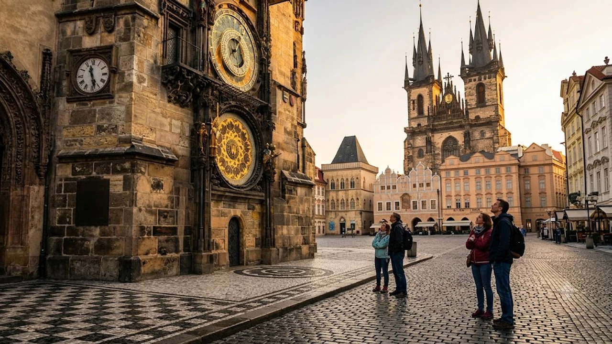

선선한 바람이 블타바강을 스치는 9월은 붉은 지붕과 고딕 양식 건축물이 빚어내는 고즈넉한 정취를 누리기 알맞은 시기입니다. 낭만 가득한 **체코 프라하 여행**을 준비하고 있다면, 구시가지 골목 사이로 번지는 중세 유럽 감성과 현지인들이 아끼는 골목 명소를 눈여겨보는 것이 좋습니다. 동유럽 자유여행 특유의 여유를 만끽하며 걷기 좋은 도보 코스와 골목마다 숨은 매력을 정리했습니다.


## 구시가지 광장과 카를교에서 만나는 중세의 숨결

### 천문시계탑과 틴 성모 교회의 아침
인파가 붐비기 전인 오전 8시 무렵 구시가지 광장에 들어서면 600년 역사를 지닌 천문시계의 정교한 외관을 온전히 감상할 수 있습니다. 매 정시 울리는 종소리와 사도 인형의 움직임은 광장 한편의 노천카페에 앉아 따뜻한 에스프레소 한 잔과 함께 지켜볼 때 한층 깊은 울림을 전합니다. 틴 성모 교회의 뾰족한 쌍탑이 푸른 하늘과 맞닿는 풍경은 도시의 고풍스러운 실루엣을 대표합니다.

### 카를교의 석상과 블타바강의 일몰
성 요한 네포무크 조각상을 비롯해 다리 양옆으로 늘어선 30개의 성인 석상은 카를교를 야외 조각 박물관으로 탈바꿈시킵니다. 해질녘 주황빛 노을이 강물 위에 부서질 때 다리 위에서 거리 악사가 연주하는 클래식 선율은 여행자의 발걸음을 멈추게 합니다. 

> 구시가지 쪽 교탑에 올라 내려다보는 카를교와 프라하성 전경은 붉은 노을빛이 어우러질 때 가장 눈부신 장관을 이룹니다.

### 하벨 시장에서 엿보는 현지인의 일상
평일 아침부터 열리는 하벨 시장은 신선한 베리류 과일과 수제 목각 인형, 현지 공예품이 정갈하게 진열된 공간입니다. 달콤한 시나몬 향을 풍기는 뜨르들로(굴뚝빵)를 손에 쥐고 시장 골목을 거닐면 오랜 역사를 품은 프라하 시민들의 생활상을 가까이서 마주하게 됩니다.

## 프라하성과 말라 스트라나의 고풍스러운 골목 산책


### 성 비투스 대성당의 압도적인 고딕 미학
프라하성의 심장부인 성 비투스 대성당은 거대한 수직 첨탑과 정교한 고딕 아치로 압도적인 웅장함을 드러냅니다. 체코 아르누보 거장 알폰스 무하가 작업한 스테인드글라스 창문은 오후 햇살을 머금을 때 성당 내부를 신비로운 청록빛과 붉은빛으로 채웁니다.

### 프란츠 카프카의 발자취가 남은 황금소로
과거 성의 경비병들과 연금술사들이 살던 황금소로는 파스텔톤의 작고 아담한 집들이 이어진 동화 같은 골목입니다. 22번지 푸른 문 앞은 소설가 프란츠 카프카가 집필실로 사용하며 명작을 써 내려간 곳으로, 벽면마다 문학적 고뇌와 낭만이 묻어납니다. 역사 깊은 유럽 건축물과 특별한 공간을 더 둘러보고 싶다면 [2026 이색 숙소 여행, 숨은 인생 역대급 호텔 5곳](/posts/world-travel/unconventional-accommodations-historical-stays-2026/)을 함께 참고하기 좋습니다.

### 네루도바 거리의 독특한 가문 문장들
말라 스트라나 광장에서 프라하성으로 이어지는 네루도바 거리는 과거 번지수 대신 집주인의 신분과 직업을 나타내던 돌 조각 문장들이 건물 입구마다 새겨져 있습니다. 세 개의 바이올린, 황금 열쇠, 백조 같은 독특한 문양을 찾아보며 걷는 언덕길은 중세 시대로 시간 여행을 떠난 듯한 기분을 안겨줍니다.

## 미식과 여유가 공존하는 프라하의 로컬 펍 문화

### 황금빛 필스너 우르켈과 함께 맛보는 콜레뇨
체코 여행에서 현지 펍 문화를 빼놓을 수 없습니다. 참나무 장작불에 겉은 바삭하고 속은 부드럽게 구워낸 돼지 무릎 요리 콜레뇨는 알싸한 홀스래디시와 새콤한 양배추 절임을 곁들일 때 풍미가 완성됩니다. 갓 따른 시원한 오리지널 필스너 맥주의 크리미한 거품과 묵직한 홉의 쌉싸름함은 오랜 도보 산책의 피로를 단숨에 씻어냅니다.

### 소박한 로컬 음식 스비치코바의 부드러움
소고기 등심을 뿌리채소와 함께 뭉근하게 졸여낸 뒤 진한 크림소```markdown
## 1. 퍼포먼스 마케팅과 데이터 추적 환경의 변화

개인정보 보호 정책 강화와 서드파티 쿠키 제한으로 인해 기존 클라이언트 사이드 트래킹 방식은 큰 데이터 유실 문제를 겪고 있습니다. 브라우저 기반 스크립트만으로는 전환 데이터를 온전히 파악하기 어려워졌으며, 마케팅 예산 대비 성과(ROAS) 측정의 정확도가 크게 낮아졌습니다.

* 브라우저 추적 제한(ITP)으로 인한 쿠키 수명 단축
* 광고 차단 프로그램 사용 증가에 따른 스크립트 실행 누락
* 기기 간 교차 전환 추적의 정확도 감소

## 2. 서버 사이드 태깅 및 CAPI 전환 전략

서버 사이드 태깅(Server-side GTM)과 Meta Conversions API(CAPI)를 도입하면 클라우드 서버를 통해 직접 광고 플랫폼으로 데이터를 전송할 수 있습니다. 이를 통해 클라이언트 단의 간섭을 우회하고 데이터 수집의 안정성을 극대화합니다.

* 사용자 브라우저 부하 경감 및 웹사이트 로딩 속도 개선
* 서버 측 필터링을 통한 민감 정보 전송 방지 및 보안 강화
* 클라이언트 이벤트와 서버 이벤트의 중복 제거(Event Deduplication) 처리 필수 적용

## 3. 고급 매칭(Advanced Matching)을 통한 매칭 품질 개선

전환 API 연동 시 가장 중요한 지표는 이벤트 매칭 품질(Event Match Quality)입니다. 유입된 사용자의 식별 데이터를 표준화된 방식으로 해싱하여 전송해야 정확한 기여 모델링이 가능해집니다.

* 전화번호(E.164 형식 권장) 및 이메일 주소의 SHA-256 해싱 처리
* 브라우저 ID(_fbp)와 클릭 ID(_fbc)의 영구 쿠키 저장 및 서버 전달
* 로그인 또는 상담 신청 시점의 퍼스트 파티 데이터 동기화

## 4. 데이터 파이프라인 검증 및 유지관리 방안

전환 인프라를 구축한 후에는 지속적인 모니터링 체계를 갖추어야 파이프라인 중단으로 인한 광고 최적화 실패를 방지할 수 있습니다.

* Meta 이벤트 관리자 내 실시간 이벤트 유입량 및 중복 제거율 점검
* Cloud 서버(GCP/AWS 등)의 트래픽 처리량 및 비용 최적화 주기 설정
* GA4 측정 프로토콜(Measurement Protocol)과의 병행 구성을 통한 크로스 체크 환경 유지