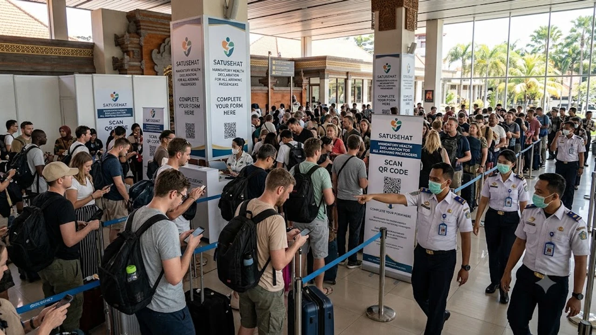

인도네시아 입국 절차가 개편되면서 발리 여행 준비 시 **발리 SATUSEHAT 건강신고서** 작성을 빠뜨리면 입국장에서 발이 묶입니다. 종이 서류 대신 모바일 기반 전자 신고를 필수 검역 지침으로 못 박으면서 현장 혼선이 잇따르고 있습니다. 입국 심사대 앞에 늘어선 대기 행렬을 피해 빠르게 공항을 빠져나가려면 비행기에 오르기 전 바뀐 규정을 정확히 숙지해야 합니다.

## 발리 입국장 혼란 부른 사투세핫 의무화 배경

### 강화된 인도네시아 보건부 방역 수칙과 현장 검역 상황
인도네시아 보건부는 변종 감염병 유입 차단을 목적으로 입국자 전원을 대상으로 전자 건강신고서 제출을 강제했습니다. 발리 응우라라이 국제공항에 착륙한 승객은 입국 게이트를 통과하자마자 검역관에게 모바일 QR코드를 제시해야 합니다. 사전에 등록을 마치지 못한 여행객들이 와이파이를 잡으려 통로에 멈춰 서면서 착륙 직후부터 극심한 정체가 발생하고 있습니다.

### 기존 관광세 검사와 겹치며 발생한 병목 현상
발리 주정부가 부과하는 관광세(Tourist Levy) 15만 루피아 결제 확인에 더해 건강신고서 검역 절차까지 겹쳤습니다. 두 창구가 개별적으로 운영되는 탓에 한쪽에서 인증 지연이 생기면 입국 심사 대기 줄 전체가 멈춰 섭니다. 과거 [베네치아 당일치기 300유로 벌금 피하는 법](/posts/world-travel/venice-day-trip-entry-fee-qr-fine-guide/)처럼 디지털 관광 규제를 앞다퉈 도입하는 세계적 흐름과 맞물려, 현장에서는 증빙 QR코드가 없으면 게이트 통과 자체가 불가능합니다.

### 종이 서류 불인정 원칙과 모바일 QR코드 준비 필수성
기내에서 나눠주던 노란색 종이 검역 신고서는 완전히 효력을 잃었습니다. 오직 인도네시아 정부 보건 포털을 통해 발급받은 디지털 바코드 및 QR코드만 화면 판독기로 스캔합니다. 데이터 로밍이나 현지 유심이 즉시 연결되지 않아 화면을 띄우지 못하는 사태를 방지하려면 탑승 전 스크린샷 저장이 필수입니다.

## 3분 만에 끝내는 사투세핫 단계별 작성 튜토리얼

### 여권 정보 및 항공편 세부 내역 입력 기준
공식 사이트에 접속해 기본 영문 성명, 여권번호, 국적을 여권 정보와 완전하게 일치하도록 적습니다. 탑승 항공편 번호(Flight Number)와 좌석 번호까지 오타 없이 넣어야 시스템상 유효한 코드가 생성됩니다. 

### 체류지 영문 주소와 연락처 기재 주의사항
발리 현지에서 머무는 첫 번째 호텔의 영문 정식 명칭과 현지 구/군 단위 상세 주소를 정확히 넣어야 통과됩니다. 전화번호 입력란에는 국가번호 `+82`를 선택한 뒤 핸드폰 앞자리 0을 제외한 나머지 숫자를 적는 방식이 기본 규칙입니다.

### 최근 21일 방문 국가 및 건강 설문 항목 체크
체류 직전 21일간 머물렀던 국가를 경유지까지 포함해 빠짐없이 선택합니다. 발열, 발진, 기침 등 호흡기나 피부 증상 유무를 묻는 질문에 체크를 완료하고 제출 버튼을 누르면 즉시 고유 QR코드가 화면에 출력됩니다.

## 현장 심사대 5초 통과 실전 꿀팁과 주의사항

### 착륙 직후 발리 공항 와이파이 먹통 대비책
수백 명이 동시에 착륙하는 피크 시간대에는 응우라라이 공항의 무료 공용 와이파이가 먹통이 되기 일쑤입니다. 웹 브라우저 창만 믿고 있다가 페이지가 새로고침되면서 백지 화면을 마주하는 사태를 겪지 않으려면 생성 즉시 캡처해 사진첩 즐겨찾기에 넣어둬야 합니다.

### 그룹 여행객 개별 QR코드 소지 원칙
가족이나 단체 여행객이라도 신고서는 탑승객 1인당 1개씩 각각 발급받아야 합니다. 대표자 스마트폰 하나로 여러 명의 코드를 번갈아 보여주면 스캐너 인식 과정에서 줄이 멈추므로 각자 기기에 캡처본을 전송해 두는 동선이 훨씬 유리합니다.

### 전자세관신고서(ECD)와의 동선 분리 확인
입국 심사대를 통과하기 전에는 SATUSEHAT QR코드를 찍고, 짐을 찾은 뒤 나가는 최종 출구에서는 전자세관신고서(e-CD) QR코드를 요구합니다. 두 서류의 성격과 제시 시점이 엄연히 다르므로 갤러리에 순서대로 정리해 두고 상황에 맞춰 제시해야 불필요한 실랑이를 피합니다.

## 발리 입국 오류 유형별 해결법과 출국 전 체크리스트

### 웹사이트 로딩 먹통 시 크롬 시크릿 모드 활용
모바일 브라우저 캐시 문제로 입력 도중 흰색 화면이 멈추는 현상이 잦습니다. 이 경우 쿠키가 쌓이지 않는 크롬 시크릿 모드나 사파리 개인정보 보호 탭으로 재접속해 입력하면 끊김 없이 발급 창으로 넘어갑니다.

### 출발 48시간 이전 등록 불가 오류 대응
출발 3~4일 전부터 미리 등록을 시도하면 날짜 선택창이 비활성화되거나 에러 메시지가 뜹니다. 해당 시스템은 인도네시아 입국 기준 48시간 이내부터 활성화되도록 설계되어 있으므로 인천공항 탑승 수속 직전에 작성하는 일정이 가장 안전합니다.

### 기내 방전 방지를 위한 준비물 챙기기
입국 심사대 앞에서 배터리가 꺼지면 모바일 QR코드를 제시하지 못해 현장 검역 데스크 한구석에 격리된 채 충전을 기다려야 합니다. 보조배터리와 충전 케이블은 절대 위탁 수하물로 부치지 말고 기내 가방에 보관해 배터리를 상시 확보해야 합니다.
[관련상품 쿠팡에서 보기](https://www.coupang.com/np/search?q=%EC%97%AC%ED%96%89%EC%9A%A9%ED%92%88&sourceType=affiliate&trackingCode=AF8691300)

#발리여행 #사투세핫 #SATUSEHAT #발리입국서류 #발리건강신고서 #발리공항검역 #발리QR코드 #인도네시아입국