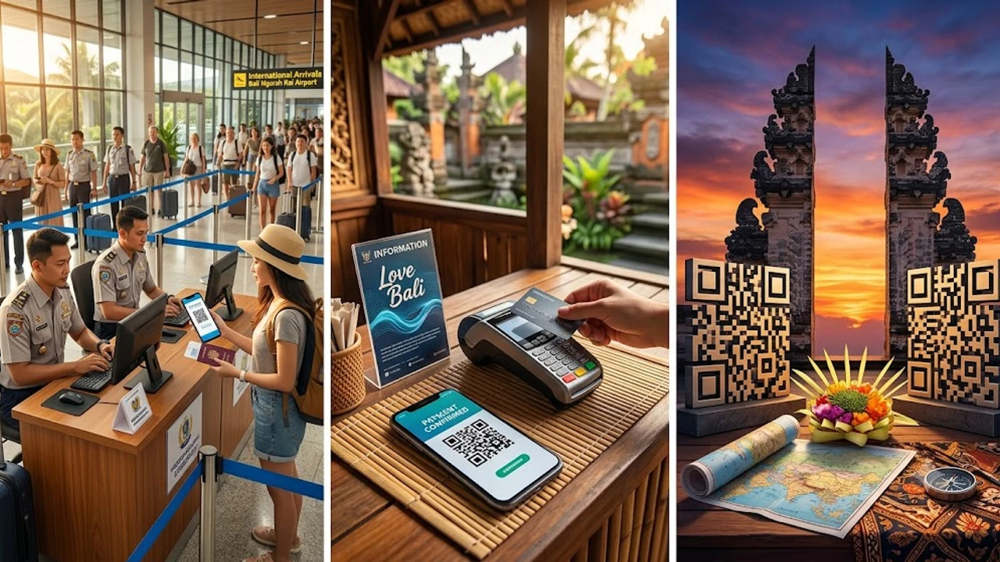

2026년 9월 중순부터 발리 입국장과 주요 명소의 풍경이 완전히 달라졌습니다. 인도네시아 정부가 외국인 대상 **발리 관광세 단속**을 전면 강화하면서, 사전에 러브발리(Love Bali) 납부 내역을 챙기지 않은 여행객들이 공항과 관광지 입구에서 발이 묶이는 사태가 속출하고 있습니다. 입국 심사대 통과 직후 마주치는 불심검문 데스크와 현장 카드 결제 지연을 피하려면 출발 전 모바일 바우처 발급 체계를 정확히 숙지해야 합니다.

## 발리 현장 불심검문 확대: 무엇이 바뀌었나

### 미납률 60%에 칼 빼든 주정부 단속 배경
발리 주정부가 올해 상반기 동안 집계한 공식 통계에 따르면, 입국 외국인 관광객 중 관광세를 실제로 낸 비율은 채 40%를 넘지 못했습니다. 미납률이 60%를 웃돌자 발리 관광청은 9월 18일을 기점으로 계도 기간을 공식 종료했습니다. 세수로 확보하려던 쓰레기 처리 인프라와 도로 개선 기금이 바닥나자, 더 이상 자율 납부에 맡기지 않고 현장 강제 징수로 방향을 튼 셈입니다.

### 웅구라라이 공항 도착장 검문소 및 대기 상황
발리 웅구라라이 국제공항 도착장에는 전용 검문 카운터가 신설되었습니다. 수하물을 찾고 세관 검색대를 통과하자마자 무작위로 여행객을 멈춰 세워 QR코드 스캔을 요구합니다. 납부 내역이 없는 여행객은 옆에 마련된 임시 징수 데스크로 인계되는데, 한꺼번에 사람이 몰리면서 통과에만 30분에서 1시간 이상 지체되는 병목 현상이 빚어지고 있습니다.

### 울루와투·우붓 등 핵심 관광지 불시 QR 단속 구역
공항을 무사히 빠져나왔다고 해서 끝이 아닙니다. 울루와투 절벽사원 매표소, 우붓 몽키 포레스트 입구, 타나롯 해상 사원 등 핵심 명소 진입로마다 공무원 단속반이 배치되었습니다. 티켓 확인과 동시에 관광세 영수증 제시를 요구하며, 현장에서 확인되지 않으면 입장 자체가 차단됩니다. 유럽의 관광세 규정을 다룬 [베네치아 당일치기 300유로 벌금 피하는 법](/posts/world-travel/venice-day-trip-entry-fee-qr-fine-guide/)처럼, 이제 발리 역시 불시 단속 체계가 일상화되었습니다.

## 러브발리(Love Bali) 사전 납부 vs 현장 납부

### 온라인 사전 납부와 공식 시스템 바우처 수령법
가장 확실한 방법은 출국 전 러브발리 공식 웹사이트나 전용 모바일 앱을 이용하는 것입니다. 1인당 15만 루피아(약 1만 3천 원)를 해외 결제 가능 카드로 지불하면 등록한 이메일로 QR코드가 박힌 전자 바우처가 날아옵니다. 여권 번호와 영문 이름을 항공권과 정확히 일치시켜 입력해야 하며, 승인 완료 화면을 PDF 파일로 저장해 두면 인터넷 연결이 불안정한 현지에서도 바로 꺼내 쓸 수 있습니다.

### 현장 적발 시 카드 결제 수수료 및 소요 시간
공항이나 관광지 현장 검문소에서 적발될 경우 오직 신용카드 및 직불카드로만 결제가 가능합니다. 문제는 현장 결제 단말기 수수료가 3~4% 추가로 붙는 데다, 네트워크 지연으로 승인 오류가 잦다는 점입니다. 결제 대기 줄에 갇혀 예약해 둔 픽업 기사를 놓치거나 일정 전체가 꼬이는 위험을 감수해야 합니다.

### 대행사 사기 사이트 구별법과 공식 결제 채널
관광세 납부 의무화 이후 검색창 상단에 뜨는 사설 대행 사이트 피해가 잇따르고 있습니다. 공식 납부액 외에 과도한 대행 수수료를 얹어 3~4만 원을 청구하거나, 카드 정보만 가로채고 무효한 가짜 QR을 발급하는 사례가 발생했습니다. 결제 주소가 인도네시아 정부 공식 도메인(`lovebali.baliprov.go.id`)인지 반드시 확인해야 낭패를 보지 않습니다.

## 입국 전 필수 확인: 예외 대상 및 주의사항

### 비자 종류별(KITAS·외교관) 면제 신청 기준
단기 관광(비자 발급 방문) 목적이 아닌 장기 체류 비자 소지자는 면제 대상에 들어갑니다. 외교관 비자, 승무원, 유학생 비자, 학생·취업용 거주허가증(KITAS/KITAP) 소지자가 대표적입니다. 단, 면제 대상자라 하더라도 현장에서 구두로 설명해서는 통하지 않으며, 사전에 러브발리 포털에서 면제 신청서를 제출하고 승인 확인증을 받아 지참해야 합니다.

### 영수증 QR코드 캡처본 소지 및 분실 시 대처
공항 와이파이는 접속자가 몰리면 먹통이 되기 일쑤입니다. 메일함 링크를 열려다가 로딩 화면만 쳐다보는 일이 없도록, QR코드 이미지를 스마트폰 사진첩에 캡처하고 클라우드 오프라인 보관함에 이중 백업해 두는 편이 안전합니다. 혹시 바우처 메일을 잃어버렸다면 러브발리 사이트의 '체크 바우처(Check Voucher)' 메뉴에서 여권 번호를 쳐서 즉시 재출력할 수 있습니다.

### 결제 오류 발생 시 현장에서 입증하는 요령
국내 카드사 승인 문자는 찍혔는데 시스템 장애로 바우처 이메일이 오지 않는 사고가 간혹 생깁니다. 이때 현장 단속반은 카드 문자만으로는 정상 결제로 인정해주지 않습니다. 카드사 앱에서 영문 승인 전표를 캡처해 결제 승인 번호(Approval Code)와 가맹점명(Love Bali)을 보여줘야 이중 결제 요구를 방어할 수 있습니다.

## 입국 지연 없이 통과하는 실전 체크리스트 3단계

### 항공기 탑승 24시간 전 사전 결제 완료하기
시스템 반영 시간과 결제 오류 대처를 감안하면 한국 출발 전날 결제를 마치는 게 가장 현명합니다. 공항 대기실에서 허겁지겁 진행하다가 이름 철자를 틀려 재결제하는 실수가 빈번하게 발생합니다.

> 현지 통화(IDR) 승인 기준이므로 해외 원화 결제 차단(DCC 차단) 서비스를 켜둔 상태에서 트래블 카드나 비자·마스터카드를 사용하는 편이 환전 수수료를 줄이는 요령입니다.

### 전자세관신고서(e-CD)와 함께 모바일 저장
발리 입국 3일 전부터 작성 가능한 인도네시아 전자세관신고서(e-CD) QR코드와 관광세 QR코드를 휴대폰 즐겨찾기 폴더에 함께 묶어두는 동선 관리가 필수입니다. 세관 구역을 나서자마자 곧바로 관광세 검문소가 나타나기 때문에 두 서류를 한 화면에서 전환할 수 있어야 줄 지체 없이 1분 만에 게이트를 통과합니다.

### 일행 단체 결제 시 바우처 개별 분할 팁
가족이나 친구 단위 여행객은 한 사람이 대표로 다인원 관광세를 묶어 결제하는 경우가 많습니다. 이때 하나의 영수증에 여러 명의 이름과 QR이 묶여 나오는데, 검문 통과 속도를 높이려면 구성원 각자의 스마트폰으로 해당 본인 QR 부분을 따로 잘라 전송해두는 편이 좋습니다.

출국 전 스마트폰 배터리 방전으로 모바일 바우처를 제시하지 못하는 돌발 상황을 막으려면 고속 충전 보조배터리를 기내 가방에 챙겨두는 준비가 유용합니다.
[여행 필수 보조배터리 쿠팡에서 보기](https://www.coupang.com/np/search?q=%EC%97%AC%ED%96%89%EC%9A%A9%ED%92%88&sourceType=affiliate&trackingCode=AF8691300)

#발리관광세 #발리여행준비 #러브발리 #발리공항단속 #발리입국서류 #발리세관신고서 #동남아여행팁