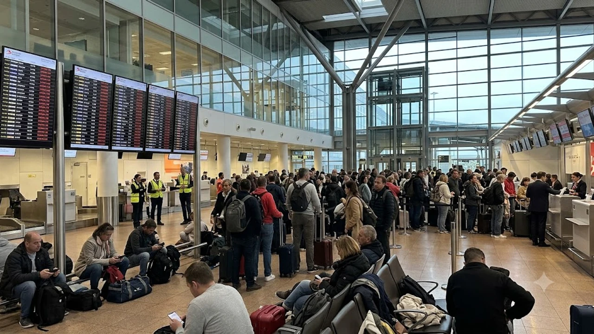

2026년 10월 9일, 벨기에 브뤼셀 자벤텀 국제공항(BRU)에서 터진 지상조업사 기습 파업으로 비행기 140여 편이 활주로에 묶였습니다. 현장에서 발이 묶인 여행객들은 **브뤼셀 공항 결항** 통보를 마주하며 발을 동동 구르고 있고, 환승 연결편까지 줄줄이 꼬여버린 실정입니다. 유럽 가을 출장과 여행 수요가 몰린 시점에 터진 사태인 만큼, 비행기 지연 피해 대처와 배상금 회수 전략을 똑똑하게 챙겨야 합니다.

## 2026년 10월 9일 브뤼셀 공항 마비: 140편 결항 사태의 전말

### 알리지아(Alyzia) 지상조업사 총파업 돌입 배경
이번 대규모 결항의 불씨는 브뤼셀 공항 지상 조업을 전담하는 프랑스계 업체 알리지아(Alyzia) 노조의 24시간 파업입니다. 2026년 10월 7일부터 이어진 노사 협상에서 인력 충원과 야간 초과수당, 노후 장비 교체 요구가 받아들여지지 않자, 노조는 10월 9일 자정을 기해 일손을 완전히 놓았습니다. 토잉카 운전, 화물 상하차, 기내 청소 인력이 사라지면서 활주로 전체가 일순간 멈춰 섰습니다.

### 브뤼셀항공 및 글로벌 20여 개 항공사 운항 차질 현황
직격탄을 맞은 곳은 루프트한자 계열 브뤼셀항공(Brussels Airlines)입니다. 하루 예정된 스케줄의 40% 이상을 허공에 날렸고, 조업 계약을 맺은 유나이티드항공, ITA항공, 에어유로파 등 20여 개 외국 항공사도 줄줄이 결항 딱지를 붙였습니다. 공항 공사는 터미널 압사 사고와 극심한 혼잡을 우려해 표가 취소된 승객의 공항 진입 자체를 차단하고 있습니다.

### 런던·파리·마드리드 등 유럽 환승 허브 연쇄 타격
브뤼셀이 유럽 복판의 환승 길목 역할을 해온 탓에 그 여파는 국경을 넘어 번졌습니다. 런던 히드로, 파리 샤를 드골, 마드리드 바라하스로 향하는 셔틀성 단거리 항공편이 올스톱되면서 미주나 아시아로 환승하려던 장거리 승객들의 동선이 완전히 끊겼습니다. 현장 게이트 주변에는 짐만 먼저 떠나보내고 탑승동 바닥에 주저앉은 승객들이 장사진을 치고 있습니다.

## 내 항공편 결항 시 즉각 대체편 찾는 실전 매뉴얼

### 항공사 앱을 통한 무료 여정 변경 및 코드셰어 우회편 확보법
체크인 카운터 앞에 늘어선 수백 명 뒤에 줄을 서는 행동은 시간 낭비일 뿐입니다. 지상 직원을 붙잡기 전에 항공사 공식 앱부터 켜야 합니다. 이번 사태처럼 비정상 운항(IRROPS) 코드가 찍히면 앱 내에서 무료 변경 메뉴가 즉시 풀립니다.
- 브뤼셀항공 발권 승객은 동일 동맹체인 루프트한자 그룹망을 활용해 프랑크푸르트나 취리히 경유편으로 재빨리 재지정
- 카운터 연결이 먹통일 때는 스카이프(Skype)로 본사 영문 콜센터 번호를 두드려 빠른 배차를 선점
- 동맹체 내 타 항공사 코드셰어 잔여석을 앱에서 실시간으로 낚아채는 민첩함이 관건

### 브뤼셀 미디(Midi)역 유로스타·탈리스 고속철도 긴급 전환 전략
비행기 표가 도저히 안 나온다면 주저 없이 철도로 눈을 돌려야 합니다. 브뤼셀 공항 지하역에서 공항철도를 타고 20분이면 브뤼셀 남역(Bruxelles-Midi)에 닿습니다.
- 파리 북역(Paris Nord): 유로스타 탑승 시 1시간 22분 만에 도착
- 암스테르담 중앙역(Amsterdam Centraal): 1시간 50분 소요
- 런던 세인트 판크라스(London St Pancras): 해저터널 유로스타로 2시간 1분 소요
기차로 이웃 국가 주요 거점 공항으로 빠져나간 뒤 거기서 대체 항공편을 타는 것이 가장 빠른 탈출구입니다. 평소 유럽 주요 거점 간 우회 루트는 [세계여행지 전체 글 보기](/posts/world-travel/)를 통해 확인해 두면 돌발 위기 때 길을 잃지 않습니다.

### 수하물 분실 및 위탁 지연 방지를 위한 기내 수하물 대응 팁
조업사 인력이 통째로 빠진 공항에서는 짐 분실 사고가 평소보다 몇 배로 뜁니다. 컨베이어 벨트나 야외 카트에 짐이 방치되어 비를 맞거나 다른 나라로 잘못 실려 갈 확률이 높습니다.
> 파업 당일 탑승권이 살아있더라도 위탁 수하물은 과감히 접어두고 20인치 기내용 캐리어와 백팩 조합으로 짐을 압축해야 합니다. 전자제품, 여벌 옷, 상비약은 몸에 바짝 붙여 들고 타야 최악의 미아 신세를 면합니다.

## 공항 파업 결항, EU261 규정으로 최대 600유로 보상받을까?

### 지상조업사 파업이 '불가항력(Extraordinary Circumstances)'에 해당하는지 여부
유럽연합 항공 승객 권리 규정(EC No 261/2004)에 따르면 운항 차질 시 승객은 최대 600유로(약 88만 원)의 정액 배상을 요구할 수 있습니다. 관건은 지상조업사 파업을 면책 조항인 **'불가항력(Extraordinary Circumstances)'**으로 인정하느냐입니다.
- 항공사 자체 파일럿·승무원 파업: 항공사 내부 노사 갈등이므로 100% 현금 배상 판결
- 외주 지상조업사·항공관제(ATC) 파업: 항공사 지휘권 밖의 제3자 사태로 분류되어 정액 배상 청구가 법적으로 기각될 가능성 농후
하지만 항공사가 파업 예고를 미리 통보받고도 승객에게 늦게 알렸거나, 합리적인 우회 경로를 적극적으로 마련하지 않은 정황을 파고들면 일부 보상 합의를 끌어낼 틈새가 있습니다.

### 결항 거리별 배상 기준금액(250€~600€) 및 지급 조건 분석
EU261 배상 기준이 충족될 경우 비행거리에 따라 떨어지는 법정 보상액은 정해져 있습니다.
- 1,500km 이하 단거리 노선: 250유로 (약 37만 원)
- 1,500km 초과 ~ 3,500km 이하 중거리 노선: 400유로 (약 59만 원)
- 3,500km 초과 장거리 노선 (유럽-인천 직항 등): 600유로 (약 88만 원)
출발 14일 전 사전 공지가 있었거나 태풍 등 천재지변이 결합한 사안은 배상 대상에서 제외됩니다.

### 대체편 대기 중 발생한 호텔 숙박비·식음료 영수증 청구 가이드
정액 배상금과는 별개로, 항공사는 승객의 안전과 기본 편의를 챙겨야 하는 '케어 의무(Duty of Care)'를 저버릴 수 없습니다. 파업 귀책 여부와 상관없이 아래 비용은 항공사로부터 전액 실비로 돌려받습니다.
- 대체편을 타기 전까지 묵은 인근 호텔비와 공항 왕복 택시비
- 대기 시간 동안 끼니를 때운 식비 및 음료비 (알코올 주류 제외)
- 연락을 위해 발생한 현지 e-SIM 구매비 및 통신비
영수증 원본(종이 실물 또는 PDF 전자 영수증)이 한 장이라도 빠지면 거절당하므로 카드 결제 내역과 전표를 철저히 챙겨야 합니다.

## 여행자보험 및 항공권 환불 거부 시 최종 대응 체크리스트

### 결항 확인서(Cancel Certificate) 즉시 발급받는 방법
항공사나 보험사에 서류를 밀어 넣을 때 절대 빠져서는 안 될 핵심 무기가 '공식 결항 확인서'입니다. 혼잡한 공항 카운터 직원과 입씨름할 필요 없이 스마트폰으로 즉시 뽑을 수 있습니다. 브뤼셀항공 공식 웹사이트 내 'Flight Disruption Certificate' 페이지에서 편명, 영문 성, 예약번호(PNR) 6자리를 치면 회사 직인이 박힌 PDF 증명서가 다운로드됩니다. 귀국 후 국내 보험사에 청구할 때도 이 서류가 결정적인 근거가 됩니다.

### 신용카드 차지백(Chargeback) 및 여행자보험 지연 특약 청구 절차
항공사가 결항 후 대체편도 구해주지 않고 유효기간 짧은 바우처로 때우려 든다면 금융 제도를 이용해 압박해야 합니다.
- **신용카드 거래 취소(차지백):** 제공받지 못한 서비스에 대해 카드사 해외 분쟁 처리반에 이의를 제기해 강제 취소 접수
- **여행자보험 항공기 지연 특약:** 결항 시점 기준 4시간 이상 지연 출발할 경우 식비, 숙박비, 현지 생필품 구매비를 가입 한도(보통 20~50만 원) 안에서 청구
지출 내역서에 결항으로 인한 비상 소비라는 점을 소명할 수 있게 품목 영수증을 챙겨두는 습관이 안전합니다.

### 유럽 파업 시즌(10월) 재발 방지를 위한 실시간 운항 조회 사이트 모음
가을철 유럽은 노동법 개정안과 임금 협상 시기가 맞물려 프랑스, 벨기에, 이탈리아 등지에서 연쇄 파업이 잦습니다. 항공사 공지만 믿고 기다리기보다 항공 전문 추적 도구를 켜두는 편이 빠릅니다.
- **유로컨트롤(Eurocontrol NOP):** 유럽 전역 공항 관제 지연과 파업 공지를 실시간 갱신하는 공식 플랫폼
- **플라이트레이더24(Flightradar24):** 타야 할 항공기가 이전 출발지에서 제때 떴는지 추적
- **FlightAware:** 공항별 결항률 통계와 취소 편수를 한눈에 파악
돌발 결항 사태에 기민하게 발을 빼려면 무거운 짐을 줄이고 즉시 이동할 수 있는 압축형 여행 파우치 세팅이 큰 도움이 됩니다.

[유럽 여행 필수 기내용 여행용품 쿠팡에서 보기](https://www.coupang.com/np/search?q=%EC%97%AC%ED%96%89%EC%9A%A9%ED%92%88&sourceType=affiliate&trackingCode=AF8691300)

#브뤼셀공항결항 #브뤼셀공항파업 #유럽항공권환불 #EU261보상규정 #비행기결항대체편 #유럽여행보험청구 #유로스타환승팁