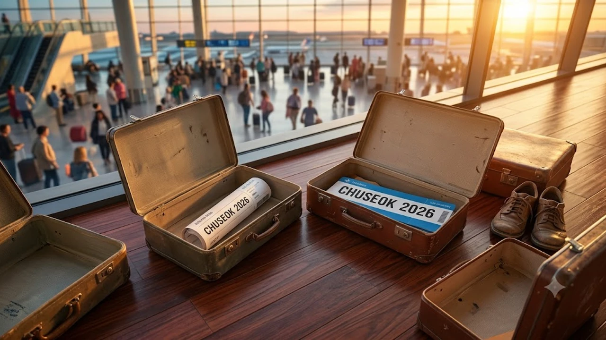

2026년 한가위 황금연휴가 코앞으로 다가왔지만 비행기 티켓을 구하지 못해 발만 구르고 있다면 포기하기엔 이르다. **추석 해외여행 취소표**는 출발 직전 위약금 변동 시점과 여행사 블록 해제 타이밍에 맞춰 대거 쏟아지는 특성이 짙다. 땡처리 항공권과 막판 잔여석이 풀리는 틈새를 정확히 노리면 연휴 한복판에도 놀라운 가격으로 출국장을 밟을 수 있다.

## 2026 추석 직전 쏟아지는 땡처리 항공권 원리

### 연휴 3주 전 위약금 면제 마감일 공략
항공권은 출발일이 임박할수록 취소 수수료가 계단식으로 뛴다. 국적 대형 항공사(FSC)와 저비용항공사(LCC) 대부분 출발 21일 전, 14일 전을 기점으로 수수료 구간을 상향 조정한다.
- **타겟 시간대**: 수수료 인상 직전일 밤 11시 30분부터 자정 사이
이 시간대에는 페널티 없이 혹은 1~3만 원 수준의 최소 수수료만 물고 빠지는 물량이 시스템에 동시다발적으로 풀린다. 특히 9월 초 평일 자정 무렵은 예약 취소분 반영이 가장 활발한 골든타임이다.

### 여행사 단체 블록 미소진 물량 방출 시점
대형 패키지 여행사는 명절 수요를 대비해 항공기 좌석의 상당 부분을 하드블록(사전 확보 좌석)으로 선점한다. 하지만 모객이 미달된 잔여 좌석은 출발 7~10일 전 일제히 시장에 던져진다.
> "여행사 입장에서는 빈 좌석으로 비행기를 띄우는 것보다 원가 이하라도 항공권만 떼어내 팔아치우는 것이 손실을 줄이는 유일한 길이다."
제휴 플랫폼의 '땡처리/긴급모객' 카테고리를 주시하면 정규 운임의 절반 이하로 떨어진 알짜배기 노선을 건질 수 있다.

### 저비용항공사(LCC) 추가 증편 노선 확인법
명절 기간 폭증하는 수요를 감당하기 위해 국토교통부는 연휴 직전 LCC들의 임시 증편을 기습적으로 승인한다. 비정기적으로 추가된 임시편은 기존 예약 대기자에게 우선 배정된 후 남은 좌석이 일반 예매로 전환된다. 항공사 공식 인스타그램 스토리나 앱 푸시 알림을 켜두면, 정규 노선이 매진된 상황에서도 깜짝 오픈되는 새 좌석을 낚아챌 확률이 급상승한다.

## 취소표 실시간 알림 및 즉시 예약 테크닉

### 구글 플라이트 가격 추적 기능 200% 활용
막연한 검색은 시간 낭비일 뿐이다. 구글 플라이트(Google Flights)의 **가격 추적(Price Tracking)** 토글을 활성화하는 것이 핵심이다. 원하는 날짜와 목적지를 설정하고 알림을 켜두면, 특정 항공편의 예약 취소로 인해 저렴한 클래스의 좌석이 다시 열리는 즉시 지메일(Gmail)로 실시간 알림이 꽂힌다. 연휴 기간에는 '모든 날짜 추적' 기능을 활용해 앞뒤로 하루 이틀 오차 범위를 두는 것이 유리하다.

### 스카이스캐너 필터로 미반영 특가 찾는 법
스카이스캐너 검색 시 종종 캐시가 지연되어 실제 취소표가 반영되지 않은 가격이 뜰 때가 있다. 이때는 검색 필터에서 **'항공사 직접 결제'** 항목만 체크해 캐시를 우회해야 한다. OTA(온라인 여행사)를 거치지 않고 항공사 자체 발권 시스템으로 바로 연결하면, 방금 전 누군가 취소한 가장 신선한 좌석 데이터에 접근할 수 있다. [세계여행지 최신 트렌드](/posts/world-travel/world-travel-1783348391782/)를 참고해 현재 검색량이 적어 틈새를 노리기 좋은 국가를 우선 리스트업 하는 것도 좋은 전략이다.

### 항공사 공식 모바일 앱 야간 취소분 탐색
PC 웹사이트보다 항공사 공식 모바일 앱의 좌석 새로고침 속도가 미세하게 빠르다. 특히 자정 직후부터 새벽 2시 사이는 시스템상 미결제 자동 취소분이 풀리는 시간대다. 결제 기한을 넘긴 무통장 입금 대기 좌석이나 카드 승인 거절로 튕겨 나온 표들이 이때 일제히 '예약 가능' 상태로 돌아간다.

## 연휴 막바지 노려볼 만한 숨은 근거리 대체지

### 도쿄·오사카 대신 추천하는 소도시 공항
수요가 과포화 상태인 도쿄 나리타나 오사카 간사이 공항은 취소표 쟁탈전이 너무 치열하다. 대안으로 나고야, 후쿠오카는 물론이고 다카마쓰, 마쓰야마, 시즈오카 같은 [2026년 여름 해외여행 추천 도시 5곳](/posts/world-travel/summer-travel-cities-2026/) 등에서 언급된 소도시 직항 노선을 노리는 편이 훨씬 승률이 높다. LCC 단독 운항 노선은 상대적으로 취소표 발생 시 대기자가 적어 즉시 결제 성공률이 올라간다.

### 다낭·방콕 대신 예약 가능한 동남아 휴양지
국민 휴양지인 베트남 다낭이나 태국 방콕행 티켓이 100만 원을 호가한다면 방향을 틀어야 한다. 필리핀 보홀, 말레이시아 코타키나발루, 베트남 푸꾸옥은 연휴 기간에도 간헐적으로 여행사 땡처리 하드블록이 자주 출몰하는 지역이다. 비행시간이 5시간 이내로 짧아 3박 4일 짧은 추석 일정에 맞추기 완벽하다.

### 대만·홍콩 등 중화권 실속 노선 타겟팅
비행시간 2시간 반 남짓인 대만 타이베이나 가오슝, 그리고 홍콩 노선은 추석 연휴에 가족 단위 패키지 취소분이 유독 자주 나오는 편이다. 비즈니스 수요가 빠진 명절 기간이기 때문에, 대형 외항사의 이코노미 클래스 취소표를 LCC 가격 수준에 확보하는 횡재를 노려볼 수 있다.

## 취소표 줍줍 성공 전 반드시 확인해야 할 체크리스트

### 여권 만료일 및 비자 요건 긴급 체크
힘들게 결제창까지 갔더라도 여권 유효기간이 발목을 잡으면 모든 노력이 수포로 돌아간다. 대부분의 국가는 입국일 기준 여권 잔여 유효기간 6개월 이상을 엄격히 요구한다. 취소표 사냥을 시작하기 전, 동반자 전원의 여권 유효기간부터 확인해 책상 앞에 붙여둬야 한다.

### 환불 불가 및 수하물 미포함 옵션 주의
출발이 임박해 풀리는 특가 항공권이나 땡처리 표는 **'결제 후 환불 불가'** 조건이 붙는 경우가 허다하다. 
- 위탁 수하물 15kg 포함 여부
- 기내식 및 사전 좌석 지정 가능 여부
이 두 가지를 간과하면 공항 카운터에서 수십만 원의 추가 운임을 결제하는 참사가 벌어진다. 눈앞의 가격만 보지 말고 운임 규정을 1초 만에 스캔하는 눈썰미를 길러야 한다.

### 여행자 보험 및 로밍 당일 처리 프로세스
표를 구했다면 출국장으로 뛰어가며 부가적인 요소를 챙겨야 한다. 다행히 여행자 보험과 eSIM(이심) 로밍은 출국 1시간 전 모바일로 즉시 개통이 가능하다. 짐을 싸기도 벅찬 막판 출국러라면 공항 이동 전 필수 준비물을 한 번에 주문해 새벽 배송으로 수령하는 시스템을 활용하는 편이 현명하다.

[스마트한 막판 출국 필수템 쿠팡에서 한 번에 보기](https://www.coupang.com/np/search?q=%EC%97%AC%ED%96%89%EC%9A%A9%ED%92%88&sourceType=affiliate&trackingCode=AF8691300)

#추석해외여행취소표 #추석항공권 #땡처리항공권 #막판해외여행 #해외여행취소표 #2026추석여행 #연휴특가비행기